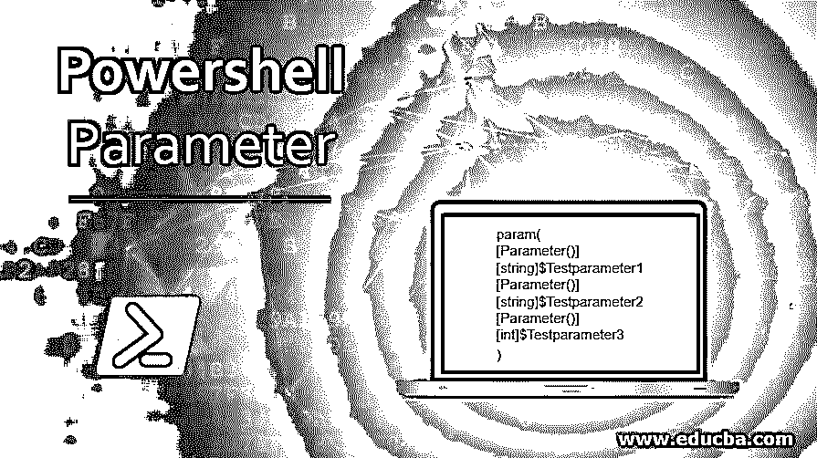
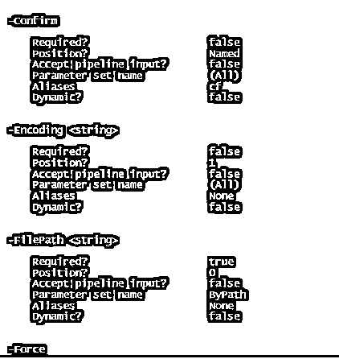
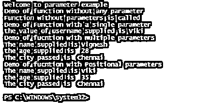

# Powershell 参数

> 原文：<https://www.educba.com/powershell-parameter/>

## Powershell 参数简介

参数只是提供给函数或任何 cmdlet 的输入。每个参数都有一个名称和与之关联的数据类型。参数不一定是强制性的。一些参数也可能有默认值，当没有明确提到参数值时，就使用这些值。对于函数，参数是用 Param 块定义的。强制参数是使用[参数(强制)]属性定义的。还可以使用 ValidateSet 属性来验证传递给每个参数的值。参数名称前面始终有一个连字符(-)，这表示 PowerShell)后面的单词是一个参数。本文将详细解释 PowerShell 中的参数及其类型、各种类型的参数、如何将参数传递给函数等。，详细。

**Powershell 参数的语法**

<small>Hadoop、数据科学、统计学&其他</small>

以下示例显示如何将参数传递给 cmdlet

`Get-ChildItem -Path “C:\vignesh\test”`

在上面的示例中，路径是 cmdlet 的一个参数，该参数的相应值包含在""中。

要定义函数的参数，使用以下格式

`param(
[Parameter()] [string]$Testparameter1
[Parameter()] [string]$Testparameter2
[Parameter()] [int]$Testparameter3
)`

**标识与 cmdlet 相关联的各种参数:**

要确定 cmdlet 可用的各种参数，可以使用下面的 cmdlet。

`Get-Help CmdletName -Parameter *`

**举例:**

`Get-Help out-file -Parameter *`

**输出:**

上面显示了与文件外 cmdlet 相关联的各种参数。它还显示了参数是否是强制的，它的位置，别名。

### 参数的属性

下面是下面提到的参数的属性

#### -必需的

这表示该参数是否是运行此 cmdlet 所必需的。如果某个参数的值为真，则意味着这是一个强制参数。如果没有传递该参数的适当值，将会引发错误。

#### -位置

位置参数是其位置设置为正整数的参数。使用这种类型的参数时，不需要参数名，但必须在适当的位置提到参数值。如果位置值为 0，则不需要参数名称，但其值应该首先出现在 cmdlets 名称之后。如果排除了位置设置，则可以在 cmdlet 中的任何位置定义它。

#### 表示“类型”

它表示参数的类型，如 string、int、switches 等。

#### -默认值

这表示未指定另一个值时参数的默认值。对于必需的参数，没有默认值，总是由用户提供。对于许多可选参数，没有默认值，因为可选参数没有多大意义。

#### -接受多个值

这表示参数是否可以接受多个值。在允许多个值的情况下，它们以逗号分隔的方式键入并传递，或者这些值可以以逗号分隔的方式保存在变量中，并且该变量可以作为值传递给参数。

#### -接受管道输入

这表示管道是否可以作为输入传递给参数。如果其值为 false，则表示该参数不接受输入管道。

#### -接受通配符

这表示参数是否可以使用通配符来匹配字符。

### 参数验证

下面是一些验证传递给参数的值的方法。

#### 1.使参数成为强制参数并允许空值

强制参数用于表示一个参数是否强制要求一个值。AllowNull 属性用于允许空值作为值。

**举例:**

`Param(
[Parameter(Mandatory=$true)] [AllowNull()] [String] $UserName
)`

在上面的例子中，UserName 是一个强制参数，它接受 null 值。

#### 2.AllowEmptyString 验证属性

此属性用于允许空字符串作为强制参数的值。“允许空集合”属性用于允许空集合作为强制字符串参数的值。

**举例:**

`Param(
[Parameter(Mandatory=$true)] [AllowNull()] [AllowEmptyCollection()] [String] $UserName
)`

ValidateCount 属性用于验证可以传递给参数的值的数量。

ValidateLenght 属性用于指定传递给参数的值的最小和最大长度。

Validatepattern 用于将正则表达式与传递给参数的值进行匹配。

ValdiateRange 指定变量值必须在的范围。

ValidateSet 表示一组值，必须从中为参数传递一个值。无法将此集合之外的值设置为参数。

ValidateDrive 用于验证某个驱动器的路径参数值

**举例:**

`Param(
[Parameter(Mandatory=$true)] [AllowNull()] [AllowEmptyCollection()] [ValidateCount(5,50)] [ValidateLength(10,20)] [ValidatePattern("[1-9][0-4][4-9][1-4]")] [ValidateDrive("C", "Function", "Drive")] [String] $UserName
)
Example:
Input:
Write-Host "Welcome to parameter example"
function test1()
{
Write-Host "Demo of function without any parameter"
Write-Host "Function without parameters is called"
}
#calling test1 function
test1
function test2($username)
{
Write-Host "Demo of Function with a single parameter"
Write-Host "the value of username supplied is" $username
}
#calling test2 function with parameter
test2 -username "Viki"
function test2
{
Param(
[parameter(Mandatory=$true)] [ValidateLength(1,30)] [String] $Name,
[parameter(Mandatory=$true)] [Int] $age,
[parameter(Mandatory=$true)] [ValidateSet("Chennai", "Mumbai", "Delhi")] [String] $City
)
Write-Host "Demo of fucntion with multiple parameters"
Write-Host "The name supplied is" $Name
Write-Host "the age supplied is "$age
Write-Host "The city passed is " $City
}
#function calling
test2 -Name "Vignesh" -age 28 -City Chennai
function test3
{
Param(
[parameter(position=1)] [ValidateLength(1,30)] [String] $Name,
[parameter(position=2)] [Int] $age,
[parameter(position=3)] [ValidateSet("Chennai", "Mumbai", "Delhi")] [String] $City
)
Write-Host "Demo of fucntion with Positional parameters"
Write-Host "The name supplied is" $Name
Write-Host "the age supplied is "$age
Write-Host "The city passed is " $City
}
#function calling
test3 "viki" 35 "Chennai"`

**输出:**

### 结论–Powershell 参数

因此，本文详细介绍了 PowerShell 中的参数。它涵盖了各种类型的参数、与参数相关联的各种属性、不同的参数类型、强制和非强制参数、参数验证等。要更详细地了解这些参数，建议编写示例脚本并执行它们。

### 推荐文章

这是 Powershell 参数指南。这里我们讨论参数的属性和一些验证传递给参数的值的方法。您也可以看看以下文章，了解更多信息–

1.  [PowerShell 连接字符串](https://www.educba.com/powershell-concatenate-string/)
2.  [PowerShell 获取项目](https://www.educba.com/powershell-get-item/)
3.  [PowerShell 拆分字符串](https://www.educba.com/powershell-split-string/)
4.  [PowerShell 预定任务](https://www.educba.com/powershell-scheduled-task/)

