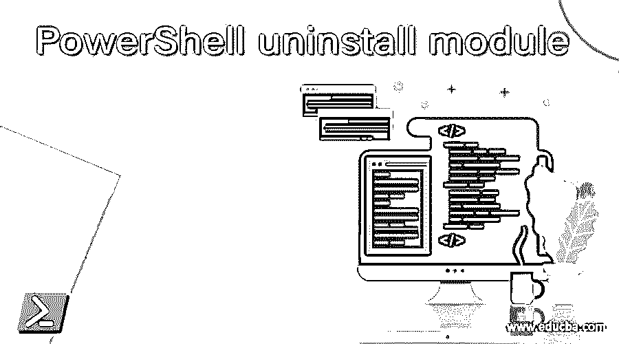
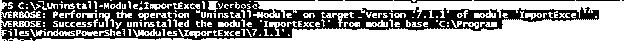
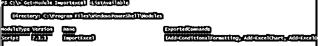
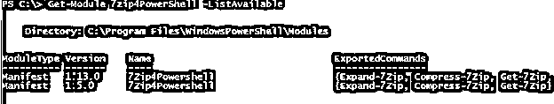
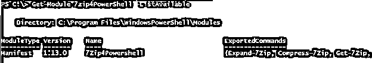
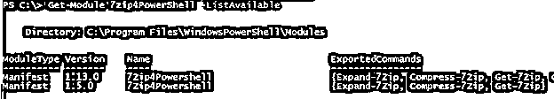
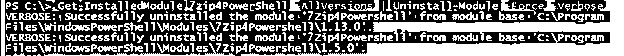
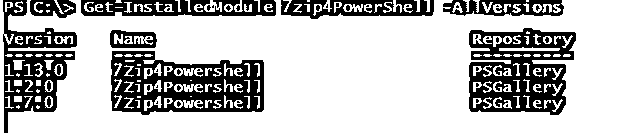
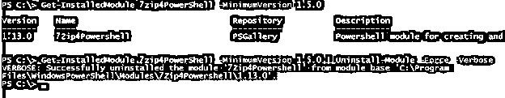
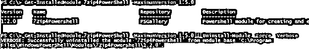

# PowerShell 卸载模块

> 原文：<https://www.educba.com/powershell-uninstall-module/>

## PowerShell 卸载模块简介

PowerShell 中的 Uninstall-Module cmdlet 附带 PowerShellGet module，它在本地用户配置文件或当前用户配置文件中卸载安装在本地计算机上的特定模块(以及多个模块)和特定版本，当模块依赖于其他模块时，它无法卸载，并且使用 PowerShell remoting 方法，我们也可以在远程计算机上卸载模块。

**语法**

<small>Hadoop、数据科学、统计学&其他</small>

卸载模块语法:

`Uninstall-Module
[-Name] <String[]>
[-MinimumVersion <String>] [-RequiredVersion <String>] [-MaximumVersion <String>] [-AllVersions] [-Force] [-AllowPrerelease] [-WhatIf] [-Confirm] [<CommonParameters>] Uninstall-Module
[-InputObject] <PSObject[]>
[-Force] [-WhatIf] [-Confirm] [<CommonParameters>]`

**语法解释:**

**-名称:**要卸载的模块。您可以提供多个模块名称，用逗号(，)分隔。

**-MinimumVersion** :当安装了多个版本的模块时，该参数卸载最低版本的模块。MinimumVerion 和 RequiredVersion 不能在同一个命令中一起使用。

–**最大版本**:该模块帮助卸载模块的最新或最大版本。MaximumVersion 和 RequiredVersion 不能在同一命令中使用。

**-RequiredVersion:** 指定要卸载的确切模块版本。

**-AllVersions:** 该参数卸载安装在本地计算机上的模块的所有可用版本。此参数不能与 MaximumVerion、MinimumVersion 和 RequiredVersion 参数一起使用。

**-AllowPrerelease** :卸载标记为预发布的模块。

**-Force:** 强制卸载，不要求用户确认。

**-确认**:如果指定$true，则确认用户同意，$false 不会提示用户卸载并开始卸载过程。

### 如何使用 PowerShell 中的卸载模块？

当 PowerShell 模块安装在计算机上时，有一个选项可用于当前用户或所有用户。PowerShell 为它们选择不同的 windows 配置文件。

对于当前用户:“% user profile % \ Documents \ windows powershell \ Modules”

对于所有用户:C:\ program files \ windows powershell \ Modules

windows 操作系统默认使用另一个路径来存储操作系统构建时的 PowerShell 模块。

PowerShell 的操作系统默认路径:C:\ WINDOWS \ system32 \ WINDOWS PowerShell \ v 1.0 \ Modules

当我们使用 Uninstall-Module 命令时，它选择上述路径从本地计算机卸载模块。在某些情况下，会安装同一个模块的多个版本，因为一些脚本编写人员更喜欢在新模块到来时进行更新。在这种情况下，Uninstall-Module 使用-RequiredVersion、-MinimumVersion 或-MaximumVersion 命令帮助卸载特定版本的模块。

有时，该模块的测试版也可供少数用户使用，即预发布版，您可以使用-PreRelease 参数卸载该特定模块。

当模块正在使用中或已加载时，当您卸载它时，它将拒绝访问，要解决此问题，您需要关闭打开的 PowerShell 会话，或者有时可能需要重新启动系统。

### 例子

下面举几个例子

#### 示例#1

卸载 ImportExcel 模块。

对于本例，我们在本地计算机上安装了 ImportExcel 模块，我们将使用 Uninstall-Module 命令卸载它。

`Uninstall-Module ImportExcel -Verbose`

**输出:**

请注意:我们没有在这里提供要卸载的模块版本，无论该模块是针对所有用户还是当前用户配置文件，都没有关系。它只是卸载模块。

卸载模块的另一种方法是首先使用 Get-Module 命令获取模块，然后使用管道将输出传递给 Uninstall-Module。

`Get-Module -Name ImportExcel | Uninstall-Module -Verbose`

上面的命令类似于第一个命令。

有时该模块已安装在您的系统中，但未在 PowerShell 会话中加载，因此您无法卸载该模块。例如，安装了 ImportExcel 模块，但未在 PS 控制台中加载，如下所示。

`Get-Module -Name ImportExcel`

输出什么都没有，但是当我们检查所有可用的模块时，它会显示输出。

`Get-Module Importexcel -ListAvailable`

**输出:**

在这种情况下，您可以先导入模块，然后运行 uninstall 命令来卸载该模块。

`Get-Module -Name ImportExcel -ListAvailable | Import-Module -Verbose
Uninstall-Module ImportExcel -Force -Verbose`

或者简单的方法是使用 Get-InstalledModule 命令卸载它，如下所示。

`Get-InstalledModule -Name ImportExcel | Uninstall-Module -Force -Verbose`

#### 实施例 2

卸载特定的模块版本。

如果我们在本地系统中安装了同一模块的多个版本，那么我们可以使用-RequiredVersion 参数来卸载特定的模块版本。

在本例中，我们安装了一个名为“7Zip4PowerShell”的 7Zip PowerShell 模块，它在同一个系统中有多个版本。

`Get-Module 7zip4PowerShell -ListAvailable`

**输出:**

我们需要在这里卸载 1.5.0 模块。

`Get-InstalledModule 7zip4PowerShell -RequiredVersion 1.5.0 | Uninstall-Module -Force -Verbose`

**输出:**

当您检查此模块的可用版本时，您将找不到此版本。

#### 实施例 3

卸载该模块的所有可用版本。

要卸载模块的所有可用版本，我们可以使用-AllVersions 参数。我们有一个 7Zip4PowerShell 模块，在本地计算机上安装了多个版本，如下所示，我们需要卸载它们。

要卸载所有模块版本，

`Get-InstalledModule 7zip4PowerShell -AllVersions | Uninstall-Module -Force -Verbose`

**输出:**

#### 实施例 4

使用最小和最大版本参数卸载模块。

当我们使用-MinimumVersion 参数时，Uninstall-Module 会从计算机中删除最高安装版本。我们安装了以下版本的 7Zip4PowerShell 模块。

`Get-InstalledModule 7zip4PowerShell -MinimumVersion 1.5.0 | Uninstall-Module -Force -Verbose`

**输出:**

当我们使用-Maximumversion 参数时，它卸载模块的最低版本。

`Get-InstalledModule 7zip4PowerShell -MaximumVersion 1.5.0 | Uninstall-Module -Force -Verbose`

**输出:**

#### 实施例 5

在远程计算机上卸载模块。

我们可以使用 Invoke-Command 模块从远程服务器卸载该模块。

`Invoke-Command -ComputerName LabMachine2k16 -ScriptBlock {                    Get-InstalledModule 7zip4PowerShell | Uninstall-Module -Force -Verbose}`

您可以使用上述示例中显示的其他命令来处理特定的模块版本卸载任务。

### 结论

Uninstall-Module 对于清理任务很有用。PowerShell Gallery 中有许多可用的模块，您可以下载它们用于测试目的，但它也会消耗磁盘空间，并且许多模块需要时间来加载，还会降低 PowerShell 功能的速度，在这种情况下，Uninstall-Module 有助于从本地和远程计算机中删除该模块。

### 推荐文章

这是 PowerShell 卸载模块的指南。在这里，我们将讨论如何在 PowerShell 中使用卸载模块，并给出示例和输出。您也可以看看以下文章，了解更多信息–

1.  [PowerShell 匹配](https://www.educba.com/powershell-match/)
2.  [PowerShell 布尔型](https://www.educba.com/powershell-boolean/)
3.  [PowerShell 等待](https://www.educba.com/powershell-wait/)
4.  [PowerShell 过滤器](https://www.educba.com/powershell-filter/)

