# 如何使用 PowerShell？

> 原文：<https://www.educba.com/how-to-use-powershell/>

## PowerShell 简介

PowerShell 是微软提供的一个强大的任务自动化工具。用作配置管理框架，用于简化 Windows 生态系统中的配置。它由基于任务的命令行外壳和脚本语言组成。主要为系统管理员设计。帮助 IT 专业人员控制和自动管理 Windows 操作系统和在 Windows 上运行的应用程序。建立在。NET 框架并基于面向对象的标准。cmdlet 是 Windows PowerShell 中的一个专用的、独特的、功能单一的命令行工具。所有管理任务通常由 cmdletss 执行，cmdlet 能够实现某些操作并返回。NET 对象。

### 如何使用 PowerShell？

在所有最新版本的 Windows 中，都可以找到预装的 PowerShell。我们只需要通过给定的步骤启动它:

<small>Hadoop、数据科学、统计学&其他</small>

1.点击搜索图标，找到“PowerShell”。

2.我们可以看到 PowerShell 的几个选项，例如

*   Windows PowerShell
*   [Windows PowerShell ISE](https://www.educba.com/windows-powershell-ise/)
*   Windows PowerShell (x86)
*   Windows PowerShell ISE (x86)

3.选择 Windows PowerShell 并右键单击“以管理员身份运行”

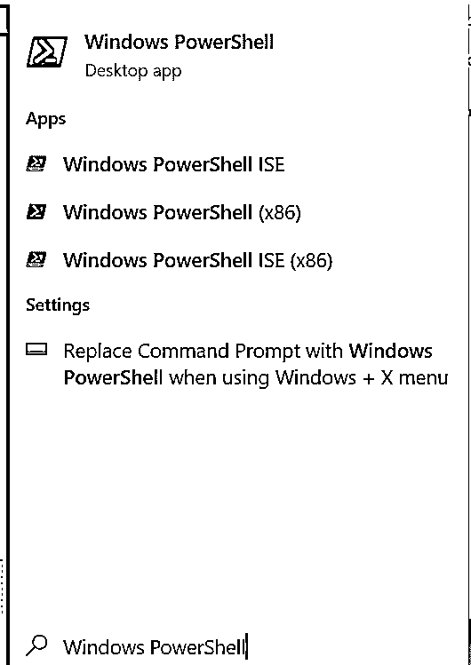

在搜索时，除了 Windows PowerShell，我们还获得了 Windows PowerShell ISE 作为搜索结果。

### 什么是 Windows PowerShell ISE？

*   ISE 指的是集成脚本环境。
*   Windows PowerShell ISE 使脚本编写变得更加简单和可靠。
*   它是 Windows PowerShell 的宿主应用程序，我们可以在其中运行命令、调试代码、识别问题并修复它们，还可以测试代码。
*   PowerShell ISE 包含系统管理员所需的所有 cmdlets 和公共模块的列表。
*   PowerShell ISE 是高度可定制的，允许用户在使用脚本时选择配色方案、主题和字体。
*   在此 ISE 中创建的任何脚本都被赋予. ps1 文件扩展名。

### PowerShell cmdlet

*   cmdlet 或 Command-let 是在 Windows PowerShell 环境中使用的轻量级命令。
*   cmdlets 是使用 PowerShell APIs 创建和调用的。
*   这些由它在命令提示符下调用。

#### PowerShell cmdlet 示例

让我们通过几个例子来理解 cmdlets 是如何工作的。

**代码:**

`Get-Help`

*   这是每个管理员应该知道的第一个命令。
*   它有助于您了解其他命令以及如何使用它们。

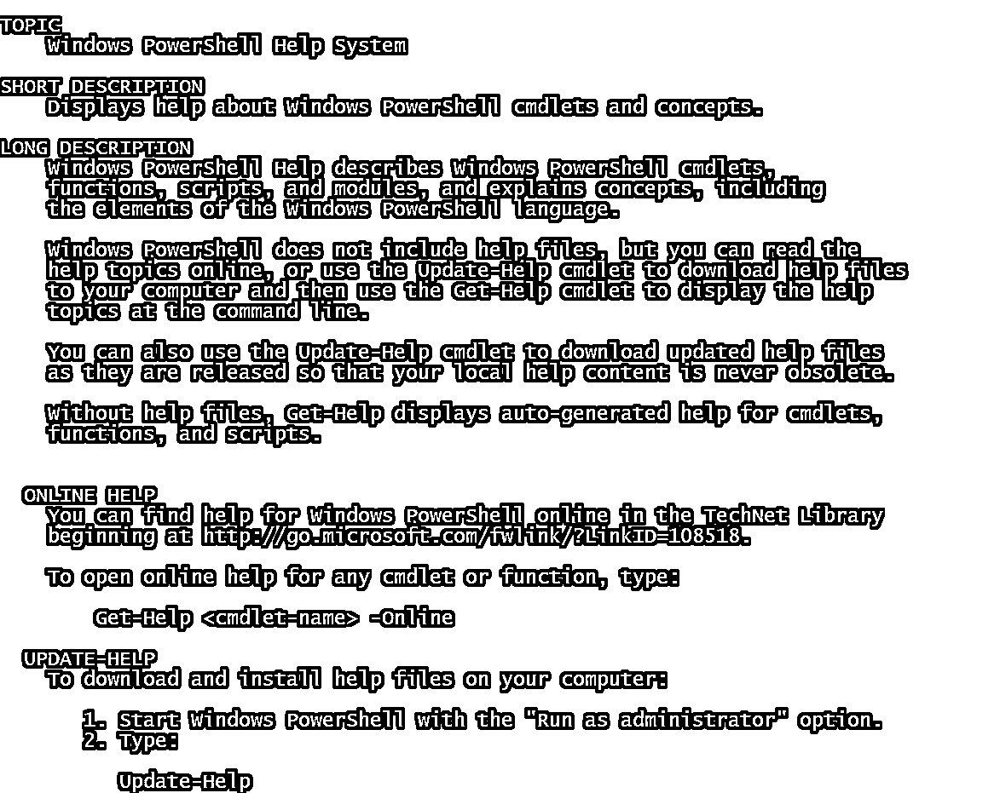

例如，我想了解 Get-Process 命令是如何工作的。因此，cmdlet 应该是

`Get-Help -Name Get-Process`

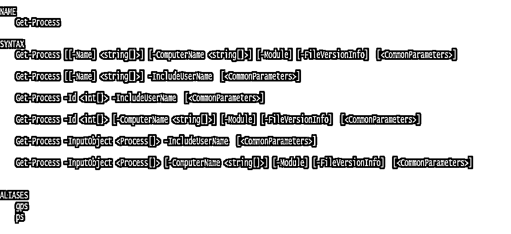

`Get-Service`

在命令行上运行此 cmdlet 时，将返回计算机上的服务列表。

`Get-Service “App*”`

此 cmdlet 返回以“App”开头的服务列表。

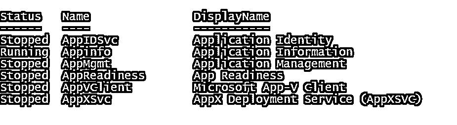

`Get-Service | Where-Object {$_.Status –eq “Running”}`

此 cmdlet 进一步筛选列表，仅显示正在运行的服务。

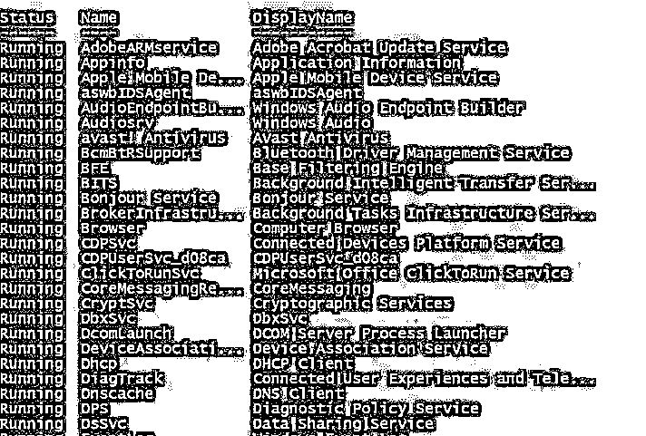

**注:**

*   **$_** 指管道中的当前记录。
*   如果状态为“正在运行”,它将处理 Get-Service 检查返回的每个输出记录，然后相应地过滤结果。

`Get-Service | Where-Object {$_.Status -eq “Running”} | Select-Object Name`

我们可以进一步过滤列表，只显示第二列，即 Name 列。此 cmdlet 将仅显示正在运行的服务的名称。

`Get-Command`

此 cmdlet 生成机器中安装的 cmdlet 和函数的列表。

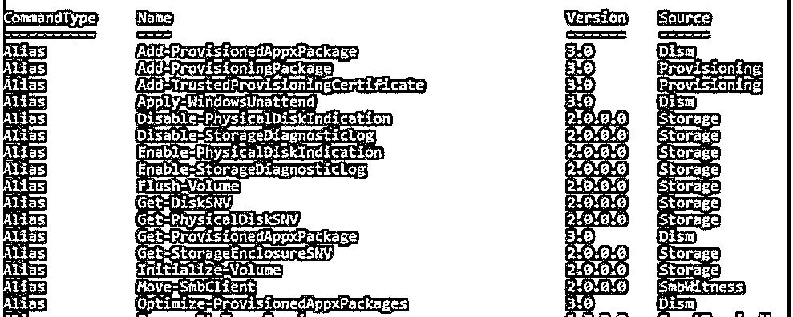

**注**:

*   Get-Command 的语法是动词-名词。
*   动词指的是获取、设置、添加、清除、写入和读取
*   名词指网络或系统中的文件、服务器和其他几个项目。

### PowerShell 脚本

*   [PowerShell 脚本](https://www.educba.com/useful-powershell-scripts/)的文件扩展名为. ps1
*   出于安全原因，默认情况下，脚本已被禁用，以防止恶意代码在其环境中执行。
*   有四种可用的安全级别，通过运行可以看到:

Get-ExecutionPolicy 命令。

*   **受限:**默认设置，不允许运行任何脚本。
*   **所有已签名:**只有由可信的开发人员签名的脚本才允许运行。
*   **远程签名:**本地创建的脚本被允许运行，而远程创建的脚本只有在由可信开发者签名的情况下才被允许运行。
*   **无限制:**任何脚本都可以不受任何限制地运行。

可以使用 Set-ExecutionPolicy 命令后跟策略名称来设置执行策略。

`Set-ExecutionPolicy Unrestricted`

可以通过运行 Get-ExecutionPolicy 命令找出正在使用的执行策略。

#### PowerShell 脚本示例

主要有两种创建和执行脚本的方法。

**示例#1** 打开一个记事本文件，直接编写脚本，然后以扩展名. ps1 保存该文件

*   在记事本文件中写下下面一行

`Write-Host “My First PowerShell Script`

*   然后将此文件另存为“ps1”。

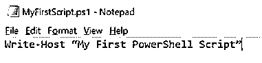

*   可以在 PowerShell 中调用该脚本，方法是指定文件名，后跟文件所在的位置

`.\MyFirstScript.ps1`

**示例 2** Windows PowerShell ISE 是创建 PowerShell 脚本并执行它们的另一种强大方式。使用 ISE 的好处是它提供了一个运行、测试以及调试脚本的环境。

*   搜索 Windows PowerShell ISE，右键“以管理员身份运行”。

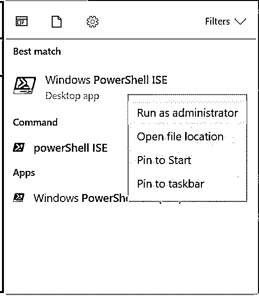

*   将以下代码写入编辑器，并另存为“ps1”

`Write-Host “My First PowerShell Script”`

*   按 F5 运行代码:

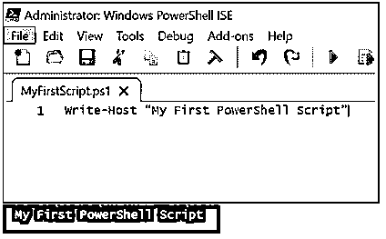

### 理解变量的使用

1.打开 PowerShell ISE 并编写以下代码

`$A = Get-Date
$A`

**注**:

*   **$A** 是存储日期值的变量。
*   **$A** 只是打印存储在其中的值。

2.将文件另存为“Date.ps1”。

3.按 F5 执行脚本并查看输出。

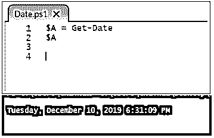

### 了解“@”的用法

1.打开 PowerShell ISE 并编写以下代码行。

`$array = @{Shape =”Square”;Side=4}
$array`

**注:**

*   **“@”**符号指一个数组。
*   **$array** 是包含数组的变量。

2.将文件另存为 **"Array.ps1"**

3.按 F5 运行脚本并查看输出。

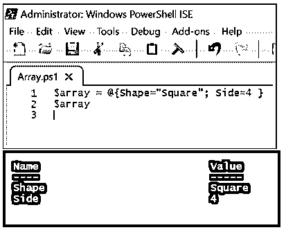

### 结论

在这篇文章中，我们试图涵盖几乎所有的基本概念，并希望这将给出一个如何使用它的清晰画面。在当今的技术行业中，由于其巨大的灵活性和对简化管理操作的贡献，它已成为 it 专业人员和管理员的强大工具和理想选择。有许多任务可以在 ps 的帮助下完成，甚至是那些你可能没有意识到的任务。您开始使用它的次数越多，您就越会开始了解这个强大工具的功能。

### 推荐文章

这是如何使用 PowerShell 的指南？.在这里，我们讨论什么是 PowerShell、ISE 和脚本及其示例和使用。您也可以浏览我们的其他相关文章，了解更多信息——

1.  [机器学习软件](https://www.educba.com/machine-learning-software/)
2.  [人工智能的重要性](https://www.educba.com/importance-of-artificial-intelligence/)
3.  [数据存储设备](https://www.educba.com/data-storage-devices/)
4.  [深度学习算法](https://www.educba.com/deep-learning-algorithms/)

