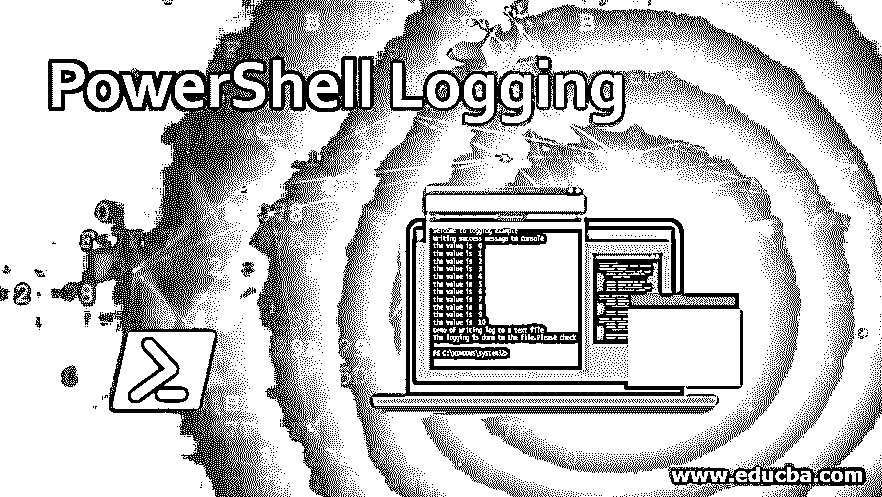
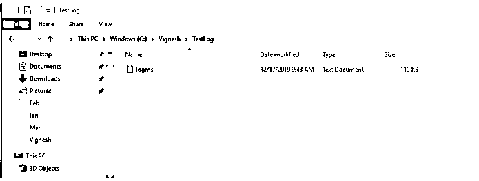
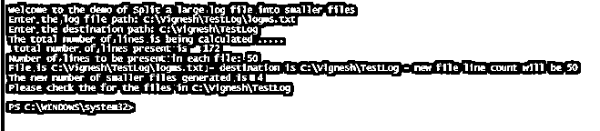
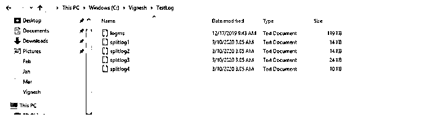
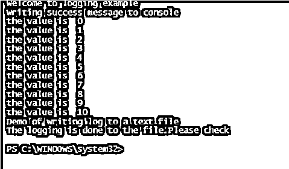

# PowerShell 日志记录

> 原文：<https://www.educba.com/powershell-logging/>

## PowerShell 日志记录简介

对于程序员来说，在脚本中启用日志记录非常重要，因为这将有助于在脚本出现意外行为时进行故障排除。日志记录是捕获错误消息或异常的机制，但它也有助于在脚本执行之前识别错误点。有时，如果一个脚本只对少数几个值起作用，而对其他值不起作用，那么如果启用了日志记录，程序员就可以很容易地缩小问题范围并修复它。PowerShell 提供了各种日志记录方法，本文将详细介绍这些方法。PowerShell 提供了三种类型的日志记录，如模块日志记录、脚本块日志记录和转录日志记录。

### 启用增强的 PowerShell 日志记录的先决条件

对于 Windows 10，自动支持增强的 PowerShell 日志记录。

<small>Hadoop、数据科学、统计学&其他</small>

对于装有 PowerShell v5.0 的 windows 7、8、2008、2012，需要以下组件

*   .Net 4.5
*   WMF (4.0/5.0)

对于装有 PowerShell v4.0 的 windows 7、8、2008、2012，需要以下组件

*   .Net 4.5
*   WMF (4.0)

#### 1.日志记录配置

在尝试记录脚本中的错误之前，在组策略中启用它们是很重要的。以下是步骤

本地组策略编辑器管理模板 Windows 组件 Windows PowerShell。在这种情况下，我们需要启用打开模块日志记录、打开 PowerShell 脚本块日志记录和打开 PowerShell 转录。

#### 2.模块日志记录

模块日志记录记录管道细节，如脚本执行时的变量初始化和命令调用。它将记录脚本和数据的样本，这些样本被格式化后作为输出发送。此外，它将捕获其他类型可能会遗漏的日志记录，但可能无法捕获某些命令。这种类型的日志事件写在 4103-事件 id 下。

#### 3.脚本块日志记录

这用于捕获所有脚本和命令的日志。这用于确定来自外部攻击者的攻击模式。甚至解码后的命令也会被捕获和记录。该日志事件记录在事件 id-4104 下。如果日志超过指定的限制，它将被分割成多个文件并被捕获。从 PowerShell 5.0 开始，如果脚本包含某些预定义的命令或易于受到攻击的脚本技术，则会自动启用脚本阻止。除非有目的地禁用脚本阻止日志记录，否则这些事件会记录在警告级别以下。这将捕获所有活动，而不仅仅是可疑活动。非可疑活动将被记录在事件 id 4104 下，但以详细或信息级别记录。

#### 4.转录记录

如果启用了事务日志记录，则会为每个会话创建一条记录，包括该会话中出现的每个输入和输出命令。这些信息与时间戳和元数据一起被写入一个文本文件。它们是自动命名的，以 PowerShell_transcript 开头。文件写入的默认位置是用户的文档文件夹；如果需要，这可以改变。存储它们的最佳位置是网络驱动器，这样攻击者就不能轻易访问它们。文件的大小非常小，然后可以使用任何标准工具进行检查。必须在本地组策略编辑器中或通过在注册表中设置它们的值来启用适当的日志记录机制。

#### 5.将巨大的日志文件拆分成较小的文件

有时，生成的日志文件可能非常大。这可能会妨碍调试过程。在这种情况下，如果我们能够将单个日志文件分割成更小的文件，将会很有帮助。下面的脚本将有助于实现这一点。该脚本首先识别需要分割的源文件。然后，它会询问保存新拆分日志文件的目标文件夹。接下来，脚本提示用户每个日志文件中应该包含的行数。一旦完成，就会生成新的日志文件。

**输入:**

`Write-Host "Welcome to the demo of Split a large log file into smaller files"
$lc = 0
$fn = 1
# Getting the source log file
$source = Read-Host "Enter the log file path"
# Getting the destination where the smaller log files will be saved
$destination = Read-Host "Enter the destination path"
Write-Host "The total number of lines is being calculated ..... "
Get-Content $source | Measure-Object | ForEach-Object { $sourcelc = $_.Count }
#total number of lines in source file
Write-Host " total number of lines present is  "  $sourcelc
# size of each destination file
$destfilesize = Read-Host "Number of lines to be present in each file"
$maxsize = [int]$destfilesize
Write-Host File is $source - destination is $destination - new file line count will be $destfilesize
$content = get-content $source | % {
Add-Content $destination\splitlog$fn.txt "$_"
$lc ++
If ($lc -eq $maxsize) {
$fn++
$lc = 0
}
}
Write-Host "The new number of smaller files generated is " $fn
Write-Host "Please check the for the files in" $destination`

在运行脚本之前，源目录中的文件数

**输出:**

运行脚本后，目录中的文件数量

**输入:**

`Write-Host "Welcome to logging example"
Write-Host "Writing success message to console"
for($i=0; $i -le 10; $i++)
{
Write-Host "the value is "$i
}
Write-Host "Demo of writing log to a text file"
for($i=0; $i -le 10; $i++)
{
$i |Out-File -FilePath C:\Vignesh\TestLog\test.txt -Append
}
Write-Host "The logging is done to the file.Please check"`

**输出:**

### 结论

因此，本文详细介绍了如何登录 PowerShell。它详细解释了各种可用的日志记录类型以及每种日志记录机制的用法。本文通过一个例子解释了如何将一个大的日志文件分割成更小的日志文件。它还解释了如何对文件或控制台进行日志记录。日志记录是脚本编写过程中要遵循的最佳实践之一，因为每当发生不寻常的事情时，它都会使生活变得更容易。了解更多信息的最佳方式是编写示例脚本并执行它们。

### 推荐文章

这是 PowerShell 日志记录指南。在这里，我们将讨论各种可用的 PowerShell 日志记录类型以及每种日志记录机制的用法。您也可以看看以下文章，了解更多信息–

1.  [PowerShell 转换为字符串](https://www.educba.com/powershell-convert-to-string/)
2.  [PowerShell 获取项目](https://www.educba.com/powershell-get-item/)
3.  [PowerShell ForEach 对象](https://www.educba.com/powershell-foreach-object/)
4.  [PowerShell 别名](https://www.educba.com/powershell-alias/)

