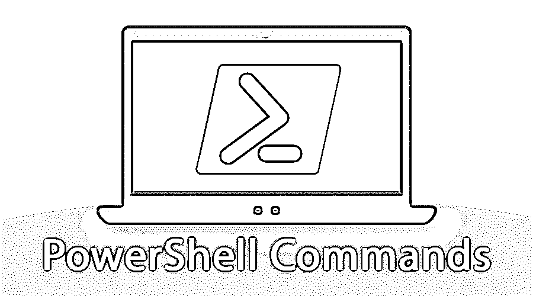
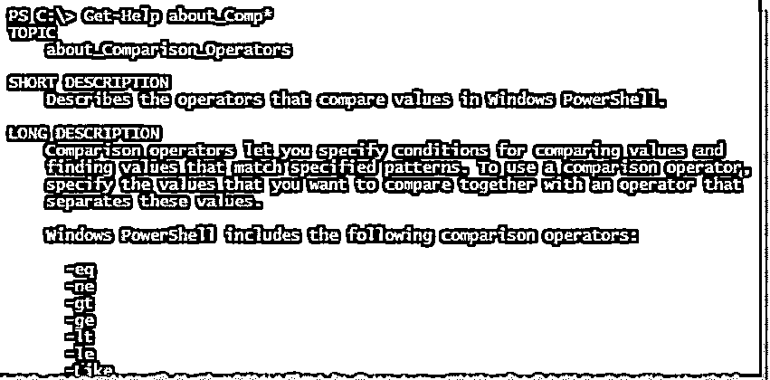
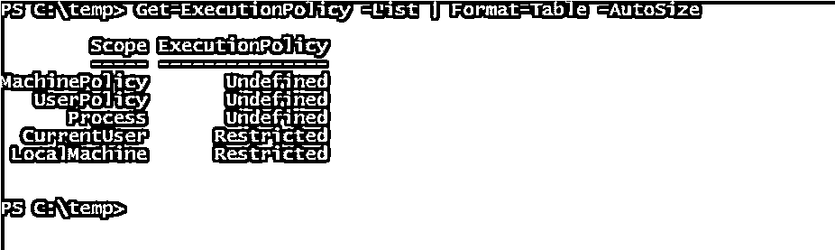
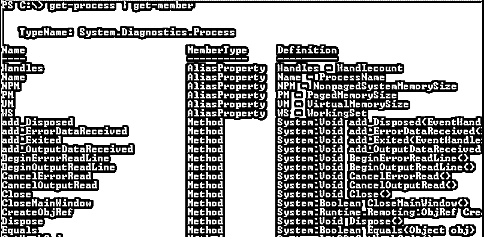
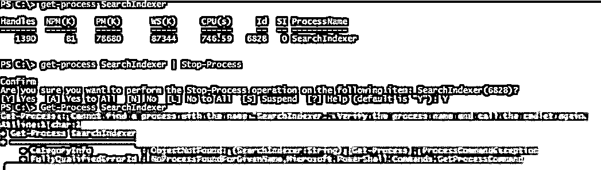
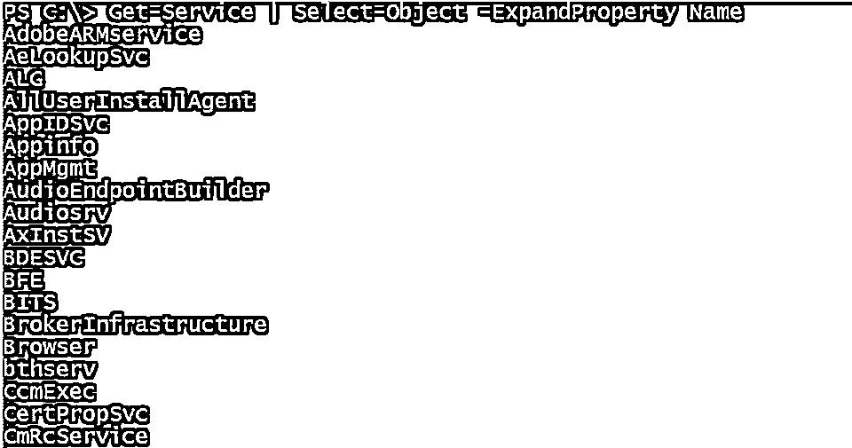
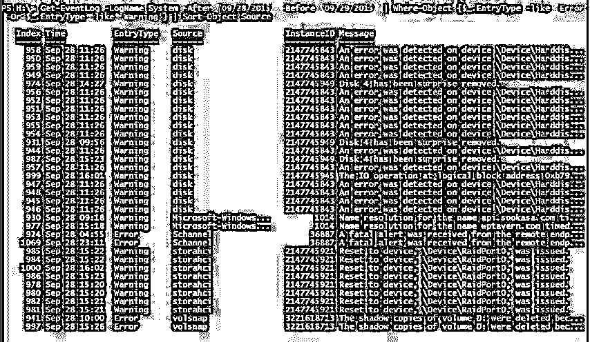
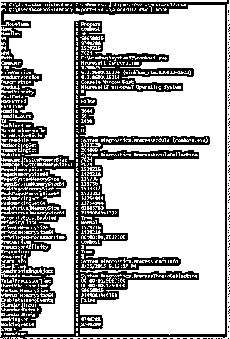
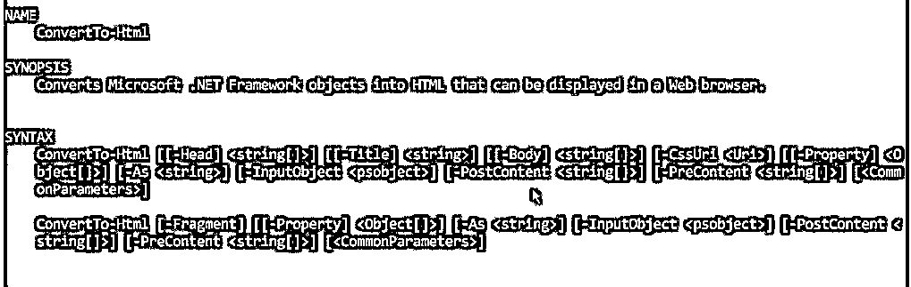
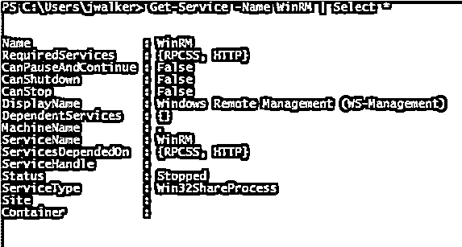

# PowerShell 命令

> 原文：<https://www.educba.com/powershell-commands/>

## 什么是 PowerShell 命令？

以下文章概述了 PowerShell 命令。PowerShell 是一种自动化的面向对象脚本语言。系统管理员广泛使用它。PowerShell 是 on.Net 构建的一个框架。它使用公共语言运行时，这个框架接受并返回。NET Framework 对象。它还介绍了 cmdlet 的一个特性，cmdlet 是一个内置在 shell 中的简单命令行工具。它是开源的，跨平台的。cmdlets 可以从不同的数据存储(如文件系统或注册表)中访问数据。cmdlets 也可以由第三方提供商添加。

### 基本 PowerShell 命令

以下是基本的 PowerShell 命令:

<small>Hadoop、数据科学、统计学&其他</small>

#### 1.获得帮助

这是任何 Windows 管理员都可以使用的最基本也是最重要的命令。此命令可用于获得其他命令的帮助。为了获得关于其它命令的信息，这个命令是有用的。Windows 将显示完整的命令语法。

#### 2.设置执行策略

为了防止任何恶意代码在 PowerShell 环境中执行，微软已经禁用了脚本。

要控制此安全级别，用户可以使用此命令，然后将其更改为以下任何一项:

*   **Restricted:** 这是默认的 Set 选项，锁定 PowerShell 仅交互进入。
*   **全部签名:**该模式允许所有脚本仅在可信发布者签名时运行。
*   **远程签名:**如果设置了此选项，此模式允许本地创建的 [PowerShell 脚本](https://www.educba.com/useful-powershell-scripts/)运行。
*   **无限制:**这意味着所有限制将从执行策略中删除。

#### 3.获取执行策略

当管理员不熟悉服务器时，他们必须了解用于运行脚本的执行策略，这可以通过使用 Get-Execution 策略找到。

#### 4.获取流程

该命令可用于获取所有正在运行的进程的列表，该列表将显示所有当前正在运行的进程。

#### 5.停止进程

有时可能会出现进程停滞的情况。通过使用 Get-Process，可以找到进程的 id，用户可以使用 Stop-Process 命令终止该进程。进程 id 的名称可用于终止正在进行的进程。

#### 6.选择对象

每当导出对象时，CSV 文件中都会包含许多属性。select 命令帮助您缩小范围，将只包含您感兴趣的对象。此命令帮助您指定一些要包含的特定属性。例如，要创建包含每个系统的名称及其状态的 CSV 文件，可以使用以下命令。

#### 7.获取事件日志

为了解析计算机事件日志，PowerShell 被广泛使用。这是因为它提供了许多参数，通过提供后跟日志文件名的-log 开关来帮助查找日志。

#### 8.导出 CSV

呈现的数据可以从 PowerShell 导出到 CSV 文件中，该文件可以使用 Excel 进行访问。用户需要提供输出文件名，这可以导出到一个 CSV 文件。

#### 9.转换为-HTML

PowerShell 可以提供关于系统的各种信息，并帮助创建可以发送给任何人的报告。这可以通过使用 Convert To-HTML 实现。要使用这个命令，用户可以很容易地将另一个命令的输出转换为-HTML。此外，用户可以使用属性开关，这有助于控制输出，其中包括一个 HTML 文件。

#### 10.获取服务

此命令提供了可以安装的所有服务的列表。如果用户想要一些特定的服务，他们可以附加-Name 开关，然后命名它。

### 中间 PowerShell 命令

下面是 PowerShell 中间命令的列表:

*   Dir: 它获取文件系统驱动器中的所有文件和文件夹。
*   **Epsn:** 该命令从不同的会话导入命令，并将它们保存在 Windows PowerShell 模块中。
*   **fl:** 它格式化属性的输出列表，其中所有属性出现在新的一行。
*   **Get-Job:** 获取当前会话中正在运行的 Windows PowerShell 后台作业。
*   **Get-Member:** 帮助获取对象的属性和方法。
*   **Get-Item 属性:**获取指定项目的属性。
*   **Invoke-Command:** 它在本地和远程计算机上运行命令。
*   **Invoke-WMI 方法:**它调用 Windows 管理规范方法。
*   **New-PSDrive:** 它创建临时和永久的映射网络驱动器。
*   **Out-Host:** 它向命令行发送输出。

### 高级 PowerShell 命令

PowerShell 的这些高级命令对于获取不同格式的信息和配置安全性非常有用。

*   **Get-Unique:** 这是一个 cmdlet，从对象的排序列表中获取唯一的对象。
*   **Measure-Object:** 此 cmdlet 可用于获取函数传递的输出属性，如 min、max、size、count、line 等。
*   此 cmdlet 用于从传递给它的对象集合中选择具有特定属性值的对象。
*   **Start-Sleep:** 这也是一个 cmdlet，它将脚本或会话中的活动暂停一段特定的时间。
*   **Invoke-Expression:** 用于对本地计算机执行命令或表达式。

### 使用 PowerShell 命令的提示和技巧

*   利用唯一的$变量。变量可以存储和操作数据。它增加了代码的灵活性和重用性。
*   使用 Start-script 和 Stop-script 来启用脚本中的日志记录。
*   利用尝试和捕捉来提高脚本的弹性。
*   使用导入-CSV 和导出-CSV 链接导入和导出数据。你可以制作自己的脚本。
*   对于重复操作，请使用 for each。用户可以重复块，这有助于自动化大型手动任务。

### 结论

PowerShell 命令是一个非常强大的工具，可以帮助管理员进行监控和其他目的。它在 Linux 中是模拟的，也被称为 [bash 脚本](https://www.educba.com/what-is-bash-scripting/)。它提供了 cmdlets，有助于通过命令行管理计算机。它还提供对数据分数的访问，如注册表和证书分数。它还有一个丰富的解析器，可以帮助开发脚本语言。因此，它有助于轻松管理所有活动的命令。

### 推荐文章

这是 PowerShell 命令的指南。这里我们讨论了概念、高级命令的基础以及使用 PowerShell 命令的技巧和诀窍。您也可以浏览我们推荐的其他文章，了解更多信息——

1.  [Powershell 有哪些用途？](https://www.educba.com/uses-of-powershell/)
2.  [PowerShell 字符串函数指南](https://www.educba.com/powershell-string-functions/)
3.  [如何使用 PowerShell？带有示例的 PowerShell 脚本](https://www.educba.com/how-to-use-powershell/)
4.  [PowerShell Get-Item 完整指南](https://www.educba.com/powershell-get-item/)

