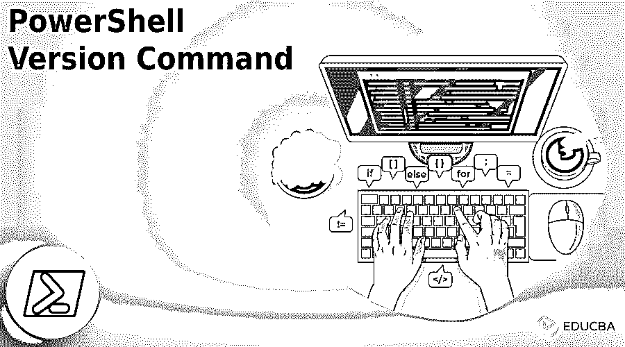
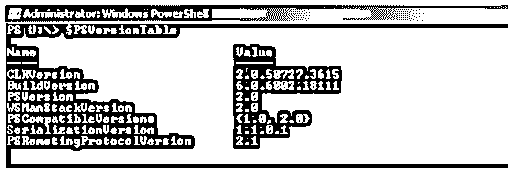
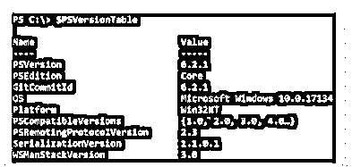
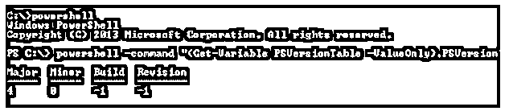
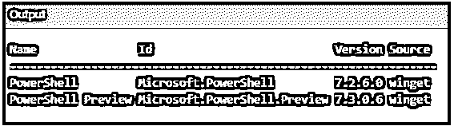

# PowerShell 版本命令

> 原文：<https://www.educba.com/powershell-version-command/>




## **PowerShell 版本命令介绍**

以下文章提供了 PowerShell 版本命令的概述。PowerShell 是用作命令提示符窗口的渐进形式。但是现在，它通过多种 cmdlets 得到了增强，并带有一个有吸引力的用户界面。

它支持 C#和。NET framework 作为高级选项与 windows GUI 工具一起使用，ISE PowerShell 允许用户调试脚本，并高效地进行编辑。当 windows 10 与 PowerShell 5.0 一起推出时，该组件表现得非常出色，并且以动态方式工作。但是人们很想知道版本之间的差异，并希望找到适合业务需求的版本。本文讨论了 PowerShell 在各种操作系统中的版本号。

<small>Hadoop、数据科学、统计学&其他</small>

### 关键要点

*   如果问题出在笔记本电脑上，用户可以选择恢复修复选项。
*   还原选项扫描整个存储库，并替换丢失和损坏的文件。
*   要修复版本问题，用户可以启用 ENABLE_MU = 0，因为它不会删除任何现有设置。它可以通过组策略设置来修复。

### PowerShell 版本命令概述

有一个简单的命令可以用来查找 PowerShell 的版本，那就是$PSVersion 表。一旦输入，它就直接获取 PowerShell 版本的输出。通过在开始菜单中启动 PowerShell，用户甚至可以在任何给出 PowerShell 版本号的版本中给出 PS version 命令。

最初，PowerShell 于 2006 年在 Windows server 2003 SP1、Vista 和 Windows XP SP2 上推出。它是一个独立的软件包。下一个版本 PowerShell v3 是在 windows 8 的第二个捆绑版本上推出的，它是微软提供的 PowerShell，安装在 windows 7sp1、windows 2008 sp1 中，但不能安装在 windows XP 中。但 windows 8.1 自带高级 PowerShell 版本 4，也安装在 windows server 2008 SP1 中。

PowerShell 5.0 是 2016 年推出的 windows 管理框架。它被宣布为最终版本，具有 OneGet 命令功能，支持基于 chocolatey 存储库的应用程序，可以管理双网络交换机。整个版本与 Windows 2016 上推出的 nano 服务器结合在一起。桌面版侧重于操作系统中的服务器版和客户端的传统版。当微软宣布要使产品成为一个跨平台的产品，不依赖于 Linux、mac 和 Windows，并有它们的生命周期支持。它计划每六个月发布一次小版本。

### 如何检查 PowerShell 版本命令？

在 Windows 中，要查找 PowerShell 命令，请按照以下说明操作。在上下文菜单中，用户可以作为管理员添加一个打开的 PowerShell 选项。




然后键入命令:

**代码:**

```
Get – Host | Select – object version
```

**输出:**


现在作为输出，输出 PowerShell 的版本。或者，给出$PSVersion 表并按回车键。我们可以找到 PSVersion 线。当默认版本引导用户快速检查 PowerShell 版本时。

要打开运行命令提示符窗口，请按 windows 键和 r。然后给出 PowerShell 并按 enter 按钮。因此，新的提示窗口被打开。

在新打开的窗口中，给出 PowerShell 命令$PSVersionTable，并按 enter 键。




PowerShell 实用程序详细信息列表在此窗口中进行了说明。通过 windows 控制台，单击挂起的更新并将其更新。

### 适用于 Windows 和 Mac 的 PowerShell 版本命令

为了知道引擎版本，使用$PSVersion 表 PSVersion，如果变量不存在，那么用户可以假设当前引擎的版本是 1.0。我们必须注意到$Host 版本和带有 get Host 的版本并不可靠。它可以帮助检查主机的版本，但它不会给出有关引擎的消息。所有托管的应用程序、PowerShell Plus、PowerShell GUI 将修复主机版本以反映产品版本。这也是查找版本详细信息的另一种方法。




### 安装 PowerShell 版本命令

在 windows 中安装 PowerShell 有不同的方法。每个安装选项都经过定制，以支持不同的工作流和场景。根据需求来固定是用户的选择。

Winget 是在 windows 客户端上安装 PowerShell 选项的方法，也是最值得推荐的方法。





MSI 包是企业部署案例的最佳选择，并且适用于 windows 服务器。

压缩包是一种自适应的方法来侧装或平行的方法来安装不同的版本。

在 windows nano server、基于 arm 的系统和 windows iot 中，用户可以选择这种方法。

.NET 全球工具是最好的选择。NET 开发人员安装和使用其他全球工具。


对于标准用户来说，Microsoft store 软件包是一种友好的安装方式，但有一些限制。

### 常见问题解答

下面是提到的常见问题:

#### Q1。如何在 Mac 上查看 PowerShell 的版本？

**答:**大部分在 Mac 中，PowerShell 版本会是 2.0 或 1.0。因此，用户必须通过发出以下命令来检查注册表或注册表项的位置。HKEY _ LOCAL _ MACHINE \ software \ PowerShell \ Microsoft \ 1-PowerShell 引擎。

值名:PowerShell 版本和值类型应该是 Reg-SZ。

#### Q2。PowerShell 上可以执行多个版本？

**回答:**是的。从版本 3 开始是可能的，对于较低版本，它可以与版本参数一起使用。在 windows PowerShell 上使用指定的版本执行版本。版本号可以是一个参数，可以是“-版本 2.0”。

#### Q3。如何更换 PowerShell 的版本？

**答案:**windows 管理框架应该安装在 5.1 MSU 文件上。服务器重新启动后，PS 控制台应该会打开，并确保 PowerShell 的版本更新到 5.1。如果用户不支持 Windows 7 或 Windows Server R2，则可以将其从 2.0 升级到 5.1 的 PowerShell 版本。

### 结论

PowerShell version 命令很简单，可以根据需要执行。因此，本文帮助用户使用 PowerShell 版本命令。

### 推荐文章

这是 PowerShell 版本命令指南。这里我们讨论一下简介，以及如何检查 PowerShell 版本命令。和 PowerShell 版本命令。您也可以看看以下文章，了解更多信息–

1.  [PowerShell 创建目录](https://www.educba.com/powershell-create-directory/)
2.  [PowerShell 正常运行时间](https://www.educba.com/powershell-uptime/)
3.  [PowerShell 停止服务](https://www.educba.com/powershell-stop-service/)
4.  [PowerShell 日志](https://www.educba.com/powershell-logging/)


