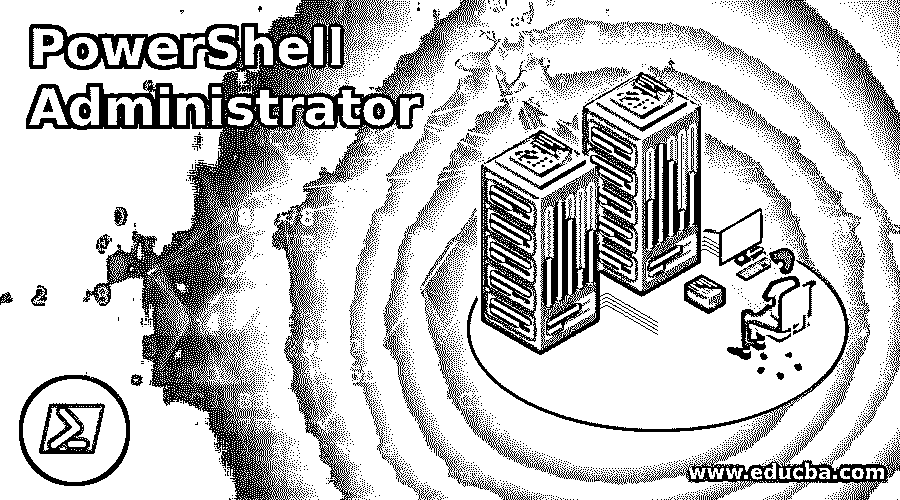
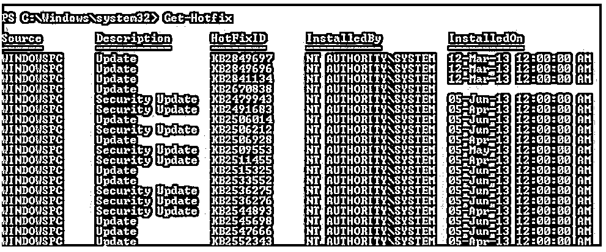
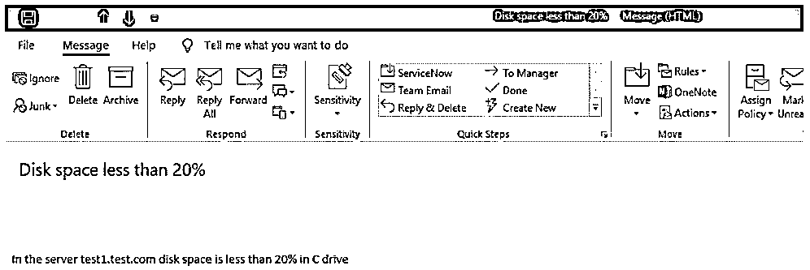
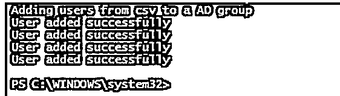
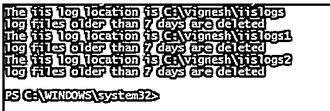

# PowerShell 管理员

> 原文：<https://www.educba.com/powershell-administrator/>

## PowerShell 管理员简介

PowerShell 管理员负责维护组织中所有基于 windows 的服务器。他们还负责维护组织数据的完整性。他们还在维护员工的入职和离职方面发挥着关键作用，因为他们负责维护组织的活动目录。PowerShell 管理员也称为 windows 管理员。

### 作为 PowerShell 管理员的不同运行方式

在 PowerShell 中以普通模式运行 cmdlet 或脚本与以管理员模式运行 cmdlet 或脚本有很大的区别。这是因为大多数操作需要管理员访问权限，只有 PowerShell 管理员有权执行这些操作。

<small>Hadoop、数据科学、统计学&其他</small>

以下是 PowerShell 在管理模式下运行的不同方式:

*   搜索 PowerShell，右键单击并选择以管理员身份运行。
*   使用 run 命令打开 PowerShell。PowerShell 窗口打开后，键入 Start-Process PowerShell-verb run as 并按 enter 键。
*   通过使用任务管理器，创建新任务。在名称中，键入 PowerShell 并选中“使用管理权限创建此任务”,然后按 enter 键。

### PowerShell 管理员的角色和职责

以下是角色和职责:

#### 1.检查补丁程序

PowerShell 管理员的主要职责之一是检查可用的最新补丁并安装它们。这对于任何组织来说都是防止资源遭受漏洞攻击和其他安全相关问题的关键部分。该组织的大多数补丁每月安装一次，以避免任何威胁。Get-Hotfix cmdlet 用于查找修补程序。如果我们知道补丁的 id，那么应该传递 KB 文章值。

**举例:**

**代码:**

`Get-Hotfix`

**输出:**

它将显示本地计算机中安装的所有修补程序的列表。

#### 2.监控磁盘空间可用性

PowerShell 管理员的另一项重要任务是监控系统中的可用磁盘空间。如果系统中有多个服务器，并且无法手动完成，这个过程将非常繁琐。这项工作是由大多数管理员在脚本的帮助下自动完成的，该脚本会定期检查磁盘空间并根据情况发送触发信号。这些脚本使用任务调度程序运行，任务调度程序将在非营业时间运行。

**举例:**

**代码:**

`$ServerList= Import-csv -path "C:\serverlist.csv"
ForEach ($s in $ServerList)
{$reportlist=Get-WmiObject win32_logicaldisk -ComputerName $s -Filter "Drivetype=3" -ErrorAction SilentlyContinue | Where-Object {($_.freespace/$_.size) -le '0.2'}
$vi=($reportlist.DeviceID -join ",").Replace(":",""
If ($reportlist)
{
$Eto = "test@test.com"
$Efro = "test@test.com"
$username = 'test@test.com'
$pwd = '#$5555'
$sub = "Disk space less than 20%"
$bdy = "In the server $s disk space is less than 20% in $vi"
$smser = "testadd@test.com"
$smmsg = New-Object System.Net.Mail.MailMessage($Efro,$Eto,$sub,$bdy)
$smtcli = New-Object Net.Mail.SmtpClient($smser, 587)
$smtcli.EnableSsl = $true
$smtcli.Credentials = New-Object System.Net.NetworkCredential($username, $pwd)
$smtcli.Send($smmsg)
}
}`

**输出:**

#### 3.将 csv 中的用户添加到广告组

**举例:**

**代码:**

`write-host "Adding users from csv to a AD group"
Import-Csv “C:\vignesh\userlist.csv” | ForEach-Object {
$USPN = $_.SAN + “@test.com”
New-ADUser `
-DisplayName $_.DN `
-Name $_.”Na” `
-GivenName $_.”GN” `
-Surname $_.”SN” `
-SAN $_.”samname” `
-UserPrincipalName $USPN `
-Office $_.”Of” `
-EmailAddress $_.”emadd” `
-Description $_.”des” `
-AccountPassword (ConvertTo-SecureString “Tes$@123!” -AsPlainText -force) `
-ChangePasswordAtLogon $true `
-Enabled $true `
Add-ADGroupMember “testgroup” $_.”samname”;
write-host "User added successfully"
}`

**输出:**

#### 4.检查修补程序是否安装在服务器上

**举例:**

**代码:**

`#list of servers to be checked
$servers = get-content -path  C:\servers.txt
#list of patch id's
$patdet = get-content -path  C:\padetails.txt
foreach ($ser in $servers)
{
foreach ($pa in $patdet)
{
Get-HotFix -id $pa -ComputerName $ser -OutVariable re -ErrorAction SilentlyContinue
if ($re -ne $null) {
write-host "Patch $pa is present in the $($ser)"
}
else {
write-host "patch $pa is not present in the $($ser)"
}
}
}`

**输出:** T3】

在上面的示例中，服务器列表保存在一个 csv 中，要检查安装的修补程序 id 列表保存在另一个 csv 中。对于 csv 中提到的每台服务器，检查是否安装了所有的修补程序 id。服务器细节和补丁 id 可以放在同一个 csv 文件中，但是放在不同的 csv 文件中会更方便。

#### **5。**删除超过 10 天的 IIS 日志

**代码:**

`Write-Host "Welcome to the iis logs archive example"
$iislogpath = Import-Csv "C:\Vignesh\logpath.csv"
foreach($path in $iislogpath)
{
write-host "The iis log location is" $path
$deleteddays = "-10"
$CurrentDate = Get-Date
$noofdays = $CurrentDate.AddDays($deleteddays)
Get-ChildItem $Path -Recurse  | Where-Object { $_.CreationTime  -lt $noofdays } | Remove-Item
Write-Host "log files older than 7 days are deleted "
}`

**输出:**

在上面的脚本中，文本文件中提到了日志位置列表。然后，在每个路径中，超过 7 天的文件将被删除。这也可以在任务计划程序中进行计划，并且可以在每天非工作时间运行。

### 结论

因此，本文详细介绍了谁是 PowerShell 管理员以及他的角色和职责。提到的角色只是少数，但是有比 PowerShell 管理员在日常活动中所做的更多的任务。这些角色用适当的例子进行了解释。在某些情况下，PowerShell 管理员还负责组织的整体基础架构。

### 推荐文章

这是 PowerShell 管理员指南。在这里，我们讨论 PowerShell Administrator 的简介，使用角色和职责运行 Administrator 的 5 种不同方式。您也可以看看以下文章，了解更多信息–

1.  [PowerShell 发送邮件](https://www.educba.com/powershell-send-mail/)
2.  [PowerShell 获取服务](https://www.educba.com/powershell-get-service/)
3.  [PowerShell 重命名文件夹](https://www.educba.com/powershell-rename-folder/)
4.  [PowerShell 功能](https://www.educba.com/powershell-functions/)

