# PowerShell 模块

> 原文：<https://www.educba.com/powershell-modules/>

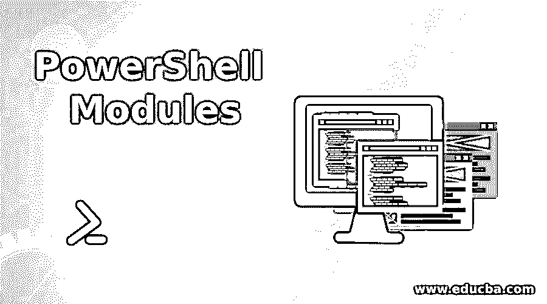

## PowerShell 模块简介

PowerShell 模块是一个包含各种命令的包，如函数、cmdlets、别名、参数、工作流和提供程序。每个 PowerShell 版本都有预定义的模块和默认安装的模块。对于每个新的 PowerShell 版本，都会自动添加和加载更多增强的模块。例如，在 PowerShell 3.0 中，当您在所有已安装的模块中运行任何命令时，模块都会自动导入。您可以使用下面的命令获取计算机中所有已安装的模块。您获得的模块列表取决于安装的 PowerShell 版本。

`Get-Module -ListAvailable`

<small>Hadoop、数据科学、统计学&其他</small>

从一个特定的模块中，您可以通过，

`Get-Command -Module ModuleName`

ModuleName 中允许使用通配符(*)。

模块非常灵活，您可以用自己的命令集创建自己的模块，并将它们发布到其他计算机和服务器上，以便使用。

PowerShell 模块可以在以下位置找到并安装，以供其他用户使用，并以不同的配置文件提供。

`$env:PSModulePath -split ';'`

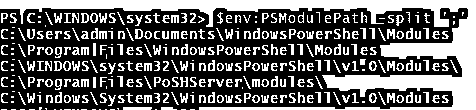

### PowerShell 模块

在 PowerShell 的上述路径中有一些默认的和导入的第三方模块。在这里，我们将解释 PowerShell 5.1 中的默认模块。

下面是每个模块的简短描述。

#### 1.AppLocker

本模块旨在管理应用程序控制策略。cmdlets 可用于帮助作者测试、维护应用程序控制策略并对其进行故障排除。通过本地安全策略管理单元和组策略管理控制台的 MMC 管理单元扩展访问的 AppLocker 用户界面。

`Get-Command -Module AppLocker`

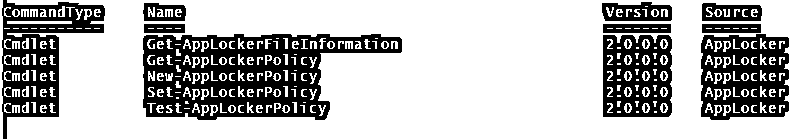

#### 2.AppBackgroundTask

此模块包含所有应用程序后台任务的 cmdlets。

`Get-Command -Module AppBackgroundTask`

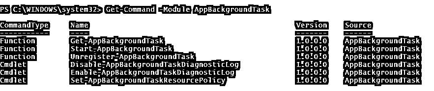

#### 3.Appvclient

此模块适用于 Microsoft 应用程序虚拟化 cmdlets。

`Get-Command -Module AppVClient`

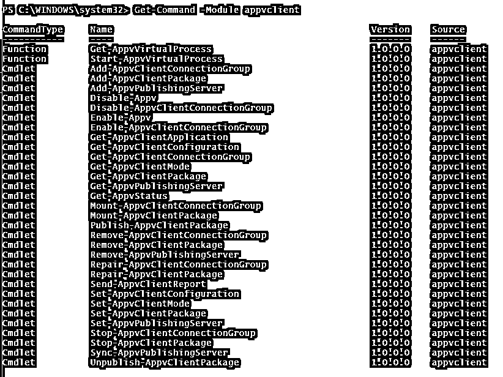

#### 4.指定访问

此 cmdlet 旨在提供对特定用户帐户的受限访问。当分配的访问权限配置给用户时，他们只能使用 windows 应用商店中的一个应用程序，但不能修改应用程序或系统设置、退出或注销应用程序。

`Get-Command -Module AssignedAccess`

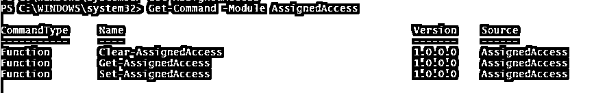

#### 5.BitLocker

此模块为 BitLocker 加密技术提供 cmdlet。BitLocker 用于加密硬盘驱动器，以防止数据在连接到另一台计算机时被窃取。

`Get-Command -Module BitLocker`

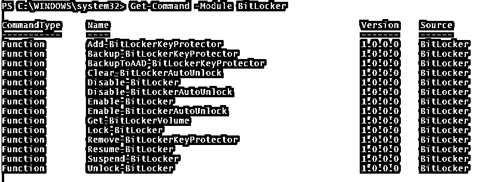

#### 6.比特转移

BITS(后台智能传输服务)是在没有应用程序使用带宽时，在具有空闲带宽的 windows 计算机系统之间传输文件的现代方法。如果出现任何中断，它会暂停传输，并在网络或客户端机器可用时再次恢复传输。

`Get-Command -Module BitsTransfer`

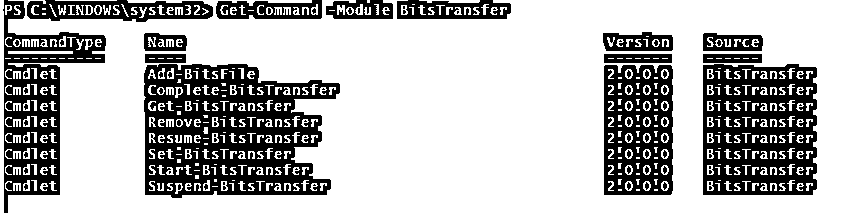

#### 7.CimCmdlets

CimCmdlets 使用几个命令进行远程处理，与传统的 WMI cmdlet 相比非常有用。首先，它支持自动完成，其次，使用 WS-Management 协议，但是这个模块也有一些限制。

`Get-Command -Module CimCmdlets`

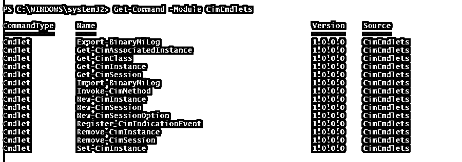

#### 8.拥护者

Windows 服务器和其他版本的 Windows 操作系统有一个内置的防病毒功能，称为 Windows Defender，此 cmdlet 提供防病毒功能的命令库管理。

`Get-Command -Module Defender`

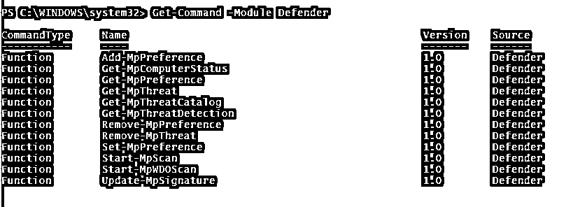

#### 9.交付优化

该模块在 Windows 10 及其更高版本 1709 和 1803 中引入。与 BITS 相比，交付优化是一种新形式的下载和共享技术。它有一些额外的功能，比如在内部网和互联网上存储和共享内容。

`Get-Command -Module DeliveryOptimization`

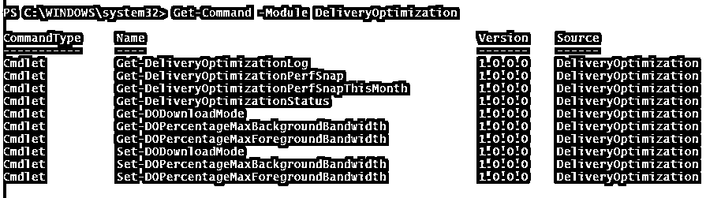

#### 10.DISM

PowerShell 中的部署映像服务和管理(DISM)提供了与 cmd 中的 asdism.exe 相同的功能。

`Get-Command -Module Dism`

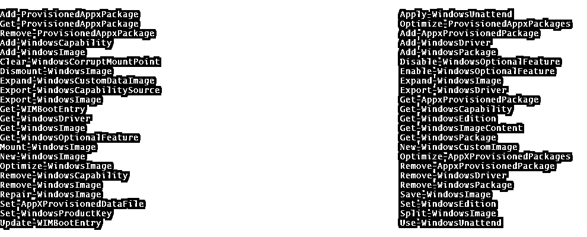

#### 11.DNS 客户端

使用此模块，您可以获取和修改本地系统和远程系统上与 DNS 客户端相关的设置。

`Get-Command -Module DnsClient`

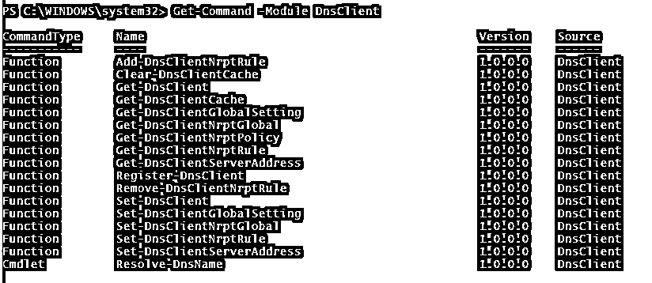

#### 12.国际的

PowerShell 模块，用于获取和设置安装操作系统时提供的计算机区域语言和区域性。

`Get-Command -Module International`

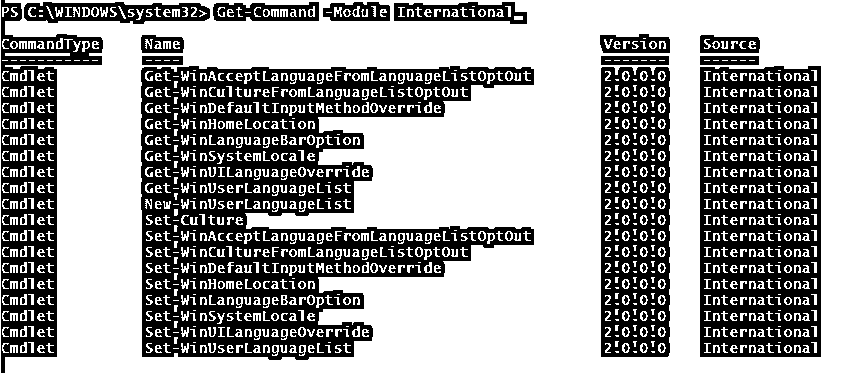

#### 13.iSCSI

用于获取/更新/删除/添加 iSCSI 存储设备的 PowerShell 模块。

`Get-Command -Module iSCSI`

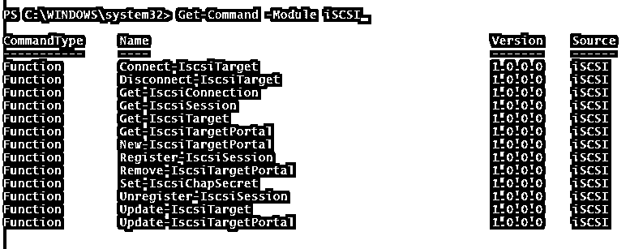

#### 14.微软。归档文件

PowerShell 模块将文件或文件夹压缩为 ZIP 文件，并提取归档文件和文件夹。

`Get-Command -Module Microsoft.PowerShell.Archive`

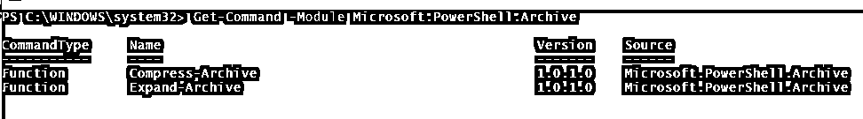

#### 15.微软。PowerShell .主机

用于记录 PowerShell 会话输出并将其存储到文本文件中的模块。

`Get-Command -Module Microsoft.PowerShell.Host`

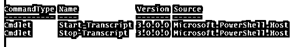

#### 16.微软。PowerShell .管理

PowerShell 模块，带有用于管理计算机或服务器的各种 cmdlets。例如，创建映射驱动器，获取/启动/停止服务或进程，以及获取本地和远程计算机信息等等。

`Get-Command -Module Microsoft.PowerShell.Management`

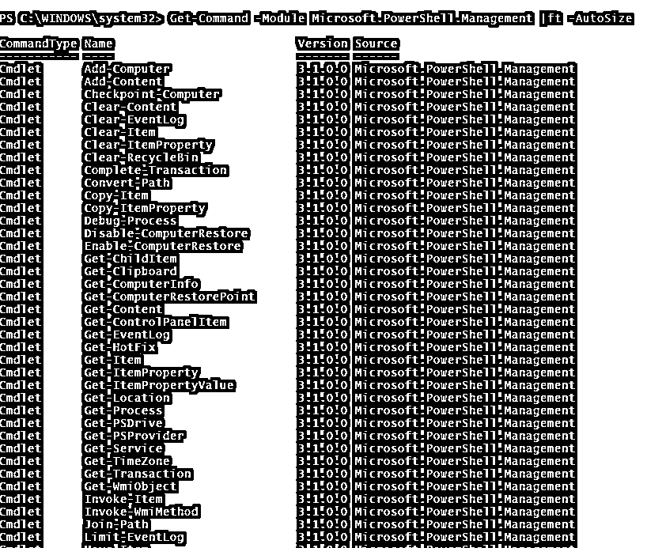

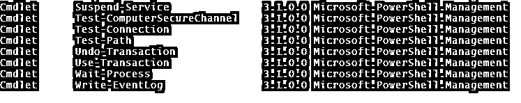

#### 17.微软。PowerShell .本地帐户

该模块用于检索、创建、删除和修改本地用户和组。例如，向新的本地组添加新用户、更改本地用户的帐户到期时间和密码、启用或禁用本地用户等。

`Get-Command -Module Microsoft.PowerShell.LocalAccounts`

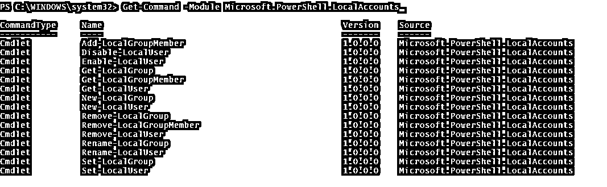

#### 18.微软。PowerShell .操作.验证

操作验证框架用于测试安装的模块。此外，还会对诊断文件夹进行检查，以确定是对简单子文件夹还是对综合子文件夹进行纠缠测试，或者对两者都进行检查。

`Get-Command -Module Microsoft.PowerShell.Operation.Validation`

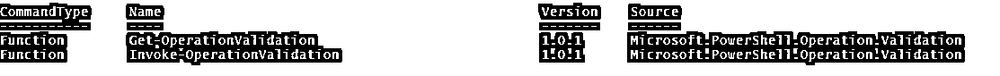

#### 19.微软。PowerShell .安全性

此模块包含 Windows 文件和文件夹安全 cmdlets。例如，获取和设置文件和文件夹的安全权限，保护密码字符串，保护/取消保护 CMS 消息等。

`Get-Command -Module Microsoft.PowerShell.Security`

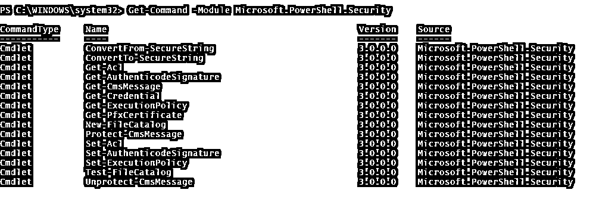

#### 20.微软。PowerShell .实用程序

带有各种 cmdlets 和函数的模块。例如，导出/导入 CSV 文件、格式化 PowerShell 控制台输出、添加/删除输出表的属性等。

`Get-Command -Module Microsoft.PowerShell.Utility`

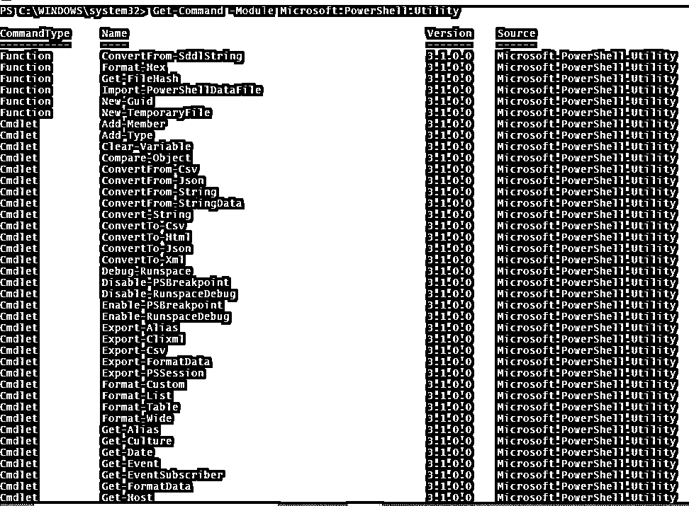

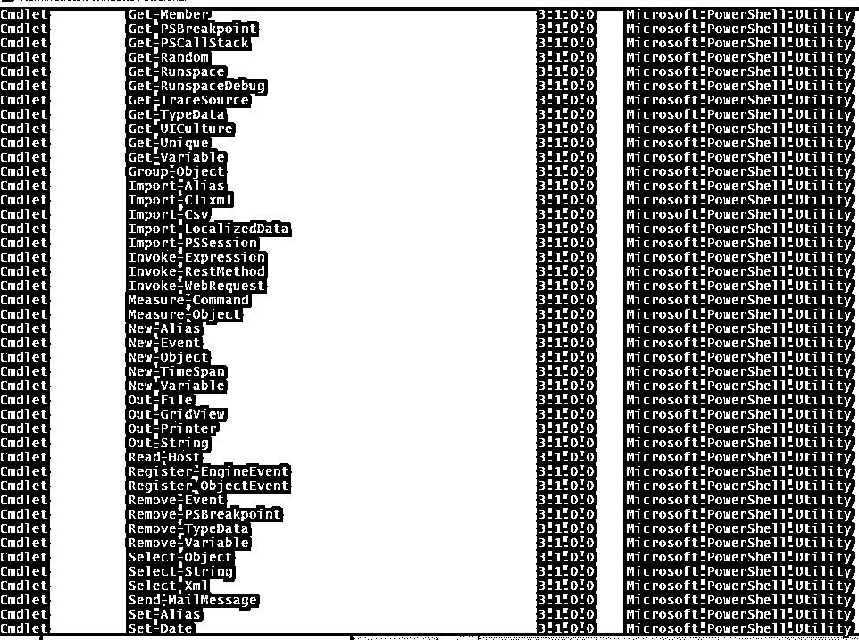

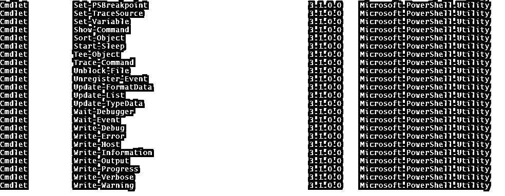

#### 21.微软。PowerShell .诊断

这个 PowerShell 模块提供 cmdlets 来诊断 windows 相关的东西。例如，评估性能计数器、从事件查看器获取 windows 事件等。

`Get-Command -Module Microsoft.PowerShell.Diagnostics`

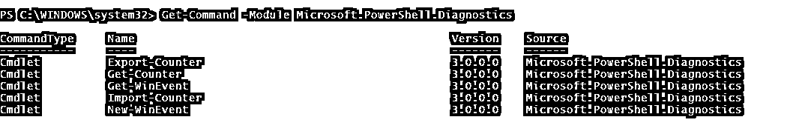

#### 22.微软。WSMan .管理

此模块提供对 WS-Management(管理的 Web 服务)的访问。使用此模块 cmdlets，您可以添加、清除、更改和删除本地和远程计算机上的 WS-Management 数据。

`Get-Command -Module Microsoft.WSMan.Management`

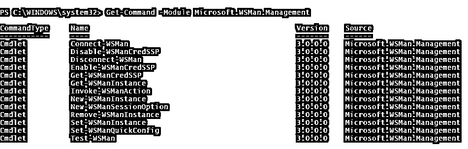

#### 23.MsDtc

此模块为 Microsoft 分布式事务协调(MsDtc)提供 cmdlets。

`Get-Command -Module MsDtc`

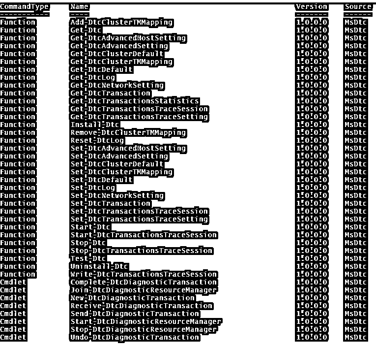

#### 24.网络适配器

此模块提供 cmdlets 来获取、添加、删除和更改网络适配器属性。

`Get-Command -Module NetAdapter`

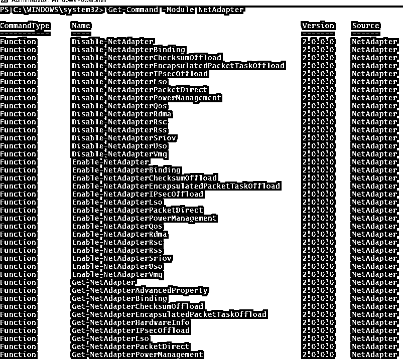

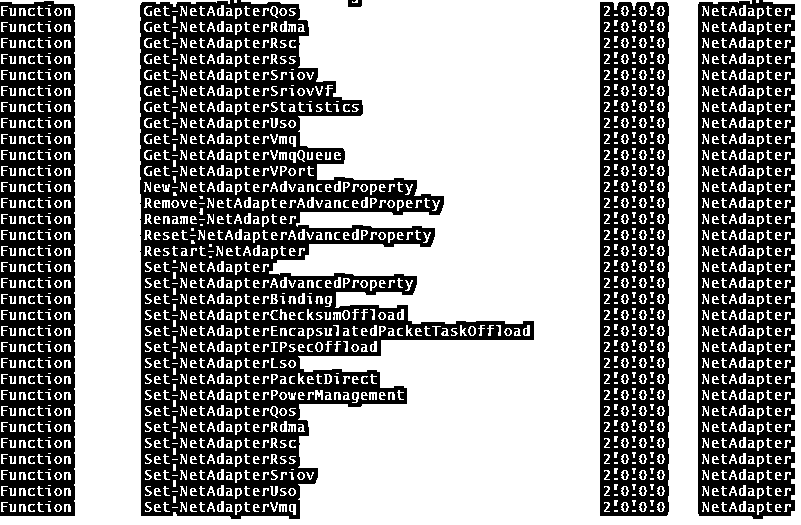

#### 25.网络连接

此模块提供 cmdlets 来获取和设置与一个或多个物理适配器相关联的网络连接配置文件。

`Get-Command -Module NetAdapter`

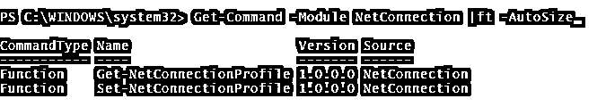

#### 26.NetEventPacketCapture

此模块的 cmdlets 用于获取、添加和删除与网络事件会话的远程捕获提供程序关联的网络适配器。

`Get-Command -Module NetAdapter`

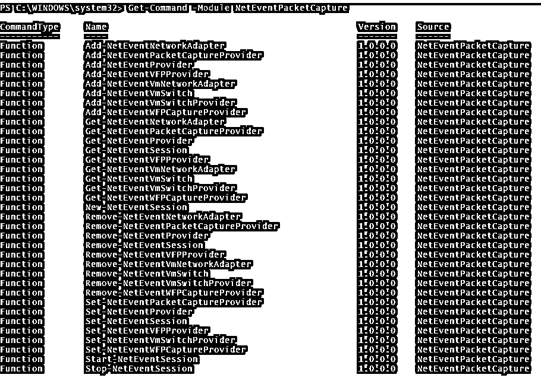

#### 27.Aa。Netlbfo

此模块为所有 NIC 绑定特定操作(如删除、创建或修改属性)提供 cmdlets。

`Get-Command -Module NetLbfo`

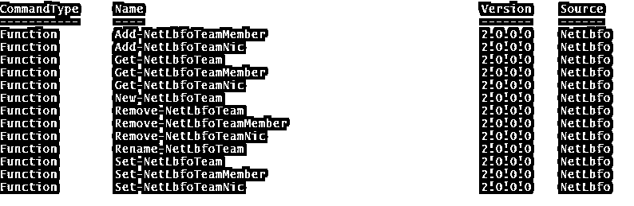

#### 28.网络安全

此模块为网络安全相关的配置更改和数据检索提供 cmdlets。例如，它可以设置 Windows 操作系统防火墙设置、应用和修改规则、设置新的防火墙规则等。

`Get-Command -Module NetSecurity`

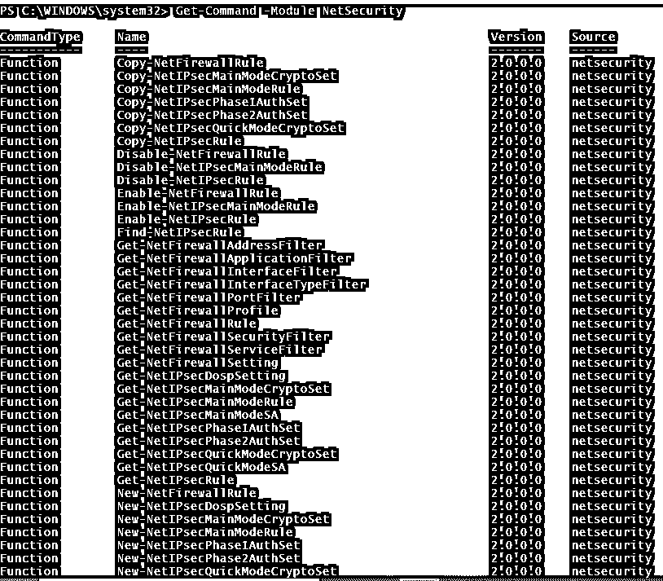

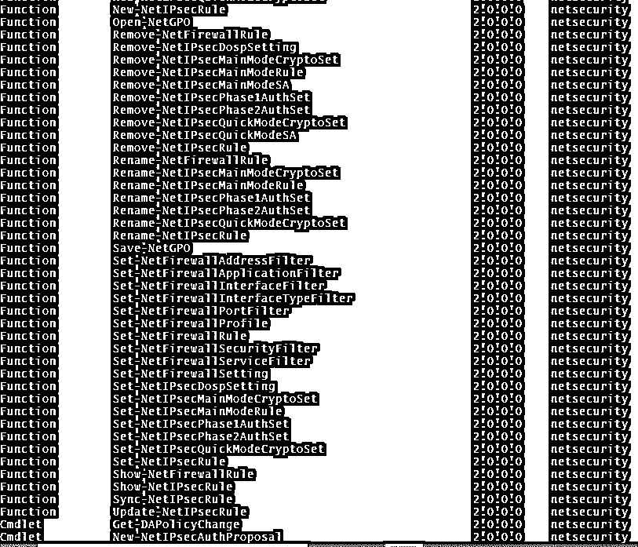

#### 29.NetTCPIP

该模块提供网络 TCP/IP 配置功能，如网络 IP 接口配置、IP 配置、为主机寻找最佳路由、删除 IP /接口等。

`Get-Command -Module NetTCPIP`

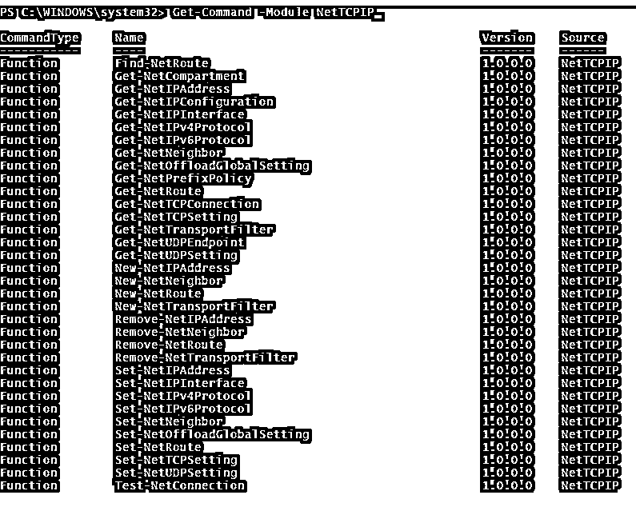

#### 30.网络连接状态

此模块提供网络连接状态的 cmdlets。

`Get-Command -Module NetworkConnectivityStatus`

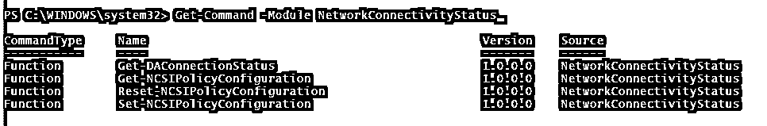

#### 31.网络开关管理器

此模块提供了用于管理网络交换机的 cmdlets。

`Get-Command -Module NetworkSwitchManager`

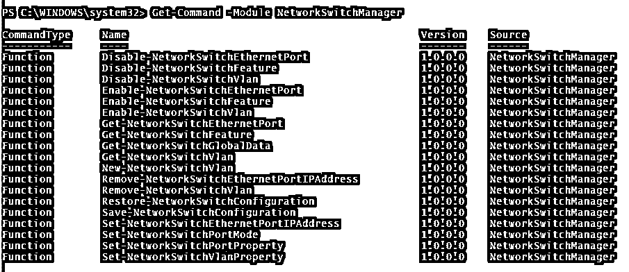

#### 32.pcsv 设备

此模块包含支持带外管理和管理 IPMI 设备的 cmdlets。

`Get-Command -Module PcsvDevice`

#### 33.公开密钥基础设施

本模块处理 PKI 和 Active Directory 证书管理。

`Get-Command -Module PKI`

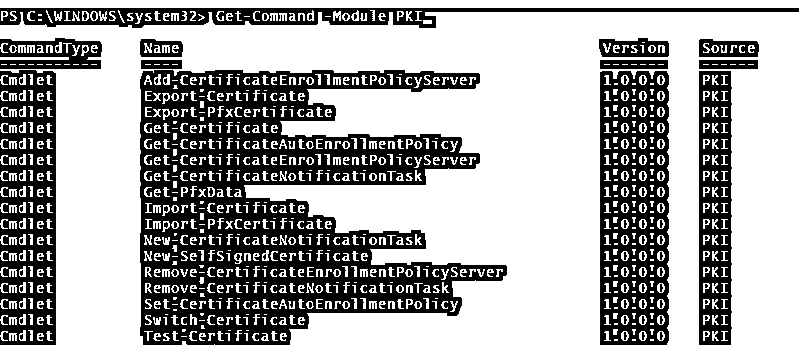

#### 34.PNP 设备

此模块提供 cmdlets 和函数来管理即插即用(PnP)设备。

`Get-Command -Module PnpDevice`

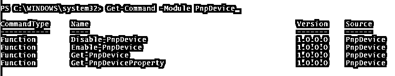

#### 35.打印管理

此模块提供 cmdlets 来管理本地和远程打印机。

`Get-Command -Module PrintManagement`

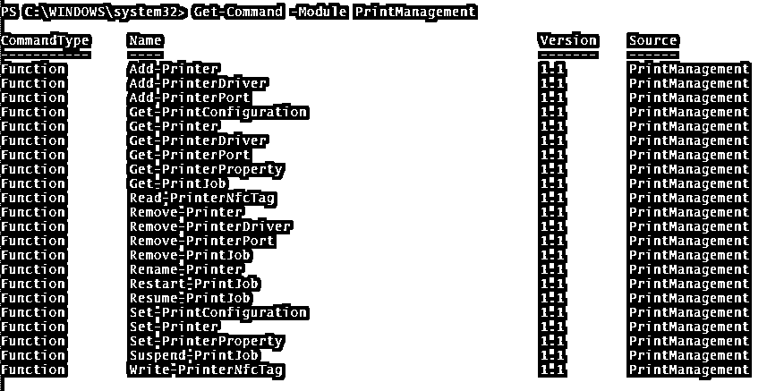

#### 36.PSDesiredStateConfiguration

此模块提供与 DSC 资源相关的 cmdlets 和函数。

`Get-Command -Module PSDesiredStateConfiguration`

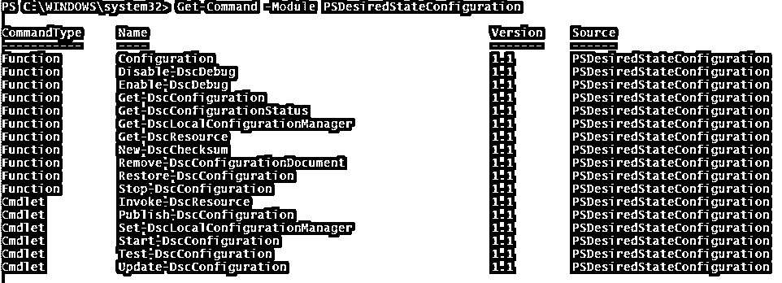

#### 37.PS 诊断

此模块包含对 PowerShell 功能进行故障排除的功能，它还可以将事件记录到事件查看器中。

`Get-Command -Module PSDiagnostics`

#### 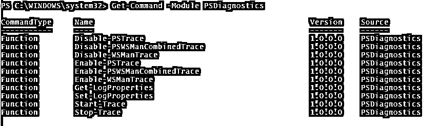

#### 38.PSScheduledJob

此模块提供管理后台作业的命令。例如，您可以创建、删除、注册和触发作业等。

`Get-Command -Module PSScheduledJob`

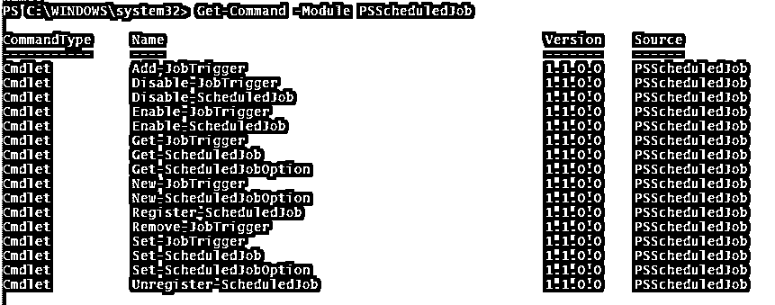

#### 39.PSWorkFlow&PSWorkFlowUtility

PSWorkFlow 模块提供 cmdlets 来编写和运行工作流。

`Get-Command -Module PSWorkflow
Get-Command -Module PSWorkflowUtility`

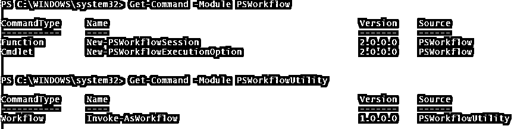

#### 40.计划任务

此模块提供了管理计划任务的功能。

`Get-Command -Module ScheduledTasks`

#### 41.安全引导

此模块提供与系统安全引导相关的 cmdlets。例如，检查您的系统是否启用了安全引导以使用 Confirm-securebootefi。

`Get-Command -Module SecureBoot`

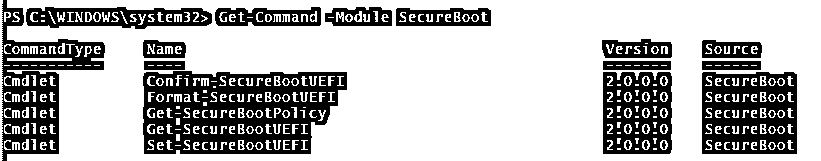

#### 42.SmbShare

此模块提供特定于 SMB(服务器消息块)共享的 cmdlets。您可以创建、删除、启用、禁用 SMB 共享，并提供/删除用户对它们的权限。

`Get-Command -Module SmbShare`

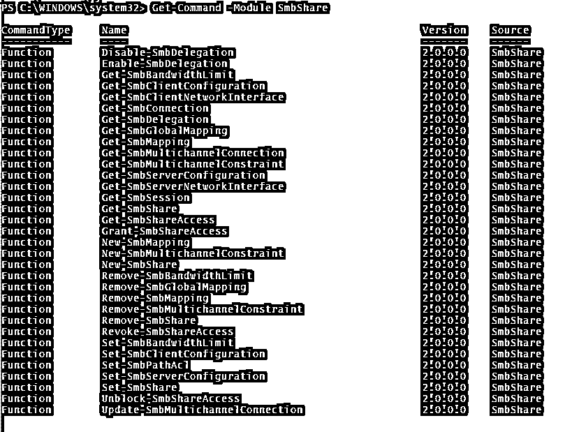

#### 43.SMBWitness

此模块检索有关连接到群集中 SMB 见证服务器的 SMB 客户端的信息，并将 SMB 连接移动到指定的群集节点。

`Get-Command -Module SmbWitness`

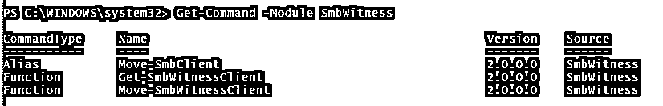

#### 44.储存；储备

此模块提供特定于存储的功能和 cmdlets。

`Get-Command -Module Storage`

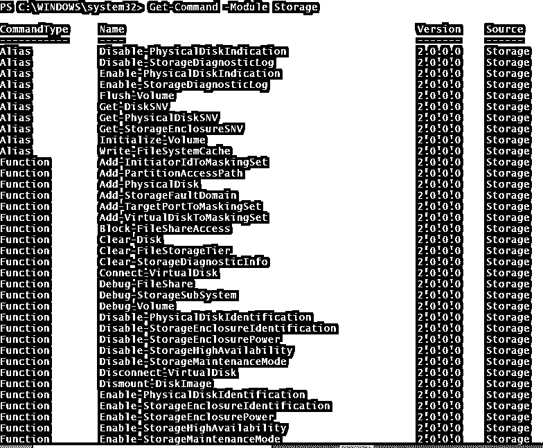

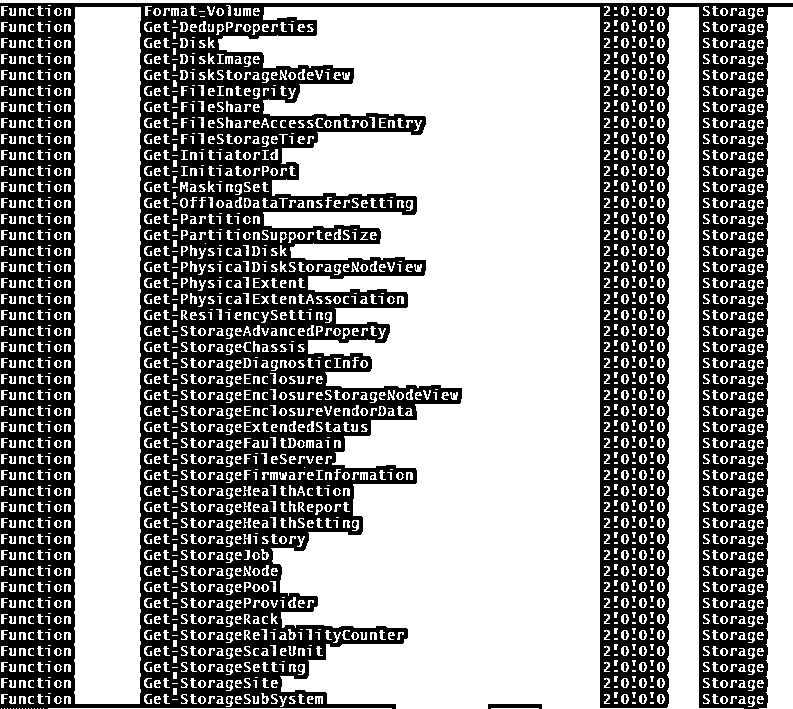

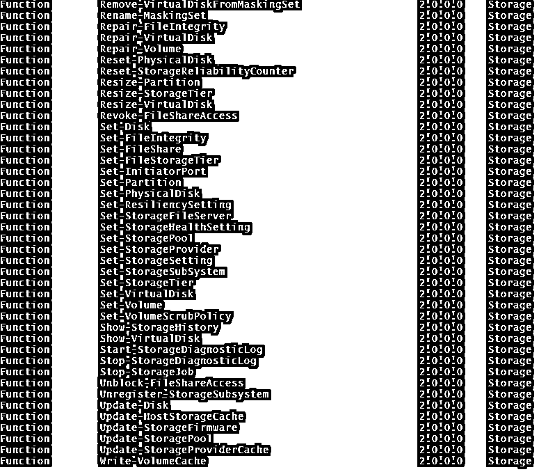

#### 45.坦克激光瞄准镜（Tank Laser-Sight 的缩写）

此模块提供管理传输层安全性(TLS)相关设置的功能。

`Get-Command -Module TLS`

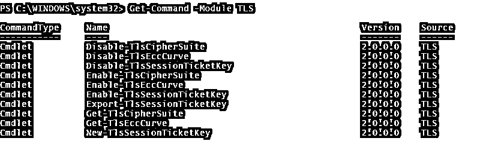

#### 46.WindowsErrorReporting

Windows 错误报告(WER)收集系统上的硬件和软件问题，并将其发送给 Microsoft 进行分析。该模块在 PowerShell 中可用。

`Get-Command -Module WindowsErrorReporting`

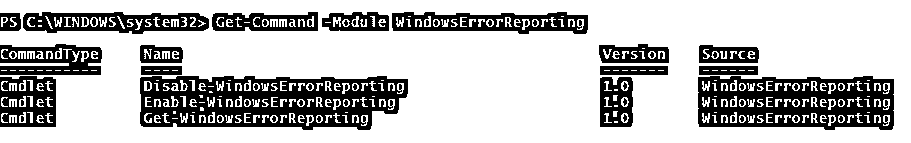

#### 47.WindowsSearch

您可以使用此 PowerShell 模块获取和设置 Windows 搜索相关项目。

`Get-Command -Module WindowsSearch`

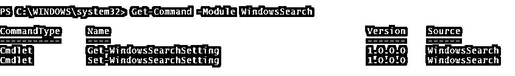

### 结论

您可以通过打包不同的 cmdlets 和函数来创建 PowerShell 模块，并且可以在多个系统上使用它们。还有许多模块不是默认安装的，但在管理工作中非常有用，您可以从 PowerShell Gallery 下载它们。

### 推荐文章

这是 PowerShell 模块的指南。在这里，我们还讨论了简介和各种 PowerShell 模块以及语法和示例。您也可以看看以下文章，了解更多信息–

1.  [PowerShell 连接字符串](https://www.educba.com/powershell-concatenate-string/)
2.  [PowerShell 转换为字符串](https://www.educba.com/powershell-convert-to-string/)
3.  [PowerShell 拆分字符串](https://www.educba.com/powershell-split-string/)
4.  [PowerShell 通配符|类型](https://www.educba.com/powershell-wildcards/)
5.  [PowerShell If-Not 指南](https://www.educba.com/powershell-if-not/)
6.  [PowerShell 重命名文件夹](https://www.educba.com/powershell-rename-folder/)
7.  [PowerShell 获取服务|示例](https://www.educba.com/powershell-get-service/)
8.  [PowerShell 指南继续](https://www.educba.com/powershell-continue/)

