# PowerShell 注册表

> 原文：<https://www.educba.com/powershell-registry/>

## PowerShell 注册表简介

在 windows 操作系统中，与所有软件和硬件相关的所有信息(如设置、软件价值和其他选项)都存储在一个名为 Registry 的数据库中。每当安装程序时，都会创建一个包含程序相关信息(如位置或版本)的子项，并将其添加到注册表中。这些设置可以在注册表编辑器中找到或修改。修复一些与软件或操作系统相关的错误需要使用注册表来修改它们的值。虽然用户可以使用 Regedit 或 reg.exe 与注册表进行交互，但是 PowerShell 有许多 cmdlets 可供管理员用来连接和处理注册表项。本文将详细解释如何使用 PowerShell 与注册表进行交互。

### 句法

以下是 PowerShell 注册表的语法:

<small>Hadoop、数据科学、统计学&其他</small>

#### 语法#1

要在本地计算机上查找注册表的路径，请使用下面的 cmdlet

**代码:**

`get-psdrive`

**输出:**

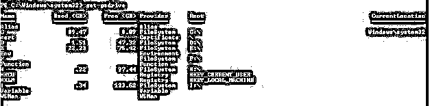

#### 语法#2

要获取注册表中可用的注册表项，可以使用以下 cmdlet

**代码:**

`Get-ChildItem -Path HKCU:\ | Select-Object Name`

**输出:**

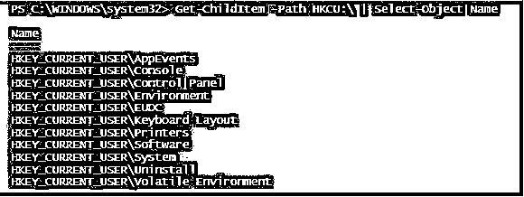

#### 语法#3

以下是 HKCU 注册表中的注册表项

对于 HKLM 注册表项

**代码:**

`Get-ChildItem -Path HKLM:\ | Select-Object Name`

**输出:**

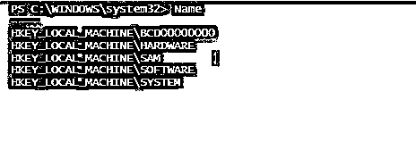

### 在 PowerShell 注册表中创建新项

注册表类似于文件夹或文件系统，注册表项及其值是注册表的属性。

要在注册表中创建新项，可以使用以下 cmdlet。

**代码:**

`New-Item -Path HKCU:\TestRegistry`

或者

`New-Item -Path Registry::HKCU\TestRegistry`

**输出:**

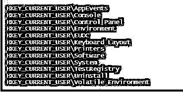

说明:在上面的截图中，新的注册表项 TestRegistry 被添加到 HKCU 注册表中。

#### 删除密钥

以下 cmdlet 可用于删除注册表项。

**代码:**

`Remove-Item -Path HKCU:\TestRegistry`

或者

`Remove-Item -Path 'HKCU:\TestRegistry'`

**输出:**

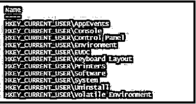

**解释:**从注册表中删除指定的条目。若要删除特定键下的键，则必须在 remove cmdlet 中使用 recurse 参数。

#### 在注册表项之间导航

如前所述，注册表项是注册表的键，不能直接访问。

**代码:**

`Get-Item -Path Registry::HKEY_LOCAL_MACHINE\SOFTWARE\Microsoft\Windows\dwm |Select-Object -ExpandProperty Property`

或者

`Get-ItemProperty -Path Registry::HKEY_LOCAL_MACHINE\SOFTWARE\Microsoft\Windows\dwm |Select-Object`

**输出:**

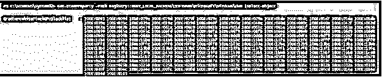

要获取当前位置的属性，可以使用下面的 cmdlet

**代码:**

`Get-ItemProperty -Path`

**输出:**

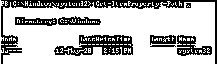

通过指定名称和名称参数，可以直接检索特定的条目

**代码:**

`Get-ItemProperty -Path HKLM:\Software\Microsoft\Windows\CurrentVersion -Name ProgramFilesDir`

**输出:**

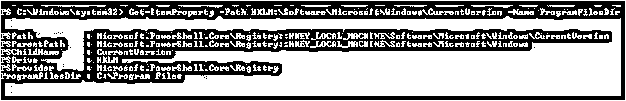

#### 要更改键值，请执行以下操作

**代码:**

`write-host "Welcome to demo of Setting a value"
Write-Host "Chnaging the value of onedrive"
$value = Get-ItemProperty -Path HKCU:\Environment -Name OneDrive
Write-Host "Before changing" $value
$newvalue = $value.OneDrive += ";C:\test"
Set-ItemProperty -Path HKCU:\Environment -Name OneDrive -Value $newvalue
$value = Get-ItemProperty -Path HKCU:\Environment -Name OneDrive
write-host "After change" $value`

**输出:**

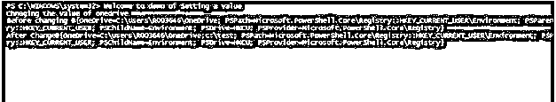

### 创建新的注册表项

可以按如下方式创建新条目。

**代码:**

`Write-Host "Creating new registry entries"
write-host "current values in environment registry"
Get-ItemProperty -Path HKCU:\Environment
New-ItemProperty -Path HKLM:\Environment -Name PowerShellPath -PropertyType String -Value $PSHome
Write-Host "Value is added"
Write-Host "after adding values in environment registry"
Get-ItemProperty -Path HKCU:\Environment`

**输出:**

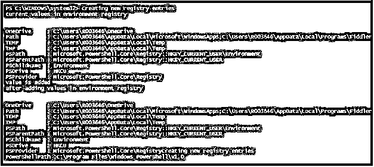

| **类型** | **值** |
| 二进制的 | 降级二进制数据 |
| DWord | 降级为整数 32 |
| 展开字符串 | 带有环境变量的字符串 |
| 多字符串 | 表示多行字符串 |
| 线 | 降级普通字符串 |
| Qword | 降级 8 字节二进制数据 |

#### 重命名条目

**代码:**

`write-host "Welcome to renaming registry entries"
write-host "Before renaming"
Get-ItemProperty -Path  HKLM:\SOFTWARE\Microsoft\Windows\CurrentVersion
Write-Host "Renaming Pspath"
Rename-ItemProperty -Path HKLM:\SOFTWARE\Microsoft\Windows\CurrentVersion -Name PSPath -NewName PSP
Write-Host "Renaming PSParentPath"
Rename-ItemProperty -Path HKLM:\SOFTWARE\Microsoft\Windows\CurrentVersion -Name PSParentPath -NewNamePSPa
Write-Host "Renaming PSChildName"
Rename-ItemProperty -Path HKLM:\SOFTWARE\Microsoft\Windows\CurrentVersion -Name PSChildName -NewName PSC
Write-Host "Renaming PSProvider"
Rename-ItemProperty -Path HKLM:\SOFTWARE\Microsoft\Windows\CurrentVersion -Name PSProvider -NewNamePSPr
Write-Host "After Renaming"
Get-ItemProperty -Path  HKLM:\SOFTWARE\Microsoft\Windows\CurrentVersion`

**输出:**

#### 从注册表中删除多个条目

**代码:**

`write-host "Welcome to delting registry entries"
write-host "Before deleting the entries are"
Get-ItemProperty -Path  HKLM:\SOFTWARE\Microsoft\Windows\CurrentVersion
Write-Host "Deleting Pspath"
Remove-ItemProperty -Path HKLM:\SOFTWARE\Microsoft\Windows\CurrentVersion -Name PsPath
Write-Host "PSPath Entry deleted"
Write-Host "Deleting PSParentPath"
Remove-ItemProperty -Path HKLM:\SOFTWARE\Microsoft\Windows\CurrentVersion -Name PSParentPath
Write-Host "PSParentPath entry deleted"
Write-Host "Deleting PSChildName"
Remove-ItemProperty -Path HKLM:\SOFTWARE\Microsoft\Windows\CurrentVersion -Name PSChildName
Write-Host "PSChildName entry deleted"
Write-Host "Deleting PSProvider"
Remove-ItemProperty -Path HKLM:\SOFTWARE\Microsoft\Windows\CurrentVersion -Name PSProvider
Write-Host "PSProvider entry deleted"
Write-Host "Deleting PSDrive"
Remove-ItemProperty -Path HKLM:\SOFTWARE\Microsoft\Windows\CurrentVersion -Name PSDrive
Write-Host "PSDrive entry deleted"
Write-Host "Current Values"
Get-ItemProperty -Path  HKLM:\SOFTWARE\Microsoft\Windows\CurrentVersion`

**输出:**

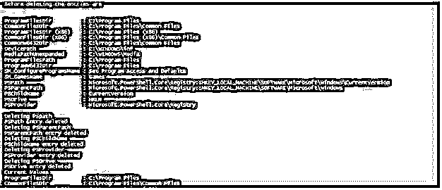

#### 在注册表中创建多个项

**代码:**

`Write-Host "Creating new keys in registry"
Write-Host "Creating test1 key"
New-Item -Path HKCU:\test1
Write-Host "Test1 key is created"
Write-Host "Creating test2 key"
New-Item -Path HKCU:\test2
Write-Host "Test2 key is created"
Write-Host "Creating test3 key"
New-Item -Path HKCU:\test3
Write-Host "Test3 key is created"
Write-Host "Creating test4 key"
New-Item -Path HKCU:\test4
Write-Host "Test4 key is created"
Write-Host "Creating test5 key"
New-Item -Path HKCU:\test5
Write-Host "Test5 key is created"
Write-Host "The current keys in the registry are"
Get-ChildItem -Path HKCU:\ | Select-Object Name`

**输出:**

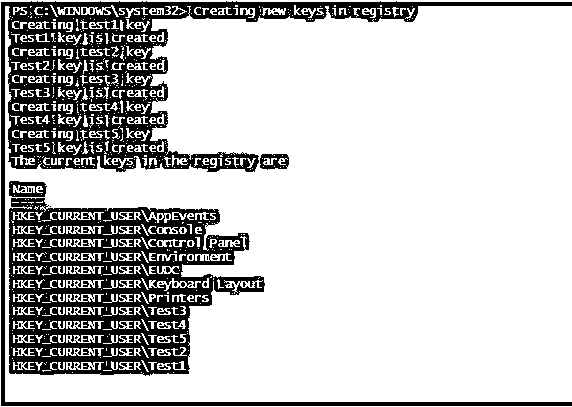

### 结论

因此，本文详细介绍了如何使用 PowerShell 来处理注册表。它用一个例子演示了如何创建、删除新的键和改变值。它还展示了如何向注册表项添加注册表项，如何更改和删除注册表键值。所有的操作都用一个适当的例子来说明。要了解更多细节，建议编写示例脚本并使用它们。本文还演示了批量添加和删除键，以及批量添加和删除键的条目。实践做得越多，学习就越多。

### 推荐文章

这是 PowerShell 注册表指南。这里我们讨论 PowerShell 注册表、语法、创建键、删除多个键和条目的介绍。您也可以浏览我们的其他相关文章，了解更多信息——

1.  [PowerShell 重命名文件夹](https://www.educba.com/powershell-rename-folder/)
2.  [PowerShell 获取位置](https://www.educba.com/powershell-get-location/)
3.  [PowerShell Set-Location](https://www.educba.com/powershell-set-location/)
4.  [PowerShell 命令](https://www.educba.com/powershell-commands/)

