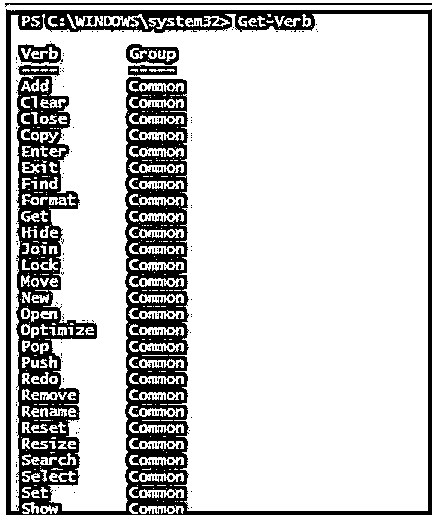
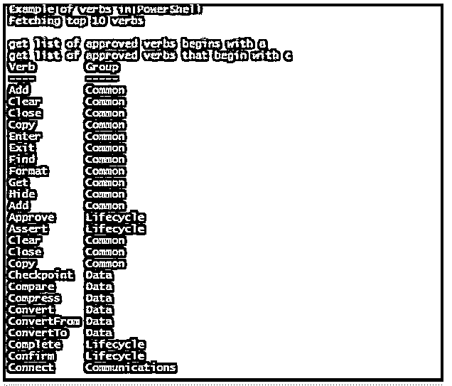

# PowerShell 动词

> 原文：<https://www.educba.com/powershell-verbs/>

## PowerShell 动词简介

以下文章提供了 PowerShell 谓词的概述。所有 PowerShell cmdlets 都设计为动词-名词模式，由连字符分隔。名词表示对其执行操作的实体，动词部分表示 cmdlet 将执行的操作。所有 cmdlets 还包括批准的动词别名前缀。这用作该 cmdlet 的别名。PowerShell 动词定义不同于英语的实际含义。在 PowerShell 上下文中，New 被视为一个动作，而在英语语言定义中，它不是一个动词。

### PowerShell 动词的语法

Get-Verb cmdlet 检索 PowerShell 中批准的动词列表。

<small>Hadoop、数据科学、统计学&其他</small>

`Get-Verb [[-Verb] <String[]>] [[-Group] <String[]>] [<CommonParameters>]`

**输出:**

有些 cmdlets 包含未批准的动词，可以运行。当使用 Import-Module 导入未批准的 cmdlet 时，将显示警告。

**参数:**

*   **-组:**该参数表示要检索的组的名称。它的数据类型是 String[]。它只是从 PowerShell 版本 6.0 引入的。它的默认值是所有动词。它接受管道输入，但不允许使用通配符。
*   **-动词:**这指定了需要获取的动词。它的数据类型是 String[]。其默认值为所有组。它接受管道输入；此外，允许使用通配符。它的一些公认的价值观是共同的，通信，安全，其他，生命周期，数据和诊断。

PowerShell 动词是根据它们的用途分组的。这让他们很容易被发现。

以下是各组:

*   **Common:** 定义了分配给任何 cmdlet(如 add)的通用操作。
*   **通信:**定义连接等动作。
*   **数据:**这跟数据手线像备份有关。
*   **诊断:**定义调试等动作。
*   **生命周期:**定义与生命周期相关的活动，例如完成。
*   **安全:**撤销等安全相关动作。
*   **其他:**与所有其他动作相关。

### 命名建议

为 cmdlet 命名动词时，必须牢记以下建议，以保持新创建的 cmdlet、PowerShell 支持的 cmdlet 和其他人创建的 cmdlet 之间的一致性。

*   建议使用一个预定义的动词。
*   动词应该描述动作的范围。
*   不要使用认可动词的替代词。
*   动词的形式应该与已经列出的相同。
*   不应使用保留的动词，如 foreach、sort、where、tee、ping、group 和 format。

### 相似动词不同动作的区别

下面是相似动词不同动作之间的区别:

*   **New&Set:**New 关键字用于创建一个新的动词；set 用于设置一个值。
*   **查找&查找:**查找动词用于查找一个对象。搜索基本上是创建一个对源的引用。
*   **Get & Read:** Get 用于获取对资源的访问，而 Read 用于从资源中提取信息。
*   **Invoke & Start:** Invoke 用于触发同步操作，而 Start 用于异步操作的情况。

### 动词及其动作

下面是动词及其动作:

#### 1.常用动词

*   **Add:** 向容器中添加新的资源，或者向现有的项目添加新的项目。它的别名是 a，这个动词与 Remove 成对出现。创建时应避免使用 append、attach、insert 和 concatenate 等词，因为它们是同义词。例如添加内容。
*   **Clear:** 用于从资源容器中移除项目，但不会删除它们。它的别名是 cl。在创建同义词时，应该避免使用以下词语，如取消、取消设置、删除和释放。例如透明内容。
*   **关闭:**用于使资源不可用。它的别名是 cs。这与 open 成对出现。
*   **Find(fd):** 用于查找容器内的资源。它的别名是 fd。应该避免的同义词是搜索。
*   **Move:** 用于将项目从一个资源容器移动到另一个资源容器，但不删除它们。它的别名是 m。下面的词，如 transfer 和 migrate，应该在创建时避免使用，因为它们是同义词。例如移动项目。
*   **Pop:** 从堆栈中移除最顶端的项目。例如弹出位置。
*   **Push:** 用于将一个项目添加到堆栈的最顶端。例如推送定位。

#### 2.交流动词

*   **连接:**用于连接源和目的地。它与断开连接成对出现。Join 和 Telnet 是应该避免的同义词。它的别名是 cc。
*   **断开:**用于断开源和目的地。它与 Connect 成对出现。中断和注销是应该避免的同义词。它的别名是 dc。
*   **接收:**用于从一个来源接收信息。它与 send 成对出现。阅读、接受和窥视是应该避免的同义词。它的别名是 rd。
*   **发送:**用于将信息发送到目的地。它与 receive 成对出现。广播和上传是应该避免的同义词。它的别名是 sd。

#### 3.数据动词

*   **检查点:**创建当前状态的快照。Diff 是应该避免的同义词。它的别名是 ch。
*   **比较:**比较来自两个资源的数据。Diff 是应该避免的同义词。它的别名是 cr。
*   **ConvertFrom:** 用于将主输入转换为其他支持的类型。它的别名是 cf。Export 和 output 是要避免的同义词。
*   **ConvertTo:** 用于将其他输入转换为主要类型。它的别名是 ct。导入和输入是要避免的同义词。

#### 4.诊断动词

*   **调试:**用于故障排除和调试问题。它的别名是 db。诊断是应该避免的同义词。
*   **跟踪:**用于跟踪资源活动。它的别名是 tr。跟随、跟踪和检查是一些应该避免的同义词。

#### 5.生命周期动词

*   **Register:** 这将为存储库中的资源创建一个条目。它的别名是 rg，并与 unregister 成对出现。
*   **重启:**用于在停止操作后重启操作。它的别名是 rt，Recycle 是要避免的同义词。

#### 6.安全动词

*   **Block:** 阻止对资源的访问。它与 unblock 成对出现。它的别名是 bl。预防和否认是应该避免的同义词。
*   保护:保护资源免受任何攻击。它与 unprotect 成对出现。它的别名是 pt。加密和保护是应该避免的同义词。

### PowerShell 动词的示例

下面是 PowerShell 动词的示例:

**代码:**

`Write-Host "Example of verbs in PowerShell" -ForegroundColor Green
Write-Host "Fetching top 10 verbs" -ForegroundColor Green
Get-Verb | Select-Object -first 10
Write-Host "get list of approved verbs begins with a" -ForegroundColor Green
Get-Verb a*
Write-Host "get list of approved verbs that begin with c" -ForegroundColor Green
Get-Verb c*`

**输出:**

### 结论

因此，本文详细解释了 PowerShell 中的动词、它们的命名约定、不同类型的动词及其别名。

### 推荐文章

这是 PowerShell 动词的指南。这里我们讨论命名建议，相似动词不同动作的区别，动词及其动作，例子。您也可以看看以下文章，了解更多信息–

1.  [PowerShell 睡眠](https://www.educba.com/powershell-sleep/)
2.  [PowerShell 子串](https://www.educba.com/powershell-substring/)
3.  [PowerShell 不像](https://www.educba.com/powershell-not-like/)
4.  [否则如果在 PowerShell 中](https://www.educba.com/else-if-in-powershell/)

