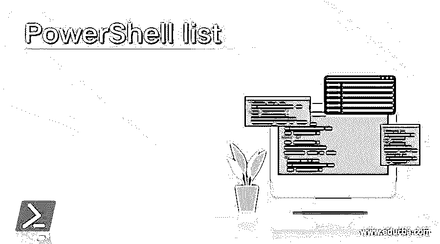
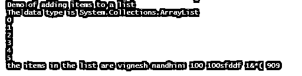
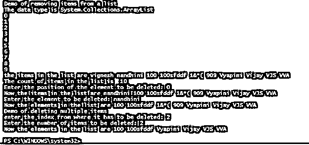
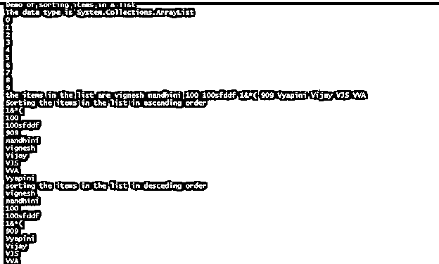
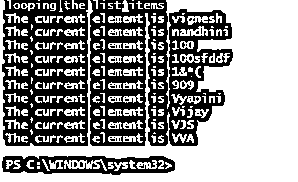
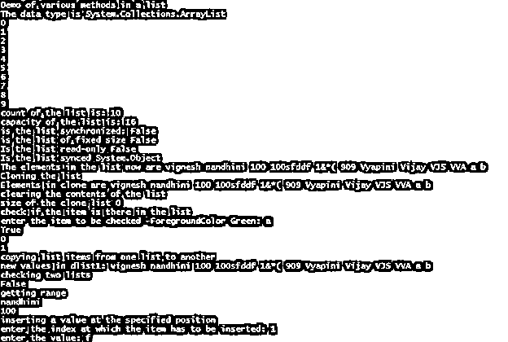
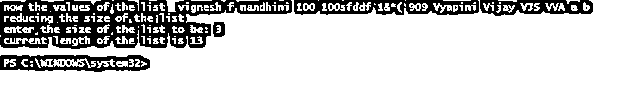

# PowerShell 列表

> 原文：<https://www.educba.com/powershell-list/>

## PowerShell 列表简介

PowerShell 列表是用于存储项目列表的数据类型或数据结构。列表的大小不是固定的，可以在任何时间点改变。list 相对于 array 的主要优势是 list 可以保存不同数据类型的项，因此它被认为是一种强数据类型。这是系统中存在的。集合. net 类。有许多方法和对象与列表相关联。本文将通过适当的例子详细介绍这个列表及其实现。

**语法:**

<small>Hadoop、数据科学、统计学&其他</small>

在 PowerShell 中创建列表有两种方法

`$testlist = New-Object -TypeName 'System.Collections.ArrayList';`

或者

`$testlist = [System.Collections.ArrayList]::new()`

空列表可以定义为

`[System.Collections.ArrayList]$testlist= @()`

例如:

**输入:**

`Write-Host "Demo of list in Powershell"
$testlist = New-Object -TypeName 'System.Collections.ArrayList'
Write-Host "Datatype is " $testlist.GetType() -ForegroundColor Green
$testlist1 = [System.Collections.ArrayList]::new()
Write-Host "Datatype is " $testlist1.GetType() -ForegroundColor Green
Write-Host "Declaring an empty list"
[System.Collections.ArrayList]$testlist2= @()
Write-Host "Datatype is " $testlist2.GetType() -ForegroundColor Green`

**输出:**

`Demo of list in Powershell
Datatype is  System.Collections.ArrayList
Datatype is  System.Collections.ArrayList
Declaring an empty list
Datatype is  System.Collections.ArrayList`

### 可用于数组列表的方法

以下是列表可用的一些方法。它们是 add、addrange、binarysearch、clear、clone、contains、copyto、equals、getenumerator、gethashcode、getrange、gettype、insertrange、setrange、removerange、remove、removeat、sort、toarray、tostring、where、trimtosize、item 和 foreach。

以下是属性；capacity，count，isfixedsize，isreadonly，issynchronized，syncroot。

**方法和用途**

**Add():** 这个方法用于向列表中添加一个元素

**Clear():** 这个方法用来清空列表的内容

**Contains():** 这个方法用于检查列表中是否存在一个条目

**Sort():** 这个方法用于对列表中的元素进行排序

**Remove():** 这个方法删除一个指定了值的元素

**RemovetAt():** 这个方法移除指定位置的元素。

这个方法创建了一个列表的副本

这个方法用于将一个列表的内容复制到另一个列表中

**InsertRange():** 这个方法在列表的指定范围内插入一个新元素

这个元素将列表缩小到指定的大小

**Foreach():** 此方法用于循环

**GetType():** 这个方法用来找出列表的类型

**RemoveRange():** 该方法删除指定范围内的项目列表

**ToArray():** 这个方法将列表转换为数组

### PowerShell 列表示例

以下是 PowerShell 列表的示例:

#### 示例#1

向列表中添加项目

**输入:**

`Write-Host "Demo of adding items to a list" -ForegroundColor Green
$dlist = New-Object -TypeName 'System.Collections.ArrayList';
Write-Host "The data type is" $dlist.GetType() -ForegroundColor Green
$dlist.Add("vignesh")
$dlist.Add("nandhini")
$dlist.Add(100)
$dlist.Add("100sfddf")
$dlist.Add("1&*(")
$dlist.Add(909)
Write-Host "the items in the list are" -ForegroundColor Green $dlist`

**输出:**

#### 实施例 2

从列表中删除项目

**输入:**

`Write-Host "Demo of removing items from a list" -ForegroundColor Green
$dlist = New-Object -TypeName 'System.Collections.ArrayList';
Write-Host "The data type is" $dlist.GetType() -ForegroundColor Green
$dlist.Add("vignesh")
$dlist.Add("nandhini")
$dlist.Add(100)
$dlist.Add("100sfddf")
$dlist.Add("1&*(")
$dlist.Add(909)
$dlist.Add("Vyapini")
$dlist.Add("Vijay")
$dlist.Add("VJS")
$dlist.Add("VVA")
Write-Host "the items in the list are" -ForegroundColor Green $dlist
Write-Host "The count of items in the list is " $dlist.Count
$cin= Read-Host "Enter the position of the element to be deleted"
$dlist.RemoveAt($cin)
Write-Host "Now the items in the list are" $dlist -ForegroundColor Green
$cin= Read-Host "Enter the element to be deleted"
$dlist.Remove($cin)
Write-Host "Now the elements in the list are" -ForegroundColor Green $dlist
Write-Host "Demo of deleting multiple items"
$index= Read-Host "enter the index from where it has to be deleted"
$range= Read-Host "Enter the number of items to be deleted"
$dlist.RemoveRange($index,$range)
Write-Host "Now the elements in the list are" -ForegroundColor Green $dlist`

**输出:**

#### 实施例 3

对列表中的项目进行排序和循环

**输入:**

`Write-Host "Demo of sorting items in a list" -ForegroundColor Green
$dlist = New-Object -TypeName 'System.Collections.ArrayList';
Write-Host "The data type is" $dlist.GetType() -ForegroundColor Green
$dlist.Add("vignesh")
$dlist.Add("nandhini")
$dlist.Add(100)
$dlist.Add("100sfddf")
$dlist.Add("1&*(")
$dlist.Add(909)
$dlist.Add("Vyapini")
$dlist.Add("Vijay")
$dlist.Add("VJS")
$dlist.Add("VVA")
Write-Host "the items in the list are" -ForegroundColor Green $dlist
Write-Host "Sorting the items in the list in ascending order" -ForegroundColor Green
$dlist |Sort-Object
Write-Host "sorting the items in the list in desceding order" -ForegroundColor Green
$dlist |Sort-Object Descending
Write-Host "looping the list items" -ForegroundColor Green
foreach($d in $dlist)
{
Write-Host "The current element is" $d
}`

**输出:**

#### 实施例 4

**输入:**

`Write-Host "Demo of various methods in a list" -ForegroundColor Green
$dlist = New-Object -TypeName 'System.Collections.ArrayList';
Write-Host "The data type is" $dlist.GetType() -ForegroundColor Green
$dlist.Add("vignesh")
$dlist.Add("nandhini")
$dlist.Add(100)
$dlist.Add("100sfddf")
$dlist.Add("1&*(")
$dlist.Add(909)
$dlist.Add("Vyapini")
$dlist.Add("Vijay")
$dlist.Add("VJS")
$dlist.Add("VVA")
Write-Host "count of the list is:" -ForegroundColor Green $dlist.Count
Write-Host "capacity of the list is:" -ForegroundColor Green $dlist.Capacity
Write-Host "is the list synchronized:" -ForegroundColor Green $dlist.IsSynchronized
Write-Host "is the list of fixed size" -ForegroundColor Green $dlist.IsFixedSize
write-Host "Is the list read-only" -ForegroundColor Green $dlist.IsReadOnly
write-Host "Is the list synced" -ForegroundColor Green $dlist.SyncRoot
$dlist.AddRange(@("a","b"))
Write-Host "The elements in the list now are" $dlist -ForegroundColor Green
Write-Host "Cloning the list" -ForegroundColor Green
$dlistclone=$dlist.Clone()
Write-Host "Elements in clone are" $dlistclone -ForegroundColor Green
Write-Host "clearing the contents of the list" -ForegroundColor Green
$dlistclone.Clear()
Write-Host "size of the clone list" $dlistclone.Count -ForegroundColor Green
Write-Host "check if the item is there in the list" -ForegroundColor Green
$toc= Read-Host "enter the item to be checked" -ForegroundColor Green
$dlist.Contains($toc)
$dlist1 = New-Object -TypeName 'System.Collections.ArrayList';
$dlist1.Add("100000")
$dlist1.Add("999999")
Write-Host "copying list items from one list to another" -ForegroundColor Green
$dlist1.CopyTo($dlist)
Write-Host "new values in dlist1:" $dlist -ForegroundColor Green
Write-Host "checking two lists" -ForegroundColor Green
$dlist.Equals($dlist1)
Write-Host "getting range" -ForegroundColor Green
$dlist.GetRange(1,2)
Write-Host "inserting a value at the specified position" -ForegroundColor Green
$ind= Read-Host "enter the index at which the item has to be inserted"
$val= Read-Host "enter the value"
$dlist.Insert($ind,$val)
Write-Host "now the values of the list " $dlist -ForegroundColor Green
Write-Host "reducing the size of the list" -ForegroundColor Green
$siz= Read-Host "enter the size of the list to be"
$dlist.TrimToSize()
Write-Host "current length of the list is" -ForegroundColor Green $dlist.Count`

**输出:**

### 结论

因此，本文详细介绍了 PowerShell 中的清单。它详细解释了与列表相关的各种属性和方法、它的用法和类型，以及适当的例子。要了解关于 PowerShell 列表的更多信息，建议编写示例脚本并练习它们。

### 推荐文章

这是 PowerShell 列表指南。在这里，我们讨论了与列表相关的各种属性和方法，它的用法和类型，以及相应的例子。您也可以看看以下文章，了解更多信息–

1.  [PowerShell 命令](https://www.educba.com/powershell-commands/)
2.  [PowerShell 等待](https://www.educba.com/powershell-wait/)
3.  [PowerShell 退出](https://www.educba.com/powershell-exit/)
4.  [Powershell 复制文件](https://www.educba.com/powershell-copy-file/)

