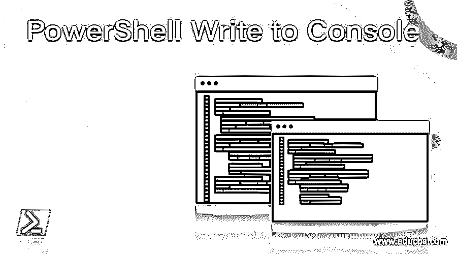
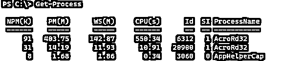
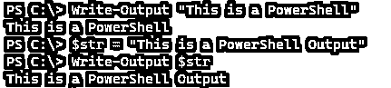
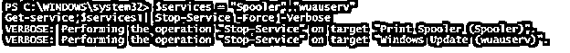

# PowerShell 写入控制台

> 原文：<https://www.educba.com/powershell-write-to-console/>

## PowerShell 写入控制台的定义

PowerShell 写入控制台命令的目的是在控制台上写入信息、数据、输出、进度、详细信息、变量和警告，我们可以使用不同的颜色来装饰控制台上显示的输出，要求用户输入，在脚本或命令出错时在控制台上写入错误消息，写入详细信息以显示后台运行的命令进程，并写入信息以引起用户注意。

**语法:**

<small>Hadoop、数据科学、统计学&其他</small>

控制台显示使用了各种命令，如下所示。

`Write-Host
[[-Object] <Object>] [-NoNewline] [-Separator <Object>] [-ForegroundColor <ConsoleColor>] [-BackgroundColor <ConsoleColor>] [<CommonParameters>]`

`Write-Output
[-InputObject] <PSObject[]>
[-NoEnumerate] [<CommonParameters>]`

`Write-Warning
[-Message] <String>
[<CommonParameters>]`

`Write-Verbose
[-Message] <String>
[<CommonParameters>]`

`Write-Information
[-MessageData] <Object>
[[-Tags] <String[]>] [<CommonParameters>]`

`Read-Host
[[-Prompt] <Object>] [-MaskInput] [<CommonParameters>]`

`Read-Host
[[-Prompt] <Object>] [-AsSecureString] [<CommonParameters>]`

### 如何在 PowerShell 中写入控制台？

PowerShell 有各种方法在显示控制台上编写输出或定制输出。当我们直接在 PowerShell 控制台上书写该行时，它会显示该字符串。举个例子，

`"This is a display output"`

**输出:**

当我们连接这些字符串时，

`"This is a display output" + " This is a string"`

**输出:**

因此，基本上，当我们不使用任何命令来显示输出时，它会自动将输出传送到 Out-Host 命令。所以第一个输入类似于，
“这是一个显示输出”| Out-Host

**输出:**

同样，当我们使用任何在控制台上显示输出的 cmdlet 时，它默认使用隐藏的 cmdlet Out-Host 在控制台上显示输出。命令输出通过管道传输到显示器的外部主机，但这一过程是隐藏的。

`Get-Process`

**输出:**

上面的命令类似于，

`Get-Process | Out-Host`

语法中还显示了其他命令，如 Write-Host、Write-Output、Write-Error、Write-Verbose 等，这些命令可以自定义输出，如特定于前景色或背景色的用户输入、在控制台上显示的详细内容。

### 例子

下面的例子给出了更多的解释。

#### 示例#1:使用 Write-Output 在控制台上写入输出。

Write-Output 命令用于在 PowerShell 控制台上写入输出。

`Write-Output "This is a PowerShell"`

**输出:**

我们也可以将字符串存储在变量中，并写出输出。

`$str = "This is a PowerShell Output"
Write-Output $str`

**输出:**

它还接受管道输入。

`"This is a PowerShell" | Write-Output`

**输出:**

如果您将 Write-Output 命令的输出存储到文件中，它不会在控制台上显示输出。

`Write-Output "This is a PowerShell" | Out-File C:\Temp\output.txt`

**输出:**

这个命令对于在我们不能使用写主机的控制台上写很有用，比如 PowerShell 工作流和 Azure PowerShell runbooks。

#### 示例 2:使用 Write-Host 在控制台上写入输出。

Write-Host 命令用于在控制台上显示带有装饰性背景和前景色的输出。

`Write-Host "This is a PowerShell"`

**输出:**

用不同的背景和前景色。

`Write-Host "This is a PowerShell" -BackgroundColor Blue -ForegroundColor White`

**输出:**

我们也可以通过管道输出。

`"This is a PowerShell" | Write-Host -BackgroundColor DarkGray -ForegroundColor DarkGreen`

**输出:**

如果我们试图将输出存储到文件中，这个命令不会让您这样做，但是它仍然会在控制台上显示输出。

`Write-Host "This is a PowerShell" -BackgroundColor Blue -ForegroundColor White | Out-File C:\Temp\Hostout.txt`

**输出:**

上面的输出没有在 Hostout.txt 文件中存储任何内容。它将是空白的。

#### 示例#3: Write-Verbose 在控制台上写入输出。

Verbose 是用于在显示器上写入命令处理信息的消息流，但它需要特殊的参数-Verbose 来显示消息。举个例子，

下面一行不会显示任何内容，因为我们没有使用-Verbose 参数。

`Write-Verbose "This is the PowerShell"`

**输出:**

但是一旦我们添加了-verbose 参数，

`Write-Verbose "This is the PowerShell" -Verbose`

**输出:**

PowerShell 中几乎所有的 cmdlets 都使用-Verbose 参数，这样我们就不需要写下所有的信息。

`$services = "Spooler", "wuauserv"
Get-service $services | Stop-Service -Force -Verbose`

**输出:**

#### 示例#4: Write-Error 在控制台上显示错误。

Write-Error message 对于在控制台上编写错误消息非常有用。

`$service = 'Spooler1'
if(Get-Service -Name $service -EA Ignore){
Write-Output "$service is exist"
}
else{
Write-Error "$service doesn't exist"
}`

**输出:**

您还可以使用与 Write-Error 命令相关的不同参数，如类别、ErrorID、异常等。

`Write-Error -Message "Error: Too many input values." -Category InvalidArgument -ErrorId B1`

**输出:**

#### 示例 5:在控制台上写入的 Read-Host 命令。

Read-Host 命令接收来自用户的输入，并将其传递给另一个 cmdlet。我们还可以使用这个命令在消息存储后在控制台上显示它。举个例子，

`Read-Host "Enter Message"
Enter Message: This is a PowerShell input`

**输出:**

#### 例 6:使用系统。在控制台上编写的控制台类。

我们可以使用。Net 类系统。控制台在控制台上写输出，为此，它使用了如下方法

`Write() and WriteLine().
[System.Console]::Write('This is a PowerShell')`

**输出:**

`Using WriteLine() method.
[System.Console]::WriteLine( "(d) Short date: . . . . . . . {0:d}`n" +
"(D) Long date:. . . . . . . . {0:D}`n" +
"(t) Short time: . . . . . . . {0:t}`n" +
"(T) Long time:. . . . . . . . {0:T}`n" +
"(f) Full date/short time: . . {0:f}`n" +
"(F) Full date/long time:. . . {0:F}`n"
, (Get-Date))`

**输出:**

### 结论

PowerShell 引入了许多有用的命令，用于在控制台上书写，这取决于工作的性质。例如，假设我们想要显示错误消息，我们可以将文本的背景颜色设置为红色，或者使用 Write-Error 命令。如果您想编写一个可以显示 verbose 的脚本，那么可以使用 Write-Verbose 命令，依此类推。

### 推荐文章

这是 PowerShell 写入控制台的指南。这里我们讨论定义，语法，以及如何在 PowerShell 中写控制台？.您也可以看看以下文章，了解更多信息–

1.  [PowerShell 等待](https://www.educba.com/powershell-wait/)
2.  [PowerShell 更改目录](https://www.educba.com/powershell-change-directory/)
3.  [PowerShell 在哪里](https://www.educba.com/powershell-where/)
4.  [PowerShell 卸载模块](https://www.educba.com/powershell-uninstall-module/)

