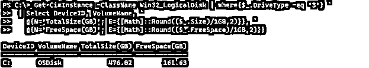
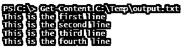

# PowerShell 新系列

> 原文：<https://www.educba.com/powershell-new-line/>

## PowerShell 新系列的定义

PowerShell 新行功能是向数据输出添加新行的方式，例如将多行结果存储在文件中，发送包含多行内容的电子邮件，或者有时在代码中添加新行，以便用户可以通过使用 PowerShell 使用的不同语法正确阅读代码和输出，以及通过使用某些语法或函数将输出格式化为多行来检索输出的过程。

**语法:**

<small>Hadoop、数据科学、统计学&其他</small>

新行没有这样的语法，但是我们使用特定的关键字作为换行符，比如(`)和回车(` n)作为新行。

以及下面的方法。

`[System.Environment]::NewLine`

### 新的 line 方法在 PowerShell 中是如何工作的？

默认情况下，PowerShell 总是格式化新行中的输出。例如，在下面的检索服务的命令中，你将总是得到每个服务的新行。

`Get-Service | ft -AutoSize`

**输出:**

当您连接字符串时，它会连接字符串，不是在新行中，而是在同一行中。请参见下面的字符串。

`"Hi.." + "This is a continue line"`

**输出:**

要换行并开始新行，需要使用回车语法(` n)。

`"Hi.." + "`nThis is a continue line"`

**输出:**

如果这条线是单线的，如果我们在它的中间加上' n，它也会把这条线分开。

`Write-Output "This is the first line. `nThis is the second line. `nThis is the third line"`

**输出:**

当您在任何编辑器中编写程序时，有时在一行中编写冗长的代码会变得很麻烦，但是使用语法(` ),您可以在任何 PowerShell 编辑器中将代码分成多行。

例如，下面的命令检索磁盘信息并执行一些

对磁盘大小的数学运算如下所示。

`Get-CimInstance -ClassName Win32_LogicalDisk | where{$_.DriveType -eq '3'} | Select DeviceID, VolumeName, @{N='TotalSize(GB)'; E={[Math]::Round(($_.Size)/1GB,2)}}, @{N='FreeSpace(GB)'; E={[Math]::Round(($_.FreeSpace)/1GB,2)}}`

这是一个单行命令，它检索逻辑磁盘信息以及总大小和可用大小(以 GB 为单位),但当我们在一行中编写它时，新程序员无法正确理解它，因此我们最好使用(`)符号将该命令分成多行。

`Get-CimInstance -ClassName Win32_LogicalDisk | where{$_.DriveType -eq '3'} `
| Select DeviceID, VolumeName, `
@{N='TotalSize(GB)'; E={[Math]::Round(($_.Size)/1GB,2)}}, `
@{N='FreeSpace(GB)'; E={[Math]::Round(($_.FreeSpace)/1GB,2)}}`

以上两个命令的输出。

即使当您在 PowerShell 控制台中添加重音符(`)时，它也会为程序创建一个新行，下一行将以双箭头>>开始，这意味着它正在等待命令继续。

`Get-CimInstance win32_logicaldisk ``

**输出:**

我们可以在控制台中使用多行代码编写磁盘信息检索命令，如下所示。

`Get-CimInstance -ClassName Win32_LogicalDisk | where{$_.DriveType -eq '3'} `
| Select DeviceID, VolumeName, `
@{N='TotalSize(GB)'; E={[Math]::Round(($_.Size)/1GB,2)}}, `
@{N='FreeSpace(GB)'; E={[Math]::Round(($_.FreeSpace)/1GB,2)}}`

**输出:**

### 例子

让我们讨论 PowerShell 新系列的例子。

#### 示例 1:使用变量的新行。

如果您使用变量来存储行或字符串，并且当您连接多个变量时，您可以在中间添加回车(` n)来分隔它们。比如说。

如果不使用回车语法，

`$str1 = 'This is the first line'
$str2 = 'This is the second line'
$str1 + $str2`

**输出:**

使用回车语法，

`$str1 + "`n" + $str2`

**输出:**

#### 示例 2:使用 Split()方法创建一个新行。

当我们使用字符串或任何文件内容时，如果我们需要使用某些特定字符将字符串拆分成多行，那么我们可以使用 split 方法来创建一个新行。举个例子，

`$str = "This is the First line. This is the second line. This is the third line"
$str`

**输出:**

我们将上面的字符串分开，创建一个新的线，如下所示。

`$str.Split('.')`

**输出:**

在 split 方法中，可以使用任何语法或关键字来分隔行。

#### 示例 3:使用字符串数组创建多行。

我们可以使用字符串数组，这是创建多行的最常见的技术。如下图。
`@"
This is the first line
This is the second line
This is the third line
"@`

**输出:**

#### 示例 4:使用字符串格式化方法。

我们可以使用字符串格式化方法将行从字符串或文件内容中分离出来。下面是一个例子。

`"This is the first line. {0}This is the second line.{0}This is the third line" -f "`n"`

**输出:**

也可以使用系统。使用方法 NewLine()初始化环境，将字符串分成多行。

`"This is the first line. {0}This is the second line.{0}This is the third line" -f [Environment]::NewLine`

上述命令将产生与前一个命令相同的输出。

#### 示例 5:在文件中添加新的一行。

当您将内容添加到文件中时，如果您想将该行添加到文件的下一行。您可以使用下面的命令。我们有 output.txt 文件，其内容如下。

`Get-Content C:\Temp\output.txt`

如果我们把内容添加到文件中而不使用转义符，它会把新的一行连接到最后一行。

`Add-Content C:\Temp\output.txt -Value "This is the fourth line"`

**输出:**

所以我们将在这里添加转义符(` n)来添加新行。

`Add-Content C:\Temp\output.txt -Value "`nThis is the fourth line"`

**输出:**

### 结论

每种编程语言(如 Java、Python、C#、PowerShell 等)都有不同的方法来创建新行，这很有帮助，因为用户可能需要在输出之间(有时在代码内部)使用一些换行符，为了更好的可读性，我们总是建议在输出中使用换行符或新行。

### 推荐文章

这是 PowerShell 新系列的指南。在这里，我们讨论介绍，语法，参数，代码实现的例子。您也可以看看以下文章，了解更多信息–

1.  [PowerShell 管理员](https://www.educba.com/powershell-administrator/)
2.  [Powershell 复制文件](https://www.educba.com/powershell-copy-file/)
3.  [PowerShell 布尔型](https://www.educba.com/powershell-boolean/)
4.  [PowerShell 睡眠](https://www.educba.com/powershell-sleep/)

