# PowerShell 输入提示

> 原文：<https://www.educba.com/powershell-prompt-for-input/>

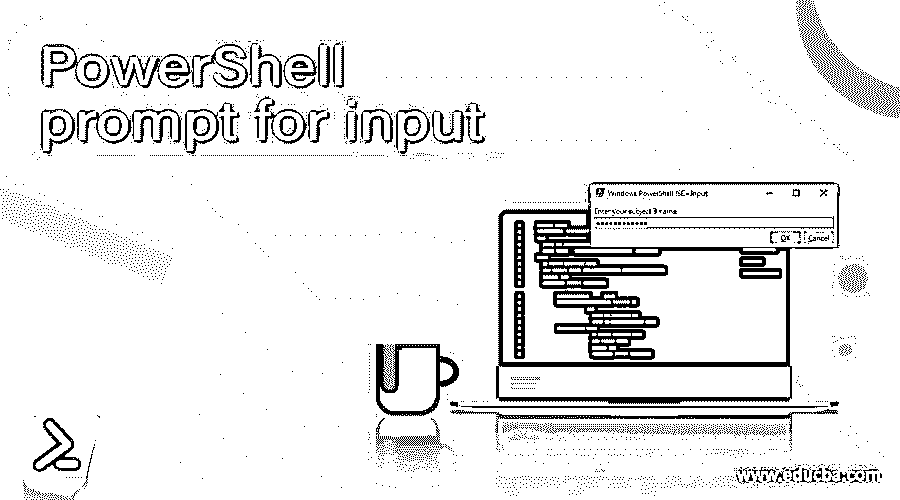

## PowerShell 输入提示简介

在 PowerShell 中，可以通过使用 Read-Host Cmdlet 提示用户来检索输入。它充当标准输入，从控制台读取用户提供的输入。由于输入也可以存储为安全字符串，因此也可以使用此 cmdlet 提示密码。在普通的 PowerShell 或 ISE 中，在请求输入的提示末尾会显示一个冒号。在 GUI 增强的 ISE 中，会显示一个弹出窗口和几个按钮。本文将详细解释如何使用 prompt 在 PowerShell 中获取用户输入。

**语法:**

<small>Hadoop、数据科学、统计学&其他</small>

`Read-Host
NAME
Read-Host`

**语法:**

`Read-Host [[-Prompt] <Object>] [-AsSecureString] [<CommonParameters>] ALIASES
None`

**参数:**

**-AsSecureString:**

这表明用户键入的输入用*隐藏。使用此参数时，输出是一个安全字符串对象。此参数的数据类型是 Switch。默认值为无。管道输入和通配符都不被接受。

**-MaskInput:**

这类似于功能中的安全字符串参数，只是此返回的输出是字符串而不是安全字符串。此参数的数据类型是 Switch。默认值为无。管道输入和通配符都不被接受。

**-提示:**

这表示应该向用户显示的提示文本。这需要是一个字符串。如果有空格，应该用引号括起来。此参数的数据类型是 object。默认值为无。管道输入和通配符都不被接受。

### 例子

#### 示例#1:正常提示

**输入:**

`Write-Host "Welcome to demo of powershell prompt input" -ForegroundColor Green
$name= Read-Host -Prompt "Enter your name"
$age= Read-Host -Prompt "Enter your age"
$city= Read-Host -Prompt "Enter your city"
Write-Host "The entered name is" $name -ForegroundColor Green
Write-Host "The entered age is" $age -ForegroundColor Green
Write-Host "The entered city is" $city -ForegroundColor Green`

**输出:**

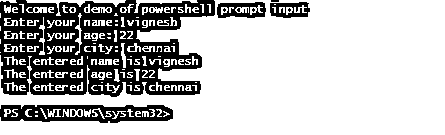

#### 示例 2:将输入保存为安全字符串

**输入:**

`Write-Host "Welcome to demo of powershell prompt input" -ForegroundColor Green
$s1= Read-Host -Prompt "Enter your subject 1 name" -AsSecureString
$s2= Read-Host -Prompt "Enter your subject 2 name" -AsSecureString
$s3= Read-Host -Prompt "Enter your subject 3 name" -AsSecureString
Write-Host "The entered name is" $s1 -ForegroundColor Green
Write-Host "The entered age is" $s2 -ForegroundColor Green
Write-Host "The entered city is" $s3 -ForegroundColor Green`

**输出:**

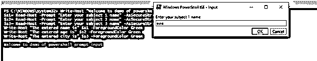

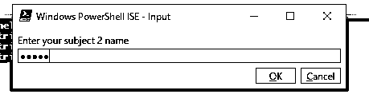

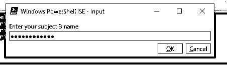

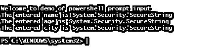

#### 示例 3:自定义表单

**输入:**

`Write-Host "Demo of custom prompt using form" -ForegroundColor Green
Add-Type -AssemblyName System.Windows.Forms
Add-Type -AssemblyName System.Drawing
$testform = New-Object System.Windows.Forms.Form
$testform.Text = 'Data Entry Form'
$testform.Size = New-Object System.Drawing.Size(400,300)
$testform.StartPosition = 'CenterScreen'
$okb = New-Object System.Windows.Forms.Button
$okb.Location = New-Object System.Drawing.Point(85,130)
$okb.Size = New-Object System.Drawing.Size(75,25)
$okb.Text = 'Add'
$okb.DialogResult = [System.Windows.Forms.DialogResult]::OK
$testform.AcceptButton = $okb
$testform.Controls.Add($okb)
$cb = New-Object System.Windows.Forms.Button
$cb.Location = New-Object System.Drawing.Point(170,130)
$cb.Size = New-Object System.Drawing.Size(75,25)
$cb.Text = 'Remove'
$cb.DialogResult = [System.Windows.Forms.DialogResult]::Cancel
$testform.CancelButton = $cb
$testform.Controls.Add($cb)
$test = New-Object System.Windows.Forms.Button
$test.Location = New-Object System.Drawing.Point(270,130)
$test.Size = New-Object System.Drawing.Size(75,25)
$test.Text = 'close'
$test.DialogResult = [System.Windows.Forms.DialogResult]::Cancel
$testform.AcceptButton = $test
$testform.Controls.Add($test)
$lb = New-Object System.Windows.Forms.Label
$lb.Location = New-Object System.Drawing.Point(20,40)
$lb.Size = New-Object System.Drawing.Size(240,20)
$lb.Text = 'Please enter the information in text box:'
$testform.Controls.Add($lb)
$tb = New-Object System.Windows.Forms.TextBox
$tb.Location = New-Object System.Drawing.Point(40,80)
$tb.Size = New-Object System.Drawing.Size(240,20)
$testform.Controls.Add($tb)
$testform.Topmost = $true
$testform.Add_Shown({$tb.Select()})
$rs = $testform.ShowDialog()
if ($rs -eq [System.Windows.Forms.DialogResult]::OK)
{
$y = $tb.Text
Write-Host "Entered text is" -ForegroundColor Green
$y
}`

**输出:**

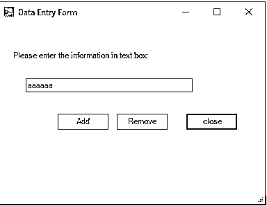

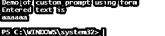

#### 示例#4:使用对话框提示用户输入

**输入:**

`$yeah = New-Object System.Management.Automation.Host.ChoiceDescription "&Yes","Description."
$nah = New-Object System.Management.Automation.Host.ChoiceDescription "&No","Description."
$abort = New-Object System.Management.Automation.Host.ChoiceDescription "&Cancel","Description."
$options = [System.Management.Automation.Host.ChoiceDescription[]]($yeah, $nah, $abort)
$heading = "Demo"
$mess = "are you sure you want to continue?"
$rslt = $host.ui.PromptForChoice($heading, $mess, $options, 1)
switch ($rslt) {
0{
Write-Host "Yes" -ForegroundColor Green
}1{
Write-Host "No" -ForegroundColor Red
}2{
Write-Host "Cancel" -ForegroundColor Red
}
}
$mess = "are you satisfied with out service?"
$rslt = $host.ui.PromptForChoice($heading, $mess, $options, 1)
switch ($rslt) {
0{
Write-Host "Yes" -ForegroundColor Green
}1{
Write-Host "No" -ForegroundColor Red
}2{
Write-Host "Cancel" -ForegroundColor Red
}
}
$mess = "are you sure you want to exit?"
$rslt = $host.ui.PromptForChoice($heading, $mess, $options, 1)
switch ($rslt) {
0{
Write-Host "Yes" -ForegroundColor Green
}1{
Write-Host "No" -ForegroundColor Red
}2{
Write-Host "Cancel" -ForegroundColor Red
}
}`

**输出:**

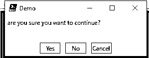

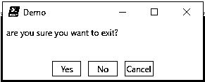

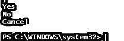

#### 实施例 5

**输入:**

`Write-Host "Demo of getting confirmation along with prompt from user"
$question1 = Read-Host "do you want to continue"
if ($question1 -eq 'y') {
Write-Host "answer provided is yes" -ForegroundColor Green
}
else
{
Write-Host "answer provided is no" -ForegroundColor Red
}
$question2 = Read-Host "are you a human"
if ($question2 -eq 'y') {
Write-Host "yes, human" -ForegroundColor Green
}
else
{
Write-Host "not a human" -ForegroundColor Red
}
$question33 = Read-Host "do you believe in god"
if ($question1 -eq 'y') {
Write-Host "yes I believe in god" -ForegroundColor Green
}
else
{
Write-Host "no I dont believe in god" -ForegroundColor Red
}`

**输出:**

#### 实施例 6

使用提示从用户处获取多个输入

**输入:**

`Write-Host "Demo of getting multiple inputs from user" -ForegroundColor Green
$ainp = @()
do {
$ips = Read-Host -Prompt "Enter ur name"
if ($ips -ne '') {$ainp += $ips}
}
until ($ips -eq 'end')
Write-Host "Entered names are" -ForegroundColor Green
$ainp
Write-Host "Demo of getting multiple user input without loop"
$dummy = "`n"
[string[]] $nl= @()
$nl = READ-HOST -Prompt "enter the names separated by comma"
$nl = $nl.Split(',').Split(' ')
Write-Host "Entered values are" -ForegroundColor Green
$dummy + $nl`

**输出:**

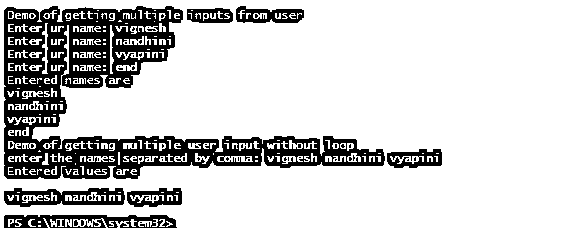

### 结论

因此，本文详细介绍了 PowerShell 中的用户输入提示。它还用适当的例子解释了各种方法。它展示了以安全格式和 GUI 获取输入的各种方法。它还解释了如何在有循环和没有循环的情况下从用户那里获得多个输入值。要了解更多细节，建议编写示例脚本并练习它们。

### 推荐文章

这是 PowerShell 输入提示指南。在这里，我们讨论介绍，语法，参数，代码实现的例子。您也可以看看以下文章，了解更多信息–

1.  [PowerShell 连接字符串](https://www.educba.com/powershell-join-string/)
2.  [PowerShell 退出](https://www.educba.com/powershell-exit/)
3.  [PowerShell XML](https://www.educba.com/powershell-xml/)
4.  [PowerShell 等待](https://www.educba.com/powershell-wait/)

