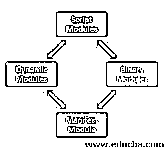
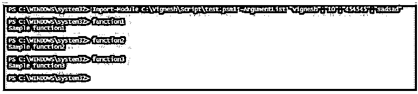
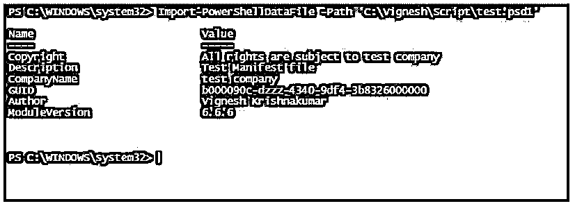

# PowerShell 文件扩展名

> 原文：<https://www.educba.com/powershell-file-extension/>

## PowerShell 文件扩展名简介

通常，当有人想到 PowerShell 和文件扩展名时，他们脑海中只会出现. ps1。对于 95%的用户来说，不可能存在与 PowerShell 相关联的其他文件扩展名。本文将关注这些文件扩展名。

### 3 种不同的 PowerShell 文件扩展名

以下是与 PowerShell 相关的一些其他扩展:

<small>Hadoop、数据科学、统计学&其他</small>

*   . psm1
*   . psd1
*   . ps1xml

#### 1.. psm1 文件

这表示 PowerShell 模块文件。模块是放在一起作为一个包的 cmdlets、变量、函数和工作流的集合。PowerShell 版本 2 首次引入了模块。模块通常存储在以下两个主要位置。

*   % windir % \ system32 \ windows powershell \ v 1.0 \ Modules 这是可供系统中任何用户使用的系统级模块的位置。
*   % user profile % \ Documents \ windows powershell \ Modules。

每个模块都有一个专门的文件夹来保存。它还包含一个名为模块清单的 psd1 文件。清单文件包含模块的设置，如 PowerShell 的版本、作者和其他设置。可以通过运行 Get-Module -ListAvailable cmdlet 来获取可用模块的列表。

一个模块通常由四个基本块组成。

*   一段代码
*   装配
*   清单文件
*   一个包含以上三者的目录。

**模块类型**

有四种不同类型的模块:

*   **脚本模块:**包含 PowerShell 变量、函数、工作流。
*   **二进制模块:**它是一个编译过的。用类似 c#的语言编写的. net 框架代码。
*   清单模块:它没有任何直接代码，而是使用一个清单文件来使用其他模块的特性。
*   **动态模块:**这些模块不存储在任何地方，而是由 New-Module cmdlet 动态生成。

#### 2.. psd1 文件

这些文件是清单文件。它描述了模块的内容并规定了模块的处理。它是一个带有哈希表的文本文件，该哈希表有一个键值对。通过将清单命名为与模块相同的名称并将清单存储在模块的根目录中，清单文件被链接到模块。以下是清单文件中将出现的一些元素。New-ModuleManifest cmdlet 用于创建新的模块清单文件。

*   RootModule: 它的类型是一个字符串，它表示与清单相关联的脚本模块或二进制模块。
*   **ModuleVersion:** 其类型为版本。它表示与清单文件关联的模块的版本。
*   **GUID:** 其类型为 GUID，表示模块的唯一标识。
*   **Author:** 它的类型是字符串，代表模块的作者。如果未指定该值，New- ModuleManifest 将使用当前用户名作为作者的姓名。
*   **描述:**它的类型是一个字符串，它提供了模块功能的描述。
*   **CLRversion:** 其类型为 version，表示用于运行或使用模块的最低 CLR 版本。
*   **RequiredModules:** 其类型为对象，表示在导入该模块之前需要加载的其他模块。
*   **RequiredAssemblies:** 其类型为字符串，表示在导入该模块之前需要加载的其他程序集。

#### 3.. ps1xml 文件

它是 PowerShell XML 文件的扩展。这些配置文件包含有关输出如何显示的详细信息以及正在使用的其他格式相关样式。PowerShell 会自动安装. ps1xml 文件。它们经过数字签名以防止被编辑，因为编辑这些文件需要大量的知识，对它们的任何更改都会产生巨大的影响。通常，XML 文件用于扩展 PowerShell 对象的功能。

有三种方法可以将扩展数据类型加载到 PowerShell 会话中，如下所示:

*   它们或者由 PowerShell 自动加载。
*   当 types.psxm1 文件模块导入到当前会话时。
*   使用 Update-TypeData Cmdlet。

PowerShell 中有许多内置的 XML 文件。它们位于主目录中，并自动加载到每个会话中。要向现有 PowerShell 对象添加新的属性或方法，必须通过 types.ps1xml 文件来完成。

添加新的. ps1xml 文件的步骤如下:

*   复制现有的. ps1xml 文件。
*   进行更改，并用扩展名. ps1xml 保存文件。
*   建议将文件保存在主目录中，尽管这不是强制性的。
*   请使用 Update-TypeDate cmdlet 将该文件包含在当前会话中。

### PowerShell 文件扩展名示例

以下是 PowerShell 文件扩展名的示例:

#### 示例#1:创建新的. psm1 文件

**代码:**

`Write-Host "Demo of module creation"
param(
[string[]] $name,
[string[]] $age,
[string[]] $phonenumber,
[string[]] $address
)
function function1 ()
{
Write-Host "Sample function1"
}
function function2 ()
{
Write-Host "Sample function2"
}
function function3 ()
{
Write-Host "Sample function3"
}
Export-ModuleMember -Function function1
Export-ModuleMember -Function function2
Export-ModuleMember -Function function3`

将上述代码作为. psm1 文件保存在任何位置，但建议保存在与 PowerShell 相同的位置。

使用下面的 cmdlet 将上述文件导入 PowerShell 会话。

`Import-Module C:\Vignesh\Script\test.psm1 -ArgumentList "vignesh","10","454545","sadsad"`

一旦模块被导入，就可以访问模块内部的功能。

**输出:**

#### 例# 2:**. PS D1 文件的创建**

**代码:**

`@{
Author ='Vignesh Krishnakumar'
CompanyName='test company'
Copyright ='All rights are subject to test company'
GUID = 'b000090c-dzzz-4340-9df4-3b8326000000'
ModuleVersion = '6.6.6'
Description='Test Manifest file'
}`

将上述内容保存为. psd1 文件。

若要导入清单文件，请使用下面的 cmdlet:

`Import-PowerShellDataFile -Path ‘C:\Vignesh\Script\test.psd1’`

**输出:**

### 结论

因此，本文介绍了 PowerShell 中除. ps1 之外的一些常用文件扩展名类型。它详细介绍了. psd1、. psm1 和. ps1xml 文件扩展名及其用法和功能。本文还展示了创建模块文件、访问模块、创建清单文件以及导入它们的示例。

### 推荐文章

这是 PowerShell 文件扩展的指南。这里我们讨论简介、3 种不同的 PowerShell 文件扩展名和示例。您也可以看看以下文章，了解更多信息–

1.  [PowerShell Get-ChildItem](https://www.educba.com/powershell-get-childitem/)
2.  [PowerShell 移动项目](https://www.educba.com/powershell-move-item/)
3.  [什么是 Bash 脚本？](https://www.educba.com/what-is-bash-scripting/)
4.  [批量脚本命令](https://www.educba.com/batch-scripting-commands/)

