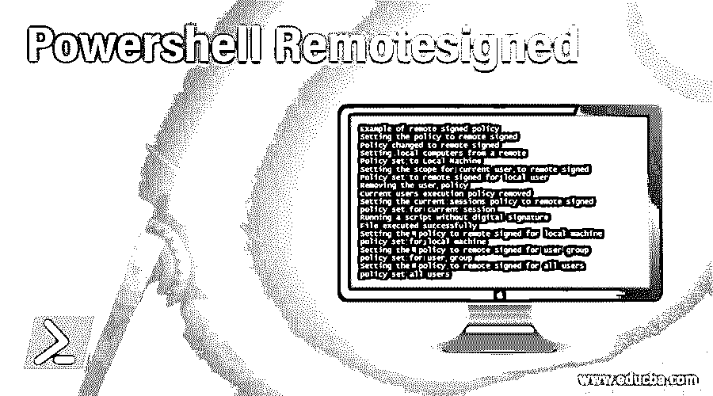
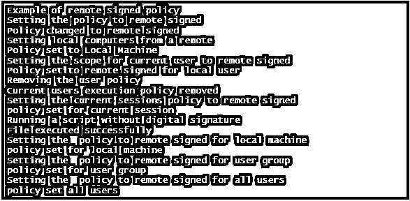

# Powershell 远程签名

> 原文：<https://www.educba.com/powershell-remotesigned/>

## PowerShell 远程签名简介

PowerShell 有一些策略来决定 PowerShell 可以运行配置文件和脚本的情况。这可以防止 PowerShell 运行或执行恶意代码或软件。可以为用户、机器或会话设置 windows 机器中的执行策略。还可以为一组特定的用户创建组策略。系统和当前用户的执行策略在注册表中维护。会话的执行策略保存在内存中，一旦会话关闭，就会丢失。可用的执行策略都是签名的、绕过的、默认的、远程签名的、受限的、未定义的和无限制的。默认策略是远程签名。本文将详细介绍 PowerShell 中的远程签名执行策略。在本主题中，我们将了解 Powershell Remotesigned。

### 远程签名的执行策略功能

默认为远程签名执行策略。在这种执行策略下，可以运行脚本。它需要数字签名来运行从互联网下载的脚本和配置文件。运行在本地机器上开发的文件不需要数字签名。若要运行没有数字签名的文件，必须使用解锁文件 cmdlet。运行没有数字签名的脚本可能是致命的。

<small>Hadoop、数据科学、统计学&其他</small>

使用 Set-ExecutionPolicy cmdlet 设置执行策略。

**语法:**

`NAME
Set-ExecutionPolicy
SYNTAX
Set-ExecutionPolicy [-ExecutionPolicy] {Unrestricted | RemoteSigned | AllSigned | Restricted | Default | Bypass | Undefined} [[-Scope] {Process | CurrentUser |
LocalMachine | UserPolicy | MachinePolicy}] [-Force] [-WhatIf] [-Confirm]  [<CommonParameters>] ALIASES
None`
要将策略设置为远程签名，使用以下 cmdlet

set-execution policy-execution policy remote signed

若要查看执行策略设置，可以使用以下 cmdlet。
`Scope ExecutionPolicy
----- ---------------
MachinePolicy       Undefined
UserPolicy       Undefined
Process       Undefined
CurrentUser       Undefined
LocalMachine    Unrestricted`

**1。执行策略范围**

可以为某个范围设置策略。允许的范围值是机器策略、用户策略、进程、本地机器和当前用户。默认的执行策略是本地机器。

**2。机器策略**

它用于对系统的所有用户应用策略。

**3。用户策略**

它为当前用户创建一个组策略。

**4。流程**

这仅适用于当前会话，其值存储在环境变量中，而不是存储在注册表中。PowerShell 会话关闭后，变量和相应的值将被删除。

**5。当前用户**

这只适用于当前用户。它可以在注册表的 HKEY 当前用户项中找到。

**6。本地机器:**

它用于为系统中的所有用户设置策略。它可以在注册表的 HKEY_LOCAL_MACHINE 中找到。

### 为一个会话设置策略

可以为会话及其子会话设置执行策略。为此，可以使用 pwsh.exe。这存储在环境变量“$ env:PSExecutionPolicyPreference”中。一旦会话关闭，该值将被清除。在会话内部，该执行策略的优先级高于注册表中设置的优先级。它永远不能优先于组执行策略。

**举例:**

`pwsh.exe -ExecutionPolicy LocalMachine`

**输入:**

`Write-Host "Example of remote signed policy"
Write-Host "Setting the policy to remote signed"
Set-ExecutionPolicy -ExecutionPolicy RemoteSigned
Write-Host "Policy changed to remote signed"
write-host "Setting local computers from a remote"
Invoke-Command -ComputerName testserver1 -ScriptBlock { Get-ExecutionPolicy } | Set-ExecutionPolicy
Write-Host "Policy set to Local Machine"
Write-Host "Setting the scope for current user to remote signed"
Set-ExecutionPolicy -ExecutionPolicy RemoteSigned -Scope CurrentUser
Write-Host "Policy set to remote signed for local user"
Write-Host "Removing the user policy"
Set-ExecutionPolicy -ExecutionPolicy Undefined -Scope CurrentUser
Write-Host "Current users execution policy removed"
Write-Host "Setting the current sessions policy to remote signed"
Set-ExecutionPolicy -ExecutionPolicy RemoteSigned -Scope Process
Write-Host "policy set for current session"
Write-Host "Running a script without digital signature"
Unblock-File c:\vignesh\test.ps1
Write-Host "File executed successfully"
Write-Host "Setting the  policy to remote signed for local machine"
Set-ExecutionPolicy -ExecutionPolicy RemoteSigned -Scope LocalMachine
Write-Host "policy set for local machine"
Write-Host "Setting the  policy to remote signed for user group"
Set-ExecutionPolicy -ExecutionPolicy RemoteSigned -Scope UserPolicy
Write-Host "policy set for user group"
Write-Host "Setting the  policy to remote signed for all users"
Set-ExecutionPolicy -ExecutionPolicy RemoteSigned -Scope MachinePolicy
Write-Host "policy set all users"`

**输出:**

### 其他 Powershell 远程签名执行策略功能

**1。全部签名**

这允许执行所有的脚本，但是需要对所有的脚本进行数字签名，即使是在本地机器上开发的脚本。在运行脚本之前会询问一个提示。

**2。旁路**

执行脚本时不会显示任何警告或提示。

**3。默认**

windows 客户端的默认策略是受限的，而对于 windows，服务器是远程签名的

**4。受限**

它只允许命令，不允许执行脚本。不允许使用配置文件、ps 文件或模块脚本。

**5。无限制**

无法更改非 windows 计算机的策略。所有未签名的脚本都可以运行。

### 组策略功能

如果启用脚本执行被禁用，则脚本将不会运行。这就像一个受限执行策略。若要启用执行策略，必须启用“打开脚本执行组策略”。要允许所有脚本，则策略应设置为无限制。要允许执行带有数字签名的脚本，则必须对其进行远程签名，如果只执行签名的脚本，则策略必须全部签名。

这些策略按以下顺序执行。最高优先级给予机器策略，然后是用户策略，接着是进程，然后是当前用户，最后是本地机器。

### 结论–Powershell 远程签名

因此，本文详细介绍了 PowerShell 中的远程签名执行策略。它解释了远程签名策略的特性和语法。本文展示了如何为各种范围将策略设置为远程签名的各种示例。它还简要介绍了其他可用的执行策略。要了解更多细节，建议编写示例程序并实践它们。

### 推荐文章

这是 Powershell 远程签名指南。这里我们讨论远程签名的执行策略特性以及其他执行策略特性。您也可以看看以下文章，了解更多信息–

1.  [PowerShell 继续](https://www.educba.com/powershell-continue/)
2.  [PowerShell 发送邮件](https://www.educba.com/powershell-send-mail/)
3.  [PowerShell 模块](https://www.educba.com/powershell-modules/)
4.  [PowerShell 获取项目](https://www.educba.com/powershell-get-item/)

