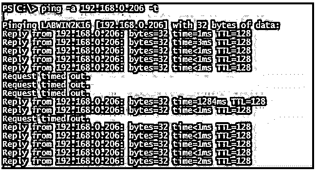
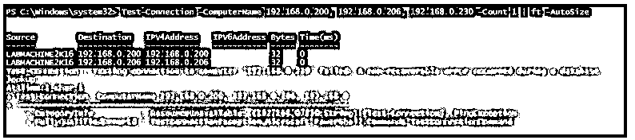
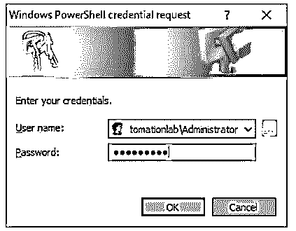

# PowerShell Ping

> 原文：<https://www.educba.com/powershell-ping/>

## PowerShell Ping 简介

PowerShell ping 命令在 PowerShell cmdlet 中也称为 Test-Connection，它向一个或多个远程节点发送 Internet 控制协议消息(ICMP)回应数据包或 ping，作为回报，它接收回应数据包以确定远程服务器的连接性，并且还通过使用各种参数来作为后台作业运行该命令，设置发送请求的次数，设置超时并配置连接和身份验证，甚至该命令还可以跟踪目标节点的路由。

**PowerShell Ping 的语法**

<small>Hadoop、数据科学、统计学&其他</small>

下面给出了提到的语法:

**使用测试连接:**

`Test-Connection
[-TargetName] <string[]>
[-Ping] [-IPv4] [-IPv6] [-ResolveDestination] [-Source <string>] [-MaxHops <int>] [-Count <int>] [-Delay <int>] [-BufferSize <int>] [-DontFragment] [-TimeoutSeconds <int>] [-Quiet] [<CommonParameters>]`

`Test-Connection
[-TargetName] <string[]>
-Repeat
[-Ping] [-IPv4] [-IPv6] [-ResolveDestination] [-Source <string>] [-MaxHops <int>] [-Delay <int>] [-BufferSize <int>] [-DontFragment] [-TimeoutSeconds <int>] [-Quiet] [<CommonParameters>]`

`Test-Connection
[-TargetName] <string[]>
-MtuSize
[-IPv4] [-IPv6] [-ResolveDestination] [-TimeoutSeconds <int>] [-Quiet] [<CommonParameters>]`

`Test-Connection
[-TargetName] <string[]>
-Traceroute
[-IPv4] [-IPv6] [-ResolveDestination] [-Source <string>] [-MaxHops <int>] [-TimeoutSeconds <int>] [-Quiet] [<CommonParameters>]`

`Test-Connection
[-TargetName] <string[]>
-TcpPort <int>
[-IPv4] [-IPv6] [-ResolveDestination] [-Source <string>] [-TimeoutSeconds <int>] [-Quiet] [<CommonParameters>]`

在上面的语法中，您可以一次使用一个 set，就像您不能同时使用-TCPPort 和-TraceRoute 参数一样。

**Note:** Few parameters were added to the latest version of the PowerShell. The above parameters are supported in PowerShell 7.1.3\. If you need to check the older version of this command, you can check on the Microsoft documentation.

**使用 Ping 命令:**

`ping [/t] [/a] [/n <count>] [/l <size>] [/f] [/I <TTL>] [/v <TOS>] [/r <count>] [/s <count>] [{/j <hostlist> | /k <hostlist>}] [/w <timeout>] [/R] [/S <Srcaddr>] [/4] [/6] <targetname>`

### PowerShell Ping 是如何工作的？

Ping 命令是在命令提示符中引入的，也可以用于 PowerShell。Ping 命令使用 ICMP(互联网控制协议消息)数据包通过远程节点发送，并通过接收从远程节点返回的回应数据包来检查连通性。如果 DNS 记录配置正确，Ping 命令还会确定域系统中主机的名称。PowerShell 引入了一个比 ping 更强大的命令，称为 Test-Connection。它是 TestConnection + PingStatus 的组合。

要 ping 远程计算机，我们可以简单地使用:

**代码:**

`ping google.com`

**输出:**

使用测试连接命令。

**代码:**

`Test-Connection Google.com`

**输出:**

### PowerShell Ping 的示例

以下是 PowerShell Ping 的示例:

#### 示例 1–使用 ping 命令确定主机名。

如果您想要检索远程服务器主机名，您可以使用带-a 参数的 ping 命令来确定。

**代码:**

`ping -a 192.168.0.200`

**输出:**

-a 参数从 IP 地址(PTR)记录中检索计算机名。

#### 示例 2–连续检索 ping。

有时我们需要连续检查远程服务器的状态，在这种情况下，您可以使用-t 参数，这样它会返回 echo 结果，直到按下 Ctrl+C 按钮。

**代码:**

`ping -a 192.168.0.206 -t`

**输出:**

#### 示例# 3–在 Test-Connection 命令中使用-Quiet 模式。

-Quiet 参数抑制 Test-Connection 命令生成的输出，并以布尔形式返回输出。如果远程连接建立成功，则返回 true，否则返回 false。

**代码:**

`Test-Connection -ComputerName 192.168.0.200 -Quiet`

**输出:**

错误输出示例，

**输出:**

#### 示例# 4–使用-count 参数限制计数。

默认情况下，Test-Connection 命令生成 4 个计数。但是，您可以限制您想要的数量。

**代码:**

`Test-Connection -ComputerName 192.168.0.200 -Count 2`

**输出:**

这在我们写剧本的时候特别有帮助。例如，我们可以将-Count 和-Quiet 参数结合起来，这样我们就可以快速获得输出。

**代码:**

`Test-Connection -ComputerName 192.168.0.200 -Count 1 -Quiet`

**输出:**

在脚本中，我们可以使用 If else 条件。

**代码:**

`if(Test-Connection -ComputerName 192.168.0.200 -Count 1 -Quiet){
Write-Output "Server Connectivity Successful"
}
else{
Write-Output "Server Connectivity failed"
}`

**输出:**

#### 示例 5–对多台服务器使用测试连接。

Test-Connection 命令中的-ComputerName 参数接受多个计算机名，因为它是一个字符串数组。

**代码:**

`Test-Connection -ComputerName 192.168.0.200, 192.168.0.206, 192.168.0.230 -Count 1 | ft -AutoSize`

**输出:**

我们可以在 try/catch 块中使用它来捕捉错误。

**代码:**

`Try {
Test-Connection -ComputerName 192.168.0.200, 192.168.0.206, 192.168.0.230 -Count 1 -EA Stop | ft -AutoSize
}
Catch {
$_.Exception.Message
}`

**输出:**

#### 示例# 6–使用-TraceRoute 确定目的节点的希望。

我们可以添加-TraceRoute 参数来确定到目的节点的路由。

**代码:**

`Test-Connection -TargetName www.google.com -Traceroute`

**输出:**

**Note:** These two parameters (-TraceRoute and -TargetName) are not supported in the PowerShell Framework version (up to PowerShell v5.1).

#### 示例 7–设置自定义缓冲区大小和延迟计数。

我们可以添加自定义缓冲区大小，并设置后续请求之间的延迟秒数，如下所示。

**代码:**

`Test-Connection -ComputerName 192.168.0.200 -Delay 3 -BufferSize 256`

**输出:**

#### 示例 8–将测试连接作为后台作业运行。

我们可以使用-AsJob 参数将 Test-Connection 命令作为后台作业运行。

**代码:**

`Test-Connection -ComputerName 192.168.0.200, 192.168.0.206 -Count 2 -AsJob`

**输出:**

获得作业名称后，可以使用 Receive-Job 命令检索作业的状态。

**代码:**

`Receive-Job -Name Job5`

**输出:**

#### 示例 9–使用多个来源向远程计算机发送请求。

您可以使用多个来源向远程计算机发送请求。

**代码:**

`Test-Connection -Source 192.168.0.202, 192.168.0.206 -ComputerName 192.168.0.200 -Count 2`

**输出:**

#### 示例# 10–使用不同的凭证。

如果源计算机和远程计算机在不同的域中，您可以使用不同的凭据。

**代码:**

`Test-Connection -Source 192.168.0.206 -ComputerName 192.168.0.200 -Count 2 -Credential Automationlab\Administrator`

**输出:**

### 结论

PowerShell ping 命令是我们编写脚本时非常有用的命令之一。确定远程服务器是否在线是第一步。很多时候，服务器可能已经在防火墙中阻止了 ICMP 请求；在这种情况下，您可以使用 Test-WSMan 这样的命令来检查 WINRM 连接是否正常。

### 推荐文章

这是 PowerShell Ping 的指南。这里我们讨论引言；PowerShell ping 是如何工作的？和示例。您也可以看看以下文章，了解更多信息–

1.  [PowerShell 睡眠](https://www.educba.com/powershell-sleep/)
2.  [PowerShell 子串](https://www.educba.com/powershell-substring/)
3.  [PowerShell 不像](https://www.educba.com/powershell-not-like/)
4.  [否则如果在 PowerShell 中](https://www.educba.com/else-if-in-powershell/)

