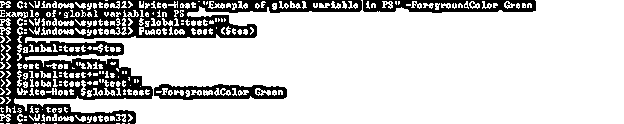
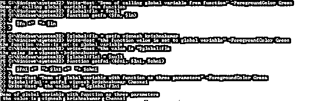
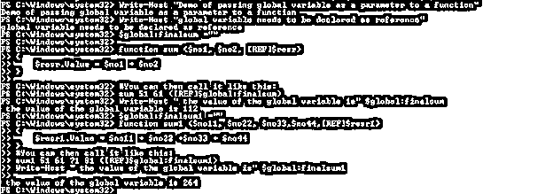
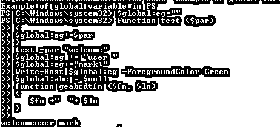

# PowerShell 全局变量

> 原文：<https://www.educba.com/powershell-global-variable/>

## PowerShell 全局变量简介

变量是 PowerShell 不可或缺的一部分。变量有很多种类型；本文将关注全局变量。全局变量是可用于当前会话中所有脚本、函数或任何 cmdlet 的变量。通常，全局变量是在开头声明的，大多是在顶部。全局变量的主要用途是它的可重用性。本文将详细解释全局变量，语法，使用，以及适当的例子。

### PowerShell 全局变量的语法

创建全局变量的方法如下

<small>Hadoop、数据科学、统计学&其他</small>

`$global:test="This is a test"`

或者

`$global:test = $null`

**举例:**

`Write-Host "Example of global variable in PS" -ForegroundColor Green
$global:test=""
Function test ($tes)
{
$global:test+=$tes
}
test -tes "this "
$global:test+="is "
$global:test+="test "
Write-Host $global:test -ForegroundColor Green`

**输出:**

**举例:**

**通过函数**设置全局变量

`Write-Host "Demo of calling global variable from function" -ForegroundColor Green
$global:fln = $null
function getfn ($fn, $ln)
{
$fn +"  "+ $ln
}
$global:fln = getfn vignesh krishnakumar
Write-Host "the function value is set to global variable" -ForegroundColor Green
write-Host "the value is "$global:fln
$global:fln1 = $null
function getfn1 ($fn1, $ln1, $chn1)
{
$fn1 +"  "+ $ln1 +"  "+ $chn1
}
Write-Host "Demo of global variable with function as three parameters" -ForegroundColor Green
$global:fln1 = getfn1 vignesh krishnakumar Chennai
Write-Host " the value is " $global:fln1`

**输出:**

**举例:**

**输入:**

`Write-Host "Demo of passing global variable as a parameter to a function"
Write-Host "global variable needs to be declared as reference"
$global:finalsum =""
function sum ($no1, $no2, [REF]$resr)
{
$resr.Value = $no1 + $no2
}
#You can then call it like this:
sum 51 61 ([REF]$global:finalsum)
Write-Host " the value of the global variable is" $global:finalsum
$global:finalsum1 =""
function sum1 ($no11, $no22, $no33,$no44,[REF]$resr1)
{
$resr1.Value = $no11 + $no22 +$no33 + $no44
}
#You can then call it like this:
sum1 51 61 71 81 ([REF]$global:finalsum1)
Write-Host " the value of the global variable is" $global:finalsum1`

### 全局变量的优势

*   它可以存储所有类型的数据类型值，如字符串、对象、数组、整数和哈希表。
*   它可以存储不同对象类型的集合
*   每个变量都被分配了一个内存
*   如果没有给全局变量赋值，默认情况下它被认为是空的。
*   尽管这不是强制性的，但为了便于理解，最好总是在顶部声明全局变量。

### 范围层次结构

如前所述，一旦您分派了 PowerShell 会话，PowerShell 会在全球范围内为您创建一些内容。这些东西可以是容量、假定名称的因子或 PSDrives。您在 PowerShell 会话中定义的任何内容也将在全局范围内定义。由于默认情况下您在全球范围内，所以如果您正在做一些使另一个范围成为全球范围的事情，如执行脚本或运行研讨会，将会创建一个子范围，父范围是全球范围。范围就像带有父级和子级的窗体。因此，在父范围(在这种情况下是全球范围)中描述的任何内容在子范围中都是可用的。但是这些东西在它们被描述的范围内是可编辑的。

**不同类型的范围修饰符:**

**全局:**这表示全局范围

**Local:** 这表示当前唯一的作用域

**私有:**这表示该项目是私有的，并且在当前范围内可用

**脚本:**这表示可以通过脚本访问项目

**使用:**用于从其他脚本中访问项目

**工作流:**表示工作流中使用的项目

**使用修饰符:**

这用于处理远程 cmdlet 中的项目。每当需要在当前会话之外访问任何内容时，都应该使用 using 修饰符。这比全局变量高了一步。一些示例 cmdlets 是 Start-Job 和 Invoke-Command。

**举例:**

**输入:**

`Write-Host "Demo of setting global variable value" -ForegroundColor Green
Set-Variable -Name "TD" -Value (Get-Date) -Scope global
Get-Variable -Name "TD"
Set-Variable -Name "NAME1" -Value "vignesh" -Scope global
Set-Variable -Name "age1" -Value "28" -Scope global
Set-Variable -Name "city" -Value "chennai" -Option Private -Scope global
Set-Variable -Name "status" -Value "married" -Scope global
Set-Variable -Name "gender" -Value "male" -Scope global
Get-Variable -Name "NAME1"
Get-Variable -Name "age1"
Get-Variable -Name "city"
Get-Variable -Name "status"
Get-Variable -Name "gender"`

**输出:**

**举例:**

**输入:**

`Write-Host "Example of global variable in PS" -ForegroundColor Green
$global:eg=""
Function test ($par)
{
$global:eg+=$par
}
test -par "welcome"
$global:eg += "user "
$global:eg+="mark "
Write-Host $global:eg -ForegroundColor Green
$global:abc = $null
function geabcdtfn ($fn, $ln)
{
$fn +"  "+ $ln
}
$global:abc = geabcdtfn vijaya sethupathi
write-Host "the value is "$global:abc
$global:fln1 = $null
function getfn1 ($fn1, $ln1, $chn1)
{
$fn1 +"  "+ $ln1 +"  "+ $chn1
}
Write-Host "Demo of global variable with function as three parameters" -ForegroundColor Green
$global:fln1 = getfn1 vignesh krishnakumar Chennai
Write-Host " the value is " $global:fln1
Set-Variable -Name "tdate" -Value (Get-Date) -Scope global
Set-Variable -Name "mark1" -Value "100" -Scope global
Set-Variable -Name "mark2" -Value "90" -Scope global
Set-Variable -Name "mark3" -Value "100" -Option Private -Scope global
Set-Variable -Name "mark4" -Value "100" -Scope global
Set-Variable -Name "total" -Value "390" -Scope global
Get-Variable -Name "mark1"
Get-Variable -Name "mark1"
Get-Variable -Name "mark1"
Get-Variable -Name "mark1"
Get-Variable -Name "total"
Get-Variable -Name "tdate"`

**输出:**

### 结论

因此，本文详细解释了 PowerShell 中的全局变量。它详细解释了如何定义一个全局变量，如何为全局变量设置一个值，如何将全局变量传递给一个函数，以及如何将函数返回的值设置为全局变量。尽管全局变量可用于整个会话，但不建议将所有变量都创建为全局变量，这会导致不良做法。要了解更多细节，建议编写示例脚本并实践它们。

### 推荐文章

这是 PowerShell 全局变量的指南。这里我们讨论如何定义一个全局变量以及如何给这个变量设置一个值。您也可以看看以下文章，了解更多信息–

1.  [PowerShell 位置](https://www.educba.com/powershell-location/)
2.  [PowerShell 新产品线](https://www.educba.com/powershell-new-line/)
3.  [PowerShell 字典](https://www.educba.com/powershell-dictionary/)
4.  [PowerShell 退出](https://www.educba.com/powershell-exit/)

