# PowerShell 中的阵列

> 原文：<https://www.educba.com/array-in-powershell/>

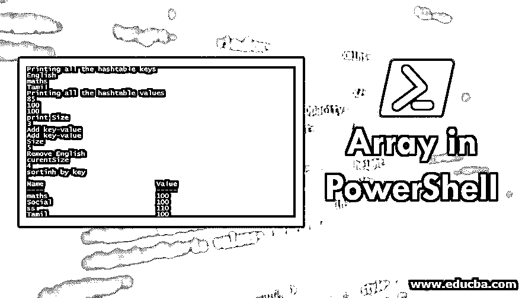

## PowerShell 中的阵列简介

数组是一种可用于存储项目集合的数据结构类型，项目集合可以是相同的数据类型或不同的数据类型。可以使用索引来访问数组中的元素。数组的索引通常从 0 开始，所以要访问第一个元素，必须使用索引[0]。通常，一个数组上只能有两个操作，即向数组中添加元素或移除元素。在本文中，我们将了解 PowerShell 中的阵列。

### 在 PowerShell 中定义数组

可以用以下任何一种方式定义数组，

<small>Hadoop、数据科学、统计学&其他</small>

@()是定义数组的方法之一。

**举例:**

`$Subject = @(‘History’,’Geo’,’Maths’)`

*   数组也可以创建为逗号分隔的列表。

`$test=’testone’,’testtwo’,’testthree’`

*   可以为特定的数据类型元素创建数组，如下所示:

`[int[]] $numbersarray = 1,2,3,4,5`

上面是一个整数数组，它只能保存整数值。

### 访问数组

让我们定义一个数组，

**举例:**

`$test=@(‘test1’,’test2’,’test3’,’test4’)`

$test [0]将返回 test1，$test [3]将返回 test4。许多语言只允许指定一个索引，[，而在 PowerShell](https://www.educba.com/what-is-powershell/) 中可以同时使用多个索引。

在上面的$test [1，3]中将返回，

测试 2

测试 4

### 数组上的操作

向数组中添加项目。让我们看一个如何向现有数组添加元素的例子。

**举例:**

`$test=@(‘welcome’,’home’)`

要添加到上面的数组中，需要使用“+=”运算符。

$test+='Raj '

运行$test 将返回，

欢迎

家

统治

### 获取数组的计数

这里我们解释，如何使用下面的输入来获得一个数组的计数。

**输入:**

`$test=@(‘test1’,’ertr’,’fgdfgfd’,’dfgfdg’,’dfdfsd’,’dfgfdgdfg’)`

$测试。Count 将返回 6，这是数组的计数/长度。

#### 1.对数组中的元素进行排序

如果数组中的元素具有相同的数据类型，则可以使用 sort 运算符对这些元素进行排序。

**输入:**

`$test=@(‘oneee’,’zddsdsad’,'thraewawe')
$test |sort`

上述命令将按升序对元素进行排序

**输出:**

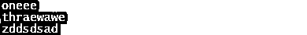

**输入:**

`$test |sort -Descending will sort the elements in the descending order`

**输出:**

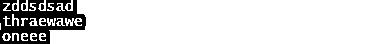

#### 2.更新数组中的项目

索引可用于更新数组中的元素

**输入:**

`$test=@(‘oneee’,’zddsdsad’,'thraewawe')
$test[0]=’changed’`

上述命令会将“one”更改为“changed”。执行$test 将返回

**输出:**

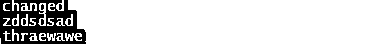

#### 3.查找数组中的元素

要检查数组的值，可以使用 like 运算符

**输入:**

`$test=@(‘viki’,ramu,'aravind','vikram')
$test -like "*vik*"`

**输出:**

### PowerShell 中的多维数组

我们可以如下创建一个多维数组，

`$testMultidimensionalArrays = @(1,2,3), @(4,5,6), @(7,8,9)`

每个数组有一行三列。

### 循环数组

和其他语言一样，for 循环可以用来循环数组中的元素。

**输入:**

`$test=@(‘viki’,’ramu’,'aravind','vikram')
for($i=0;$i -lt $test.Length; $i++)
{
Write-Host $test[$i] }`

**输出**:

For-each 可用于对数组中的每一项执行操作。

**输入:**

`$test=@(1,4,5,6,7,8,9,10)
foreach($i in $test)
{
$i=$i+5
Write-Host $i
}`

**输出:**

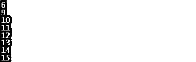

### PowerShell 中的数组列表

数组的一个缺点是增加了条目，为了克服这个缺点，我们有一个数组列表。

下面是创建数组列表的语法，

`$myarray = [System.Collections.ArrayList]::new()
$myarray.Add(1)
$myarray.Add(2)
$myarray.Add(3)
$myarray`

第一行是初始化数组列表的方法，随后几行是向数组列表添加条目

### 阵列与阵列列表性能

以下示例显示了对数组和数组列表执行操作时的性能差异

**输入:**

`Measure-Command -Expression { 0..250 | ForEach-Object { $arr += $_+1 }}
$arrlit = [System.Collections.ArrayList]@()
$f arrlit _performance = Measure-Command -Expression { 0..250 | ForEach-Object { $ arrlit += $_+1 }}
$ arrlit _performance`

第一个命令对数组执行操作，第三行对数组列表执行同样的操作。

**输出:**

*   阵列性能

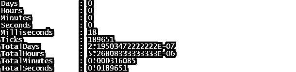

*   数组列表的性能

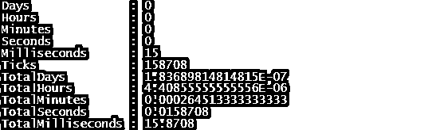

数组列表的性能比数组更快更好。

### PowerShell 中的阵列示例

下面是一个使用 for 循环、foreach 循环和 while 循环查找数组长度的示例。

**输入:**

`$testlist = 5.634, 4.512323, 3.312323, 13.2213213, 4.02324, 34.3334324, 34.04324, 45.4534324, 99.993234324, 11123234234 write-host("Printing the array elements")
$testlist
write-host("length of array")
$testlist.Length
write-host("fifth element in array")
$testlist[4] write-host("partial array")
$subList = $testlist[1..3] write-host("using for loop")
for ($i = 0; $i -le ($testlist.length - 1); $i += 1) {
$testlist[$i] }
write-host("using forEach Loop")
foreach ($e in $testlist) {
$e
}
write-host("using while Loop")
$i = 0
while($i -lt 4) {
$testlist[$i];
$i++
}
write-host("Assign values")
$testlist[1] = 10
$testlist`

**输出:**

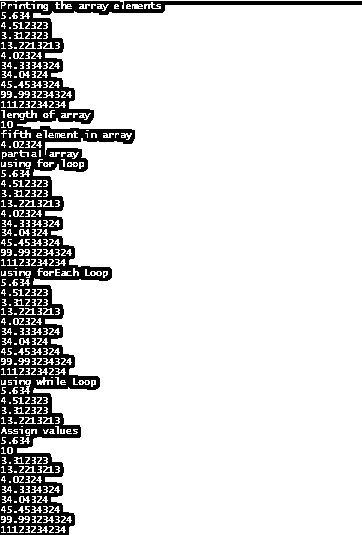

### 散列表

哈希表用于实现结构化数组。在哈希表中，值以键值格式存储。它们也被称为字典或关联数组。

**语法:**

`$testhashtable=@{}`

或者

`$testhashtable=@{ key1=”test1”;key2=”test2”;key3=”test3”}`

其中，key1、key2 和 key3 是键，test1、test2 和 test3 是值。

**输入**:

`$testhashtable`

**输出:**

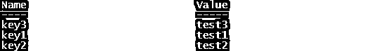

方法，可以按如下方式访问键或值。点运算符

**输入:**

`$testhashtable.keys`

**输出:**

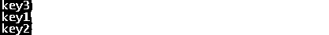

**输入:**

`$testhashtable.Values`

**输出:**

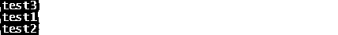

#### 例子

下面是一个查找所有哈希表键和哈希表值的例子。

**输入:**

`$testht = @{ English = "85"; Tamil = "100"; maths = "100"}
write-host("Printing all the hashtable keys")
$testht.keys
write-host("Printing all the hashtable values")
$testht.values
write-host("print Size")
$testht.Count
write-host("Add key-value")
$testht["Social"] = "100"
write-host("Add key-value")
$testht.Add("ss","110")
write-host("Size")
$testht.Count
write-host("Remove English")
$testht.Remove("English")
write-host("curentSize")
$testht.Count
write-host("sortinh by key")
$testht.GetEnumerator() | Sort-Object -Property key`

**输出:**

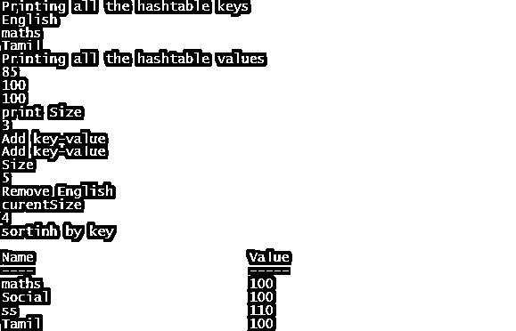

### 结论–PowerShell 中的阵列

阵列的主要优势是内存管理。可以直接从缓存中访问它们，这有助于加快检索速度。它们是可重用的，一旦声明它们可以被多次重用。

### 推荐文章

这是 PowerShell 中的阵列指南。这里我们讨论 PowerShell 中数组、数组列表和哈希表的介绍和实现。您也可以阅读以下文章，了解更多信息——

1.  [PowerShell vs CMD](https://www.educba.com/powershell-vs-cmd/)
2.  [PowerShell 的 7 大版本](https://www.educba.com/install-powershell/)
3.  [阵列的优势](https://www.educba.com/advantages-of-array/)
4.  【PowerShell 和 Bash 的主要区别
5.  [带有查询示例的 Escape 子句的概念](https://www.educba.com/oracle-like-operator/)
6.  [Powershell Write-Host |语法示例](https://www.educba.com/powershell-write-host/)
7.  [PowerShell 排序对象完整指南](https://www.educba.com/powershell-sort-object/)

