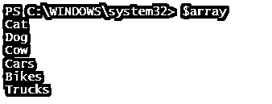
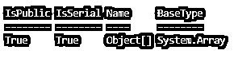
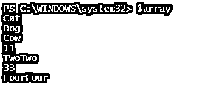
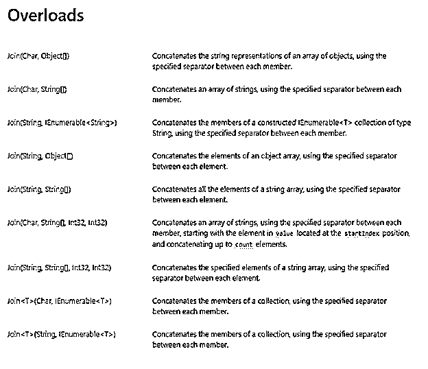
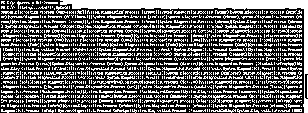

# PowerShell 加入阵列

> 原文：<https://www.educba.com/powershell-join-array/>

## PowerShell 加入阵列简介。

PowerShell Join array 是使用操作符和 String 类的方法来连接数组的操作符。连接两个数组会创建第三个数组，因为数组(不是 ArrayList)的大小是固定的。连接数组的输出也是对象的集合。

**语法**

<small>Hadoop、数据科学、统计学&其他</small>

联接数组操作支持各种语法。

*   +'运算符连接两个字符串数组或不同数据类型的数组。
*   **Join(Char，Object[])** :将字符连接到对象数组。
*   **Join(Char，String[])** :将字符连接到字符串数组。
*   **Join(String，Object[])** :将字符串连接到对象数组。
*   **Join(Char，String，Int32，Int32)** :将字符连接到字符串数组，从起始索引一直到字符串计数。

### 例子

下面举几个例子

#### 示例 1–用“+”运算符连接两个数组。

假设我们有两个不同的数组，我们需要将它们连接起来。

`$array1 = "Cat","Dog","Cow"
$array2 = "Cars","Bikes","Trucks"
To join two arrays, we will use the **‘+’** operator here.
$array = $array1 + $array2
$array`

**输出:**

#### 示例 2–连接两个不同数据类型的数组。

在第一个示例中，我们看到两个 PowerShell 数组存储的值是 string 的集合。但是，我们可以在字符串中存储不同的值，并将它们连接起来。

举个例子，

`$array1 = "Cat","Dog","Cow"
$array2 = 11,"TwoTwo",33,"FourFour"`

如果我们检查两个变量$Array1 和$Array2 的数据类型，它将是 Object[]的集合，如下所示。

这意味着数组中的；你输入什么不同类型的对象并不重要；最终，它成为对象的集合。所以我们可以使用 **'+'** 操作符合并任意数量的数组。

在这个例子中，合并两个数组，

`$array = $array1 + $array2
$array`

**输出:**

在前两个例子中，我们使用第三个数组来存储结果。让我们检查它的数据类型；它也应该是对象集合。

`$array.GetType()`

**输出:**

#### 示例 3——使用 ArrayList 连接两个数组

在下面的例子中，我们将使用。Net 类系统。Collection.ArrayList，并执行连接操作，我们需要使用 Add()方法。如下所示，我们有两个数组，它们使用 Add()方法连接在一起。

`$array1 = "Cat","Dog","Cow"
$array2 = 11,"TwoTwo",33,"FourFour"
foreach($value in $array1){$JoinArray.Add($value) | Out-Null}
foreach($value in $array2){$JoinArray.Add($value) | Out-Null}
$JoinArray`

**输出:**

我们可以像$JoinArray($Array1)一样直接将数组添加到 add 方法中，但问题是它将整个数组视为索引 0，将下一个数组$JoinArray($Array2)视为索引 1。所以我们必须使用 foreach 循环添加每个值。

#### 示例# 4–字符串连接数组示例–I

在字符串数组中，系统。字符串。Net 类支持连接方法。有多种重载方法可以加入数组。有关字符串连接方法，请参见下面的参考链接。

https://docs.microsoft.com/en-us/dotnet/api/system.string.join?view=net-5.0#System_String_Join_System_Char_System_Object

我们将使用上面的一些方法。

在上面所有的连接方法中，第一个参数总是一个分隔符，第二个是执行连接操作的项。

我们在这里使用的第一个字符串连接方法是，Join(Char，Object[])。这里的字符是分隔符，Object[]是要处理的项。它是 Object[]的数组，所以我们可以传递它里面的任何对象，因此它是一个 string 方法；它应该将 Object[]转换为字符串数组。举个例子，

`$Services = Get-Service
[String]::Join('|',$Services)`

**输出:**

正如您在上面的例子中看到的，我们通过分隔符“|”连接了每个服务对象[]。对于这个例子，输出可能是正确的格式，但是在 Get-Process 这样的例子中，当您将整个 Object[]作为字符串传递时。举个例子，

`$procs = Get-Process
[String]::Join('|',$procs)`

**输出:**

上面的输出不是我们想要的，但是我们可以使用它的属性用提供的分隔符来分隔对象。举个例子，

`[String]::Join('|',$procs.name)`

**输出:**

#### 示例 5–字符串连接数组示例–II

我们可以对字符串使用的第二种方法。Net 类联接数组的方法是 Join(Char，String[])。它用第一个参数中提到的分隔符连接字符串数组。举个例子，

`$str = "This","is","PowerShell","String"
[String]::Join('^',$str)`

**输出:**

加入空间，

`[String]::Join(' ',$str)
This is PowerShell String`

#### 示例 6–字符串连接数组示例–III

在上面的两个例子中，我们用字符连接了一个字符串数组。现在，我们还可以使用另一个字符串连接该字符串，因为重载方法支持这样做。在第二个参数中，我们可以传递对象或字符串。

它对数组的字符串串联支持两种方法。

*   **Join(String，Object[])** :在每个对象输出之间用字符串分隔符连接类似数组的对象(Get-Service 或 Get-process)。举个例子，

`$ser = Get-Service
[String]::Join('  Hello  ',$ser)`

**输出:**

如上面的例子所示，服务是通过 Hello 关键字分隔和连接的，包括空格。

*   **Join(String，String[]):** 在每个元素之间使用字符串分隔符连接字符串数组。

例如

`$str = "This","is","PowerShell","String"
[String]::Join(' String ',$str)`

**输出:**

#### 示例# 7–字符串连接数组示例–IV

在这个方法中，我们使用一个字符或一个字符串作为对象数组[]或字符串数组[]的分隔符来连接。对此，我们可以使用两种不同的方法。

*   **Join(Char，String[]，Int32，Int32)**

参数描述如下。

*   **Char** :给定输入的字符分隔符
*   **String[]** :字符串数组，用一个字符分隔和连接。
*   **Int32** :拼接的起始索引。
*   **Int32** :从起始索引开始计数。

举个例子，

`$str = "This","is","PowerShell","string","to","test","the","join","array"
[String]::Join('#',$str, 2,5)`

**输出:**

在上面的例子中，我们使用分隔符' # '连接起始索引为 2 的字符串和总计数为 5 的单词。

*   **Join(String，String[]，Int32，Int32)**

与上面的操作类似，我们可以使用 Join 方法，使用另一个带有起始索引和总计数的字符串来连接字符串数组。

举个例子，

`$str = "This","is","PowerShell","string","to","test","the","join","array"
[String]::Join(" hello world ",$str, 1,3)`

**输出:**

### 结论–PowerShell 加入阵列

PowerShell 加入数组是一个非常有用和强大的脚本操作。它有许多基本用途，如连接路径、在字符串数组之间添加值等。还有其他命令也服务于连接基础，如 Join-Path 和 Join-ADlStoreItem，它们间接服务于相同的数组操作，但它们是高级命令。

### 推荐文章

这是 PowerShell 加入阵列的指南。这里我们讨论连接数组操作所支持的各种语法以及例子。您也可以看看以下文章，了解更多信息–

1.  [PowerShell 过滤器](https://www.educba.com/powershell-filter/)
2.  [PowerShell 删除文件](https://www.educba.com/powershell-delete-file/)
3.  [PowerShell 注册表](https://www.educba.com/powershell-registry/)
4.  [PowerShell 继续](https://www.educba.com/powershell-continue/)

