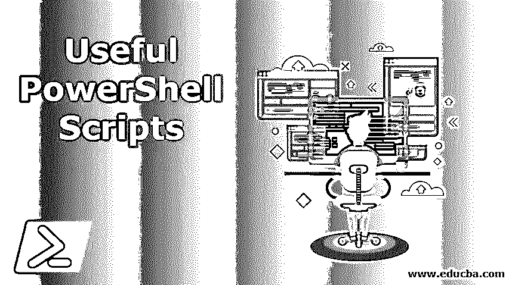
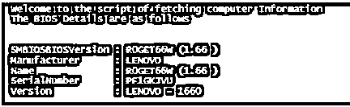
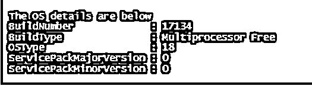
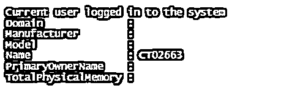
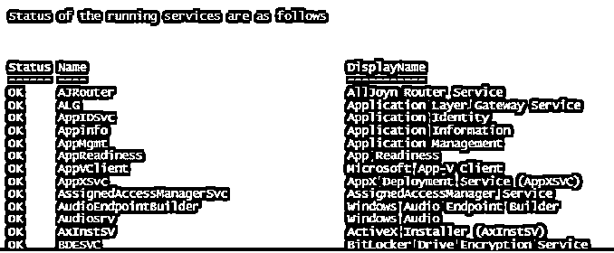
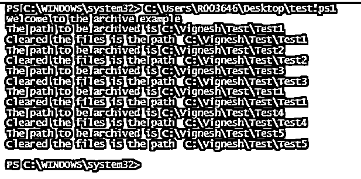

# 有用的 PowerShell 脚本

> 原文：<https://www.educba.com/useful-powershell-scripts/>

## PowerShell 脚本简介

在本文中，我们将了解有用的 PowerShell 脚本。对于任何用户或管理员来说，每天都需要执行某些任务。还有一些任务做起来更简单，不需要人工干预就可以完成。为了节省用户的时间，可以在 PowerShell 脚本的帮助下自动执行任务。这些任务可以是从某个位置下载文件、获取计算机的详细信息、删除超过某一天的文件、每小时重启一次系统。一旦脚本准备就绪，就可以手动运行它，甚至可以使用任务调度程序来运行它。

**例如:**为了释放驱动器中的空间，我们可以编写一个 PowerShell 脚本来删除超过 90 天的文件，并安排一个每天运行的任务，以便在驱动器上保持足够的空间。

<small>Hadoop、数据科学、统计学&其他</small>

### 有用的 PowerShell 脚本示例

下面我们解释如何使用 PowerShell 脚本的示例:

#### 获取系统相关信息的脚本

以下脚本用于获取与系统相关的重要基本信息，例如系统型号、可用磁盘空间、BIOS 信息、处理器配置、内存详细信息、操作系统详细信息、系统用户和所有者列表、当前用户会话以及各种运行进程和安装的各种修补程序的状态。

##### 示例#1

**代码:**

`Write-Host "Welcome to the script of fetching computer Information"
Write-host "The BIOS Details are as follows"
Get-CimInstance -ClassName Win32_BIOS`

**输出:**

##### 实施例 2

**代码:**

`Write-Host "The systems processor is"
Get-CimInstance -ClassName Win32_ComputerSystem | Select-Object -Property SystemType`

**输出:**

##### 实施例 3

**代码:**

`Write-Host "The computer Manufacture and physical memory details are as follows"
Get-CimInstance -ClassName Win32_ComputerSystem`

**输出:**

##### 实施例 4

**代码:**

`Write-Host "The installed hotfixes are"
Get-CimInstance -ClassName Win32_QuickFixEngineering`

**输出:**

##### 实施例 5

**代码:**

`Write-Host "The OS details are below"
Get-CimInstance -ClassName Win32_OperatingSystem | Select-Object -Property Build*,OSType,ServicePack*`

**输出:**

##### 实施例 6

**代码:**

`Write-Host "The following are the users and the owners"
Get-CimInstance -ClassName Win32_OperatingSystem | Select-Object -Property *user*`

**输出:**

##### 实施例 7

**代码:**

`Write-Host "The disk space details are as follows"
Get-CimInstance -ClassName Win32_LogicalDisk -Filter "DriveType=3" |Measure-Object -Property FreeSpace,Size -Sum |Select-Object -Property Property,Sum`

**输出:**

##### 实施例 8

**代码:**

`Write-Host "Current user logged in to the system"
Get-CimInstance -ClassName Win32_ComputerSystem -Property UserName`

**输出:**

##### 实施例 9

**代码:**

`Write-Host "Status of the running services are as follows"
Get-CimInstance -ClassName Win32_Service | Format-Table -Property Status,Name,DisplayName -AutoSize -Wrap`

**输出:**

### 在 PowerShell 脚本中实现的示例

下面解释了要在 PowerShell 脚本中实现的示例:

#### 示例#1:向 AD 添加用户

以下脚本将把 CSV 中的每个用户添加到广告中。CSV 将包含所有与用户相关的属性，这些属性需要脚本在 AD 中创建用户。如果出现错误，脚本将在文本文件中记录错误详细信息。成功创建后，控制台中会出现一条消息，说明该用户已在 Active Directory 中创建。第一行用于导入 csv 文档并遍历每个记录。后续行用于将记录值分配给 AD 中的用户属性。最后一行用于将用户添加到 Active Directory 组。代码包含在一个 try-catch 块中，以捕捉任何异常。如果出现任何错误，将使用 catch 语句在控制台上打印出来。

**代码:**

`try
{
Import-Csv “C:\test\test.csv” | ForEach-Object {
$Name = $_.Name + “test.com”
New-ADUser `
-DisplayName $_.”Dname” `
-Name $_.”Name” `
-GivenName $_.”GName” `
-Surname $_.”Sname” `
-SamAccountName $_.”Name” `
-UserPrincipalName $UPName `
-Office $_.”off” `
-EmailAddress $_.”EAddress” `
-Description $_.”Desc” `
-AccountPassword (ConvertTo-SecureString “vig@123” -AsPlainText -force) `
-ChangePasswordAtLogon $true `
-Enabled $true `
Add-ADGroupMember “OrgUsers” $_.”Name”;
Write-Host "User created and added in the AD group"
}
}
catch
{
$msge=$_.Exception.Message
Write-Host "Exception is" $msge
}`

**CSV 文件的样本输入:**

| **名称** | **Dname** | **GName** | **Sname** | **UPName** | **关** | **EAD address** | **Desc** |
| 测试 1 | 测试 1 | 测试 1 | 测试 1 | 测试 1 | 试验 | test@test.com | 测试 1 |
| 测试 2 | 测试 2 | 测试 2 | 测试 2 | 测试 2 | 测试 2 | test2@test.com | 测试 2 |
| 测试 3 | 测试 3 | 测试 3 | 测试 3 | 测试 3 | 测试 3 | test3@test.com | 测试 3 |
| 测试 4 | 测试 4 | 测试 4 | 测试 4 | 测试 4 | 测试 4 | test4@test.com | 测试 4 |
| 测试 5 | 测试 5 | 测试 5 | 测试 5 | 测试 5 | 测试 5 | test5@test.com | 测试 5 |

#### 示例 2:从路径中删除超过 30 天的文件

以下脚本用于删除自当前日期起 30 天或更长时间内创建的文件。csv 中提到了要检查文件的路径。首先，导入 csv 文件。然后，对于每个路径，检查并删除超过 30 天的文件。

**代码:**

`Write-Host "Welcome to the archive example"
$csv = Import-Csv "C:\Vignesh\test.csv"
foreach($row in $csv)
{
$Path=$row.Path
write-host "The path to be archived is" $row.Path
$DaysTOBeArchived = "-30"
$CurrentDate = Get-Date
$DatetoBeDeleted = $CurrentDate.AddDays($DaysTOBeArchived)
Get-ChildItem $Path -Recurse  | Where-Object { $_.CreationTime  -lt $DatetoBeDeleted } | Remove-Item
Write-Host "Cleared the files is the path "$row.path
}`

**样本输入:**

**路径**

`C:\Vignesh\Test\Test1
C:\Vignesh\Test\Test2
C:\Vignesh\Test\Test3
C:\Vignesh\Test\Test1
C:\Vignesh\Test\Test4
C:\Vignesh\Test\Test5`

**输出:**

#### 例 3:如果磁盘空间少于 5%，发送一封电子邮件

以下示例将在磁盘空间小于 5%时发送一封自动邮件。

**代码:**

`$cname="Mycomputer"
ForEach ($c in $cname)
{
$disk=Get-WmiObject win32_logicaldisk -ComputerName $c -Filter "Drivetype=3" -ErrorAction SilentlyContinue | Where-Object {($_.freespace/$_.size) -le '0.05'}
If ($disk)
{
$EmailToAdd = "test@test.com"
$EmailFromAdd = "test@test.com"
$userdet = 'testuser'
$passworddet = "testpwd"
$Subjectdet = "Disk space alert"
$Bodydet = "low space in the system"
$SMTPServerdet = "testswer"
$SMTPMessagedet = New-Object System.Net.Mail.MailMessage($EmailFromAdd,$EmailToAdd,$Subjectdet,$Bodydet)
$SMTPClientdet = New-Object Net.Mail.SmtpClient($SMTPServerdet, 587)
$ SMTPClientdet.EnableSsl = $true
$ SMTPClientdet.Credentials = New-Object System.Net.NetworkCredential($userdet, $passworddet)
$ SMTPClientdet.Send($SMTPMessagedet)
}
}`

### 通过任务计划程序运行脚本

通过创建任务，上述脚本可以每天运行，无需用户干预。该任务将在每天的指定时间运行脚本。这种方法的优点是不会有错过脚本运行的风险，并且节省了用户的时间。以下是通过任务计划程序运行 ps 脚本的步骤

*   打开任务计划程序并创建任务
*   在“trigger”选项卡中，设置该任务需要运行的时间以及作业的频率，例如是每天运行还是每小时运行，以及需要运行的时间
*   在“操作”选项卡中，指定文件位置
*   最后，单击确定。

### 结论

因此，本文涵盖了各种有用的脚本，可用于自动化所执行的任务。脚本的优点是它们减少了人力和监控需求。它还展示了如何使用任务调度程序运行脚本。脚本还可以用于在出现问题时向用户发送电子邮件或警报。要获得脚本方面的专业知识，建议编写示例程序并实践它们。

### 推荐文章

这是一个有用的 PowerShell 脚本指南。在这里，我们讨论各种有用的脚本，用适当的代码和输出以及使用任务调度器来实现的例子。您也可以浏览我们的其他相关文章，了解更多信息——

1.  [PowerShell 版本](https://www.educba.com/powershell-versions/)
2.  [PowerShell 排序对象](https://www.educba.com/powershell-sort-object/)
3.  [PowerShell 中的哈希表](https://www.educba.com/hashtable-in-powershell/)
4.  PowerShell 中的[变量](https://www.educba.com/variable-in-powershell/)
5.  [PowerShell ForEach 对象的参数](https://www.educba.com/powershell-foreach-object/)

