# PowerShell 中的字符串

> 原文：<https://www.educba.com/string-in-powershell/>

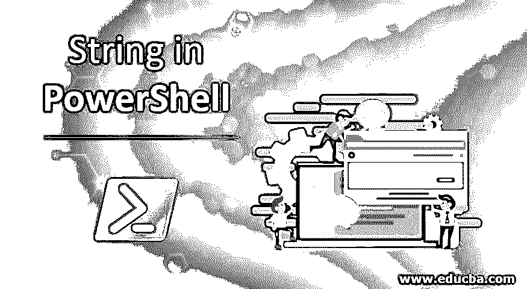

## PowerShell 中字符串的介绍

字符串被视为字符序列，是 PowerShell 中的数据类型之一。它的对象类型是 System。字符串。当我们提到字符串时，双引号或单引号中的所有内容都被认为是字符串，它们之间的唯一区别是字符串中变量的表示。在 PowerShell 中，几乎每个输出都可以转换成字符串对象。

### 如何在 PowerShell 中声明一个字符串？

在 PowerShell 中，您在双引号或单引号中提到的任何内容都被视为字符串，只是字符串中两种情况下的变量表示不同。有几种方法可以用来声明字符串。首先，你可以直接将一个字符串赋给一个变量，这个变量的数据类型就变成了一个字符串。例如，这里的$var 现在是一个字符串变量。您可以检查它的数据类型。

<small>Hadoop、数据科学、统计学&其他</small>

**代码:**

`$var = "This is a string"
$var.GetType()`

**输出:**

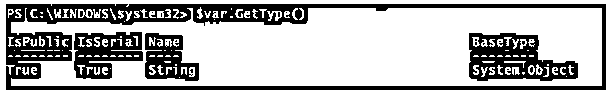

第二种声明字符串的方法是显式方法。在这里，您将变量转换为字符串。在声明参数时，below 方法通常用于函数和高级函数中。

**代码:**

`[String]$var1 = "This is a string"`

### 在 PowerShell 中使用字符串执行的操作

要检查 PowerShell 可以对字符串执行哪些操作，您需要管道化 Get-Member 命令并检查方法。

**代码:**

`$var | Get-Member`

我们将在这里逐一讨论操作。

#### 1.检查绳子的长度

您可以检查字符串长度或字符串中的字符数，您需要使用字符串的 length 函数。

**代码:**

`$var = "This is a test string"
$var.Length`

**输出:**

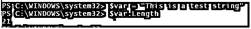

#### 2.字符串上的拆分操作

当您对字符串应用拆分操作时，它会从提到拆分字符的地方将字符串拆分成多行。以我们的环境 PS 模块路径为例，

**代码:**

`$env:PSModulePath`

**输出:**

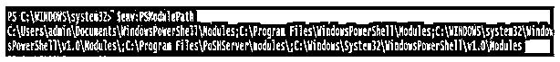

我们希望在上面的输出中分割路径。

**代码:**

`($env:PSModulePath).Split(';')`

**输出:**

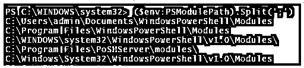

类似地，您可以使用不同的拆分字符将字符串分成所需的输出。

#### 3.字符串上的连接操作

当您在字符串上使用 Join 操作时，它实际上连接了两个字符串。

**代码:**

`"Hello" + " World"`

**输出:**

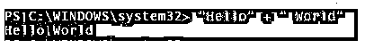

另一种方法是使用 Join 命令。

**代码:**

`$a = "Hello"
$b = "World"
$a,$b -join(' ')`

**输出:**

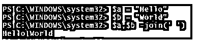

如果你想用 **'#** '字符连接两个字符串，那么只需将 **'#'** 放入连接函数中。

**代码:**

`$a = "Hello"
$b = "World"
$a,$b -join('#')`

**输出:**

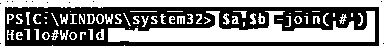

您也可以连接两个以上的字符串。

**代码:**

`$a = "Hello"
$b = "World"
$c = "Delta"
$a,$b,$c -join('#')`

**输出:**

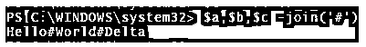

还可以用 Concat 方法连接字符串。

**代码:**

`$a = "Hello"
$b = "World"
$c = "Delta"
[System.String]::Concat($a,$b,$c)`

**输出:**

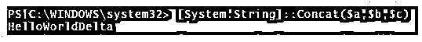

#### 4.字符串上的子字符串操作

Substring 命令在字符串中用来提取字符串的一部分。它完全适用于索引。在字符串中，索引从 0 开始。

**代码:**

`$var = "This is a string"
$var.Substring(0,5)`

**输出:**

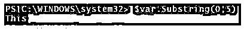

要提取整个字符串，

**代码:**

`$var = "This is a string"
$var.Substring(0,$var.Length)`

**输出:**

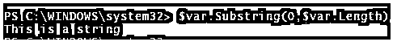

#### 5.包含对字符串的操作

当应用于字符串时，它检查字符串中是否存在特定的单词。该函数区分大小写。输出将采用布尔(真/假)格式。

**代码:**

`$var = "This is a string"
$var.Contains("this")
$var.Contains("This")`

输出将分别为假和真。由于此方法区分大小写，当函数匹配“this”时，它无法识别字符串中的部分。

**输出:**

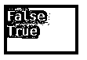

您还可以验证字符串中的单词部分。

**代码:**

`$var = "This is a string"
$var.Contains("ring")`

输出将为真。

#### 6.字符串的大写和小写操作

您可以将整个字符串转换成大写或小写。

**代码:**

`$var = "This is a string"
$var.ToUpper()
$var.ToLower()`

**输出:**

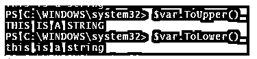

#### 7.字符串上的修剪操作

PowerShell 中的 Trim 操作用于修剪或删除字符串开头和结尾的空格或特定字符。举个例子，

当你在字符串上只使用 Trim()函数时，它将删除字符串开头和结尾的空格。当您在函数中使用任何字符时，此操作区分大小写。

**代码:**

`(" Hello World ").Trim()`

**输出:**

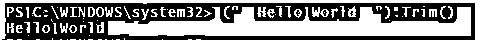

要从两端修剪特定字符，

**代码:**

`("Hello World").Trim('H') #Removes the 'H' from the beginning
("Hello World").Trim('Hd') #Removes the 'H' from the beginning and 'd' from the end.
("Hello World").Trim('e') #Removes nothing as 'e' is not beginning or the end of the string`

**输出:**

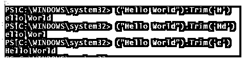

还有 TrimStart()和 TrimEnd()函数，它们分别从字符串的开头和结尾删除空格或特定字符。

TrimStart()示例，

**代码:**

`("Hi, this ends with H").TrimStart('H')`

**输出:**

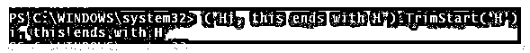

TrimEnd()示例，

**代码:**

`("Sir, this ends with S").TrimEnd('S')`

**输出:**

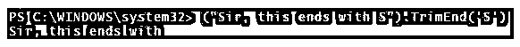

当您同时提到多个字符时，操作会删除它们。

**代码:**

`("Hello World").TrimStart("Hel")
("Hello World").TrimEnd("ld")`

**输出:**

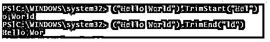

#### 8.字符串上的替换操作

要替换特定的字符或字符集，可以在字符串命令中使用替换操作。此操作不区分大小写。以下命令将用空字符替换“N”。

**代码:**

`("New PowerShell version is 7.0") -Replace ("N","")`

**输出:**

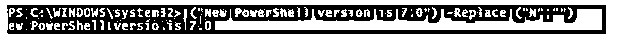

您可以用特定字符替换空格。

**代码:**

`("New PowerShell version is 7.0") -Replace (' ','#')`

**输出:**

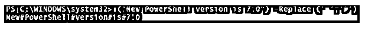

为了替换这个单词，

**代码:**

`("New PowerShell version is 7.0") -Replace ('PowerShell','Python')`

**输出:**

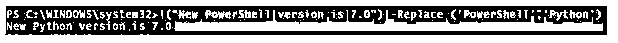

#### 9.字符串上的索引操作

PowerShell 中的索引操作，用于查找字符串中特定字符的位置。索引从 0 开始。IndexOf()操作查找该字符的第一个匹配项。

**代码:**

`("New PowerShell version is 7.0").IndexOf('P')`

**输出:**

LastIndexOf()查找字符的最后一个匹配项。

**代码:**

`("New PowerShell version is 7.0").LastIndexOf('n')`

**输出:**

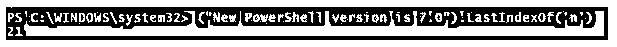

#### 10.将对象转换为字符串

要将任何对象转换成字符串数据类型，需要使用 ToString()命令。在下面的例子中，我们将把一个整数值转换成一个字符串。

**代码:**

`$intvar = 12345
$intvar.GetType()`

如果您检查$intvar **，**的数据类型，它将是整数类型。

**输出:**

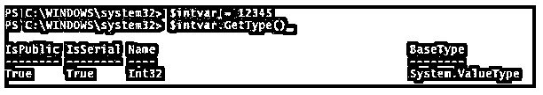

要将上述变量转换成字符串，

**代码:**

`$intvar = 12345
$intvar = $intvar.ToString()
$intvar.GetType()`

**输出:**

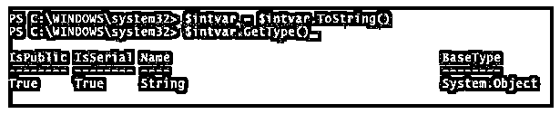

### 结论

字符串操作经常在 PowerShell 脚本中使用，因为很容易对行数执行操作并提取数据。在 PowerShell 中，大多数输出都是字符串格式，或者可以转换成字符串。还有另一个管道 cmdlet Select-String，当通过 Get-Content 或 XML 提取大量数据时，它可以有效地处理字符串操作。

### 推荐文章

这是 PowerShell 中的 String 指南。这里我们讨论一下简介，操作以及如何在 PowerShell 中声明一个字符串。您也可以看看以下文章，了解更多信息–

1.  [PowerShell 导入模块](https://www.educba.com/powershell-import-module/)
2.  [PowerShell 字符串函数](https://www.educba.com/powershell-string-functions/)
3.  [PowerShell 调用命令](https://www.educba.com/powershell-invoke-command/)
4.  [Python 导入模块指南](https://www.educba.com/python-import-module/)
5.  [PowerShell 转换为字符串|示例](https://www.educba.com/powershell-convert-to-string/)
6.  [PowerShell 字符串替换指南](https://www.educba.com/powershell-string-replace/)

