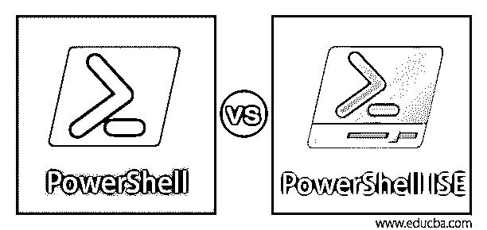
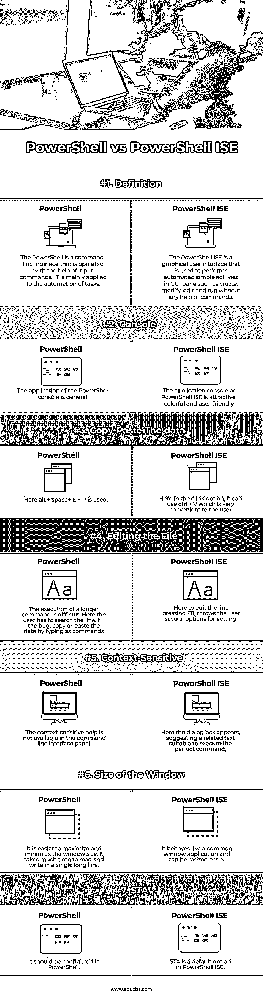

# PowerShell vs PowerShell ISE

> 原文：<https://www.educba.com/powershell-vs-powershell-ise/>

## PowerShell 与 PowerShell ISE 的区别

通常，外壳被定义为提供对操作系统上各种特性的访问的用户界面。它也可以基于命令行界面或图形用户界面。PowerShell 是为配置管理和任务自动化而开发的。它在一个共享平台上工作，并且是开源的。PowerShell ISE 扩展为 PowerShell 集成脚本环境，这是一个图形用户界面，使用户能够直接在 GUI 上执行命令、创建和修改脚本，而不是作为命令键入。

### PowerShell 与 PowerShell ISE 之间的直接比较(信息图表)

以下是 PowerShell 与 PowerShell ISE 之间的主要比较:

<small>Hadoop、数据科学、统计学&其他</small>

### PowerShell 与 PowerShell ISE 的主要区别

PowerShell 和 PowerShell ISE 的配置和应用程序可以有很大的不同。但是它的重要特征将在下面讨论。让我们讨论一些主要的关键差异:

#### 1.PowerShell 和 PowerShell ISE 的用户界面

PowerShell 可以安装在 macOS、Linux 上，尤其是 Windows 上。在初始阶段，它是基于。NET 框架以及脚本语言和命令行界面。Windows 开发了一个特别适合其编程语言的命令行界面。但作为对 CLI 的升级，Windows 提供了一个强大的工具，即 PowerShell ISE，它可以执行管理员的所有智能工作。它可以执行高级功能，例如运行重复的命令序列来计算服务器的配置。它支持脚本的开发，脚本是命令的集合，用户可以将输入作为执行的复杂逻辑。

#### 2.特殊特点

还配置了一个独立的命令面板来执行交互式 PowerShell ISE 脚本。管理员可以改变任何颜色，布局，字体和定制文本的应用程序设置。它还可以使用列号和行号、键盘快捷键、上下文相关的特性来帮助调整编辑环境。而在 PowerShell 中没有这样的高级功能。它只有默认的配置设置。

#### 3.多任务处理

PowerShell 可以通过执行简单的命令(如 start-jobs)来调度后台作业和 PowerShell 运行空间命令，从而支持多线程。PowerShell ISE 支持八个并行执行。它支持复制和粘贴多个代码行，使脚本的编辑更加容易。它包括一个广泛的调试器，通过使用整个脚本或部分脚本进行命令测试。它还可以检查变量和添加断点，以查看脚本在特定点的行为。Snippet 存储较短的代码段以供重复使用，常用列表提供了对最近文件的快速访问。

#### 4.更新版本

PowerShell 的初始版本在 2006 年 11 月针对 Windows 2003、Windows XP 和 Windows Vista 进行了更新。现在最新版本是 2016 年 windows 10 周年更新时的 Windows PowerShell 5.1。它也适用于 Windows sever 2008 R2 版、Windows Server 2012 R2 版、Windows Server 2012 专业版和编辑版 Windows 8.1 以及 Windows 7 Service Pack 1。PowerShell ISE 的最新版本与 Windows 2.0 版本一起出现，后者具有智能感知功能，可自动完成 cmdlets、文件、值、参数和其他变量。自动保存选项存储每分钟的脚本，以避免在任何崩溃的情况下数据丢失。

#### 5.首选武器

在 PowerShell 中，为了有效管理网络中更高维度的服务器，必须实施新的安全解决方案，该解决方案依赖于必须在服务器上执行的特定作业或应用程序。用户可以通过登录到每个服务器来检查作业的状态，但是这是浪费时间并且需要时间来完成任务。但是 PowerShell ISE 的应用程序需要几分钟的时间来执行，并在一个脚本的帮助下完成整个操作，该脚本保存了关于服务器上服务的所有数据。它被指定并作为文本文件转储。因此，这是一个耗时的过程。因此，在存储脚本的帮助下，它简化了各种繁琐的过程。

### PowerShell 与 PowerShell ISE 对比表

让我们来看看 PowerShell 与 PowerShell ISE 之间的主要比较:

| **比较的基础** | **PowerShell** | **PowerShell ISE** |
| **定义** | PowerShell 是一个命令行界面，在输入命令的帮助下操作。它主要应用于任务的自动化。 | PowerShell ISE 是一个图形用户界面，用于在 GUI 窗格中执行自动化的简单操作，如创建、修改、编辑和运行，无需任何命令帮助。 |
| **控制台** | PowerShell 控制台的应用程序是通用的 | 应用程序控制台或 PowerShell ISE 很吸引人，色彩丰富，用户友好 |
| **复制粘贴数据** | 这里使用 alt + space+ E + P | 在 clipX 选项中，可以使用 ctrl + V，这对用户来说非常方便 |
| **编辑文件** | 执行更长的命令是困难的。在这里，用户必须搜索行，修复错误，通过键入命令来复制或粘贴数据 | 这里要编辑的行按下 F8，给用户抛出几个编辑选项。 |
| **上下文相关** | 命令行界面面板中没有上下文相关的帮助。 | 这里出现对话框，建议一个适合执行完美命令的相关文本。 |
| **窗口大小** | 最大化和最小化窗口大小更容易。在一长行中读和写要花很多时间。 | 它的行为就像一个普通的窗口应用程序，可以很容易地调整大小 |
| **STA** | 应该在 PowerShell 中配置。 | STA 是 PowerShell ISE 中的默认选项。 |

### 结论

PowerShell 是 Windows 管理框架的一部分，使管理员能够管理组织内多个版本的 Windows 服务器。它可以安装一组功能，如 PowerShell 所需状态配置、windows 远程管理、windows PowerShell web 服务、服务器管理器 CIM 提供程序、软件清单登录、windows 管理规范。

### 推荐文章

这是 PowerShell vs PowerShell ISE 的指南。这里我们讨论信息图和比较表的主要区别。您也可以浏览我们的其他相关文章，了解更多信息——

1.  [PowerShell vs Python](https://www.educba.com/powershell-vs-python/)
2.  [PowerShell vs CMD](https://www.educba.com/powershell-vs-cmd/)
3.  [PowerShell vs 命令提示符](https://www.educba.com/powershell-vs-command-prompt/)
4.  [PowerShell vs Bash](https://www.educba.com/powershell-vs-bash/)

