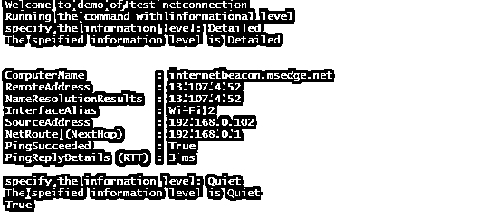
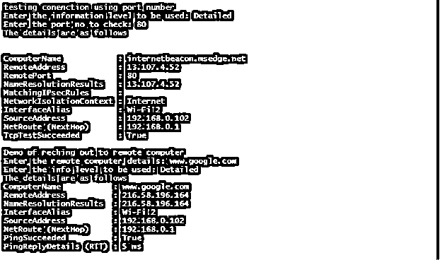
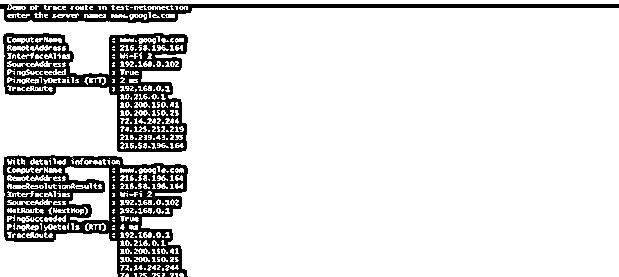
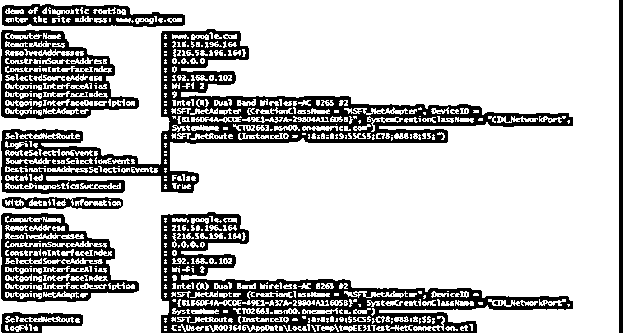

# PowerShell 测试-网络连接

> 原文：<https://www.educba.com/powershell-test-netconnection/>

## PowerShell 测试简介-网络连接

测试网连接用于与连接相关的各种信息，例如诊断和连接。在 PowerShell v4.0 之前，有不同的工具用于对与网络相关的不同问题进行故障排除。为了避免这种情况，引入了此 cmdlet 作为解决各种连接相关问题的单一来源。此 cmdlet 支持的各种诊断包括路由跟踪和选择诊断、ping 和 TCP。根据提供的输入，输出范围包括各种信息，如 DNS 的查找结果、配置的各种 IP 地址和安全规则、源和目标 IP 地址选择结果以及与连接相关的信息。本文将详细介绍 test-net 连接、它的参数以及它的用法。

**语法:**

<small>Hadoop、数据科学、统计学&其他</small>

`NAME
Test-NetConnection`

**语法:**

`Test-NetConnection [[-ComputerName] <string>] [-TraceRoute] [-Hops <int>] [-InformationLevel {Quiet | Detailed}] [<CommonParameters>] Test-NetConnection [[-ComputerName] <string>] [-CommonTCPPort] {HTTP | RDP | SMB | WINRM} [-InformationLevel {Quiet | Detailed}] [<CommonParameters>] Test-NetConnection [[-ComputerName] <string>] -Port <int> [-InformationLevel {Quiet | Detailed}]  [<CommonParameters>] Test-NetConnection [[-ComputerName] <string>] -DiagnoseRouting [-ConstrainSourceAddress <string>] [-ConstrainInterface <uint32>] [-InformationLevel {Quiet | Detailed}]  [<CommonParameters>] ALIASES
TNC`

**例如:**

**输入:**

`Test-NetConnection`

**输出:**

### PowerShell 测试参数-网络连接

*   **常用支持:**

这表示要检查的 tcp 端口号。此参数的数据类型是字符串。这不是一个强制参数。此 cmdlet 中参数的位置是 1。它不接受 pipline 和通配符作为输入。此参数唯一可接受的值是 SMB、HTTP、WINRM 和 HTTP。

*   **计算机名:**

这指定了目标系统的 DNS 或 IP 地址。此参数的数据类型是字符串。也可以使用 RemoteAddress，cn 引用它。此参数在 cmdlet 中的位置为零。默认值为无。它接受管道输入，而不允许使用通配符。

*   **-约束接口:**

这表示用于诊断路由的机制。该参数的数据类型是 Uint32。默认值为无。它不接受管道字符和通配符作为输入。

*   **-约束源地址:**

这表示用于诊断源地址的约束。此参数的数据类型是字符串。默认值为无。它不接受管道字符和通配符作为输入。

*   **-诊断路由:**

这表示诊断从源运行到目标。此参数的数据类型是字符串。默认值为无。它不接受管道字符和通配符作为输入。

*   **-跳数:**

这表示在遍历跟踪路由 cmdlet 的过程中应该执行的跳转次数。该参数的数据类型为 int32。默认值为无。它不接受管道字符和通配符作为输入。

*   **-信息级别:**

这表示应该显示的信息类型。此参数的数据类型是字符串。默认值为无。它不接受管道字符和通配符作为输入。以下是可以提供给该参数的值；详细且安静。如果值为 quiet，则只返回基本信息。

*   **-端口:**

这表示要检查连接的远程计算机的端口号。也可以使用 Remoteport 引用它。该参数的数据类型为 int32。默认值为无。它接受管道输入，但不允许使用通配符。

*   **-跟踪路由:**

这表示在目标计算机上运行的连接测试。此参数的数据类型是 switch。默认值为 none，它不接受管道字符和通配符作为输入。

在 Test-Netconnection 之前，之前的版本是 Test-Connection。它具有 buffersize 和 delay 等参数，可用于定义连续 pings 之间的秒数。

### 例子

让我们讨论 PowerShell Test-NetConnection 的例子。

#### 例子#1:获取详细和安静的信息

**输入:**

`Write-Host "Welcome to demo of test-netconnection" -ForegroundColor Green
Write-Host "Running the command with informational level"
$infolevel=Read-Host "specify the information level"
Write-Host "The speified information level is" $infolevel -ForegroundColor Green
Test-NetConnection -InformationLevel $infolevel
$infolevel=Read-Host "specify the information level"
Write-Host "The speified information level is" $infolevel -ForegroundColor Green
Test-NetConnection -InformationLevel $infolevel`

**输出:**

安静信息级别仅返回二进制值。如果连接成功，则返回 true，如果连接不存在，则返回 false。

#### 实施例 2

**使用端口号和 using 远程服务器来检查远程连接**

**输入:**

`Write-Host "testing conenction using port number" -ForegroundColor Green
$infolevel= Read-Host "Enter the information level to be used"
$portno= Read-Host "Enter the port no to check"
Write-Host "The details are as follows" -ForegroundColor Green
Test-NetConnection -Port $portno -InformationLevel $infolevel
Write-Host "Demo of reching out to remote computer"
$remotecmp= Read-Host "Enter the remote computer details"
$infolevel1= Read-Host "Enter the info level to be used"
Write-Host "The details are as follows" -ForegroundColor Green
Test-NetConnection -ComputerName $remotecmp -InformationLevel $infolevel1`

**输出:**

#### 实施例 3

**输入:**

`Write-Host "Demo to see if a port is open" -ForegroundColor Green
$rs= Read-Host "enter the remote server"
Test-NetConnection -ComputerName $rs -CommonTCPPort HTTP
$portno=Read-Host "enter the port no"
$ipadd= Read-Host "enter the ip address"
$con = New-Object System.Net.Sockets.TcpClient($ipadd, $portno)
if ($connection.Connected) {
Write-Host "connection is succeeded" -ForegroundColor Green
} else {
Write-Host "connection is failed" -ForegroundColor Red
}`

**输出:**

#### 实施例 4

**输入:**

`Write-Host "Demo of trace route in test-netonnection"
$servername= Read-Host "enter the server name"
Test-NetConnection -ComputerName $servername -TraceRoute
Write-Host "With detailed information" -ForegroundColor Green
Test-NetConnection -ComputerName $servername -TraceRoute -InformationLevel Detailed
Write-Host "demo of diagnostic routing"
$sname= Read-Host "enter the site address"
Test-NetConnection -ComputerName $sname -DiagnoseRouting
Write-Host "With detailed information" -ForegroundColor Green
Test-NetConnection -ComputerName $sname -DiagnoseRouting -InformationLevel Detailed`

**输出:**

### 结论

因此，文章详细解释了 Test-NetcOnnection cmdlet 的详细内容。它涵盖了各种场景，在这些场景中可以使用适当的示例。它还解释了与 cmdlet 相关联的各种参数。要了解更多细节，建议编写并执行示例脚本。

### 推荐文章

这是 PowerShell 测试指南-网络连接。在这里，我们讨论的介绍，语法，代码实现的例子。您也可以看看以下文章，了解更多信息–

1.  [PowerShell 等待](https://www.educba.com/powershell-wait-2/)
2.  [PowerShell 更改目录](https://www.educba.com/powershell-change-directory/)
3.  [PowerShell 在哪里](https://www.educba.com/powershell-where/)
4.  [PowerShell 卸载模块](https://www.educba.com/powershell-uninstall-module/)

