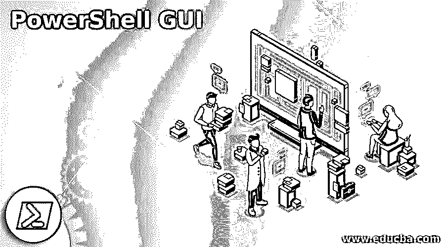
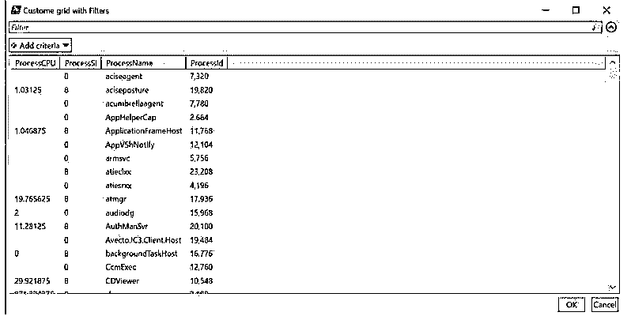
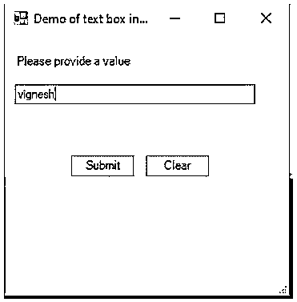
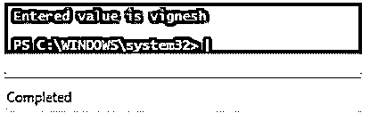

# PowerShell GUI

> 原文：<https://www.educba.com/powershell-gui/>

## PowerShell GUI 简介

尽管 PowerShell 是一种功能强大的脚本语言，但它仍然无法在开发人员/用户中使用，因为它的 gui 不是交互式的。换句话说，它缺乏其他语言提供的与用户交互的完美 UI。只有熟悉 PowerShell 环境的人才能进行交互，而普通人则不能。这是 PowerShell 用于执行幕后操作的主要原因。在这里，我们将看到如何像其他应用程序一样在 PowerShell 中构建用户交互应用程序。

### 构建 GUI 所涉及的步骤

下面给出了构建交互式 PowerShell 应用程序所涉及的以下步骤:

<small>Hadoop、数据科学、统计学&其他</small>

*   编写将由脚本执行的函数。
*   构建表单。
*   整合脚本和表单。

#### 1.编写将由脚本执行的函数

首要的事情是编写实现功能所需的函数或函数集。功能可以是任何东西。该脚本将处理所有这些 cmdlets、函数调用或 api 调用。这仍然是应用程序的核心。所有的业务逻辑、验证和决策都在这一步完成。对脚本进行了端到端的测试，确保功能部分正常工作。

#### 2.构建表单

这部分是构建表单的阶段。该表单通常包含文本框，按钮，标签，下拉框，复选框等。表单是以交互的方式构建的，并且在表单中捕获必要的用户输入。该表单的行为类似于任何其他表单，并充当用户和脚本之间的接口。

#### 3.整合脚本和表单

这是形式和功能相结合的部分；一般来说，这些函数是在点击按钮时调用的。表单上的每个按钮都与各自的功能相关联，这些功能将执行一些业务逻辑。这一点至关重要，如果整合不当，将无法实现预期的结果。

### PowerShell GUI 示例

以下是 PowerShell GUI 的示例:

#### 示例#1

**代码:**

`Write-Host "Demo of dispalying out grid in a GUI with search" -ForegroundColor Green
$pro_arry = @()
$processes = Get-Process | Select Name, Id, CPU, SI
Foreach ($process in $processes){
$pro_arry += New-Object PSObject -Property @{
Process_Name = $process.Name
Process_CPU = $process.CPU
Process_Id = $process.Id
Process_SI = $process.SI
}
}
$op = $pro_arry | Out-GridView -Title "Custome grid with Filters" -OutputMode Multiple`

**输出:**

在上面的示例中，构建了一个 GUI，使用 Out-Gridview cmdlet 将当前运行的流程导出到带有过滤器的表单中。可以看出，结果可以根据进程 CPU、进程 SI、进程名称或进程 Id 进行排序。还有一个用于添加过滤标准的过滤器。还有一个搜索框用于搜索输出。这为用户提供了更好的 GUI，用户可以直接在屏幕上过滤或做任何他想做的事情，而不是将输出发送到文件，然后手动搜索或过滤。这里只有一个 cmdlet，因此没有创建任何函数。为四列创建了一个简单的数组，并为它们分配了相应的值。

#### 实施例 2

**代码:**

`[void] [System.Reflection.Assembly]::LoadWithPartialName("System.Drawing")
[void] [System.Reflection.Assembly]::LoadWithPartialName("System.Windows.Forms")
$inputform = New-Object System.Windows.Forms.Form
$inputform.Text = "Demo of text box input"
$inputform.Size = New-Object System.Drawing.Size(300,300)
$inputform.StartPosition = "CenterScreen"
$OKB = New-Object System.Windows.Forms.Button
$OKB.Location = New-Object System.Drawing.Size(65,120)
$OKB.Size = New-Object System.Drawing.Size(65,23)
$OKB.Text = "Submit"
$OKB.Add_Click({Write-Host "Entered value is"$OTB.Text -ForegroundColor Green;$inputform.Close()})
$inputform.Controls.Add($OKB)
$CAB = New-Object System.Windows.Forms.Button
$CAB.Location = New-Object System.Drawing.Size(140,120)
$CAB.Size = New-Object System.Drawing.Size(65,23)
$CAB.Text = "Clear"
$CAB.Add_Click({Write-Host "No input from user" -ForegroundColor Red;$inputform.Close()})
$inputform.Controls.Add($CAB)
$Lbl = New-Object System.Windows.Forms.Label
$Lbl.Location = New-Object System.Drawing.Size(10,20)
$Lbl.Size = New-Object System.Drawing.Size(260,20)
$Lbl.Text = "Please provide a value
$inputform.Controls.Add($Lbl)
$OTB = New-Object System. .Forms.TextBox
$OTB.Location = New-Object System.Drawing.Size(10,50)
$OTB.Size = New-Object System.Drawing.Size(240,20)
$inputform.Controls.Add($OTB)
$inputform.Topmost = $True
$inputform.Add_Shown({$inputform.Activate()})
[void] $inputform.ShowDialog()`

**输出:**

在上面的例子中，创建了一个简单的文本框并提供给用户。用户在文本框中输入的文本被捕获，然后在输出控制台中打印出来。如果选择了清除按钮，则在控制台中，“不会显示用户的任何输入”。首先，使用 form 对象初始化一个表单。然后设置表单的属性，如表单的大小、表单的标题及其尺寸，并将其添加到表单中。然后创建 submit 和 clear 按钮，指定它们的属性，如显示位置、按钮大小、按钮上显示的文本以及单击按钮时需要执行的操作，并将其添加到表单中。

文本框中输入的值将显示在控制台上，以便单击提交按钮，然后关闭表单。控制台上将显示一条消息，提示单击清除按钮，然后关闭表单。然后初始化一个标签，定义其属性，如文本、位置和大小，并将其添加到表单中。最后，定义一个文本框及其属性，如文本、大小和位置，并将其添加到表单中。需要注意的是，表单是父对象，它包含所有其他控件，如标签、文本框和按钮。

### 结论

因此，本文详细介绍了如何在 PowerShell 中创建图形用户界面。它用一个例子解释了如何创建一个带有标签、文本框和按钮的表单。它还展示了一个示例，展示了如何创建一个自定义的过滤窗口来进行搜索和排序。类似地，复杂的表单可以用其他可用的项目来设计，比如单选按钮、复选框、列表框、多选列表框和日期选择器。建议使用每个可用项目来探索和创建表单，以便查看更多细节。

### 推荐文章

这是 PowerShell GUI 的指南。在这里，我们分别讨论介绍、构建 GUI 的步骤和示例。您也可以看看以下文章，了解更多信息–

1.  [PowerShell 睡眠](https://www.educba.com/powershell-sleep/)
2.  [PowerShell 子串](https://www.educba.com/powershell-substring/)
3.  [PowerShell 不像](https://www.educba.com/powershell-not-like/)
4.  [否则如果在 PowerShell 中](https://www.educba.com/else-if-in-powershell/)

