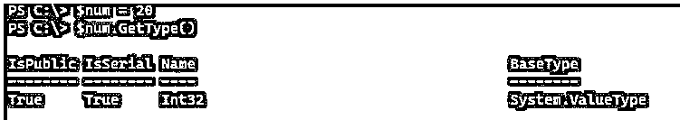
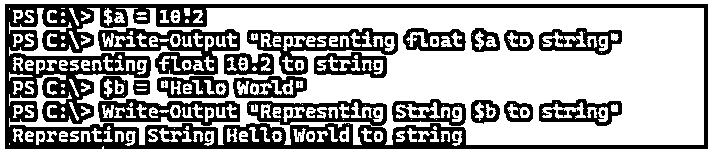
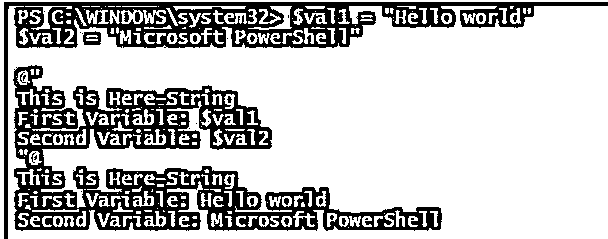
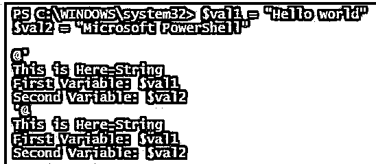
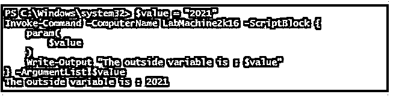
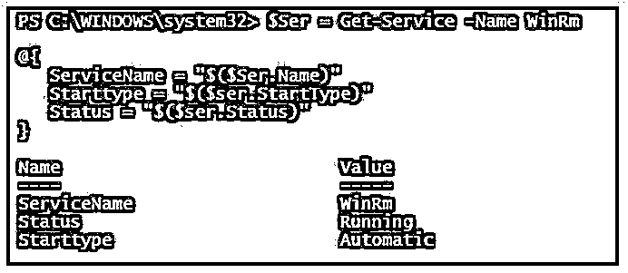
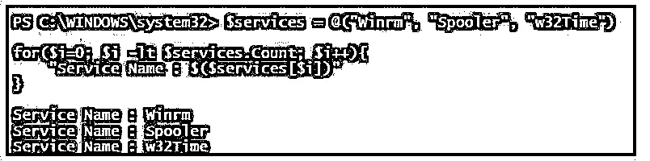

# 字符串中的 PowerShell 变量

> 原文：<https://www.educba.com/powershell-variable-in-string/>

## 字符串中的 PowerShell 变量介绍

PowerShell 中的变量是一种在其中存储值的方法，而在字符串中使用这些变量是一种表示这些变量的方法，方法是用双引号将其展开，并以不同的方式表示变量，如字符串格式或直接 PowerShell 变量，并在存储 cmdlet 值时对字符串中的变量执行操作，以及像字符串连接这样的正常操作。

<small>Hadoop、数据科学、统计学&其他</small>

### 字符串中 PowerShell 变量的语法

字符串中的变量没有特定的方法，但是当字符串被声明的时候，我们有办法扩展里面的变量。

例如，在外部声明字符串变量，并在双引号、单引号、here-string、PowerShell 字符串数组中使用它们，或者在 Invoke-Command 中表示它们。

**描述:**

PowerShell 通过使用$符号和变量名来声明变量。

例如，$Services。当我们声明变量的任何类型(Integer、double、string、DateTime)并且在 string 变量中使用它们时，它会自动将该变量转换为 string。

**代码:**

`$num = 20
$num.GetType()`

这里，我们声明了$num 变量，它的值是 20，数据类型是一个整数，如下面的输出所示。

**输出:**

当我们在字符串中使用这个变量时，让我们看看它会产生什么输出。

**代码:**

`Write-Output "Representing $num to string"`

**输出:**

虽然数字是 20，但它是在一个字符串中表示的，但是它的数据类型被保留，除非它被显式地转换为字符串。类似地，对于其他数据类型，字符串可以将任何变量转换为字符串。

**代码:**

`$a = 10.2
Write-Output "Representing float $a to string"
$b = "Hello World"
Write-Output "Representing String $b to string"`

**输出:**

PowerShell 中的单引号和双引号是相同的，但是扩展变量会产生巨大的差异，因为单引号字符串不能扩展变量。

**代码:**

`"Expanding Number: $num variable with the double-quote"`

**输出:**

**代码:**

`'Expanding Number: $num variable with the single-quote'`

**输出:**

在字符串中使用变量还有很多其他的方法。

### 字符串中 PowerShell 变量的示例

以下是字符串形式的 PowerShell 变量的示例:

#### 示例# 1–显示字符串格式的变量。

当字符串中有要显示的变量时，我们可以使用字符串格式化方法-f 和“{ 0 }”来显示它们。

在这个例子中我们有两个变量，以及我们如何显示它们。

**代码:**

`$a = "Hello world"
$b = "Microsoft Azure"
Write-Output "First Variable: $a, Second Variable: $b"
"Without Write-Output, First Variable: $a, Second Variable: $b"`

**输出:**

使用格式化方法，我们可以显示如下所示的变量。

**代码:**

`"Formatting method: First Variable: {0}, Second Variable: {1}" -f $a, $b`

**输出:**

#### 例 2——在 Here-String 中使用变量。

当我们扩展 Here-String @" "@中的变量时，单引号或双引号的使用很重要。当我们用单引号的时候，它不能得到变量的值，但是用双引号，这是可能的。

**代码:**

`$val1 = "Hello world"
$val2 = "Microsoft PowerShell"
@"
This is Here-String
First Variable: $val1
Second Variable: $val2
"@`

**输出:**

带单引号。

**代码:**

`@'
This is Here-String
First Variable: $val1
Second Variable: $val2
'@`

**输出:**

#### 示例 3–在字符串中使用带有变量的 cmdlet 输出。

我们可以在 PowerShell 字符串中使用变量的输出，还可以扩展它们的属性。

**代码:**

`$ser = Get-Service -Name WinRm
$ser`

**输出:**

当我们扩展服务名时。

**代码:**

`Write-Output "Service Name is $ser.Name"`

**输出:**

我们可以获得服务的输出，但是如果您注意到，它是服务名称的类型，而不是实际的服务名称，所以如果您想要正确的输出，我们需要在使用服务变量之前使用$变量。

**代码:**

`Write-Output "Service Name is $($ser.Name)"`

**输出:**

或者您可以使用如下所示的字符串格式化方法。

**代码:**

`"Service name is : {0}" -f $ser.name`

**输出:**

让我们举另一个在 here-string 中扩展 cmdlet 输出变量的例子。

**代码:**

`@"
Today's date is $(Get-Date)
Today's Day is $((Get-Date).DayOfWeek)
Today's Day of the year is $((Get-Date).DayOfYear)
"@`

**输出:**

#### 示例 4–在 Invoke-Command 字符串中使用变量。

使用 Invoke-Command，当我们在字符串中使用变量并获取 Invoke-Command 范围之外的值时，我们无法获取它的值。

**代码:**

`$value = "2021"
Invoke-Command -ComputerName LabMachine2k16 -ScriptBlock {
Write-Output "The outside variable is: $value"
}`

**输出:**

这不是字符串或变量的问题，而是变量超出了范围。所以对于这个方法，我们需要使用-ArgumentList 参数来传递它。

**代码:**

`$value = "2021"
Invoke-Command -ComputerName LabMachine2k16 -ScriptBlock {
param(
$value
)
Write-Output "The outside variable is : $value"
} -ArgumentList $value`

**输出:**

#### 例 5——在哈希表中使用字符串中的变量。

我们也可以在哈希表中使用字符串中的变量。在下面的例子中，我们可以直接在值字段中使用变量，但只是为了说明变量的扩展支持哈希表中支持的字符串。

**代码:**

`$Ser = Get-Service -Name WinRm
@{
ServiceName = "$($Ser.Name)"
Starttype = "$($ser.StartType)"
Status = "$($ser.Status)"
}`

**输出:**

#### 示例 6–表示 PowerShell 字符串中的数组。

我们可以使用索引来获得使用字符串的数组的输出。

**代码:**

`$services = @("Winrm", "Spooler", "w32Time")
for($i=0; $i -lt $services.Count; $i++){
"Service Name : $($services[$i])"
}`

**输出:**

我们也可以使用 foreach 方法。

### 结论

当我们希望通过扩展字符串内的 cmdlet 变量而不是使用 cmdlet 扩展的附加变量来最大限度地减少工作量时，PowerShell 字符串中的变量在将输出存储到文件时非常有用，这使得它们易于显示和格式化字符串内的值。

### 推荐文章

这是一个关于 PowerShell 字符串变量的指南。在这里，我们讨论了 PowerShell 变量 String 的介绍以及一些例子。您也可以看看以下文章，了解更多信息–

1.  [PowerShell 睡眠](https://www.educba.com/powershell-sleep/)
2.  [PowerShell 子串](https://www.educba.com/powershell-substring/)
3.  [PowerShell 不像](https://www.educba.com/powershell-not-like/)
4.  [否则如果在 PowerShell 中](https://www.educba.com/else-if-in-powershell/)

