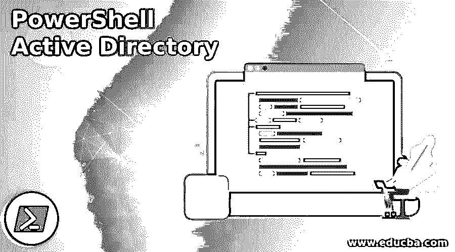
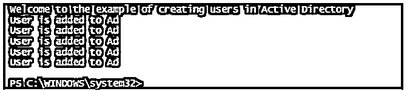
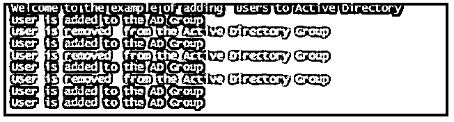
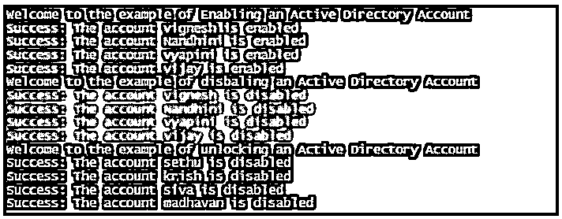
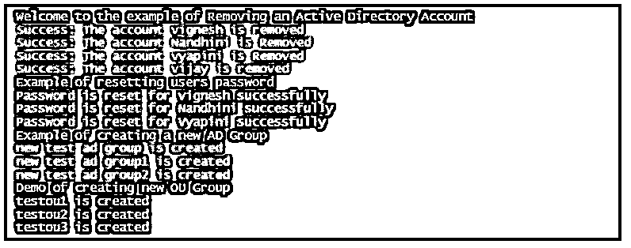

# PowerShell 活动目录

> 原文：<https://www.educba.com/powershell-active-directory/>

## PowerShell Active Directory 简介

管理 Active Directory 是 windows administrator 不可或缺的一部分。管理员无法手动向 AD 添加或删除用户。这种通用操作需要自动化，而这正是 PowerShell 所提供的。它有一个单独的模块，其中有 cmdlets，让管理员执行这些活动。本文将展示如何使用 PowerShell 来处理 Active Directory 以及 PowerShell 的 Active Directory 模块中一些流行的 cmdlets。

### 正在安装 Active Directory 模块

在计算机中导入或安装 active directory 模块以访问 cmdlets 是很重要的。这可以通过根据系统的操作系统下载相应的 RSAT 软件包来完成。[从 Windows 10](https://www.educba.com/what-is-windows-10/) 开始，RSAT 是需求权限的一部分，可以通过可选功能激活。

<small>Hadoop、数据科学、统计学&其他</small>

完成后，可以按如下方式导入模块:

**导入模块 ActiveDirectory**

查看模块中可用的 cmdlets 列表。

**获取命令模块 ActiveDirectory**

一些最常用的 cmdlets 如下:

| **Cmdlet** | **使用** | **例子** |
| New-ADUser | 这是为了在广告中创建新用户。 | new-ADUser-Name " Vignesh "-other attributes @ { ' title ' = " engineer "；mail'="vignesh@gmail.com"}。 |
| 新广告组 | 此 cmdlet 用于创建 Active Directory 组。 | New-ADGroup -Name“测试组”-Sam account Name test admin-group category Security-group scope Global-display Name“o365 admin”-Path“CN = Users，DC=admin，DC = Com”-描述“这是一个测试组”。 |
| 新组织单位 | 此 cmdlet 用于创建新的组织单位。 | new-ADOrganizationalUnit-Name " test accounts "-Path " DC = test，DC=COM "。 |
| Add-ADGroupMember | 向 Active Directory 组添加用户。 | add-adgroup member-Identity testad group-Members Vignesh，arun，vyapini。 |
| 移除-ADGroupMember | 从 active directory 组中删除用户。 | remove-adgroup member-Identity testad group-Members Vignesh、nandhini、vyapini。 |
| 添加-计算机 | 此 cmdlet 用于将计算机加入特定的域。 | add-Computer-domain name testdomain-Restart。 |
| 启用-ADAccount | 此 cmdlet 用于在 active directory 中启用用户或服务帐户。 | enable-ad account-Identity“vignesh”。 |
| 禁用帐户 | 此 cmdlet 用于禁用 active directory 中的用户或服务。 | disable-ad account-Identity“vignesh”。 |
| 解锁帐户 | 此 cmdlet 用于解锁被锁定的帐户。 | 解锁-账户-身份“vignesh”。 |
| 搜索帐户 | 此 cmdlet 用于根据条件搜索帐户。 | Search-ADAccount -AccountDisabled -UsersOnly.上述 cmdlet 将只检索被禁用的用户帐户。 |
| 测试-计算机安全通道 | 此 cmdlet 用于测试和修复域和客户端系统之间的连接通道。 | test-ComputerSecureChannel-Server“test . com”。 |

### PowerShell Active Directory 的示例

以下是 PowerShell 活动目录的示例:

#### 示例#1

将用户添加到 Active Directory。

**代码:**

`Write-Host "Welcome to the example of creating users in Active Directory"
$csv=Import-Csv -Path "C:\vignesh\test.csv"
foreach($row in $cvs)
{
$prop = @{
'GivenName' = $row.Gname
'Surname' = $row.Sname
'Name' = $row.Name
'AccountPassword' = (ConvertTo-SecureString 'p@$$123345' -AsPlainText -Force)
'ChangePasswordAtLogon' = $true
}
New-AdUser @prop
Write-Host "User is added to Ad" -ForegroundColor Green
}`

上述脚本将从 csv 文件中读取用户属性，并在 ad 中创建用户。

**输出:**

#### 实施例 2

在 AD 组中添加和删除用户。

**代码:**

`Write-Host "Welcome to the example of adding  users to Active Directory"
$csv=Import-Csv -Path "C:\vignesh\test.csv"
foreach($row in $cvs)
{
if($row.ISadd -eq "true")
{
Add-AdGroupMember -Identity $row.GroupName -Members $row.Member
Write-Host "User is added to the AD Group" -ForegroundColor Green
}
else
{
Remove-AdGroupMember -Identity $row.GroupName -Members $row.Member
Write-Host "User is removed  from the Active Directory Group" -ForegroundColor Red
}
}`

**输出:**

#### 实施例 3

**代码:**

`Write-Host "Welcome to the example of Enabling an Active Directory Account"
Enable-ADAccount -Identity "vignesh"
Write-Host "Success: The account vignesh is enabled" -ForegroundColor Green
Enable-ADAccount -Identity "Nandhini"
Write-Host "Success: The account Nandhini is enabled" -ForegroundColor Green
Enable-ADAccount -Identity "Vyapini"
Write-Host "Success: The account vyapini is enabled" -ForegroundColor Green
Enable-ADAccount -Identity "vijay"
Write-Host "Success: The account vijay is enabled" -ForegroundColor Green
Write-Host "Welcome to the example of disbaling an Active Directory Account"
Disable-ADAccount -Identity "vignesh"
Write-Host "Success: The account vignesh is disabled" -ForegroundColor Red
Disable-ADAccount -Identity "Nandhini"
Write-Host "Success: The account Nandhini is disabled" -ForegroundColor Red
Disable-ADAccount -Identity "Vyapini"
Write-Host "Success: The account vyapini is disabled" -ForegroundColor Red
Disable-ADAccount -Identity "vijay"
Write-Host "Success: The account vijay is disabled" -ForegroundColor Red
Write-Host "Welcome to the example of unlocking an Active Directory Account"
Unlock-ADAccount -Identity "sethu"
Write-Host "Success: The account sethu is disabled" -ForegroundColor Yellow
Unlock-ADAccount -Identity "krish"
Write-Host "Success: The account krish is disabled" -ForegroundColor Yellow
Unlock-ADAccount -Identity "siva"
Write-Host "Success: The account siva is disabled" -ForegroundColor Yellow
Unlock-ADAccount -Identity "madhavan"
Write-Host "Success: The account madhavan is disabled" -ForegroundColor Yellow`

**输出:**

#### 实施例 4

**代码:**

`Write-Host "Welcome to the example of Removing an Active Directory Account"
Remove-ADUser -Identity "vignesh"
Write-Host "Success: The account vignesh is removed" -ForegroundColor Red
Remove-ADUser -Identity "Nandhini"
Write-Host "Success: The account Nandhini is Removed" -ForegroundColor Red
Remove-ADUser -Identity "Vyapini"
Write-Host "Success: The account vyapini is Removed" -ForegroundColor Red
Remove-ADUser -Identity "vijay"
Write-Host "Success: The account vijay is removed" -ForegroundColor Red
Write-Host "Example of resetting users password"
$newpass=Read-Host "Please Enter the passowrd to be used" -AsSecureString
Set-ADAccountPassword -Identity "Vignesh" -NewPassword $newpass -Reset
Write-Host "Password is reset for vignesh successfully" -ForegroundColor Green
Set-ADAccountPassword -Identity "Nandhini" -NewPassword $newpass -Reset
Write-Host "Password is reset for Nandhini successfully" -ForegroundColor Green
Set-ADAccountPassword -Identity "Vyapini" -NewPassword $newpass -Reset
Write-Host "Password is reset for Vyapini successfully" -ForegroundColor Green
Write-Host "Example of creating a new AD Group"
New-ADGroup -Name "test Admins" -SamAccountName testadmins -GroupCategory Security -GroupScope Global -DisplayName "testadmins" -Path "CN=Users,DC=test,DC=Com" -Description "test"
Write-Host "new test ad group is created" -ForegroundColor Magenta
New-ADGroup -Name "test Admins1" -SamAccountName testadmins1 -GroupCategory Security -GroupScope Global -DisplayName "testadmins1" -Path "CN=Users,DC=test,DC=Com" -Description "test1"
Write-Host "new test ad group1 is created" -ForegroundColor Magenta
New-ADGroup -Name "test Admins2" -SamAccountName testadmins2 -GroupCategory Security -GroupScope Global -DisplayName "testadmins2" -Path "CN=Users,DC=test,DC=Com" -Description "test2"
Write-Host "new test ad group2 is created" -ForegroundColor Magenta
Write-Host "Demo of creating new OU Group"
New-ADOrganizationalUnit -Name "testou1" -Path "DC=test,DC=com"
Write-Host "testou1 is created" -ForegroundColor Yellow
New-ADOrganizationalUnit -Name "testou2" -Path "DC=test,DC=com"
Write-Host "testou2 is created" -ForegroundColor Yellow
New-ADOrganizationalUnit -Name "testou3" -Path "DC=test,DC=com"
Write-Host "testou3 is created" -ForegroundColor Yellow`

**输出:**

### 结论

因此，本文详细介绍了如何使用 PowerShell 连接 AD。我们还详细了解了一些常用的广告模块 cmdlets 及其示例。示例脚本执行最常见的自动化任务。

### 推荐文章

这是 PowerShell Active Directory 的指南。这里我们分别讨论入门、安装活动目录模块和示例。您也可以看看以下文章，了解更多信息–

1.  [PowerShell 转义符](https://www.educba.com/powershell-escape-character/)
2.  [PowerShell 导入-CSV](https://www.educba.com/powershell-import-csv/)
3.  [PowerShell 删除文件](https://www.educba.com/powershell-delete-file/)
4.  [WinRM PowerShell](https://www.educba.com/winrm-powershell/)

