# PowerShell 环境变量

> 原文：<https://www.educba.com/powershell-environment-variables/>

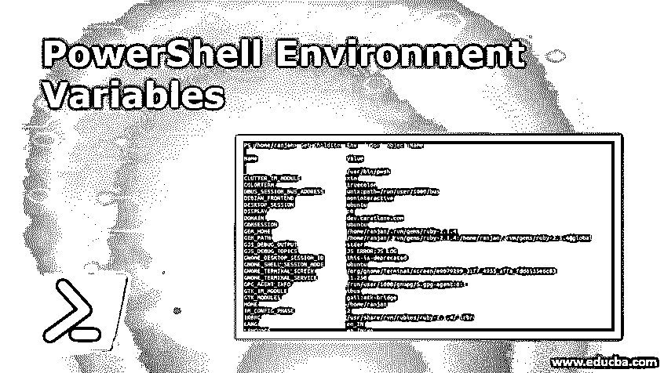

## PowerShell 环境变量简介

环境变量包含操作系统信息，如操作系统的路径、操作系统使用的处理器数量以及系统临时文件夹的地址。这里的第一个问题是，为什么我们需要环境变量？让我告诉你一个例子，假设你有一个脚本，这个脚本必须根据环境以不同的方式工作，例如，如果脚本在本地计算机上运行，它必须以不同的方式执行，如果它在服务器计算机上运行，它必须以不同的方式工作。现在的问题是脚本如何知道它在哪里运行？所以答案很简单，在环境变量的帮助下，它可以区分并执行相应的任务。我们的操作系统包含很少的环境变量，例如，当我们登录到我们的计算机系统时，它设置我们的主目录。我们会看到它的语法和例子。要查看 PowerShell 环境变量，请使用以下命令。

`Set-Location Env:
Get-Item Env:`

<small>Hadoop、数据科学、统计学&其他</small>

### 如何声明 PowerShell 环境变量？

以下是声明 PowerShell 环境变量的示例:

#### 示例#1

在下面的例子中，我们为设置环境分配一个环境变量，并使用命令 Get-ChildItem 获取环境名称。假设您想为不同的环境设置不同的数据库，我们可以设置环境变量名称，根据环境名称，我们可以设置数据库名称。

**代码:**

`$env:ServerName = 'stage'
Get-ChildItem Env:ServerName`

**输出**:“阶段”

`$env:ServerName = 'production'
Get-ChildItem Env:ServerName`

**输出**:‘生产’

#### 实施例 2

我们可以定义自己的环境变量，也可以根据需要获取它的值。在下面的例子中，我们可以看到一个非常简单的语法和它的例子。我们设置 myFirst_ENV 的值，并使用 Get-ChildItem 命令获取它的值。

**代码:**

`$Env:<variable-name> += "<new-value>"
$Env:myFirst_ENV += "test1"
Get-ChildItem Env:/myFirst_ENV`

**输出:**

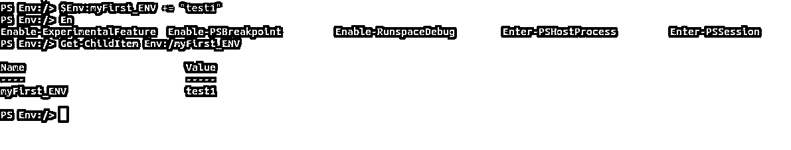

### PowerShell 环境变量列表

有两种类型的环境变量:

#### 1.系统定义的

系统定义的可用一个系统定义的，例如你的计算机从哪里启动它知道如何设置主目录和如何设置其他重要路径，

任何系统中都有许多环境，比如与窗口相关的环境、与路径相关的环境以及与处理器长度相关的环境。下面的命令将显示所有可用的环境。对于不同的系统架构，如 Window、Linux 和 apple 系统，It 值是不同的。

`Get-ChildItem Env:`

**输出:**

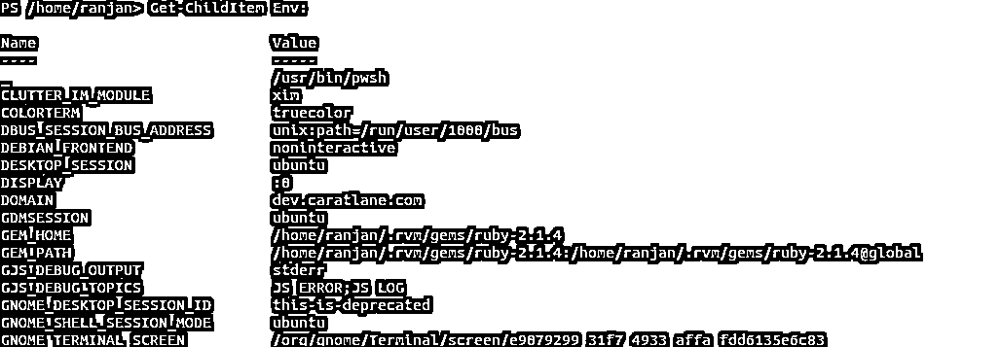

我们也可以按排序顺序显示这些详细信息，请看下面的屏幕示例。

`Get-ChildItem Env: | Sort-Object Name`

**输出:**

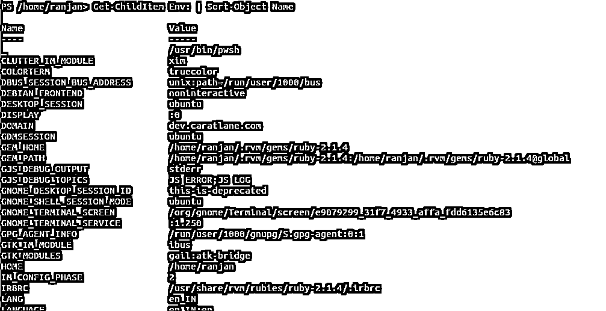

让我们用例子来谈论每一个，所以如果我们想看到窗口路径比我们可以写下面的命令，

`$env:WINDOWPATH`

如果我们想看到路径变量类型的细节，我们可以写这样的命令

`$env:PATH`

请参见下面的示例及其输出，

**输出:**

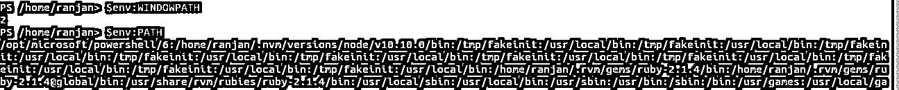

我们可以看到所有的临时文件夹看看下面的命令

`Get-ChildItem $Env:Temp -Recurse`

**输出:**

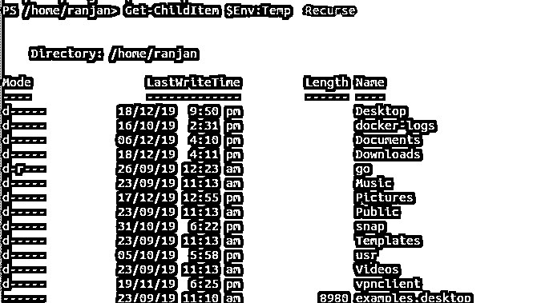

要查看任何环境变量值，我们可以在屏幕上使用下面的命令，只需传递我们想要查看的环境变量的名称，它就会显示出来。

**代码:**

`PS /home/ranjan> $env:CLUTTER_IM_MODULE
xim
PS /home/ranjan> $env:XDG_DATA_DIRS
/usr/share/ubuntu:/usr/local/share/:/usr/share/:/var/lib/snapd/desktop
PS /home/ranjan> $env:NODE_ENV
development
PS /home/ranjan> $env:DESKTOP_SESSION
ubuntu
PS /home/ranjan>`

**输出:**

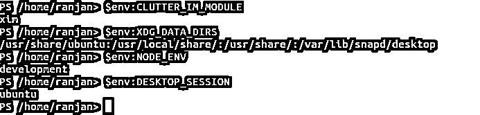

#### 2.自定义环境

另一个环境变量是自定义环境变量，它们是由我们自己定义的变量。例如，如果我们开发了一个应用程序，我们希望它在不同的环境下以不同的方式运行，比如

**代码:**

`$Env:FOO = "hello world"
Get-ChildItem FOO`

**输出:**

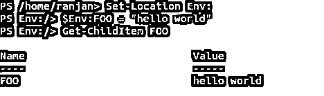

### 使用 Power Shell 环境变量的优势

您已经在 Powershell 中创建了许多变量，但是您有没有意识到这些变量是本地的，这意味着它们只能在当前会话中使用，一旦您开始另一个 PWSH 会话，这些变量就不可用了。让我们看看下面的例子。

让我们在当前会话中创建一个局部变量变量“mycomputer ”,

**代码:**

`Set-Variable -Name mycomputer -Value "ranjan-computer"
gv mycomputer -valueOnly`

**输出:**ran Jan-计算机

让我们打开另一个 shell，登录到 PWSH 会话，并尝试获取“mycomputer”变量名，如下所示。

`pwsh
gv mycomputer -valueOnly`

**输出:** gv:找不到名为“mycomputer”的变量。

因此，该变量对其他会话不可用，并通过错误返回。环境变量是特殊的变量，因为它们在所有新的 shells 中都可用。

局部变量见屏幕示例。

**输出:**

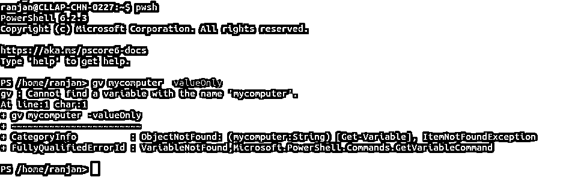

让我们以环境变量为例，这里我们有一个名为 NODE_ENV 的环境变量，我们在一个 shell 上获取它的值 development，一旦我们打开一个新的 shell 并试图找到它的值，我们就会看到它返回相同的值，即“development”，这意味着环境变量是全局可用的。

请参见全局环境变量的示例，

`Get-ChildItem Env:NODE_ENV`

**输出:**

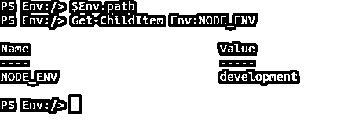

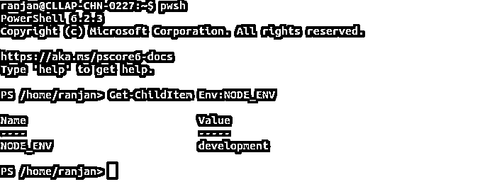

从上面的例子中，我们了解到环境变量可以在每个新的 shell 中使用。

您也许能够理解在 PowerShell 中使用环境变量的最大和主要的优点。它只是帮助我们在运行时识别系统环境，允许我们的脚本根据环境的值执行不同的任务。

#### 主要优点是:

*   环境变量的值是持久性，这意味着在所有终端中都可用。
*   如果我们有大型的服务器组，那么通过定义环境变量来管理它们将会非常容易。
*   如果你想以一种更好的方式管理你的应用程序，并且不想接触内部代码进行配置，那么我们可以使用环境变量。
*   你将有一些更好的安全性，因为大多数黑客都试图攻击和照看他们的代码和应用程序，他们不能操纵和访问环境变量。
*   如果你想设置一个快速测试环境，但不想让非技术用户访问大量代码，那么我们可以设置环境变量，并根据我们为不同用户设置的环境为他们提供访问权限。

### 结论

PowerShell 环境变量，当我们尝试运行应用程序并希望全局使用一个变量时，环境变量非常有用，这意味着该变量应该可用于所有正在运行的进程和脚本。

### 推荐文章

这是 PowerShell 环境变量指南。这里我们讨论要声明的例子，两种类型的环境变量，advantages 和一个 advantages 例子。您也可以浏览我们的其他相关文章，了解更多信息——

1.  [如何安装 PowerShell](https://www.educba.com/install-powershell/)
2.  [PowerShell 中的比较运算符](https://www.educba.com/comparison-operators-in-powershell/)
3.  [实现 PowerShell Set-Location 的示例](https://www.educba.com/powershell-set-location/)
4.  [带有属性的 PowerShell Get-ChildItem 的前 16 个参数](https://www.educba.com/powershell-get-childitem/)
5.  [PowerShell 排序-对象|语法|参数|示例](https://www.educba.com/powershell-sort-object/)
6.  [PowerShell Get-Item 示例](https://www.educba.com/powershell-get-item/)

