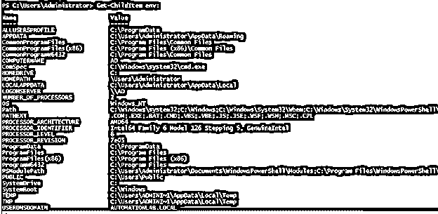
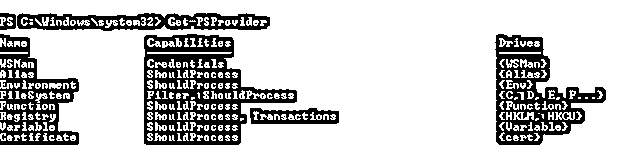

# PowerShell 设置环境变量

> 原文：<https://www.educba.com/powershell-set-environment-variable/>

## PowerShell set 环境变量简介。

PowerShell 环境变量存储 Windows 操作系统信息，如操作系统安装路径、系统驱动器、用户配置文件路径、处理器数量等。它们可以被另一个程序或子父进程使用，因为它们更容易工作。使用 PowerShell 设置环境变量是最简单的方法，为此，我们可以使用简单的变量追加方法。Net 方法或 Set-Item cmdlet。

**语法**

<small>Hadoop、数据科学、统计学&其他</small>

下面是设置环境变量的方法。

**通过添加/追加变量**

`$Env:<variable-name> = "<new-value>"`

以上命令语法使用指定的值创建一个新的环境变量。要追加变量，请使用( **+** )符号。

`$Env:<variable-name> += "<new-value>"`

**使用 Set-Item cmdlet**

在命令下面，语法设置现有的变量名。我们还可以创建一个新变量，而不需要在 Value 参数中提供现有的变量名。

`Set-Item -Path Env:<variable-name> -Value ($Env:<variable-name> + ";<new-value>")`

**使用设定内容法**

在此方法中，我们可以通过提供环境变量的路径，或者通过先将位置设置为环境路径，然后直接更改变量，来直接使用此 cmdlet。

`Set-Content -Path env:<variable-name> -Value "ValueName"`

**使用。Net 类方法**

`[Environment]::SetEnvironmentVariable(String, String)`

上述命令创建、修改或删除当前进程中存储的环境变量。

`[Environment]::SetEnvironmentVariable(String, String,EnvironmentVariableTarget)`

上述命令创建、修改或删除当前进程中存储的环境变量或 Windows 操作系统注册表项。

### 环境变量在 Windows 中是如何工作的？

环境变量存储在名为 Env 的变量中，可以使用 Get-ChildItem(别名:dir)访问该变量，以获取存储在该变量中的所有值。举个例子，

`Get-ChildItem Env:`

**输出:**

如果您在上面的命令中注意到，环境变量以(:)符号结尾，它表示驱动器符号，但 Env:是特定的驱动器，您可以使用 Get-PSDrive 命令获取当前会话中关联的所有驱动器。

价值

`Get-PSDrive`

您可以注意到 Env 出现在名称中，因此我们可以使用带有 Env: value 的驱动器符号来访问它，类似于注册表值。要检查当前会话中连接的所有驱动器，请使用 Get-PSProvider 命令。

`Get-PSProvider`

**输出:**

当我们设置环境变量时，我们需要使用 Env:符号通过语法的上述方法来访问这个特定的变量。

要在 Windows 操作系统上永久设置环境变量，您需要使用计算机属性->高级系统设置->高级选项卡->环境变量。您可以在用户或计算机范围内添加或编辑现有的环境变量，然后 windows 将该变量写入注册表以进行永久更改，即使在 windows 重新启动后，该变量仍然存在。

同样，您可以在 PowerShell 用户配置文件中设置环境变量，使其持久化。

### PowerShell 设置环境变量的示例。

下面举几个例子

#### 示例 1–附加变量方法。

在这个方法中，我们将现有的变量添加到环境变量列表中。举个例子，

我们需要向 PSModulePath 环境变量添加另一个路径。现有路径如下所示。

`dir Env:\PSModulePath`

**输出:**

我们可以使用 split 方法在控制台中正确获取路径，

`(dir Env:\PSModulePath).value -split ';'`

**输出:**

要添加新路径，我们只需添加变量。

`$env:PSModulePath += ";c:\temp"`

当您检查 PSModulePath 的变量时，它应该显示 C:\temp。

`$env:PSModulePath -split ';'`

**输出:**

这只是一个临时添加；当您重新启动计算机时，上面添加的路径将会消失。

要设置新变量，可以直接使用变量名和新值，如语法部分所示。

`$env:AZSubscription = 'Visual Studio Subscription'`

**输出:**

上述命令将添加名为 AZSubscription 的新环境变量，并将其值设置为“Visual Studio Subscription”。

#### 示例 2–使用 Set-Item cmdlet。

我们还可以使用 Set-Item 命令来设置环境变量值。例如，要将值附加到上面的 AZSubscription 环境变量，我们可以使用下面的命令。

`Set-Item -Path Env:\AZSubscription -Value ($env:AZSubscription + ";AutomationLab")`

**输出:**

要使用 Set-Item 创建新的环境值，我们可以直接提供新的路径和新的值。

`Set-Item -Path Env:\AZResourceGroup -Value 'AutomationRG'`

**输出:**

#### 示例# 3–设置内容 cmdlet

我们可以使用下面的命令，通过 Set-Content cmdlet 在环境变量中追加路径。这里，我们提供了现有的环境变量来追加到 Value 参数中。

`Set-Content -Path Env:\AZResourceGroup -Value ($Env:AZResourceGroup + ";AutomationRG2")`

**输出:**

类似地，要使用 Set-Content cmdlet 添加新的环境变量，我们可以在-Path 参数中直接使用新的变量名，在-Value 参数中使用它的值。

`Set-Content -Path Env:\AZResourceGroup -Value 'NewAutomationRG'`

**输出:**

如果我们使用现有变量而不在-Value 参数中追加值，它将清除旧值并设置新值，如上面的示例所示。

#### 示例# 4–使用。Net 类方法

在这种方法中，我们使用 PowerShell。Net 类调用[System。环境]为环境变量设置值或创建新值。

首先，我们将为环境设置新的值。

`[System.Environment]::SetEnvironmentVariable('AZResourceGroup','Automationtest')`

**输出:**

我们也可以用别名[environment et]代替[System。环境】。为了使用这种方法追加新值，我们将使用下面的语法，这在语法一节中提到过。

`[Environment]::SetEnvironmentVariable(String, String,EnvironmentVariableTarget)`

`$path = $env:AZResourceGroup + ";AutomationTest2"
[Environment]::SetEnvironmentVariable('AZresourceGroup',$path)`

**输出:**

### 结论–PowerShell 设置环境变量

环境变量在检索操作系统、硬件和应用程序的细节方面非常强大。一些编程语言如 Java。NET 使用环境变量，以便应用程序直接检索数据并使用它们。为了便于使用，他们还可以创建一个环境变量。

### 推荐文章

这是 PowerShell 设置环境变量的指南。在这里，我们讨论了环境变量在 Windows 中是如何工作的，并给出了一些例子。您也可以看看以下文章，了解更多信息–

1.  [PowerShell 睡眠](https://www.educba.com/powershell-sleep/)
2.  [Windows PowerShell ISE](https://www.educba.com/windows-powershell-ise/)
3.  [PowerShell 转义符](https://www.educba.com/powershell-escape-character/)
4.  [PowerShell 子串](https://www.educba.com/powershell-substring/)

