# PowerShell 中的哈希表

> 原文：<https://www.educba.com/hashtable-in-powershell/>

## PowerShell 中哈希表的介绍

PowerShell 哈希表是一种紧凑的数据结构，它将键/值对存储在哈希表中。换句话说，哈希表是一个带有键值对的关联数组或字典。键/值对本质上是以某种方式相关的两个元素的集合。

在哈希表中，输入是具有关联值的唯一键，输出是具有两列的表。

<small>Hadoop、数据科学、统计学&其他</small>

*   名字
*   价值

在 PowerShell 中，每个哈希表都是一个哈希表对象。这个对象通常是字符串或整数，但也可以是任何对象类型。

**语法:**

在使用哈希表之前，必须先创建它。下面是这样做的语法。

创建空哈希表

`$hash =@{}`

您还可以创建一个哈希表，同时添加键值。

`$hash = @{ key1 = item1; key2 = item2;... }`

可以通过以下方式向空哈希表添加数据:

`$hash.add( $key, $value )`

也可以使用类似的语法创建有序字典。

下面是创建有序字典的语法。这里，我们只在**“@”**符号前添加了【ordered】属性。

`$hash =[ordered] @{ key1 = item1; key2 = item2;... }`

**注意:**哈希表和有序字典的主要区别在于哈希表不保持条目添加的顺序，而有序字典保持。

**访问哈希表值:**通过键访问哈希表值。

`$hash[“key1”]`

**打印哈希表:**要打印/显示哈希表，只需输入保存哈希表的变量名。

`$hash`

上面的命令显示了一个有两列的表，一列是键，另一列是键的关联值。

### Hashtable 在 PowerShell 中是如何工作的？

*   Hashtable 使用哈希函数将密钥转换为哈希。
*   Hash 是哈希表用来获取值的数字。
*   Hash 然后直接映射到键/值对数组中的一个桶。

让我们通过给出的示例来了解 PowerShell 的工作原理:

*   首先，创建一个空哈希表，然后用键值对填充它，

**代码:**

`$hash = @{}
$hash.add( 'ID', 1 )
$hash.add( 'Subject', 'Maths')
$hash.add( 'Maths', 80 )
$hash`

**输出:**

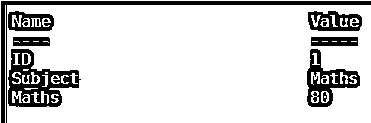

*   你也可以创建一个哈希表并同时初始化它。

**代码:**

`$hash = @{ID=1; Subject='Maths'; Marks=80}
$hash`

**输出:**

#### 对于有序哈希表

**代码:**

`$hash=[ordered]@{ID=1; Subject='Maths'; Marks=80}
$hash`

**输出:**

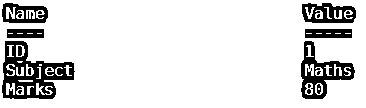

这里展示了几个例子来说明可以在哈希表上执行的操作。

#### 编辑哈希表中的项目

.Set_Item()方法用于编辑哈希表中的条目:

**代码:**

`$hash=[ordered]@{ID=1; Subject='Maths'; Marks=80}
$hash.Set_Item("Subject", “English”)
$hash`

**输出:**

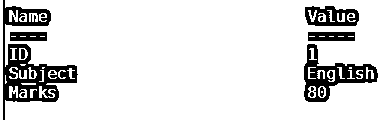

*   如果一个新条目以前不存在，它会自动添加到哈希表中。

**代码:**

`$hash=[ordered]@{ID=1; Subject='English'; Marks=80}
$hash.Set_Item("NoOfStudents",30)
$hash`

**输出:**

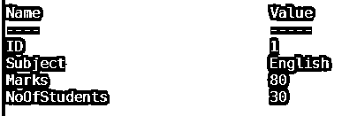

#### 从哈希表中移除项目

**代码:**

`$hash=[ordered]@{ID=1; Subject='English'; Marks=80}
$hash.Remove("NoOfStudents")
$hash`

**输出:**

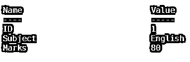

#### 打印哈希表键

**代号:**

`$hash=[ordered]@{ID=1; Subject='English'; Marks=80}
$hash.keys`

**输出:**

#### 打印哈希表值

**代码:**

`$hash=[ordered]@{ID=1; Subject='English'; Marks=80}
$hash.values`

**输出:**

#### 搜索特定项目

**代码:**

`$hash=[ordered]@{ID=1; Subject='Maths'; Marks=80}
If ($hash.Subject -eq ‘Maths’) {Echo ‘OK’}`

**输出:**

这里，如果“Subject”键值与“Maths”匹配，则输出为“OK”。

对于部分匹配，**。**包含一个键或**。**使用了 ContainsValue 方法。

`$hash.ContainsKey(‘Subject’)`

这将作为输出返回 True，因为键与“主题**”**匹配。

`$hash.ContainsKey('Date')`

这将返回 False 作为输出，因为键与“日期**”**不匹配。

`$hash.ContainsValue(‘Maths’)`

这将作为输出返回 True，因为值与' Maths **'** 匹配。

`$hash.ContainsValue('Physics')`

这将返回 False 作为输出，因为值与“物理**”**不匹配。

您还可以检查特定的键是否存在。

**代码:**

`$hash=[ordered]@{ID=1; Subject='Maths'; Marks=80}
If ($hash.Subject) {Echo ‘OK’}`

**输出:**

### 排序键和值

*   默认情况下，哈希表条目是不排序的。
*   每次打印键/值时，顺序可能会有所不同。
*   因为使用排序的数据列表总是很方便，所以您可以在 Powershell 中对哈希表的键/值对进行排序，尽管您不能对哈希表本身进行排序。
*   GetEnumerator 方法用于枚举键和值
*   然后，使用 Sort-Object cmdlet 对要打印的枚举值进行排序。

让我们通过一个例子来理解这一点。

**代码:**

`$hash.GetEnumerator() | Sort-Object -Property key`

**输出:**

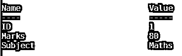

在上面的例子中，首先在$hash 变量中枚举哈希表中的键和值，然后键按字母顺序排序。

*   要按降序对哈希表值进行排序，让我们看看下面的例子。它的实现方式与上面类似，只是您需要在 cmdlet 中添加“Descending”。

**代码:**

`$hash=[ordered]@{ID=1; Subject='Maths';Marks=80}
$hash.GetEnumerator() | Sort-Object -Property key -Descending`

**输出:**

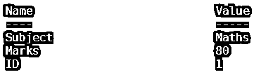

### 遍历哈希表

*   使用字典或列表将参数作为一个单元提供给命令的方法。
*   如果您需要指定大量参数，这会使您的命令变得很长，并且您最终会滚动出屏幕或者尝试将其打包以使其可读，那么这是很有帮助的。
*   使用 splatting，您可以使用更容易阅读的数组或哈希表，而不是在一行中提供所有参数。
*   Splatting 通过提供一种简洁明了的格式使代码阅读变得更加容易。让我们通过一个非常简单的例子来理解这一点。

**代码:**

`$splat= @{year = 2019; Month = 12; day=1}
get-date @splat`

**输出:**

**注意:变量名$splat 中的$** 符号在执行命令时变成了 **@** 符号

使用 **@** 符号代替 **$** 符号调用 splat 操作。

### 遍历哈希表

让我们借助下面的例子:

#### 1.使用 ForEach

**代码:**

`$hash=[ordered]@{ID=1; Subject='Maths';Marks=80}
foreach
($key in $hash.keys)
{
$message = '{0} is {1}' -f $key, $hash[$key] Write-Output $message
}`

**输出:**

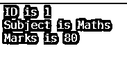

这里，我们遍历哈希表中的每个键并访问

使用它的价值

#### 2.使用 ForEach-Object

**代码:**

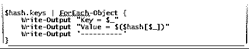

**输出:**

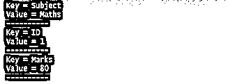

#### 3.用 GetEnumerator()打开哈希表对象

**代码:**

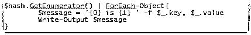

**输出:**

在这里，每个键值对都通过管道。使用 GetEnumerator()方法的主要目的是将 PowerShell 对象展开成各个元素。

### 结论 PowerShell 中的哈希表

在本文中，我们谈到了 Powershell 中哈希表的一些重要方面。

总结一下:

*   Hashtable 是一种轻量级数据结构，用作关联数组来将键映射到值。
*   这是一种结构化的、有效的查找和检索数据的方式。
*   可以存储列表。
*   可以在 PowerShell 中创建计算属性。

### 推荐文章

这是 PowerShell 中 Hashtable 的指南。这里我们讨论 Hashtable 如何在 PowerShell 中工作，以及排序键和值。您也可以阅读以下文章，了解更多信息——

1.  [PowerShell 移除-项目](https://www.educba.com/powershell-remove-item/)
2.  [PowerShell 中的比较运算符](https://www.educba.com/comparison-operators-in-powershell/)
3.  [PowerShell 中的数组](https://www.educba.com/array-in-powershell/)
4.  [PowerShell 变量](https://www.educba.com/powershell-variables/)
5.  [实现 PowerShell Get-Date 的示例](https://www.educba.com/powershell-get-date/)
6.  [SQL 中唯一键的指南](https://www.educba.com/unique-key-in-sql/)

