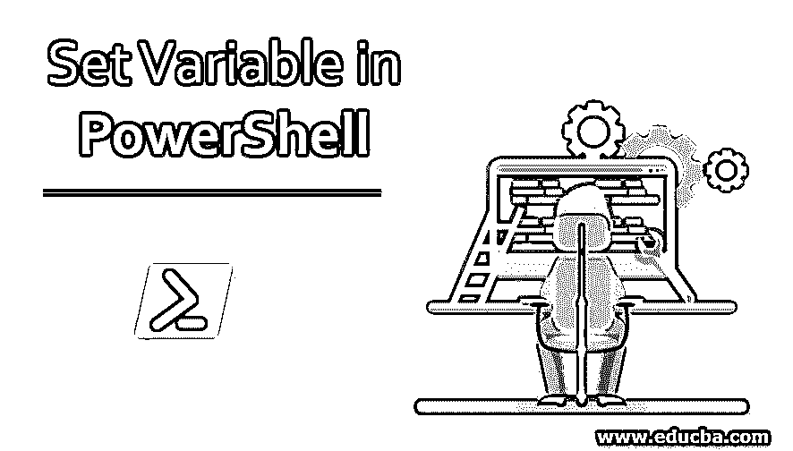
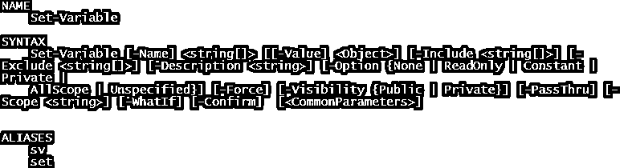
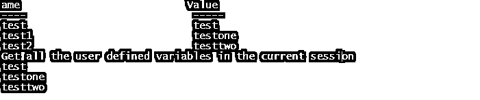
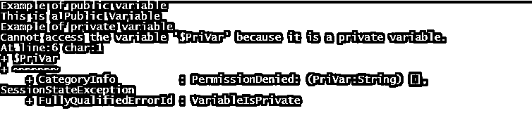
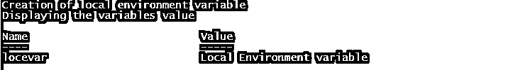
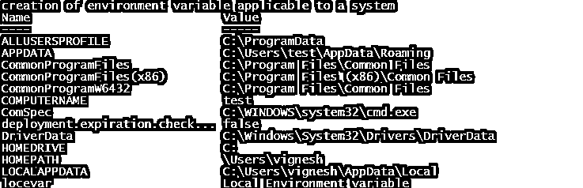

# 在 PowerShell 中设置变量

> 原文：<https://www.educba.com/set-variable-in-powershell/>

## PowerShell 中的 Set-Variable 简介

以下文章概述了 Powershell 中的 set 变量。变量是可用于存储值的内存块。PowerShell 变量使用“$”符号表示。变量名可以是数字、字母甚至下划线。PowerShell 变量不区分大小写。PowerShell 变量不仅仅是基于文本的，相反，它们是像 Microsoft.Net 对象那样的对象。有不同类型的变量，如用户创建的变量、自动变量和偏好变量。Set-variable 是设置变量值的 cmdlet。如果变量不存在，set-variable cmdlet 会创建一个变量，然后将值赋给它。

### PowerShell 中设置变量的语法

以下是 set-variable cmdlet 的语法。

<small>Hadoop、数据科学、统计学&其他</small>

**输入:**

`Get-Help Set-Variable`

**输出:**

**举例:**

`Set-Variable -Name "test" -Value "test variable"`

上面的 cmdlet 将名为 test 的变量的值设置为“测试变量”。如果变量不存在，它将被创建。

### PowerShell 中 Set 变量的参数

下面给出了以下参数:

**1。Confirm:** 这用于在运行 cmdlet 之前获得确认。这是一个可选参数。它的类型是开关。其默认值为无。它不接受管道输入和通配符。

**2。Exclude:** 这指定了在执行 cmdlet 时应该排除的项目列表。可以是路径，也可以是模式。它的类型是字符串。它的类型是开关。其默认值为无。它不接受管道输入，但可以接受通配符。它也是一个可选参数。

**3。Force:** 这允许创建一个与现有只读变量相同的变量。它还可以用于更改只读变量的值。这是一个可选参数。它的类型是开关。其默认值为 false。它不接受管道输入和通配符。

**4。Include:** 这指定了在执行 cmdlet 时应该包含的项目列表。可以是路径，也可以是模式。它的类型是字符串。它的类型是开关。其默认值为无。它不接受管道输入，但可以接受通配符。它也是一个可选参数。

**5。Name:** 指定变量名，是一个强制参数。它的类型是字符串。其默认值为无。它接受管道输入，而不允许使用通配符。

**6。Option:** 用于指定变量的 options 属性。它的默认值是无。它的类型是项目的范围。它不接受管道输入和通配符。这是一个可选参数。

其适用值如下

*   **注**:这是默认值；没有设置选项。
*   **Readonly** :变量的值不能改变，除非使用 force 参数。该变量也不能被删除。
*   **常量**:变量值不可更改或删除。变量只能在创建过程中保持不变。
*   **Private:** 变量只在当前作用域内有效。
*   **AllScope:** 变量可以被复制到任何可能被创建的作用域。

7 .**。范围:**该参数指定变量的范围。可用的作用域有全局、本地、脚本和私有。Local 是变量的默认范围。它的类型是字符串。它不接受管道输入和通配符。这是一个可选参数。

**8。Value:** 用于指定变量的值。其类型为对象，默认值为无。它可以接受管道输入，但不接受通配符。

**9。Visibility:** 这表示创建的变量在创建它的会话之外是否可用。它的值要么是公有的，要么是私有的。默认情况下，它是公共的，这意味着它甚至在会话之外也是可用的。Private 表示变量在会话之外不可用。它不接受管道输入和通配符。

10。WhatIf: 这显示了 cmdlet 运行时的实际输出。这就像 cmdlet 的演示。类型是一个开关。默认值为 false。它不接受管道输入和通配符。

### PowerShell 中设置变量的示例

以下是 PowerShell 中 set 变量的示例

#### 示例#1

设置并获取一个变量

**输入:**

`Set-Variable -Name "test" -Value "test"
Get-Variable -Name "test"
Set-Variable -Name "test1" -Value "testone"
Get-Variable -Name "test1"
Set-Variable -Name "test2" -Value "testtwo"
Get-Variable -Name "test2"
Write-Host "Get all the user-defined variables in the current session"
Get-Variable test* -ValueOnly`

**输出:**

#### 实施例 2

私有变量和公共变量之间的差异

**输入:**

`Write-Host "Example of the public variable"
Set-Variable -Name "PubVar" -Visibility Public -Value "This is a Public Variable"
$pubvar
Write-Host "Example of the private variable"
Set-Variable -Name "PriVar" -Visibility private -Value "This is a private Variable"
$PriVar`

**输出:**

### 使用环境变量

下面是使用环境变量的两个例子

#### 1.创建局部作用域环境变量

**输入:**

`Write-Host "Creation of local environment variable"
$env:locevar = 'Local Environment variable'
Write-Host "Displaying the value of the variable"
Get-ChildItem Env:locevar`

**输出:**

在上面的示例中，创建的变量仅可用于当前的 PowerShell 会话。一旦会话关闭，变量就会消失。

#### 2.为机器创建环境变量

**输入:**

`Write-Host "creation of environment variable applies to a system"
[System.Environment]::SetEnvironmentVariable('envvar','environment variable',[System.EnvironmentVariableTarget]::Machine)
Set-Location Env:
Get-ChildItem`

**输出:**

### 结论–PowerShell 中的集合变量

因此，本文详细解释了 set-variable cmdlet 及其不同的作用域。它还解释了环境变量，如何创建和访问它们。要深入了解 cmdlet，建议创建示例程序，并享受围绕它们工作的乐趣。

### 推荐文章

这是在 PowerShell 中设置变量的指南。在这里，我们将讨论 PowerShell 中设置变量的参数，以及使用环境变量和相应的示例。您也可以浏览我们的其他相关文章，了解更多信息——

1.  [PowerShell 日期](https://www.educba.com/powershell-date/)
2.  [PowerShell 中的比较运算符](https://www.educba.com/comparison-operators-in-powershell/)
3.  [深度学习技术](https://www.educba.com/deep-learning-technique/)
4.  [PowerShell 中的开关盒](https://www.educba.com/switch-case-in-powershell/)
5.  [PowerShell 设置指南-位置](https://www.educba.com/powershell-set-location/)
6.  [PowerShell Get-child item 完整指南](https://www.educba.com/powershell-get-childitem/)

