# PowerShell 中的比较运算符

> 原文：<https://www.educba.com/comparison-operators-in-powershell/>

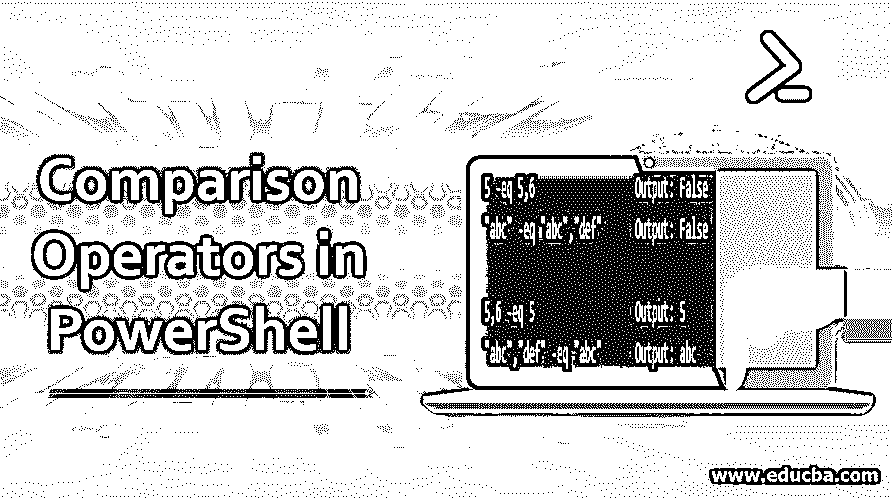

## PowerShell 中的比较运算符简介

在本文中，我们将详细了解 PowerShell 中不同的比较运算符。比较运算符用于比较、搜索和改变两个或多个值。还可以在条件中使用比较运算符来匹配和比较值。

### 比较运算符

Windows PowerShell 使用以下比较运算符，默认情况下，它们不区分大小写。要执行区分大小写的操作，只需在下面的运算符前键入“c”。例如，-clike，-cne，-ceq 等。

<small>Hadoop、数据科学、统计学&其他</small>

| **-eq** | 平等的 |
| **-ne** | 不相等 |
| **-gt** | 大于 |
| **-葛** | 大于或等于 |
| **-lt** | 不到 |
| **-乐** | 小于或等于 |
| **——像** | 检查部分字符串是否匹配(通配符比较) |
| **-不像** | 检查字符串的一部分是否不匹配(通配符比较) |
| **-匹配** | 正则表达式比较 |
| **-不匹配** | 正则表达式比较 |
| **-包含** | 安全壳操作员 |
| **-不包含** | 非包容运营商 |
| **-在** | In 运算符 |
| **-notIn** | 非 In 运算符 |
| **-更换** | 替换字符串模式 |

### 实现比较运算符的示例

以下是比较运算符的一些示例:

#### 1.–eq:等于

该运算符用于检查值之间的相等性。它们应该完全匹配，这是不区分大小写的。输出将为真或假。举个例子，

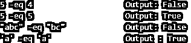

您还可以比较两种不同的数据类型。

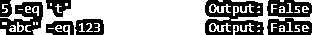

您也可以将多个值与单个值进行比较。

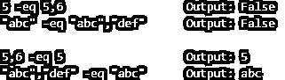

如果使用–CEQ 运算符，则比较将区分大小写。

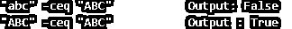

#### 2.–ne:不等于

这与等于运算相反。如果值匹配，那么它将返回 FALSE，否则它将返回 TRUE。

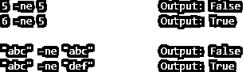

对于多个值，

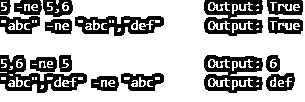

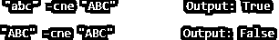

#### 3.–gt:大于

它将左侧的值与右侧的值进行比较，并根据值输出 TRUE 或 FALSE。在下面的例子中，它将 5 与 6 进行比较，检查它是否大于 6，并提供答案 FALSE。

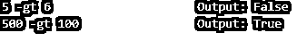

当您比较两个字符时，它会检查其 ASCII 值，并基于该值提供结果。' a '的 ASCII 值是 97，' c '是 99，所以' c '大于' a '。结果第二句是真的。

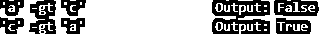

如果您将多个字符放在一起比较，那么它将检查两边第一个字符的 ASCII 值，并相应地提供结果。举个例子，

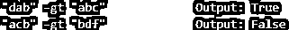

在上面的第一句话中,“d”的 ASCII 值大于“a ”,在第二句话中,“a”的 ASCII 值小于“b”。用于多值比较。

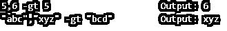

#### 4.–ge:大于等于

检查左侧的值是否大于或等于右侧的值。

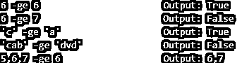

#### 5.–lt:小于

检查左侧的值是否小于右侧的值。

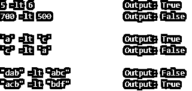

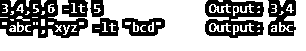

#### 6.–le:小于或等于

检查左侧的值是否小于等于右侧的值。

#### 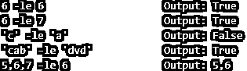

#### 7.像

它使用通配符(*)将左侧值与右侧值进行匹配。

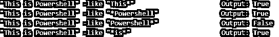

[通配符](https://www.educba.com/wildcard-characters/) (*)，当应用时，它检查部分是否包含在字符串中。如果它在特定值(即 This*)之后应用，则它检查该单词+后继字符串是否存在。在第一个例子中。

*   单词:这个
*   后继字符串:是 Powershell

如果在特定单词之前应用，则它检查特定单词+优先字符串是否存在。在第二个例子中。

*   单词:Powershell
*   先例字符串:这是

在第三个示例中，通配符(*)应用于单词“Powershell”之后，word 正在匹配，但没有后续字符串，因此输出为 False。在第四个示例中，通配符(*)应用于两边，因此它检查一个字符串是否存在于它之前或之后，换句话说，提到的单词是该字符串的一部分。所以这里输出为真。

#### 8. –NotLike

它与 Like 运算符相反，但通配符的定义保持不变，只是输出相反。

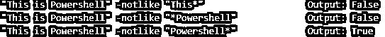

#### 9.–匹配

它使用正则表达式匹配字符串。当输入是标量时，它会自动填充$matches 变量。

$ **匹配**

名字值

—- —–

0 即将到来

要匹配至少任何一个字符，请将它们放入[ ]。

在上面的例子中，字符“c”是匹配的。匹配连续范围[range]中的至少一个字符。

这里，从字符 n 到 r[不区分大小写]将根据字符串进行检查，并且“o”和“p”是匹配的。因此，输出为真。

#### 10.–不匹配

与匹配运算符相反。如果找到匹配，则返回 false，反之亦然。

名字值

—- —–

0 即将到来

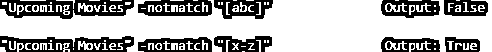

#### 11.-包含 **:** 安全壳操作员

指示引用值集合是否包含精确的(不区分大小写)单个值。如果是，则返回真，否则返回假。

**语法:**

`<Reference-values> -Contains <Test-value>`

上面的输出是假的，因为左边包含两个值。但是如果你将它们存储到一个变量中并进行匹配，输出将为真。

对于区分大小写的操作，请使用–ccontains 运算符。

#### 12.–not Contains:包含运算符(与 Contains 相反)

如果测试值与参考值组完全匹配，则输出为假。否则，输出为真。

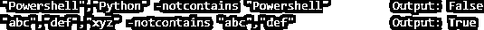

#### 13.构成有机化合物、药品、蛋白质等的名称

与包含运算符类似，只是语法相反。-在 Powershell 3.0 中引入了运算符。如果测试值与参考值匹配，则返回 TRUE，否则返回 FALSE。

**语法:**

`<Test-value> -in <Reference-values>`

在上面的例子中，“Shell”与 Powershell 并不完全匹配。

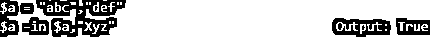

#### 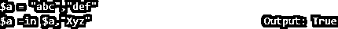

#### 14.–notin:Not in 运算符(与-in 运算符相反)

如果测试值与参考值完全匹配，则返回 FALSE，否则返回 TRUE。

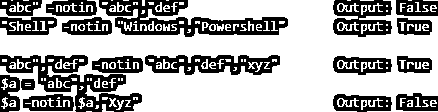

#### 15.–替换:更改指定值

**语法:**

`<String> -replace <Old value>,<New Value>`

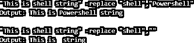

替换变量中的值

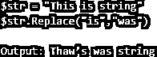

**Note:** There are two matching values of “is”, so it has replaced two values.

#### 16.其他类似的运营商

还有其他类似的操作符，如下所述。

**a .按位运算符**

| **-波段** | 按位 AND |
| 【t0-钻头】T1 | 按位或(含) |
| **-异己** | 按位或(异或) |
| **-bNot** | 按位非 |
| **-shl** | 向左移动 |
| **-shr** | 向右移位 |

**2。逻辑运算符**

| **-和** | 逻辑与 |
| **-或** | 逻辑或 |
| **-异或** | 逻辑异或 |
| **-不是** | 逻辑非 |
| **！** | 逻辑非 |

### 推荐文章

这是 PowerShell 中比较运算符的指南。这里我们讨论 Powershell 中不同类型的比较操作符，并给出例子。你也可以看看下面的文章来了解更多-

1.  [PowerShell 操作员](https://www.educba.com/powershell-operators/)
2.  [PowerShell 字符串函数](https://www.educba.com/powershell-string-functions/)
3.  [JavaScript 中的比较运算符](https://www.educba.com/comparison-operators-in-javascript/)
4.  [PowerShell 命令](https://www.educba.com/powershell-commands/)
5.  [PowerShell 中的阵列示例](https://www.educba.com/array-in-powershell/)
6.  [Oracle LIKE 操作员指南](https://www.educba.com/oracle-like-operator/)
7.  [不同类型的 Matlab 逻辑运算符](https://www.educba.com/matlab-logical-operators/)

