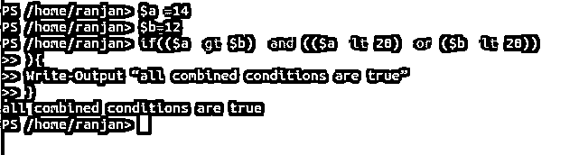
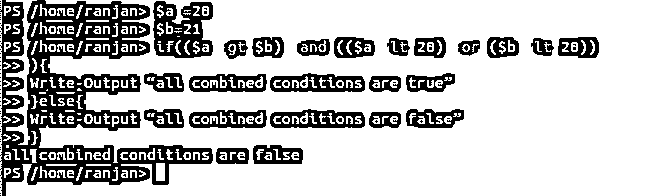
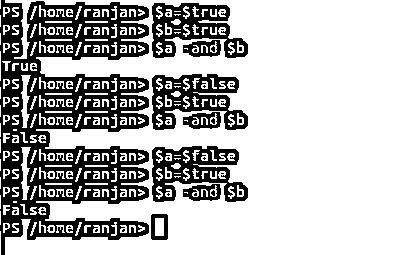
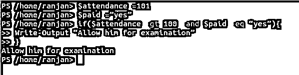
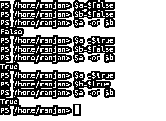
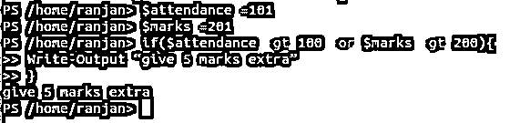
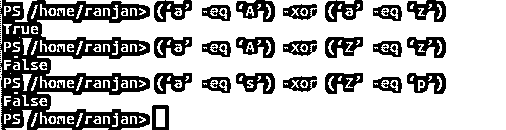
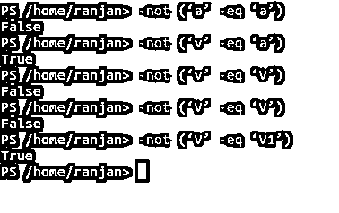
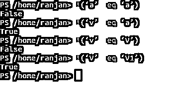

# PowerShell 中的逻辑运算符

> 原文：<https://www.educba.com/logical-operators-in-powershell/>

## PowerShell 中的逻辑运算符简介

我们在 if 语句中见过很多条件，像 if($j -lt 10)，但是如果我们想一次检查多个条件，比如$j -lt 10 和$i -lt 15。所以我们有逻辑运算符来处理这种情况。PowerShell 中的逻辑运算符将两个或多个表达式和语句组合在一起。简单地说，如果我们想在一个条件中转换多个条件，我们可以在 PowerShell 中使用逻辑运算符。让我们用逻辑运算符 LO 来解释语法。

**语法:**

<small>Hadoop、数据科学、统计学&其他</small>

`if(cond1 LO1 cond2  LO2 cond3){
Statement 1
Statement 2
...
}`

所以在上面的语法中(cond1 LO1 cond2 LO2 cond3)组合起来构成一个条件。

在上面的语法中(cond 1 LO1 cond 2 LO2 cond 3)=单个条件。因为它将返回多个条件的单个值组合。

### PowerShell 中逻辑运算符的示例

下面是 Powershell 中逻辑运算符的例子，详细解释。

#### 示例#1

在本例中，我们组合了三个条件，所有，($ a-gt $ b)=一个条件，($ a-lt 20)-or($ b-lt 20))=一个条件由两个条件组合而成，$ a-gt $ b)-and($ a-lt 20)-or($ b-lt 20))=一个条件，通过这三个条件的组合，我们得到一个单一条件。因此，如果所有这些条件都为真，那么将只显示输出“所有组合条件都为真”。

**代码:**

`$a =14
$b=12
if(($a -gt $b) -and (($a -lt 20) -or ($b -lt 20))
){
Write-Output “all combined conditions are true”
}`

**输出:**

#### 实施例 2

在这个例子中，我们组合了三个条件，所有，($ a-gt $ b)=一个条件，($ a-lt 20)-or($ b-lt 20))=一个条件，($ a-gt $ b)-and($ a-lt 20)-or($ b-lt 20))=一个条件，通过组合所有三个条件，我们得到一个单一的条件。这里我们可以看到，我们将所有三个条件组合成一个条件，它们的输出将是单一的。

**代码:**

`$a =20
$b=21
if(($a -gt $b) -and (($a -lt 20) -or ($b -lt 20))
){
Write-Output “all combined conditions are true”
}else{
Write-Output “all combined conditions are false”
}`

**输出:**

### PowerShell 中的逻辑运算符列表

PowerShell 中有 5 个主要的逻辑运算符，它们是“与”、“或”、“异或”、“非=(！)".让我们用简单的例子来讨论每一个。

#### 1) -and 运算符

and 被称为逻辑 and，如果$a 和$b 为真，则任何逻辑 and 的输出为真，否则为假，下面是逻辑 and 运算符的一些示例。

**代码:**

`$a -and $b //false (if both are false)
$a -and $b  //false (if any one of them is false)
$a -and $b //true (if both of them are true)`

所以基本上逻辑 and 运算符只有在两者都为真时才为真。执行上述示例的屏幕如下所示。

**输出:**

一般而言，我们希望所有条件都应被完全填充。例如，假设一个班级的老师决定只允许那些出勤率超过 100 并且支付了班级费用的学生参加考试。所以这里两个条件都需要完全满足。

**代码:**

`$attendance =101
$paid =”yes”
if($attendance -gt 100 -and $paid -eq “yes”){
Write-Output “Allow him for examination”
}`

**输出:**

我们还可以通过传递不同的输入值$attendance 和$ paid 来测试这个程序。

#### 2) -or 运算符

逻辑 or，如果$a 和$b 为假，则为假，否则下面给出一些例子:

**代码:**

`$a -or $b //false(if both are false)
$a -or $b //true (if any one of them is true)
$a -or $b  //true (if both of them are true)`

所以基本上逻辑 and 运算符只有在两者都为假时才为假。执行上述示例的屏幕如下所示。

**输出:**

一般来说，当我们想要考虑任何条件为真时，就使用 or 运算符，比如参加了 100 次以上考试的学生将获得额外的 5 分，或者得分超过 200 分的学生。

**代码:**

`$attendance =101
$marks =201
if($attendance -gt 100 -or $marks -gt 200){
Write-Output “give 5 marks extra”
}`

**输出:**

我们还可以通过传递不同的输入值$attendance 和$ paid 来测试这个程序。

#### 3)-异或运算符

逻辑异或，如果$a 或$b 为真，则为真，否则为

**代码:**

`(‘a’ -eq ‘A’) -xor (‘a’ -eq ‘z’) //true as one of them is true
(‘a’ -eq ‘A’) -xor (‘Z’ -eq ‘z’)//false as one of them  is false
(‘a’ -eq ‘s’) -xor (‘Z’ -eq ‘p’) //false as both of them are false`

下面的屏幕显示了上述示例的输出，

**输出:**

#### 4)-非运算符

逻辑 not，如果$a 为 False，则为 True，否则为

**代码:**

`-not (‘a’ -eq ‘a’)  //false as output of expression is true
-not (‘v’ -eq ‘a’)// true as output expression is false
-not (‘v’ -eq ‘V’) //false as output expression is true
-not (‘V’ -eq ‘V1’) //true as output expression is false`

上面示例的屏幕如下所示，

**输出:**

**

** 

#### 5) !操作员

的！运算符与-not 运算符相同。简直！运算符将 true 转换为 false，将 false 转换为 true。

**代码:**

`!(‘a’ -eq ‘a’)  //false as output of expression is true
!(‘v’ -eq ‘a’)// true as output expression is false
!(‘v’ -eq ‘V’) //false as output expression is true
!(‘V’ -eq ‘V1’) //true as output expression is false`

上面示例的屏幕如下所示，

**输出:**

**Note:** In PowerShell always use $TRUE and $FALSE for the true and false value, if you will use true and false they will not consider as a boolean value.

**代码:**

`$a =false
$b=true
!$a //true
!($b) //true
$a=$false
$b=$true
!($a) //true
!($b) //false`

上面示例的屏幕如下所示，

**输出:**

一些将所有操作符混合在一起的真实例子，

假设我们的服务器和数据库正在运行，我们希望实现某些检查，它会一直检查服务器和数据库是否正在运行。

**代码:**

`if($server -eq “running” -and $database -eq “running”){
Write-Output “server is running and database is running”
}elseif($server -eq “not running” -and $database -eq “running”){
Write-Output “server is not running and database running”
}elseif($server -eq “running” -and $database -eq “not running”){
Write-Output “server is running and database not running”
}else{
Write-Output “server and database both are not running”
}`

**第一次输入:**

`$server =”not running”;
$database =”running”`

**第二次输入:**

`$server =”running”;
$database =”not running”`

### 结论

总之，没有逻辑运算符，我们的编程将是空白，因为只有逻辑运算符我们才能编写情景代码，我们才能处理不同的情况。

### 推荐文章

这是 PowerShell 中逻辑运算符的指南。这里我们讨论 Powershell 中的简介和前 5 个逻辑操作符，并给出例子和代码实现。您也可以阅读以下文章，了解更多信息——

1.  [9 大 Windows 操作人员](https://www.educba.com/windows-operators/)
2.  [不同类型的 Matlab 运算符](https://www.educba.com/matlab-operators/)
3.  [Ansible vs 木偶 vs 厨师](https://www.educba.com/ansible-vs-puppet-vs-chef/)
4.  [PowerShell 面试问题](https://www.educba.com/powershell-interview-questions/)
5.  [PHP 中逻辑运算符的教程](https://www.educba.com/logical-operators-in-php/)
6.  [SQL 逻辑运算符示例](https://www.educba.com/sql-logical-operators/)

