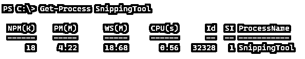
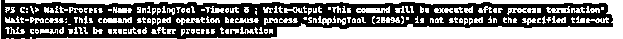
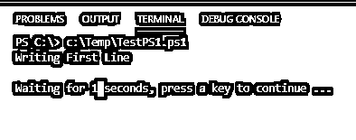
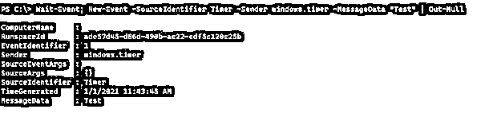
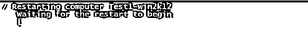

# PowerShell 等待

> 原文：<https://www.educba.com/powershell-wait/>

## PowerShell 等待的定义

PowerShell**wait**cmdlet 用于将执行暂停一段时间，以等待命令、作业或进程完成，通知用户后台作业正在运行并要求等待一段特定时间，重新启动远程系统，并等待它启动，启动和停止虚拟机等，这取决于指定的命令。如果该命令是让后台作业先处理，那么它将等待完成，如果该命令要暂停执行一段时间，那么用户必须等到指定的时间。

**语法:**

<small>Hadoop、数据科学、统计学&其他</small>

**a .等待过程**

上述命令用于在接受新输入或转到下一个命令之前等待进程停止。

**b .等待作业**

该命令用于完成后台作业，在执行完成之前，执行不会进入下一阶段。

**c .开始睡眠**

该命令在指定的时间(秒或毫秒)内暂停脚本执行，并且不能让任何命令或作业在后台等待，而是暂停脚本执行。

**d .等待事件**

该命令暂停脚本或函数的执行，直到引发特定事件，之后继续执行脚本。

**e .等待参数**

许多命令直接在命令中使用-Wait 参数来等待该命令完成，而不是使用单独运行的 **Wait-Job** 命令。

**f .超时**

类似于 **Start-Sleep** 命令，该命令在指定的时间段内暂停脚本的执行。

### PowerShell 中的 **Wait** 方法是如何工作的？

一旦我们使用了 Wait 命令，它就会停止执行，直到后台作业或进程完成，并从上次停止的地方继续执行。有些命令，如**开始睡眠**和**超时**，只是暂停脚本，但不在后台运行任何作业或进程。

### 例子

让我们讨论 PowerShell 等待的例子。

#### 1.等待流程示例

当我们使用命令 **Wait-Process** 时，它等待特定的进程或应用程序停止。该命令接受进程 ID、名称和以秒为单位的超时。

例如，我们有一个正在运行的 SnippingTools 应用程序，我们打算终止它，但是我们会一直等到进程终止。

`Get-Process SnippingTool`

要使用 wait 命令，我们可以使用 ProcessID 或进程的名称。

`Wait-Process -ID 32328
Write-Output "This command will be executed after process termination"`

您还可以提供以秒为单位的超时参数。如果进程没有在指定的时间内终止，它将抛出一个错误。

您还可以为 **Wait-Process** 命令提供多个进程名。

#### 2.开始睡眠示例

这个命令会将执行暂停一段时间，下一个命令会一直等到这段时间。您可以以秒或毫秒为单位提供时间。

`Write-Output "Writing First Line"`

`Start-Sleep -Seconds 5`

Write-Output“该命令将在 5 秒后执行”

还可以提供**-毫秒**参数。

`Start-Sleep -Milliseconds 5000`

#### 碳（carbon 的缩写）超时示例

这是一个 cmd 命令，但也可以在 PowerShell 中访问。以秒为单位指定超时时间后，接下来的命令会一直等待到超时时间。

`Write-Output "Writing First Line"
Timeout /T 5
Write-Output "This command will be executed after 5 seconds"`

**输出:**

用户可以在指定的超时时间内中断，如果想要不间断的超时时间，则使用 **/NoBreak** 开关。

使用 **/NoBreak** 开关的唯一选项是按下 **Ctrl+C** 来终止进一步的执行。

#### d.等待作业示例

当我们使用 **Wait-Job** 命令时，它等待脚本块完成并执行下一行命令。

`$sb = Start-Job -ScriptBlock{
$i = 0
while($i -lt 10){
$i++
Sleep 3
}
}
Wait-Job $sb.Name
Write-Output "This line will be executed after job completes"`

**输出:**

我们还可以在 **Wait-Job** cmdlet 中使用 **-Timeout** 参数以秒为单位指定作业完成的超时时间。如果作业在此期间没有完成，脚本将抛出一个错误。

#### e.等待事件示例

该命令等待引发特定事件，PowerShell 将暂停执行，直到事件触发时再继续执行。

`Wait-Event`

上述命令等待任何下一个事件触发，并在该时间暂停 PowerShell 执行。

我们将在这里创建一个新的测试事件来触发**等待事件**命令。

`Wait-Event;
New-Event -SourceIdentifier Timer -Sender windows.timer -MessageData "Test" | Out-Null`

**输出:**

如果我们有该事件的任何特定来源，我们可以指定那个 **SourceIdentifier** Name。

`Wait-Event -SourceIdentifier "ProcessStarted" -Timeout 200`

#### g.**-等待命令中的**参数

少数命令如 **Restart-Computer、Start-AZVM、Stop-AzVM、**等支持 **-Wait** 参数，在执行了 **-Wait** 参数命令后，执行下一个命令。举个例子，

`Restart-Computer -ComputerName test1-win2k12 -Wait -Force
Write-Output "Get Process command will be executed after server restart"
Get-Process -ComputerName test1-win2k12`

**输出:**

还有其他命令默认包含等待参数，如 **Start-AzVM** 和 **Stop-AzVM** 命令。

`Start-AzVM -Name TestVm -ResourceGroupName TestRG -NoWait
Write-Output "This command will be executed immediately"`

要停止虚拟机，

`Stop-AzVM -Name TestVm -ResourceGroupName TestRG
Write-Output "This command will be executed after VM Stops"`

在第一个命令 **Start-AZVM** 中，指定了-NoWait 参数，以便命令不会等待启动虚拟机，但是在第二个命令 Stop-AZVM 中，默认参数是 Wait，以便下一个命令将等待，直到虚拟机成功停止。

### 结论

PowerShell 中有许多 Wait cmdlets，PowerShell 命令中有受支持的 Wait 参数，因此前面的命令应该先完成，因为有时下一个命令输入依赖于前面命令的输出，我们需要先执行它们。

### 推荐文章

这是 PowerShell 等待指南。这里我们讨论 Wait 方法的定义，它在 PowerShell 中是如何工作的，以及代码实现的例子。您也可以看看以下文章，了解更多信息–

1.  [PowerShell 执行策略](https://www.educba.com/powershell-execution-policy/)
2.  [PowerShell 睡眠](https://www.educba.com/powershell-sleep/)
3.  [PowerShell 子串](https://www.educba.com/powershell-substring/)
4.  [PowerShell 脚本块](https://www.educba.com/powershell-scriptblock/)

