# PowerShell 匹配

> 原文：<https://www.educba.com/powershell-match/>

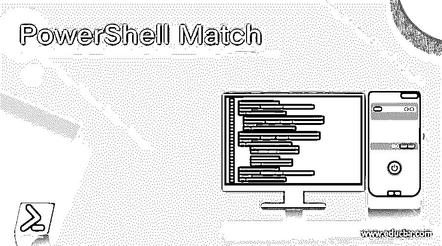

## PowerShell 匹配的定义

PowerShell 匹配操作符(Like、NotLike、match、NotMatch)使用提供的模式或通配符检查输入字符串或关键字是否与特定关键字匹配。模式和使用的通配符取决于所使用的运算符。-Like 和-NotLike 运算符使用通配符，而-Match 和-NotMatch 运算符使用正则表达式。

**语法:**

<small>Hadoop、数据科学、统计学&其他</small>

以下语法用于 PowerShell 匹配运算符。

`<string[]> -like    <wildcard-expression>
<string[]> -notlike <wildcard-expression>
<string[]> -match    <regular-expression>
<string[]> -notmatch <regular-expression>`

### 匹配运算符在 PowerShell 中是如何工作的？

#### 答。-Like 和-NotLike 运算符。

PowerShell **-Like** 和 **-NotLike** 操作符类似于 **-Eq** 或 **-Ne** 操作符，但是它们使用通配符来匹配输入字符串。下面是用于匹配模式的通配符。

通配符:

| * | 匹配零个或多个字符 |
| ? | 匹配该位置的一个字符 |
| [] | 匹配一系列字符 |
| [] | 匹配特定字符 |

通配符(*)匹配字符串中的零个或多个字符，如果输入字符串是长期的，则它给出布尔输出，如果是字符串数组，则匹配的字符串将是如下所示的输出。

`"PowerShell" -like "Power*"`

**输出:**

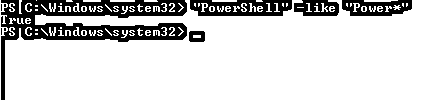

在上面的例子中，通配符(*)匹配它前面的字符串(**不区分大小写**)。

`"PowerShell" -like "Power"`

**输出:**

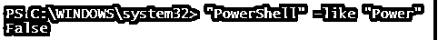

如上图所示， **-like** 运算符在没有通配符的情况下不起作用。当我们在字符串前使用通配符时，它会检查它是否匹配字符串的结尾部分，如下所示。

`"PowerShell" -like "*Shell"`

**输出:**

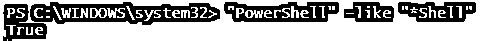

当在两个通配符(*)之间添加关键字时，它会检查该关键字是否是输入字符串的一部分。举个例子，

`"PowerShell" -like "*rsh*"`

**输出:**

**-NotLike** 运算符将给出相反的输出。

`"PowerShell" -Notlike "*rsh*"`

**输出:**

以上示例是针对单个输入字符串的。如果有多个字符串作为输入值，那么它将从输入字符串中返回匹配的值。

`"PowerShell","Azure","Insight" -like "*Sh*"`

**输出:**

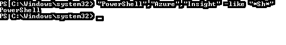

-不像例子。

`"PowerShell","Azure","Insight" -notlike "*Sh*"`

**输出:**

用于匹配特定字符或字符范围的通配符(**[]–方括号**)。

当通配符[]与**破折号('-')** 一起使用时，它匹配字符串中的字符范围。如果找到，则返回**真值**，否则返回**假值**。

`"PowerShell" -like "p[m-p]wershell"`

**输出:**

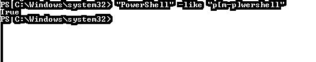

在上面的例子中，字符**‘o’**在[m-p]的范围内，所以上面的输出为真。

类似地，如果我们使用方括号内的字符集，它将匹配它们中的输入字符。举个例子，

`"PowerShell" -like "[pq]owershell"`

**输出:**

在上面的例子中，第一个字符在集合[ **pq** 中匹配，所以输出为真。由于字符' **p** '不属于[ **abc** ]集合，下面的输出将为假。

`"PowerShell" -like "[abc]owershell"`

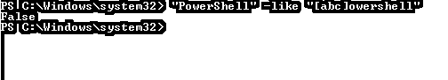

#### B.-Match 和-NotMatch 运算符。

**-匹配**和**-不匹配**操作符使用正则表达式。

*   **字符文字:**

当我们使用部分字符进行匹配时，如果字符存在，-Match 运算符返回 True 输出，否则返回 False。举个例子，

`"IndPC002" -match "IND"`

**输出:**

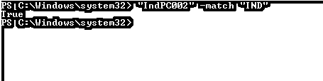

*   **字符组**

`"IndPC002" -match "[ijk]nd[opq]C002"`

**输出:**

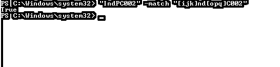

在上面的例子中，字符组与特定位置的输入字符进行比较。如果匹配，则返回输出，否则返回 false。

*   **字符范围**

`"PS" -match "[A-Z][A-Z]"`

**输出:**

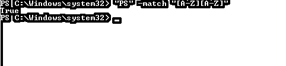

`"PS" -cmatch "[A-Z][0-9]"`

**输出:**

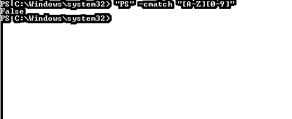

*   **十进制和非十进制数字。**

正则表达式字符 **\d** 匹配十进制数字，而 **\D** 匹配任何非十进制数字。

`2021 -match "\d"`

**输出:**

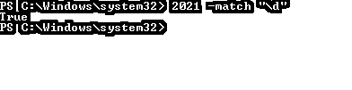

`"2021c" -match "\D"`

**输出:**

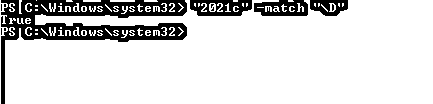

上面的输出是正确的，因为它包含了非数字字符。

*   **字字。**

为了检查输入字符串是否包含单词，我们需要使用 **\w，**，相反， **\W** 表示非单词字符类。

`"PowerShell" -match "\w"`

**输出:**

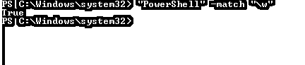

*   **空格和通配符。**

空白与' **\s** '字符匹配，而非空白与 **\S** 字符匹配。

`"a c" -match "[ab]\s[a-z]"`

**输出:**

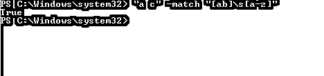

对于通配符匹配**句号(。)**符号使用。它匹配除换行符( **\n** )之外的任何字符。

`"a c" -match "..."
"a c" -match "...."`

**输出:**

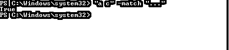

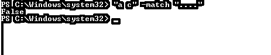

*   **量词**

| + | 一次或多次 |
| * | 零次或多次 |
| ? | 零次或一次 |
| {n，m} | 最小 N，最大 M |

示例:

*   **星号(*)** 匹配前面的字符零次或多次，即使字符不存在，输出也会为真。

`"Hello   PowerShell" -match "\w*\s*PowerShell"`

**输出:**

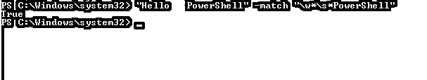

*   **加号(+)** 匹配前一个字符一次或多次。

`"IndNZPC-001" -match "[A-Z]+-\d+"`

**输出:**

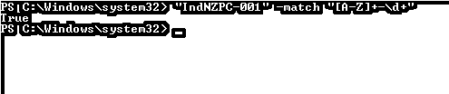

*   **问号(？)**匹配前一个字符零次或一次。在下面的例子中，即使破折号 **(-)** 不存在，输出也将为真。

`"IndNZPC001" -match "[A-Z]+-?\d+"`

**输出:**

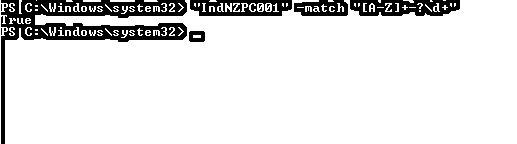

*   **{n，m}** 限定词可以有不同的用法，如下表所示。

| {n} | 精确匹配 N 次 |
| {n，} | 匹配至少 N 次 |
| {n，m} | 最小 N 次和最大 M 次 |

示例:

`'1800-1800-123' -match '\d{4}-\d{4}-\d{3}'`

**输出:**

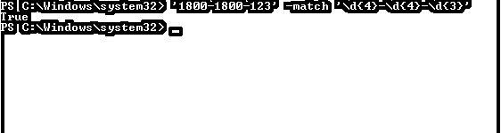

*   **使用锚点:**

PowerShell 主要使用两个锚。**脱字符号(^)** 和**美元($)** 。

**插入符号(^)** 匹配字符串的开头。例如，下面的命令将显示所有以“d”开头的进程。

`Get-Process | where{$_.Name -match "^d"}`

**输出:**

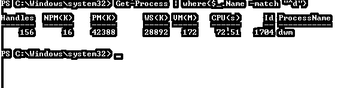

**Dollar ($)** 用于字符串的末尾进行匹配。例如，下面的命令将检索所有以 Host 结尾的进程。

`Get-Process | where{$_.Name -match "host$"}`

**输出:**

您也可以组合使用**插入符号(^)** 和**美元($)** 符号。

### 例子

#### 例#1: Like 操作符过滤特定服务。

`Get-Service | where{$_.Name -like "sp*"}`

**输出:**

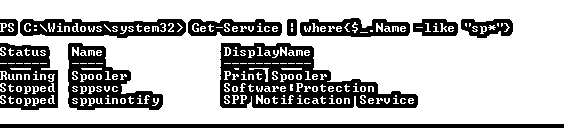

以上示例将检索所有以 SP 开头的服务名。

`Get-Process | where{$_.Name -notlike "*win*"}`

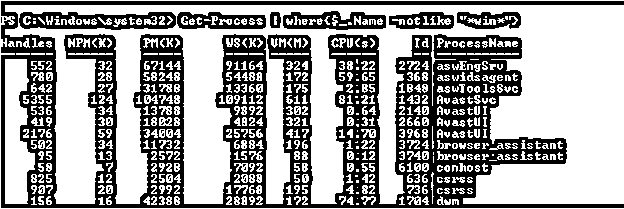

上面的示例将检索进程名称中不包含“ **win** 的所有进程。

#### 示例 2:用于名称验证的匹配操作符

`"IndPC-002" -match "\w-\d"
"IndPC002" -match "\w-\d"`

**输出:**

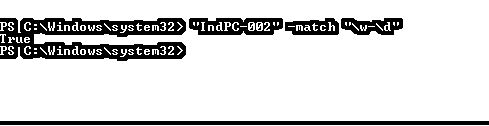

上面的示例验证了服务器名称模式。

#### 示例 3: PowerShell 函数 ValidatePattern

我们可以使用与上面相同的带有函数 **ValidatePattern** 属性的例子，如下所示。

`function ServerValidation{
param(
[ValidatePattern("\w-\d")]$servername
)
Write-Output "Server Name is valid"
}`

**输出:**

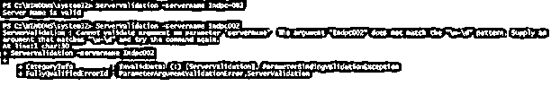

### 结论

当我们在 PowerShell 中处理字符串时，PowerShell 匹配操作符非常有用，此外，为了验证输入形式，我们可以使用 Match 参数，这样我们就不需要编写冗长的代码。这些操作符降低了脚本的复杂性。

### 推荐文章

这是 PowerShell 匹配指南。这里我们讨论 PowerShell 中匹配操作符的定义、语法、参数以及如何工作？带代码实现。您也可以看看以下文章，了解更多信息–

1.  [PowerShell Invoke-Webrequest](https://www.educba.com/powershell-invoke-webrequest/)
2.  [PowerShell 等待](https://www.educba.com/powershell-wait/)
3.  [PowerShell 睡眠](https://www.educba.com/powershell-sleep/)
4.  [PowerShell 子串](https://www.educba.com/powershell-substring/)

