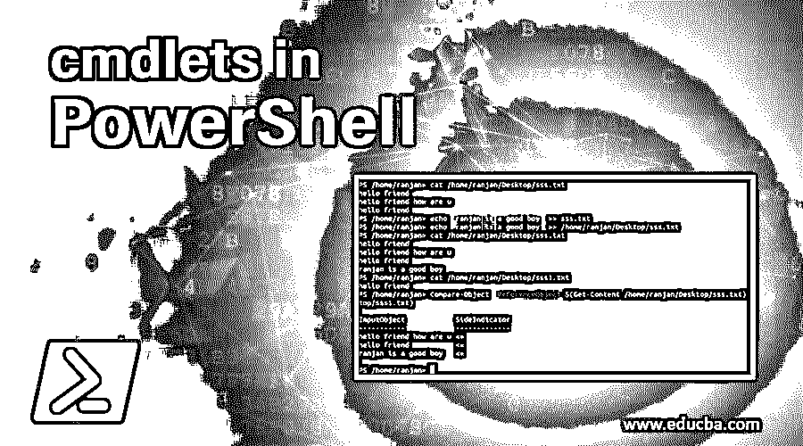
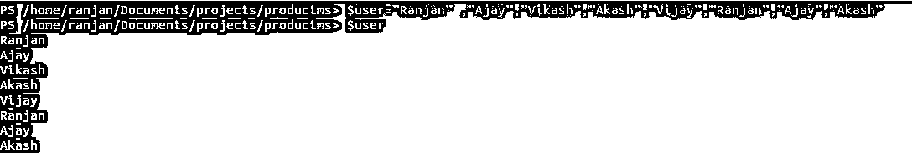
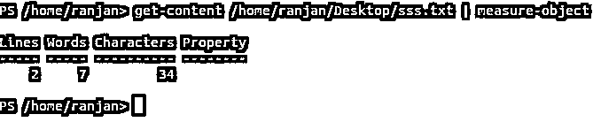
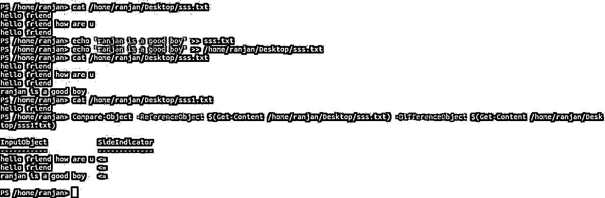
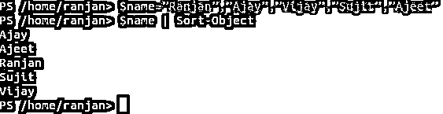
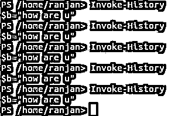
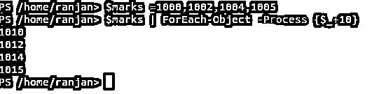
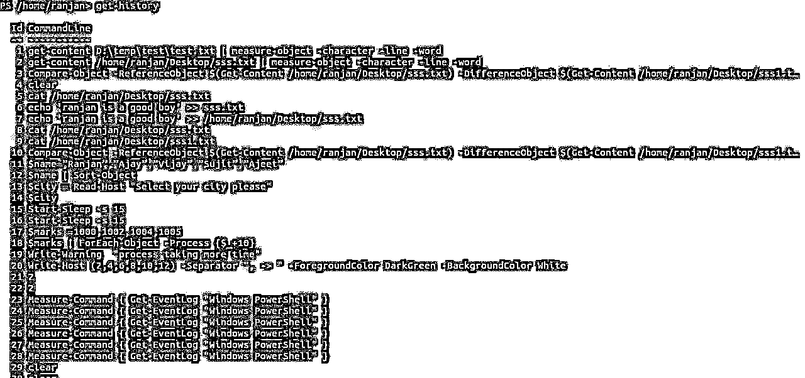
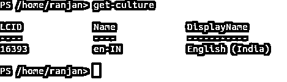
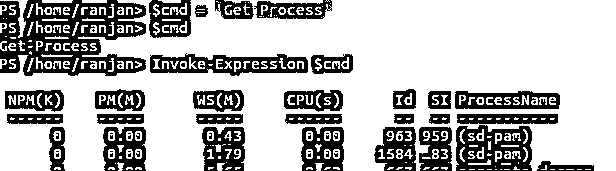

# PowerShell 中的 cmdlets

> 原文：<https://www.educba.com/cmdlets-in-powershell/>

## PowerShell 中的 cmdlets 简介

Cmdlets 是 PowerShell 中的专用[命令，它们实现各种功能来执行特定任务。这些函数是本地函数，执行各种任务。cmdlet 是在 Windows PowerShell 环境中使用的轻型命令。在编写任何自动化脚本时，这些命令都是有用的。我会告诉你一些例子，假设你有一些文件，你想计算文件大小，你可以使用 PowerShell cmdlets。您想要读取文件及其行为，可以使用 cmdlets。](https://www.educba.com/powershell-commands/)

### PowerShell 中 cmdlets 的解释

有许多 cmdlets，我们将讨论他们的使用和真实世界的例子。要编写 cmdlet，我们必须并且应该使用从两个专用 cmdlet 基类之一派生的 cmdlet 类。它们必须采用以下格式。

<small>Hadoop、数据科学、统计学&其他</small>

*   需要属性声明，它应该将派生类标识为 cmdlet。
*   定义用属性修饰的公共属性，这些属性将公共属性标识为 cmdlet 参数。
*   我们需要覆盖至少一个或多个输入处理方法。

在讨论之前，我们应该知道它的一般语法，

**语法:**

`Object/file/string /numer/etc Cmdlets-name1 | Cmdlets-name1 | Cmdlets-name1`

cmdlet-name 1、cmdlet-name 2、cmdlet-name 3 是不同的 cmdlet，我们可以根据需要使用它们。

### PowerShell 中的不同 cmdlets

让我们讨论 cmdlets，

#### 1.获得唯一性

假设我们有一个包含各种用户的数组，我们想要列表中唯一的用户，那么我们将使用 Get-unique。下面是它和屏幕的一个例子。

`$user=”Ranjan”,”Ajay”,”Vikash”,”Akash”,”Vijay”,”Ranjan”,”Ajay”,”Akash”
$user`

**输出:**

这里，同一个用户被重复两次。

`$user=”Ranjan”,”Ajay”,”Vikash”,”Akash”,”Vijay”,”Ranjan”,”Ajay”,”Akash”
$user |  get-unique`

**输出:**

所以从上面的例子，我们可以看到一个小命令可以改变整个输出。

#### 2.分类

排序是任何编程语言的最重要的期望之一，很多时候我们可能有数十万条记录，我们希望看到特定顺序的数据，假设我们有一些用户，但我们希望用户按字母顺序排序，那么我们将使用排序，我们可以使用 get-unique 来获得唯一的结果。

`$user =”Ranjan”,”Ajay”,”Vikash”,”Akash”,”Vijay”,”Ranjan”,”Ajay”,”Akash”
$user | sort | get-unique`

**输出:**

#### 3.测量对象

假设我们有一个文件，我们想知道文件中的行数、字数和字符数，那么我们将使用 Measure-Object cmdlet，Measure-Object cmdlet 可用于获取传递的输出的属性，如最小值、最大值、大小、计数、行数等。在这些例子中，我们看到了 Measure-Object cmdlet 的运行。

在桌面创建一个文件 sss.txt，写两行第一行“hello friend”和第二行“hello friend how are u”并执行下面的命令:

`get-content /home/ranjan/Desktop/sss.txt | measure-object`

记住，要运行这个命令，你必须用 sss.txt 创建一个文件，否则它会抛出一个错误。

**输出:**

#### 4.比较对象

如果您有两个文件，并且两个文件都包含几行，借助 Compare-Object 命令，我们可以检查两个文件中的相似行或匹配行，因此在一个非常简单的 word 中，Compare-Object cmdlet 可用于比较两个对象。在下面的例子中，我们看到了运行中的比较对象 cmdlet。

在这个例子中，首先，我们在/home/ranjan/Desktop 中有一个文件 sss.txt，其内容第一行是“hello friend”，第二行是“hello friend how are u”，第三行是“hello friend”。我们创建了另一个名为 sss1.txt /home/ranjan/Desktop 的文件，内容为“hello friend”。我们将比较线条，匹配项将显示出来。

`Compare-Object -ReferenceObject $(Get-Content /home/ranjan/Desktop/sss.txt) -DifferenceObject $(Get-Content /home/ranjan/Desktop/sss1.txt)`

**输出:**

#### 5.分类对象

cmdlet 用于按属性对对象进行排序。在这些示例中，我们看到了 cmdlet 在示例中使用的 Sort-Object。

`$name=”Ranjan”,”Ajay”,”Vijay”,”Sujit”,”Ajeet”
$name | Sort-Object`

**输出:**

#### 6.读取主机

cmdlet 这个命令允许我们从输入字符串中读取值。在这些示例中，我们看到了 Read-Host cmdlet 的运行。

`$city = Read-Host "Select your city please"
$city`

**输出:**

在这里，我们可以看到它要求输入您的城市名称，您的输入值成为您的城市名称变量$city value 成为“Dhanbad”。

#### 7.开始睡眠

假设你想暂停会话几秒钟，那么我们可以使用“开始-睡眠”

**代码:**

`Start-Sleep 15`

**输出:**

您的会话将停止 15 秒。在这些示例中，我们看到了 Start-Sleep cmdlet 的运行。

#### 8.调用历史记录

在工作的时候假设你想看到历史活动，忘记了最后一个命令，那么我们可以使用调用历史命令。下面给出一个例子，

`Invoke-History`

**输出:**

#### 9.写警告

我们可以自定义警告信息，下面是一些例子，

`Write-Warning "process taking more time"`

**输出:**

#### 10.ForEach-对象

这是一个非常常用的命令，假设您有一些学生的分数数组，我们想在每个学生的分数中添加 10 个分数。为此，我们有一个名为 ForEach-Object 的 cmdlet，下面的屏幕给出了一个例子。

`$marks =1000,1002,1004,1005
$marks | ForEach-Object -Process {$_+10}`

**输出:**

#### 11.获取历史记录

这不同于调用历史，因为在这种情况下，我们将看到所有活动，或所有活动的列表，下面给出了它的示例以及屏幕。

在这些示例中，我们看到了 Get-History cmdlet 的运行。

`Get-history`

**输出:**

get-culture cmdlet 用于获取 windows 中的当前区域性集。在这些示例中，我们看到了 Get-Culture cmdlet 的运行。

`get-culture`

**输出:**

#### 12.调用表达式

我们可以将一个表达式分配给一个变量，并可以用它的表达式值调用该变量，在下面的例子中，我们将一个“Get-Process”命令分配给变量$cmd，然后用 Invoke-Expression $cmd 调用它。

`$cmd = ‘Get-Process'
$cmd
Invoke-Expression $cmd`

**输出:**

### 结论

总之，我们已经看到了 PowerShell 的各种命令，这些命令在编写自动化脚本时非常有用，在这些命令的帮助下，我们可以操纵和处理任何时间的数据和情况。

### 推荐文章

这是 PowerShell 中 cmdlets 的指南。这里我们详细讨论 PowerShell 的解释和前 12 个不同的 cmdlets。您也可以阅读以下文章，了解更多信息——

1.  [PowerShell vs 命令提示符](https://www.educba.com/powershell-vs-command-prompt/)
2.  [列出 Unix Shell 命令](https://www.educba.com/unix-shell-commands/)
3.  [在 PowerShell 中添加内容](https://www.educba.com/add-content-in-powershell/)
4.  [学习 JavaScript 睡眠](https://www.educba.com/javascript-sleep/)

