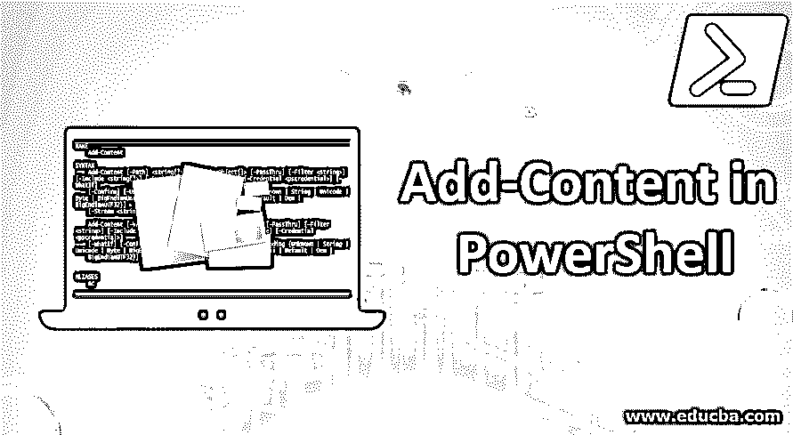
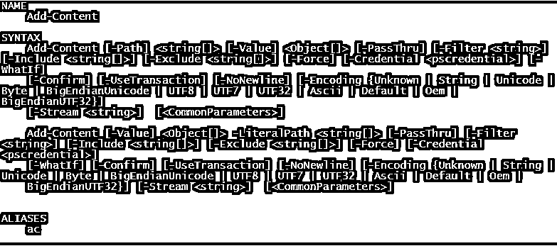

# 在 PowerShell 中添加内容

> 原文：<https://www.educba.com/add-content-in-powershell/>

## PowerShell 中添加内容简介

任何编程语言中最被低估的能力或最被忽视的特性[之一是 I/O 方面或文件处理机制。类似地，在 PowerShell 的 Add-Content 中，很少有内容有助于将输出写入文件、创建新文件或追加到现有文件。一个这样的内容是附加内容，我们将在这篇文章中看到详细的内容。](https://www.educba.com/what-is-a-programming-language/)

**语法:**下面是从 help 命令中得到的最简单的语法。

<small>Hadoop、数据科学、统计学&其他</small>

**输入:** `Get-Help Add-Content`

**输出:**

### PowerShell 中添加内容的参数

下面给出了一些解释的参数:

**1。路径:**指文件所在的路径。这是 cmdlet 运行的强制参数。接受通配符。默认值为 none，其类型为字符串。

**2。值:**这是指要添加的内容。这是 cmdlet 运行的强制参数。不接受通配符。默认值为 none，其类型为 object。

**3。编码:**该参数用于表示文件编码，可选参数。此 ASCII 的默认值。不接受通配符。

**4。Force:** 这也是一个可选参数。此的默认值为 false。这只是为了防止内容添加到只读文件中。不接受通配符。它的类型是开关。

**5。确认:**这也是可选参数。这仅用于在执行 cmdlet 之前显示确认提示。不接受通配符。它的类型是开关。

**6。Exclude:** 这也是一个可选参数。其默认值为无。这用于指定需要包含的任何路径或文件。也接受通配符。它的类型是字符串。

7 .**。Include:** 这也是可选参数。其默认值为无。这用于指定需要包含的任何路径或文件。也接受通配符。它的类型是字符串。

**8。过滤器:**用于指定路径的过滤器。这也是一个可选参数。接受通配符，默认值为无。它的类型是字符串。

**9。LiteralPath:** 用于指定一个或多个位置的路径。这也是一个可选参数，其默认值为 none。此参数不接受通配符。它的类型是字符串。

10。NoNewline: 这个参数也是可选的。这表示不在内容中添加新行。其默认值为 none，不接受通配符。它的类型是开关。

**11。WhatIf:** 这个参数是可选的。其类型为开关，默认值为无。它不接受通配符。它用于查看 cmdlet 运行时的输出。

**12。UseTransaction:** 该参数可选。其类型为开关，默认值为无。它不接受通配符。它仅在事务运行时使用。

**示例语法**

`Add-Content “file path” ‘Content”`

**例如**添加内容 C:\testfolder\test.txt“添加内容”

上面的 cmdlet 将指定的内容附加到测试文件(如果存在)，否则它会自动创建文件并将内容添加到其中。

### PowerShell 中的附加内容示例

以下是一些例子——

#### 示例#1

**输入:** `Add-Content -Path *. -Value "TestAppend"`

**输出:**

上述命令会将值“test append”添加到当前文件夹中的所有文本文件中。要更改文件夹位置，请运行以下命令

`Set-Location -Path “directory path”`

#### 实施例 2

**输入:** `Add-Content D:\test\test1\test2.txt ‘example!'`

**输出:**

上面的命令会将内容添加到 test2 文件中。

#### 实施例 3

**输入:** `Add-Content 'C:\Vignesh\append.txt'  "date! $(Get-Date)"`

**输出:**

在上面的示例中，当前日期和时间被附加到文件中。

#### 实施例 4

**输入:** `Add-Content -Path a.txt, b.txt -Value (get-date)`

**输出:**

上面的 cmdlet 将当前日期和时间添加到文本文件中。

#### 实施例 5

**输入:** `Get-Content c:\source.txt | Add-Content D:\dest.txt`

**输出:**

上面的 cmdlet 将 dest.txt 的内容追加到 source.txt

#### 实施例 6

**输入:** `Add-Content -Path source.txt -Value (Get-Content c:\destination.txt)`

**输出:**

上面的内容首先使用 get-content 从 destination.txt 中检索内容。然后，传递该值以添加到 source.txt 文件中。

#### 实施例 7

**输入:** `Add-Content C:\vignesh\append.txt "`nLine1"
Add-Content C:\vignesh\append.txt "`nLine2"
Add-Content C:\vignesh\append.txt "`nLine3"
Add-Content C:\vignesh\append.txt "`nLine4"`

**输出:**

线路 1

第 2 行

第 3 行

第 4 行

由于有一个序列，上面的代码每次都会在新的一行中写入输出。

为了在输出内容中包含制表符，使用了" ` t "

#### 实施例 8

**输入:** `Add-Content C:\vignesh\append.txt "`nsname`tm1`tm2`tm3"
Add-Content C:\vignesh\append.txt "`ns1`t4`t32`t28"
Add-Content C:\vignesh\append.txt "`ns2`t3`t50`t15"
Add-Content C:\vignesh\append.txt "`ns3`t12`t13`t84"`

**输出:**

名称 m1 m2 m3

s1 4 32 28

s2 3 50 15

s3 12 13 84

#### 实施例 9

**输入:** `Add-Content -Value (Get-Content test.txt) -path C:\ram\test134.txt`

**输出** t:

在上面的例子中，首先，get-content 的值是通过读取 test.txt 文件获得的。这是作为要添加到 test134.txt 的值传递的。ram 文件夹不存在，它是动态创建的。

也可以使用 Add-content 将内容写入 csv 文件。下面是一个生成 csv 文件的示例。

#### 实施例#10

**输入:**

`Add-Content -Path C:\studentreport.csv  -Value '"Name","Subject1","Subject2","subject3","Total"'
$students = @(
'"ram",10,20,30,60'
'"mary",40,50,60,150'
'"peter",30,30,30,90'
'"john",30,30,30,90'
'"elizabeth",30,30,30,90'
'"John",40,50,60,150'
'"Shiv",40,50,60,150'
)
$students | foreach { Add-Content -Path  C:\studentreport.csv -Value $_ }`

**输出:**

将生成一个 csv 文件，其内容如下所示

| 名字 | 主题 1 | 主题 2 | 主题 3 | 总数 |
| 公羊 | Ten | Twenty | Thirty | Sixty |
| 玛丽 | Forty | Fifty | Sixty | One hundred and fifty |
| 彼得 | Thirty | Thirty | Thirty | Ninety |
| 约翰 | Thirty | Thirty | Thirty | Ninety |
| 伊丽莎白一世 | Thirty | Thirty | Thirty | Ninety |
| 约翰 | Forty | Fifty | Sixty | One hundred and fifty |
| 刀 | Forty | Fifty | Sixty | One hundred and fifty |

### 结论

当用户需要同时对多个文件执行简单的文件操作时，Add-content 非常有用。这减少了所需的手动工作，有时，如果文件不存在，add-content 会自动创建文件，而不是手动检查文件是否存在。

### 推荐文章

这是在 PowerShell 中添加内容的指南。这里我们讨论 PowerShell 中 Add-Content 的介绍、参数，以及输入和输出的例子。您也可以浏览我们推荐的其他文章，了解更多信息——

1.  [MATLAB 函数](https://www.educba.com/matlab-functions/)
2.  [现在 Excel 函数](https://www.educba.com/now-function-in-excel/)
3.  [PowerShell 字符串函数](https://www.educba.com/powershell-string-functions/)
4.  [Powershell 的用途](https://www.educba.com/uses-of-powershell/)
5.  [如何声明和初始化 PowerShell 变量？](https://www.educba.com/powershell-variables/)
6.  [了解 PowerShell 中的数组](https://www.educba.com/array-in-powershell/)
7.  [PowerShell 获取日期|示例|参数](https://www.educba.com/powershell-get-date/)

