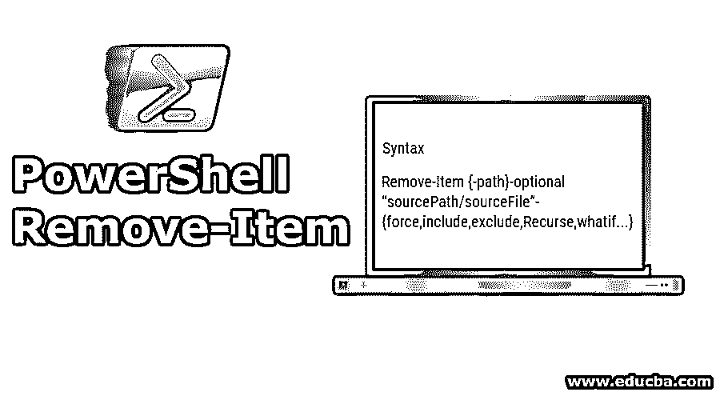
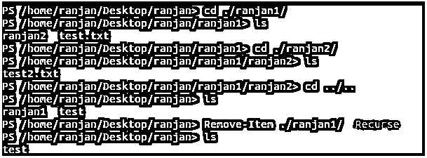
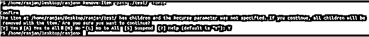
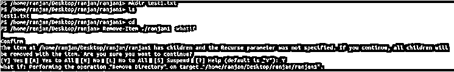
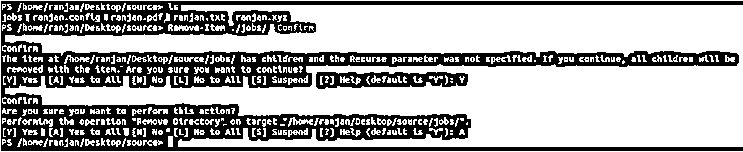
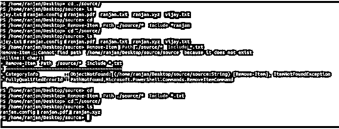

# PowerShell 删除-项目

> 原文：<https://www.educba.com/powershell-remove-item/>

## PowerShell Remove-Item 简介

删除文件在我们的生活中很常见，所以我们每天都在删除一些文件和数据，几乎所有的编程语言都提供了删除文件的功能，但是 PowerShell 的好处是它可以删除除文件以外的许多东西，比如注册表、别名和函数。如果我们多次删除任何系统文件，所有相关文件都不会被删除，因此在 PowerShell Remove-Item 的帮助下，我们甚至可以删除相关文件。它可以删除任何大文件与删除所有相关文件的速度更好。我们将在本主题中讨论语法和用法以及基本实践。

**语法**

<small>Hadoop、数据科学、统计学&其他</small>

PowerShell Remove-Item 的一个非常简单的语法是

`Remove-Item {-path}-optional “sourcePath/sourceFile”-{force,include,exclude,Recurse,whatif...}`

下面的语法涵盖了常用的东西，

`Remove-Item
[-Path(source folder location)] <array of string>-optional
[-Force]-optional
[-Filter <String(filter contents for delete)>]-optional
[-Include <array of string>](specify contents need to be included like *.pdf,*.txt)-optional
[-Exclude <array of string>](specify contents need to be excluded like *txt ,*pdf)-optional
[-Recurse](this commands allow to delete folder containing another folder folder)-optional
[-WhatIf](It shows what can happen if command run)-optional
[-Confirm](before  deleting any file ask for confirmation)-optional
[<CommonParameters>]`

### 因素

以下是 PowerShell Remove-Item 的以下参数，请参见下文:

*   **确认:**我们可能会错误地运行删除命令，我们知道删除命令可能会犯很大的错误，因此对于这种情况，确认将非常有用，因为它会在删除前询问您一次。
*   **Exclude:** 这个命令接受一个数组，所以你可以在这些命令中提到你想要排除的任何一项。我们也可以在 exclude 命令中使用通配符**，**比如" *txt" **，**
*   **过滤器:**在这里我们可以指定 Remove-item 命令的过滤器参数。
*   **Force:** 很多时候，当文件打开时，我们无法删除它，所以通过使用命令-Force 我们可以删除它。在这里，它将提供删除那些不允许删除的项目的权限，例如，如果有任何具有只读权限的文件，并且我们想要删除该文件，那么我们可以使用此命令。或者举另一个例子，如果文件已经打开，我们想删除它，我们可以使用-Force。
*   **Include:** Include 执行与-exclude 类似的任务，唯一的区别是这里可以定义通配符，用于在删除文件或介质时包含的文件。**T3】**
*   **LiteralPath:** 这个命令可以删除一个或多个位置上的文件，在数组格式中我们可以定义它们为一个字符串格式的数组，我们应该非常小心地使用这个命令。**T3】**
*   **路径:**这是我们将要删除项目的路径。这个路径命令也允许使用通配符。
*   **Recurse:** 在这里，它删除包含文件夹的文件夹，就像我们删除一个名为/Ranjan 的文件夹，它包含另外三个文件夹/job /education /locations，所有这些文件夹都包含更多的文件夹，这意味着子文件夹在子文件夹中。因此，要删除这种文件系统，我们使用-Recurse 命令。
*   **WhatIf:** 这只显示命令运行时可能发生的情况，或者简单地说，它描述了命令的结果。

### 实现 Power Shell Remove-Item 的示例

以下是实现 Power Shell Remove-Item 的示例。

#### 示例#1

让我们删除里面没有任何内容的文件。这里我们只是简单地删除一个里面什么也没有的文件夹。下面给出了一个屏幕示例。

`Remove-Item ./test1/`

从测试文件夹中删除名称中包含“-”的所有文件。这是一个非常有用的命令，因为我们在这里删除所有包含名称“-”的文件。我们可以在下图中看到最初文件夹 test 包含 4 个文件，其中两个文件“ranjan-pandey.txt”和“苏曼-库马尔. txt”包含“-”。因此，在运行下面的命令时，它将删除这两个文件。

`Remove-Item ./test/*-*`

**输出:**

#### 实施例 2

让我们做一些递归删除，在这种情况下，我们将删除一个文件夹(目录),这个文件夹还包含一个子目录。

`Remove-Item ./ranjan1/ -Recurse`

**输出:**

在上面的示例中，文件夹“ranjan1”包含“ranjan2”和“test.txt”文件，而“ranjan2”又包含“test2.txt”。现在，要删除 ranjan1 文件夹，我们需要编写 command -Recurse 和 Remove-Item。

#### 实施例 3

很多时候，一些隐藏文件甚至在删除所有内容后仍然存在，所以要执行完全删除，我们可以使用“-Force”。让我们举一个命令的例子——Force Remove，这个命令在我们有一些隐藏文件时使用，所以要删除隐藏文件我们可以使用 Force。

`Remove-Item -path ./test/ -Force`

**输出:**

在这个例子中-Force 将从测试中删除所有文件以及任何隐藏文件。

#### 实施例 4

whatIf 命令，这个命令显示在执行命令时会发生什么，请看下图。

`Remove-Item ./ranjan1 -whatif`

**输出:**

#### 实施例 5

在本例中，我们涵盖了“-Confirm”。我们正在尝试使用 passing -Confirm 命令删除文件夹作业。一旦我们运行此命令，它会询问您是否要删除它，一旦我们说“是”，它会显示错误文件已经存在，您可以理解-Confirm 命令的效用，因为即使在运行该命令后，只有在您同意的情况下，文件才会被删除，这意味着出现任何错误的可能性非常小。

`Delete-Item -path ./source/ -Confirm`

**输出:**

#### 实施例 6

让我在这里给你解释一个非常有用的例子，假设你想删除文件夹中所有带有特定扩展名的文件，比如。txt“，”。xls“，”。pdf”。

`Remove-Item -Path ./source/* -Include *.txt`

**输出:**

在上面的例子中，我们删除了所有包含“.txt "作为扩展名。同样你可以试着删除”。pdp”和”。配置”扩展名。当我们有非常大量的文件，并且我们想要删除一些特定的带有特定扩展名的文件时，这些命令非常有用。

### 结论 PowerShell 删除-项目

PowerShell Remove-Item 命令是一个非常有用的命令，当文件系统中有大量文件时，它起着非常关键的作用。当我们必须删除带有巨大子文件夹的文件时，它提供了各种类型的支持命令，如-Force、Include 和许多其他命令来执行它的特殊任务。

### 推荐文章

这是 PowerShell 删除项目的指南。在这里，我们将讨论 Power Shell Remove-Item 的参数以及相应的示例。您也可以阅读以下文章，了解更多信息——

1.  [PowerShell 命令](https://www.educba.com/powershell-commands/)
2.  [PowerShell 字符串函数](https://www.educba.com/powershell-string-functions/)
3.  [如何安装 PowerShell](https://www.educba.com/install-powershell/)
4.  [PowerShell 操作员](https://www.educba.com/powershell-operators/)
5.  [PowerShell Move-Item |参数和示例](https://www.educba.com/powershell-move-item/)
6.  [PowerShell 详细日期示例](https://www.educba.com/powershell-date/)

