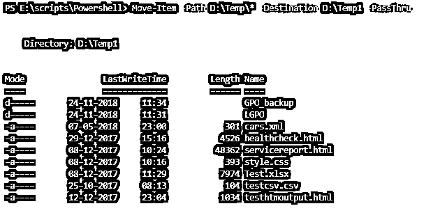
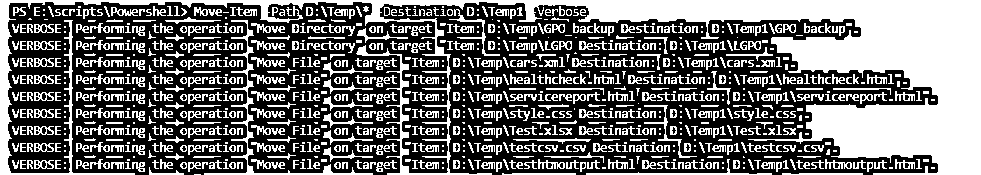
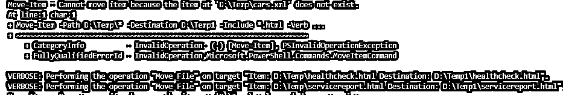
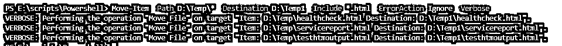
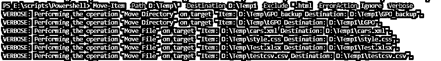
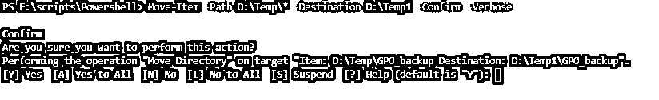
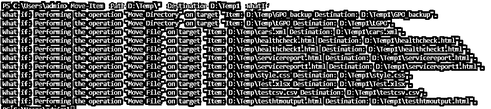

# PowerShell 移动-项目

> 原文：<https://www.educba.com/powershell-move-item/>

## PowerShell 中移动项目简介

在本文中，我们将了解 PowerShell Move-Item。Powershell 中的 Move-Item cmdlet 的工作方式类似于 Windows 中的剪切/粘贴选项。它将文件、文件夹、注册表及其属性、内容和子项从一个位置移动到另一个位置。该位置必须由同一提供商支持。当您将项目从一个位置移动到另一个位置时，它基本上会从原始位置删除项目并移动到另一个位置。

**语法**

<small>Hadoop、数据科学、统计学&其他</small>

`Move-Item
[-Path] <String[]>
[[-Destination] <String>] [-Force] [-Filter <String>] [-Include <String[]>] [-Exclude <String[]>] [-PassThru] [-Credential <PSCredential>] [-WhatIf] [-Confirm] [<CommonParameters>]`

**语法**

`Move-Item
-LiteralPath <String[]>
[[-Destination] <String>] [-Force] [-Filter <String>] [-Include <String[]>] [-Exclude <String[]>] [-PassThru] [-Credential <PSCredential>] [-WhatIf] [-Confirm] [<CommonParameters>]`

### PowerShell 移动项目的参数

以下是 PowerShell Move-Item 中使用的参数:

*   **路径:**指定文件的源位置。默认目录是当前目录。您也可以指定(。)作为当前位置。允许使用通配符参数。您可以使用通配符(*)来指代目录中的所有项目。
*   **LiternalPath:** 与-path 参数几乎相同，只是您需要键入准确的路径值，因为不允许使用通配符参数。没有字符被解释为通配符。如果你想使用转义字符，那么在单引号中使用它们。一旦它们出现在单引号中，PowerShell 会将转义字符视为字符串。了解有关转义(特殊)字符的更多信息。https://docs.microsoft.com/
*   **目的地:**将要移动到所需位置的物品的路径。如果目标路径不可用，那么它将抛出一个异常，但是您可以重命名文件名，您需要在目标参数本身中提供一个新的文件名。默认目标是当前位置，允许使用通配符，但结果必须指定一个位置。
*   **强制:**将项目移动到目标文件夹，无需用户确认。此外，如果在目标位置发现任何重复的项目，则在满足安全权限的情况下覆盖它们。它还可以移动系统的只读文件。
*   **包含:**包含特定的文件名(C:\temp\test*)或扩展名(*。pdf)从源路径移动到目标位置。允许使用通配符。当指定了源路径的内容时，参数 Include 很有用。例如，在源路径 c:\temp\*中，它将包括 c:\temp 文件夹中的所有文件，然后无论在 include 参数 Move-Item cmdlet 中设置什么筛选器，都将相应地工作。
*   **排除:**排除特定文件名(c:\temp\test*)或扩展名(*。txt ),这样它们就不会被移动到目标位置。允许使用通配符参数。同样，您需要使用整个文件夹或注册表内容来过滤掉特定的数据。
*   **Filter:** Filter 参数比 Include 和 Exclude 参数更有效，因为它在检索对象时应用过滤器，而不是在检索值后过滤对象。类似通配符支持的过滤器的确切语法取决于提供者。
*   **PassThru:** 使用 PassThru 参数时，命令的输出返回到 PowerShell 控制台。
*   **凭证:**如果源目录和目标目录在不同的域或工作站上，并且它们使用不同的凭证，则您需要指定目标主机凭证。您可以使用 Get-Credential 将凭据存储在变量中，并将其提供给 Credential 参数。例如，$cred = Get-Credential。如果您在–Credential 参数后提供用户名，它将提示您输入密码。
*   **Whatif:** 显示在不执行命令的情况下运行命令会发生什么。
*   **确认:**在执行任何动作之前进行确认。当您使用此参数时，您会得到以下选项。是[A]对所有人都是[N]否[L]否对所有人都是暂停[？]帮助(默认为“Y”):
*   **公共参数:**下面是与 Move-Item cmdlet 一起使用的公共参数，也称为高级函数参数。详细，-调试，-错误操作，-警告操作，-信息操作，-错误变量，-警告变量，-信息变量，-输出变量，-输出缓冲，-管道变量，-使用事务

### 实现 PowerShell Move-Item 的示例

以下是 PowerShell Move-Item 的示例:

#### 1.移动具有来源和目的地的项目

`Move-Item -Path D:\Temp\* -Destination D:\Temp1`

如果您使用通配符(*)，则它将移动文件夹内容，否则它将移动整个文件夹。在上面的示例中，您看不到哪些文件从源移动到了目标，因为没有指定显式参数，但是当您使用 PassThru(在控制台本身中返回输出)或–Verbose 参数时，输出/进程将仅在 PowerShell 控制台中显示。

#### 2.使用–pass thru 移动项目

**代码:**

`Move-Item -Path D:\Temp\* -Destination D:\Temp1 -PassThru`

**输出:**

#### 3.使用–Verbose 移动项目

**代码:**

`Move-Item -Path D:\Temp\* -Destination D:\Temp1 -Verbose`

**输出:**

#### 4.使用–Include 移动项目

**代码:**

`Move-Item -Path D:\Temp\* -Destination D:\Temp1 –Include *.html -Verbose`

**对上面代码的解释:**在上面的例子中，脚本将移动所有具有。html 扩展。当我们只使用 Include 参数时，脚本会对没有 HTML 扩展名的文件或文件夹抛出一个错误。

**输出:**

我们可以通过–error action 参数简单地消除上述异常。

**代码:**

`Move-Item -Path D:\Temp\* -Destination D:\Temp1 -Include *.html -ErrorAction Ignore -Verbose`

**输出:**

#### 5.使用–Exclude 移动项目

**代码:**

`Move-Item -Path D:\Temp\* -Destination D:\Temp1 -Exclude *.html -ErrorAction Ignore -Verbose`

**输出:**

在上述示例中，文件将被移动，但不包括。html 文件复制到目标文件夹。

#### 6.移动包含子项目的项目

当我们使用通配符时，它只包括该文件夹下的项目，而不包括子文件夹。例如，D:\temp\*文件夹不能过滤 D:\temp\LGPO 下或其他子文件夹下的文件。为此，我们需要首先使用 Get-ChildItem 和–Recurse 参数提取文件，然后将它们移动到另一个位置。

**代码:**

`Get-ChildItem -Path D:\Temp -Recurse -Include *.html | Move-Item -Destination D:\Temp1 -Verbose`

**输出:**

#### 7.移动项目并确认

**代码:**

`Move-Item -Path D:\Temp\* -Destination D:\Temp1 -Confirm -Verbose`

它会在移动任何项目之前等待用户的确认。

**输出:**

#### 8.使用假设条件移动项目

**代码:**

`Move-Item -Path D:\Temp\* -Destination D:\Temp1 -WhatIf`

显示了在没有实际运行命令的情况下执行命令会发生什么。

**输出:**

#### 9.使用–凭据移动项目

**代码:**

`Move-Item -Path D:\Temp\* -Destination D:\Temp1 -Credential ad\xyz`

上述命令将打开一个用户名为 ad\xyz (domain\username)的凭据框。

**输出:**

### 推荐文章

这是 PowerShell 移动项目的指南。这里我们用适当的例子来讨论 PowerShell Move-Item 的参数。您也可以浏览我们的其他相关文章，了解更多信息——

1.  [什么是 PowerShell](https://www.educba.com/what-is-powershell/)
2.  [PowerShell 变量](https://www.educba.com/powershell-variables/)
3.  [PowerShell 字符串函数](https://www.educba.com/powershell-string-functions/)
4.  [如何安装 PowerShell](https://www.educba.com/install-powershell/)
5.  [PowerShell 指南日期](https://www.educba.com/powershell-date/)

