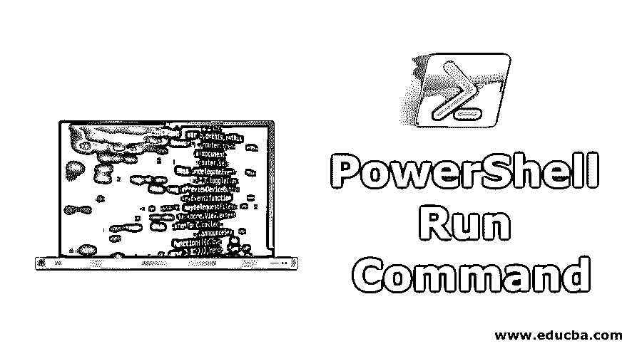
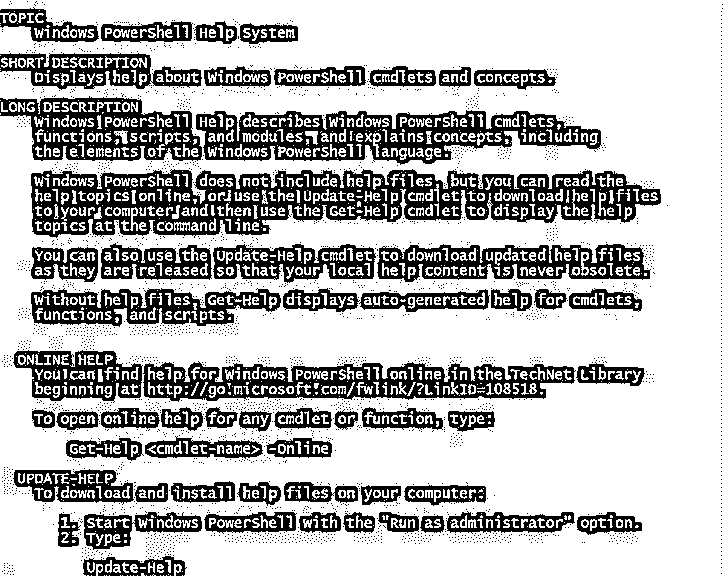
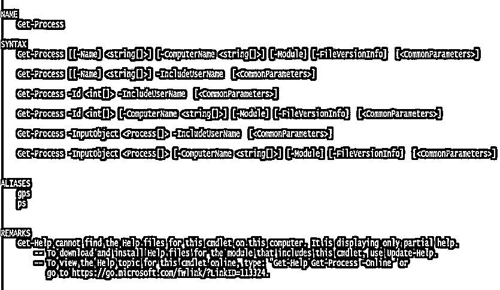
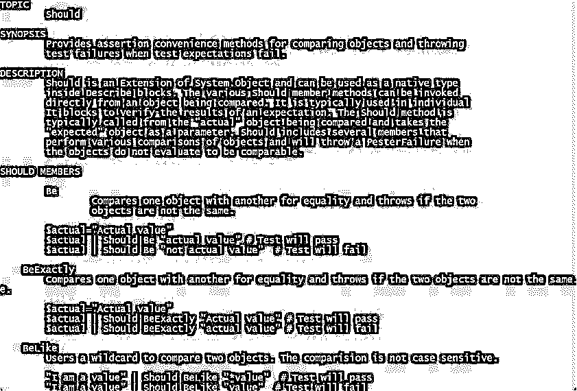
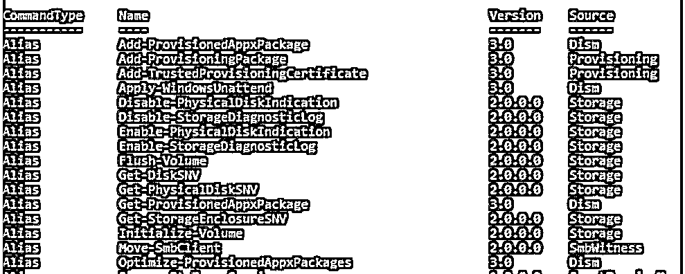
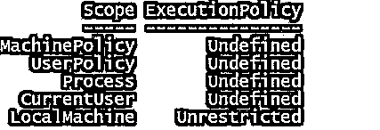
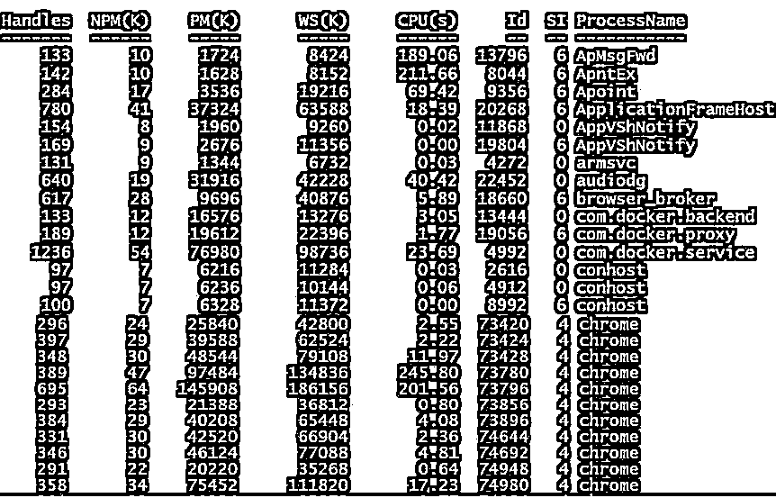
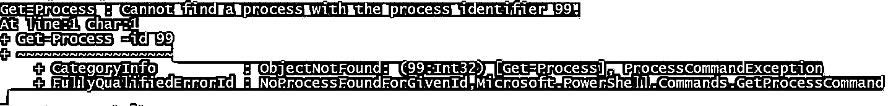
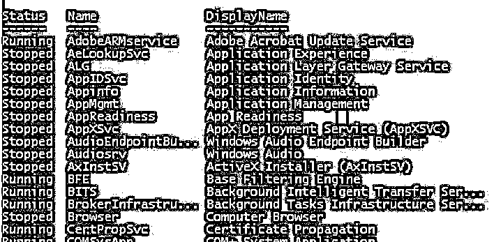
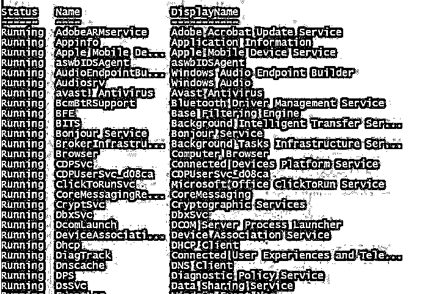

# PowerShell 运行命令

> 原文：<https://www.educba.com/powershell-run-command/>

## PowerShell 运行命令简介

PowerShell 运行命令这篇文章是关于 PowerShell 运行命令的，每个 IT 专业人员和系统管理员都应该知道这些命令。

*   PowerShell Run 命令对于通过 PowerShell 无缝、流畅地完成工作至关重要。
*   [PowerShell 命令](https://www.educba.com/powershell-commands/)被称为 cmdlet(Command-Let)。
*   用户可以使用这些命令来执行各种管理任务，从监控到管理服务器、测试和调试脚本以及其他管理任务。

### 基本 PowerShell 运行命令

让我们浏览一些非常基本和重要的 PowerShell 命令，以了解它们在执行各种任务时的用途。

<small>Hadoop、数据科学、统计学&其他</small>

这些命令有助于从不同的数据源(如文件或文件夹系统、注册表等)检索各种格式的信息。

#### 1.获得帮助

1.  这个 PowerShell 命令是每个管理员或开发人员都应该知道的最基本的命令。
2.  简单地说，获取有关其他命令的信息有助于获取其他命令的帮助。

该命令的语法是:

`Get-Help`

**输出**:

Windows 将显示有关如何使用其他命令从 PowerShell 获得帮助的完整信息。

让我们来看看这个命令如何适用于我们需要信息的特定命令或 cmdlet。

`Get-Help Get-Process`

**输出**:

以上命令显示了有关 cmdlet“Get-Process”的完整信息以及完整的命令语法。

要查看任何帮助文档，可以键入 Get-Help，后跟帮助文件的确切名称。

**例如，**

`Get-Help about_should`

应该是一个帮助文件，上面的语法是为了获取关于这个帮助文件的信息。

**输出**:

带有完整描述和示例的文件内容显示在屏幕上。

#### 2.获取命令

此 cmdlet 用于获取您可以在当前会话中使用的命令(类型别名、函数和脚本)的完整列表。

这个 cmdlet 的语法是`VERB-NOUN`

在哪里，

动词指的是获取、设置、添加、清除、读取和写入

名词指系统中的文件、服务器、存储和各种其他项目。

**举例:**

`Get-Command`

**输出:**

*   **具体来说，如果您想获得唯一别名类型的列表，cmdlet 应该是**

`Get-Command -CommandType Alias`

*   **对于函数类型，cmdlet 应该是**

`Get-Command -CommandType Function`

*   **对于脚本，cmdlet 应该是**

`Get-Command -CommandType Script`

#### 3.获取执行策略

*   出于安全原因，默认情况下，Microsoft 限制用户在 PowerShell 环境中执行脚本。
*   为了使用脚本，用户需要更改默认设置或默认策略。

为此，首先应该熟悉运行脚本的执行策略。下面给出了这方面的 cmdlet

`Get-ExecutionPolicy -List`

**输出:**

这将显示执行策略及其范围的列表。

该列表显示，对于本地机器*，*的执行策略已经更改为无限制。

#### 4.获取流程

*   此 cmdlet 显示本地计算机上当前正在运行的所有进程的列表。如果没有传递参数，此 cmdlet 将返回系统上所有活动的进程。

**举例:**

`Get-Process`

**输出:**

*   对于特定的进程，您可以指定进程名称或进程 Id(Id)。

**举例:**

`Get-Process -id 0`

这个 cmdlet 会显示 **Id 为 0** 的进程，也就是空闲进程。

**输出:**

**注意** *:* 如果没有具有指定 Id 的进程，这意味着 Id 是错误的或者特定的进程已经退出。

**例如，**

下面的 cmdlet 搜索 Id 为 99 的进程。

`Get-Process -id 99`

**输出:**

这将引发一个错误，指出没有找到 Id 为 99 的进程。

*   您可以使用“Stop-Process”通过指定名称或 Id 来停止正在运行的进程。

**例如，**

在您的本地机器上运行着一个进程“计算器”。

`Get-Process -ProcessName Calculator`

若要停止此过程，可以键入以下 cmdlet

`Stop-Process -ProcessName Calculator`

这将终止计算器的运行实例。

#### 5.获取服务

*   此 cmdlet 返回本地计算机上的所有服务，无论这些服务是正在运行还是已停止。
*   如果此 cmdlet 没有传递任何参数，则返回本地计算机的所有服务。

**举例:**

`Get-Service`

**输出:**

返回所有正在运行和已停止的服务。

若要获取正在运行的服务，请键入以下 cmdlet。

`Get-Service | Where-Object {$_.Status –eq “Running”}`

**输出:**

还可以使用 Get-Member cmdlet 获取服务的属性。

`Get-Service | Get-Member`

**输出:**

此 cmdlet 显示作为 Get-Service cmdlet 输出生成的对象的属性和方法。

(|)管道运算符在这里的作用是将 Get-Service cmdlet 的输出发送给 Get-Member cmdlet。

#### 6.哪里对象

*   它用于从传递给它的对象列表中选择具有特定值的对象。

**举例:**

`Get-Service | Where-Object {$_.Status -eq 'Running'}`

这个 cmdlet 将简单地获取一个对象集合，并将其传递给管道操作符进行过滤，以返回一个状态为“正在运行”的服务列表。

#### 7.convertto-html 格式

*   当您希望根据有关系统的信息创建报告时，此 cmdlet 非常有用。
*   为此，只需使用管道(|)操作符将一个命令的输出提供给 ConvertTo-HTML。
*   HTML 基本上转换微软。NET Framework 对象转换为 HTML 以在 web 浏览器中显示。

**例如，**

您可以创建网页并显示 PowerShell 别名。

`Get-Alias | ConvertTo-Html | Out-File Display_Alias.htm
invoke-item Display_Alias.htm`

这将在网页上显示所有别名。

*   您也可以将信息导出为. csv 文件

`Get-Alias | ConvertTo-Html > Display_Alias.htm
invoke-item Display_Alias.htm`

#### 8.获取事件日志

*   使用此 cmdlet，您可以从本地计算机以及远程计算机获取事件日志。
*   获取本地系统中的事件日志列表

`Get-EventLog -List`

**输出:**

### 结论

*   本文向您介绍了在 PowerShell 中工作的非常基本但非常重要的命令。
*   在这里，我们试图理解各种 PowerShell 命令的目的和用途。
*   这对于监控和故障排除以及管理各种管理任务非常有帮助。
*   PowerShell 命令都是关于易于记忆和执行的 cmdlets。
*   一旦您掌握了至少基本的 PowerShell 命令，您就可以充分利用 PowerShell，因为它将大大简化您的日常手动任务。

### 推荐文章

这是 PowerShell 运行命令指南。在这里，我们讨论基本的 PowerShell 运行命令以及相应的示例和输出。您也可以浏览我们推荐的其他文章，了解更多信息——

1.  [在 PowerShell 中添加内容](https://www.educba.com/add-content-in-powershell/)
2.  [PowerShell 日期与示例](https://www.educba.com/powershell-date/)
3.  [PowerShell 输出文件的示例和参数](https://www.educba.com/powershell-out-file/)
4.  [PowerShell 别名|如何访问和创建？](https://www.educba.com/powershell-alias/)
5.  [PowerShell While 循环](https://www.educba.com/powershell-while-loop/)

