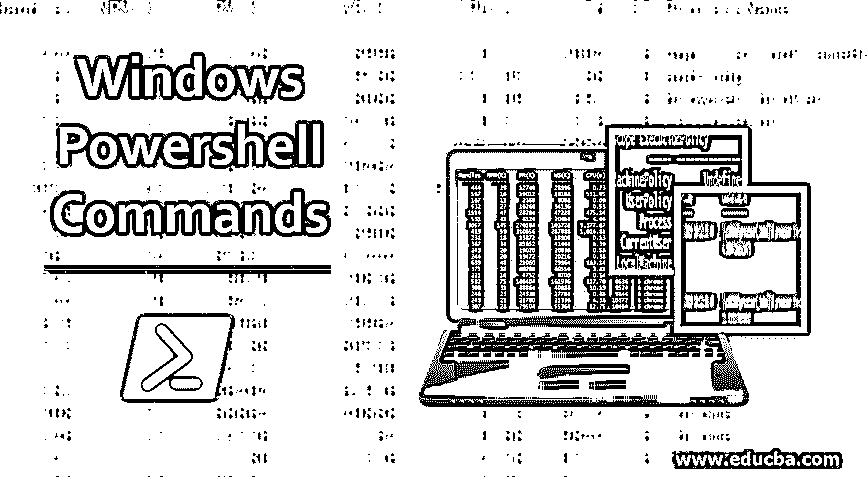
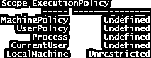
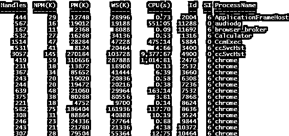
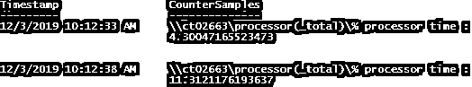

# Windows Powershell 命令

> 原文：<https://www.educba.com/windows-powershell-commands/>

## Windows Powershell 命令简介

以下文章概述了 Windows Powershell 命令。Windows PowerShell 是一种脚本语言，构建于。net 平台，旨在自动执行与 windows 应用程序和管理相关的任务。术语 PowerShell 是运行命令/脚本的语言和界面的组合。PowerShell 的第一个版本于 2006 年推出。有两种类型的界面可以运行 can PowerShell 命令；windows PowerShell 就像一个可以运行 PowerShell cmdlet 的命令提示符，而 [Windows PowerShell ISE](https://www.educba.com/windows-powershell-ise/) 就是可以运行和调试 PowerShell 脚本(PowerShell cmdlet 的汇编)的地方。它是一种面向对象的语言，因此允许它与。网络接口。它现在是开源的，也可以安装在其他操作系统上。

要启动 PowerShell 会话，请在命令提示符 PowerShell cmdlets 和变量中键入“PowerShell”。PowerShell 中的命令被称为“cmdlets”。可以通过运行下面的 cmdlet 获得可用列表。

<small>Hadoop、数据科学、统计学&其他</small>

**代码:**

`Get-Command`

上面返回了 PowerShell 中几乎 1500 个可用的 PowerShell cmdlets。

### 11 个重要且强大的 cmdlets

以下是 11 个重要的 Windows PowerShell 命令:

#### 1.获得帮助

对于任何人来说，记住任何编程语言的语法或 cmdlets 都是困难且乏味的任务。为了克服这一挑战，PowerShell 提供了大量帮助文章。要获得有关任何 PowerShell cmdlet 的帮助，可以使用 Get-Help cmdlet。它为 cmdlet 提供了语法和使用方法。

**语法:**

`Get-Help “Cmdletname”`

**举例:**

`Get-Help Get-Process This will display the syntax and the aliases of Get-Process Cmdlet`

#### 2.集合执行策略

设置的执行策略用于确定运行 PowerShell cmdlet 或脚本的策略。换句话说，它用于阻止所有用户的某些操作。它被用来给予一些特殊的许可。

**语法:**

`Set-ExecutionPolicy
[-ExecutionPolicy] <ExecutionPolicy>
[[-Scope] <ExecutionPolicyScope>] [-Force] [-WhatIf] [-Confirm] [<CommonParameters>]`

**举例:**

`Set-ExecutionPolicy -ExecutionPolicy RemoteSigned -Scope CurrentUser`

在上面的示例中，远程签名策略应用于当前用户。

#### 3.获取执行策略

在任何环境中运行命令或脚本之前，最好了解当前的执行策略。Get-ExecutionPolicy 用于此目的。

**语法:**

`Get-ExecutionPolicy
[[-Scope] <ExecutionPolicyScope>] [-List] [<CommonParameters>]`

**举例:**

`Get-ExecutionPolicy -List`

**输出:**

上面显示了当前 PowerShell 会话的执行策略。

#### 4.获取服务

上面的 cmdlet 返回所有可用的服务。

**语法:**

`Get-Service
[[-Name] <String[]>] [-DependentServices] [-RequiredServices] [-Include <String[]>] [-Exclude <String[]>] [<CommonParameters>]`

**例 1:**

`Get-Servicek`

以上将返回所有可用服务的列表。

**例 2:**

`Get-Service -Displayname "*network*"`

上面返回了名称中包含网络的服务。

#### 5.出口-CSV

上述命令用于将 cmdlet 或脚本的输出导出到 csv 文件。

**语法:**

`Export-Csv
[[-Path] <string>] [[-Delimiter] <char>] -InputObject <psobject>
[-LiteralPath <string>] [-Force] [-NoClobber] [-Encoding <Encoding>] [-Append] [-IncludeTypeInformation] [-NoTypeInformation] [-WhatIf] [-Confirm] [<CommonParameters>]`

**举例:**

`Get-Command | Export-CSV c:\commands.csv`

以上内容会将可用命令的列表输出到 CSV 文件中。

#### 6.获取事件日志

上述命令返回系统事件查看器中的事件。

**语法:**

`Get-EventLog
[-LogName] <String>
[-ComputerName <String[]>] [-Newest <Int32>] [-After <DateTime>] [-Before <DateTime>] [-UserName <String[]>] [[-InstanceId] <Int64[]>] [-Index <Int32[]>] [-EntryType <String[]>] [-Source <String[]>] [-Message <String>] [-AsBaseObject] [<CommonParameters>]`

**举例:**

`Get-EventLog -Log "Application"  - Newest 10`

上面返回了前 10 个应用程序日志。

#### 7.获取流程

了解系统上当前运行的一组进程。

**语法:**

`Get-Process
[[-Name] <String[]>] [-Module] [-FileVersionInfo] [<CommonParameters>]`

**举例:**

`Get-Process | Where-Object {$_.WorkingSet -gt 70000000}`

运行 Get-Process 会显示以下结果。

**输出:**

上面的 cmdlet 显示了占用超过 70 MB 的进程。

#### 8.停止进程

顾名思义，上面的 cmdlet 就是杀死一个进程。

**语法:**

`Stop-Process
[-Id] <Int32[]>
[-PassThru] [-Force] [-WhatIf] [-Confirm] [<CommonParameters>]`

**例 1:**

`Stop-Process -Name "calc"`

上面的 cmdlet 停止了计算器进程。

**例 2:**

`Stop-Process -ID 2668`

上面用相应的 id 杀死了进程。

#### 9.哪里对象

它用于过滤目的。

**语法:**

`Where-Object
[-InputObject <PSObject>] [-Property] <String>
[[-Value] <Object>] [-EQ] [<CommonParameters>]`

**举例:**

`Get-Service | Where-Object {$_.Status -eq 'Running'}`

上述命令返回当前正在运行的服务。

#### 10.检查点计算机

每当执行有风险的任务时，都会使用这个 cmdlet。它会在系统上创建一个恢复点。

**语法:**

`Checkpoint-Computer
[-Description] <String>
[[-RestorePointType] <String>] [<CommonParameters&gt;]`

**举例:**

`checkpoint-computer -description "restorpoint"`

#### 11.获取计数器

此 cmdlet 用于确定影响系统性能的各种参数。

**语法**:

`Get-Counter
[[-Counter] <String[]>] [-SampleInterval <Int32>] [-MaxSamples <Int64>] [-Continuous] [-ComputerName <String[]>] [<CommonParameters>]`

**举例:**

`Get-Counter -Counter "\Processor(_Total)\% Processor Time" -SampleInterval 5 -MaxSamples 2`

上面的命令获取五秒钟间隔内两个样本的处理器时间。

**输出:**

### 结论–Windows Powershell 命令

因此，本文涵盖了一些顶级 Powershell cmdlets。Powershell 中大约有 1500 多个可用的 cmdlets，了解它们的最佳方式是使用 get-help 命令并探索它们。

### 推荐文章

这是 Windows Powershell 命令指南。这里我们讨论 11 个最常用的 windows Powershell 命令以及语法和示例。您也可以浏览我们推荐的其他文章，了解更多信息——

1.  [PowerShell 列表](https://www.educba.com/powershell-list/)
2.  [PowerShell 添加到阵列](https://www.educba.com/powershell-add-to-array/)
3.  [PowerShell 动词](https://www.educba.com/powershell-verbs/)
4.  [PowerShell 测试连接](https://www.educba.com/powershell-test-connection/)

