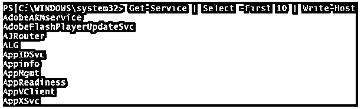
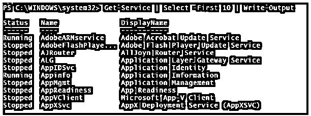

# Powershell 写入主机

> 原文：<https://www.educba.com/powershell-write-host/>

## Powershell 写入主机简介

write-host cmdlet 用于在 PowerShell 控制台中显示输出。您可以使用各种字体颜色和背景颜色来自定义显示的输出。当对象被传递给管道写主机时，它并不把它当作对象，而是把它当作一个名称参数或值，而只是在控制台中显示输出。

### 句法

`Write-Host
[[-Object] <Object>] [-NoNewline] [-Separator <Object>] [-ForegroundColor <ConsoleColor>] [-BackgroundColor <ConsoleColor>] [<CommonParameters>]`

<small>Hadoop、数据科学、统计学&其他</small>

#### 因素

*   **–对象:**用于在控制台输出中显示。一般来说，对象是字符串对象，变量或者可以是运算值。
*   **–NoNewLine:**使用该参数，输出将继续到同一行，而不是新行。
*   **–分隔符:**您可以用指定的字符或单词分隔括号中的单词。在后面的例子中给出了解释。
*   **–foreground color**:显示输出时，可以设置文本的颜色。没有默认颜色。

颜色如下:

| -黑色 | 深蓝色 |
| 深绿色 | -暗青色 |
| -DarkRed | -深洋红色 |
| -暗黄色 | -灰色 |
| 深灰色 | -蓝色 |
| 绿色 | -青色 |
| -红色 | -洋红色 |
| 黄色 | -白色 |

*   **–背景颜色:**该参数指定文本的背景颜色。没有默认颜色。颜色如下。

| -黑色 | 深蓝色 |
| 深绿色 | -暗青色 |
| -DarkRed | -深洋红色 |
| -暗黄色 | -灰色 |
| 深灰色 | -蓝色 |
| 绿色 | -青色 |
| -红色 | -洋红色 |
| 黄色 | -白色 |

*   **<公共参数> :** 该 cmdlet 支持公共参数。详细、调试、ErrorAction、ErrorVariable、WarningAction、WarningVariable、OutBuffer、PipelineVariable 和 OutVariable。

### Powershell 写主机示例

下面给出了 Powershell 写主机的一些示例:

#### 示例#1:用对象写主机

`Write-Host "This is a Simple String"`

**输出:**

类似地，您可以通过将字符串传递到管道来编写相同的代码，输出将与上面相同。

`"This is a simple string" | Write-Host`

现在假设，我们一起传递多个对象。让我们考虑对写主机的获取服务。

`Get-Service | Select -First 10 | Write-Host`

**输出:**

但是当你使用写输出时

`Get-Service | Select -First 10 | Write-Output`

**输出:**

因此，write-host 只写入服务的名称，而不是整个 Get-Service 输出，因为 Write-Host cmdlet 不能将整个输出作为单个对象处理，而是作为单个值或字符串处理。您可以使用 Write-Output 参数显示所有默认值。

#### 示例#2:使用–NoNewLine 写入主机

默认情况下，当 write-host 命令在 end new line 参数处执行时，也会执行该参数，因此无论您写入什么输出都将出现在下一行中，但是使用–NoNewLine 参数时，输出将被连接起来。

`Write-Host "This is first line..." -NoNewline
Write-Host "There is no space"`

**输出:**

#### 示例#3:使用–分隔符写入主机

使用 separator 参数，您可以在每个值之间放置一个特定的字符或单词。举个例子，

`Write-Host (1,2,3,4,5) -Separator "->"`

**输出:**

`Write-Host ("This","is","string") -Separator ","`

您也可以用特定的单词来分隔值。

`Write-Host ("This","is","string") -Separator " hi "`

分隔符不适用于单个值或字符串。

`Write-Host "This is string" -Separator "->"`

Note: Separator is not to replace a specific word.

#### 示例#4:使用–foreground color 写入主机

有时您需要用特定的颜色显示输出文本。您可以使用不同的颜色来显示文本。

`Write-Host "This is magenta foreground text" -ForegroundColor Magenta`

**输出:**

`Write-Host "This is Dark cyan foreground text" -ForegroundColor DarkCyan`

#### 示例#5:使用–background color 写入主机

您可以使用此参数更改文本的背景颜色。

`Write-Host "This is white text with Dark Red background"-
BackgroundColor DarkRed`

`Write-Host "Magenta text with green background" -ForegroundColor Magenta -
BackgroundColor green`

Note: Background parameter doesn’t change the console color, it just changes the background color of the text it displaying.

### 结论

写主机不能捕获或存储输出，它只是显示输出。要捕获输出，您需要使用 write-output cmdlet，但是使用后一个命令，您不能使用不同的颜色。

例如，下面的命令输出不会存储在 test.txt 中，而是显示在 PowerShell 控制台中。

`Write-Host "Simple text" > c:\test.txt`

但是当你使用写输出时，你可以存储在一个文本文件中。

`Write-Output "Simple text" > c:\test.txt`

### 推荐文章

这是 Powershell 写主机的指南。这里我们讨论 Powershell Write-Host 的语法、参数和各种示例，以及相应的代码和输出。您也可以看看以下文章，了解更多信息–

1.  [PowerShell 中的数组](https://www.educba.com/array-in-powershell/)
2.  [PowerShell ForEach 循环](https://www.educba.com/powershell-foreach-loop/)
3.  [在 PowerShell 中添加内容](https://www.educba.com/add-content-in-powershell/)
4.  [可执行的命令](https://www.educba.com/ansible-commands/)

