# PowerShell Get-ChildItem

> 原文：<https://www.educba.com/powershell-get-childitem/>

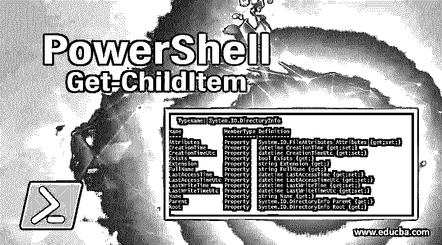

## PowerShell Get-ChildItem 简介

PowerShell 中的 Get-ChildItem 类似于 windows 命令提示符中的 dir 命令。它可用于从指定位置检索数据。在 PowerShell 子文件夹中，文件或注册表称为子项。如果您想从子容器中检索项目，那么您需要使用–Recurse 参数。类似于 cmd 中的 dir /s。

位置可以是文件系统位置，如本地目录、共享路径目录、注册表配置单元或证书存储。当您对系统驱动器使用 Get-ChildItem 时，它会检索目录、子目录和文件，但当您对目录使用它时，它会检索子目录及其下的文件。它的别名是 gci。

<small>Hadoop、数据科学、统计学&其他</small>

**语法#1:**

`Get-ChildItem
[[-Path] <string[]>] [[-Filter] <string>] [-Include <string[]>] [-Exclude <string[]>] [-Recurse] [-Depth <uint32>] [-Force] [-Name] [-Attributes <FlagsExpression[FileAttributes]>] [-FollowSymlink] [-Directory] [-File] [-Hidden] [-ReadOnly] [-System] [<CommonParameters>]`

**语法#2:**

`Get-ChildItem
[[-Filter] <string>] -LiteralPath <string[]>
[-Include <string[]>] [-Exclude <string[]>] [-Recurse] [-Depth <uint32>] [-Force] [-Name] [-Attributes <FlagsExpression[FileAttributes]>] [-FollowSymlink] [-Directory] [-File] [-Hidden] [-ReadOnly] [-System] [<CommonParameters>]`

### PowerShell Get-ChildItem 的参数

以下是 PowerShell Get-ChildItem 的参数，解释如下:

**1)–属性<文件属性> :** 该参数获取指定属性的文件和文件夹。使用此参数时，可以指定复杂的属性组合。

**例子:**

*   获取加密的系统文件。

`Get-ChildItem -Attributes System+Encrypted`

*   获取加密或压缩的非系统文件(非目录)。

`Get-ChildItem -Attributes !Directory+!System+Encrypted, !Directory+!System+Compressed`

运算符及其属性之间不能使用空格，但逗号前允许有空格。Attribute 参数支持下列属性。

| 档案馆 | 脱机的 |
| 压缩的 | 只读的 |
| 设备 | 维修点 |
| 目录 | 稀疏文件 |
| 把…加密 | 系统 |
| 隐藏的 | 暂时的 |
| 常态 | NotContentIndexed |

以下运算符可用于组合属性:

| ! | 不 |
| + | 和 |
| , | 运筹学 |

以下缩写用于属性:

*   **D:** 目录
*   **H:** 隐藏
*   只读
*   **S:** 系统

**2)–Directory:**当您使用-Directory 参数时，您将仅获得目录(文件夹)作为子项，这将排除显示文件。要排除目录，请使用-file 属性。它的别名是“d”或“ad”，取决于文件系统提供商。

**3)–File:**File 属性仅输出该容器下的文件。要排除文件，您需要使用-Directory 参数。它的别名是“af”。

**4)-Hidden:**默认情况下，Get-ChildItem 显示非隐藏的文件和文件夹。如果你想显示所有文件和文件夹，包括隐藏的，那么使用-Force 参数。当您使用-Hidden 参数时，它将只显示隐藏的文件和文件夹。它的别名是“h”或“ah”，取决于文件系统提供商。

**5)–Readonly:**只显示只读文件和文件夹(目录)。它的别名是“ar”。

**6)–系统:**该属性将只显示系统文件和文件夹。它的别名是“as”。

**7)–Force:**该属性将提供所有文件和文件夹，包括隐藏的文件和文件夹。默认情况下，不包括隐藏的文件和文件夹。我们也可以用-hidden 参数得到隐藏的文件和目录。

**8)-use transaction:**将命令包含在活动事务中。当当前事务正在进行时，此参数有效。要了解有关事务的更多信息，请查看 PowerShell about_Transactions 中的帮助。

**9)–深度:**该参数用于控制目录的递归。默认情况下，Get-ChildItem 为您提供父文件和文件夹，当您使用递归时，它提供所有子目录及其内容，但当您使用深度参数时，您可以获得子目录及其内容的确切级别。

例如，当您提供深度级别 2 时，它从一级子目录和二级子目录中获取内容。使用–Depth 参数时，不需要 Recurse 参数。Powershell 5.0 中引入了此参数。

**10)–Exclude:**字符串参数，在–Exclude 之后指定，可以排除文件、目录、扩展名等。您可以使用通配符，例如*。txt，测试*。

**11)–Include:**这是一个字符串参数，使用该参数时，显示具体的文件和文件夹。比如说，如果 ***** 。txt 文件，那么它将只显示文本文件。您可以包含多个选项。比如，*。txt，*.mp4 都可以包含在内，用逗号(，)分隔。

**12)–Filter:**也可以用-filter 参数过滤路径。filter 参数比 include 参数更有效，因为它在查询时检索对象，而其他参数在查询后检索。此参数支持通配符。文件系统提供程序是唯一支持使用过滤器的 PowerShell 提供程序。

**13)-路径:**该参数指定一个或多个位置的路径。您可以在 path 中使用通配符，如果未指定位置，它会将当前位置作为默认位置。

**14)-文字路径:**该参数指定一个或多个位置的路径。与-path 参数不同，您不能在这里指定通配符，因为该参数不能将字符解释为通配符。如果您的路径包含任何转义字符，请在单引号下标记它们，PowerShell 会将其视为单个路径。

**15)–Name:**该参数从 Get-ChildItem 输出中获取项目的唯一名称，而不是目录、mode、LastWriteTime 等的路径。

**16)-公共参数:**使用以下公共参数，也称为高级功能参数。Verbose、Debug、ErrorAction、ErrorVariable、WarningAction、WarningAction、WarningVariable、OutBuffer、PipelineVariable 和 OutVariable。

### Get-ChildItem 支持的属性和操作

以下是 Get-ChildItem 支持的属性和操作，解释如下:

**1。目录属性**

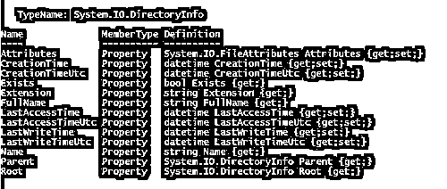

**2。文件**的属性

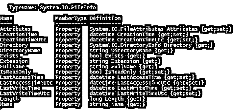

**3。方法目录**

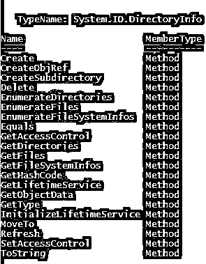

**4。方法文件**

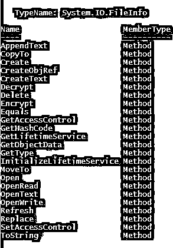

### PowerShell Get-ChildItem 的示例

以下是 PowerShell Get-ChildItem 的一些示例:

#### 示例# 1–父文件和文件夹

下面的脚本将显示父文件和文件夹。

`Get-ChildItem -Path D:\Temp`

**输出:**

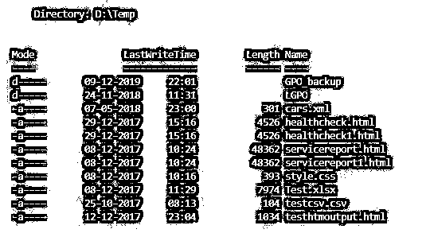

#### 示例 2–递归参数

下面的脚本将显示子文件和文件夹内容，但不显示隐藏文件。

`Get-ChildItem -Path D:\Temp -Recurse`

**输出:**

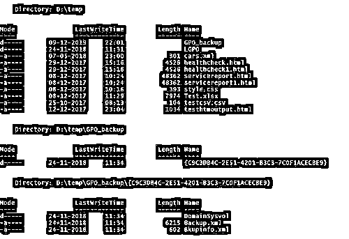

#### 示例 3–深度参数

下面的脚本将显示子文件和文件夹的内容，最多 2 层，分别是子文件夹及其子文件夹的内容。

`Get-ChildItem -Path D:\Temp -Recurse -Depth 2`

**输出:**

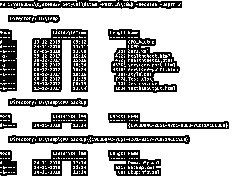

#### 示例 4–隐藏参数

下面的脚本将只显示给定路径中的隐藏文件。

`Get-ChildItem -Path D:\Temp -Recurse -Hidden`

**输出:**

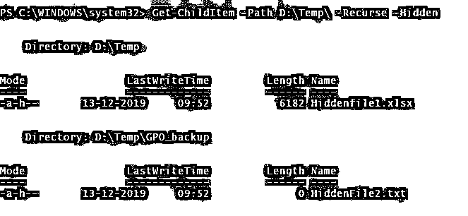

#### 示例 5–包含参数

以下脚本将包括所有扩展名为*的文件。可扩展标记语言

`Get-ChildItem -Path D:\Temp -Recurse -Include *.xml`

**输出:**

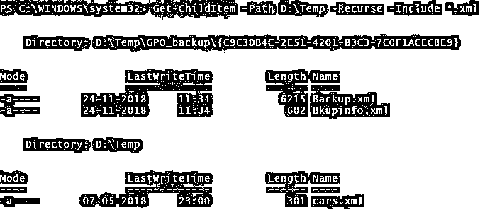

#### 示例 6–排除参数

以下脚本将排除以 s 开头的文件和文件夹。

`Get-ChildItem -Path D:\Temp -Exclude S*`

**输出:**

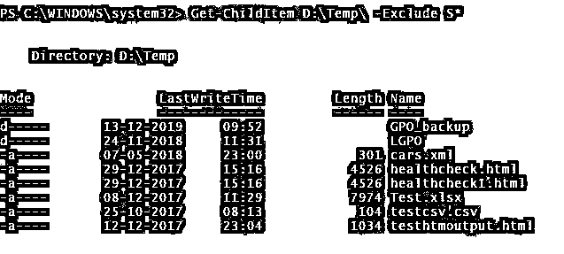

#### 示例 7–力参数

下面的脚本将显示子文件和文件夹的内容以及隐藏的文件。

`Get-ChildItem -Path D:\Temp -Depth 1 -Force`

**输出:**

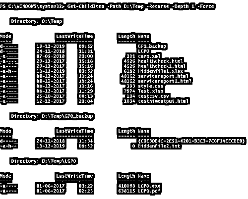

#### 示例 8–属性参数

下面的脚本将排除目录并检查隐藏文件。同样，您可以组合不同的属性来获得想要的结果。

`Get-ChildItem d:\Temp -Recurse -Attributes !Directory,!Directory+Hidden`

**输出:**

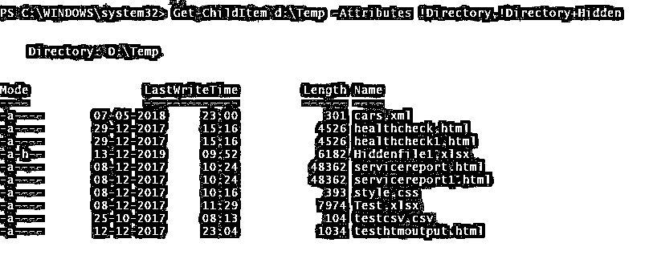

#### 示例 9–名称参数

下面的脚本将只显示文件和文件夹的名称，不包括其他参数。

`Get-ChildItem d:\Temp -Recurse -Attributes !Directory,!Directory+Hidden -Name`

**输出:**

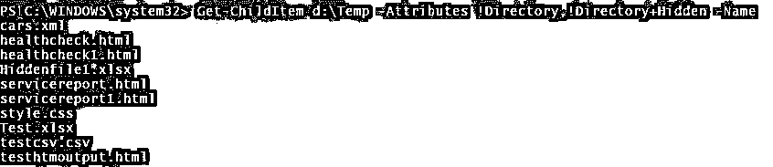

#### 示例# 10–注册表值

您还可以检索各种注册表值，如下所示。

`Get-ChildItem -Path Registry::HKEY_LOCAL_MACHINE
Get-ChildItem -Path Registry::HKEY_CLASSES_ROOT
Get-ChildItem -Path Registry::HKEY_CURRENT_CONFIG
Get-ChildItem -Path Registry::HKEY_CURRENT_USER
Get-ChildItem -Path Registry::HKEY_USERS
Get-ChildItem -Path Registry::HKEY_PERFORMANCE_DATA`

#### 示例# 11–证书

获取要在下面命令中使用的所有证书。

`Get-ChildItem -Path Cert:\* -Recurse`

### 推荐文章

这是 PowerShell Get-ChildItem 的指南。这里我们讨论 PowerShell Get-ChildItem 的前 16 个参数、操作和各种例子。您也可以阅读以下文章，了解更多信息——

1.  [PowerShell 中添加内容的参数](https://www.educba.com/add-content-in-powershell/)
2.  [在 PowerShell 中获取帮助的示例](https://www.educba.com/get-help-in-powershell/)
3.  [PowerShell vs CMD](https://www.educba.com/powershell-vs-cmd/)
4.  [十大 PowerShell 面试问题](https://www.educba.com/powershell-interview-questions/)
5.  [PowerShell 格式表完整指南](https://www.educba.com/powershell-format-table/)
6.  [了解 PowerShell 获取位置](https://www.educba.com/powershell-get-location/)

