# PowerShell 排序-对象

> 原文：<https://www.educba.com/powershell-sort-object/>

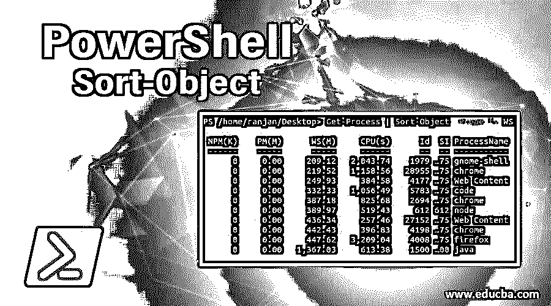

## PowerShell 排序对象简介

在本文中，我们将讨论不同的 PowerShell 排序对象。排序是任何编程语言中必不可少的工作。当我们需要某种模式的结果来分析数据时，总是会用到排序。让我告诉你一个例子，假设你有一些学生的详细资料，你想看到按字母顺序排序的结果。

**举例:**

<small>Hadoop、数据科学、统计学&其他</small>

`$students =”Ranjan”,”Ajay”,”Vijay”,”Sujit”,”Ajeet”,”Akash”,”Vikash”
$students`

**输出:**

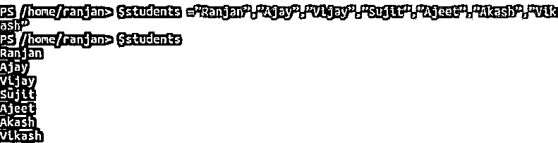

这个输出没有经过排序，

`$students | Sort-Object`

**输出:**

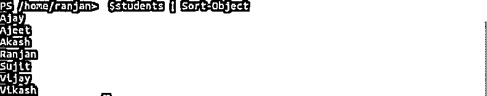

执行的输出可以在下图中看到。最初的结果是，" Ranjan "，" Ajay "，" Vijay "，" Sujit "，" Ajeet "，" Akash "，" Vikash "排序后我们得到了结果 Ajay Ajeet Akash ran Jan Sujit Vijay Vikash。这里他们按字母顺序排序。我们可以根据目录的属性对数字和任何目录进行排序。我们将讨论更多的例子。请参见下面的示例屏幕。

### PowerShell 排序对象的语法和参数

一个非常简单的语法是{Array，directory } | Sort-Object。我们在 PowerShell 中使用“|”作为分隔符，您可以用“|”分隔任意多的命令。Sort-Object 具有各种其他参数，如属性(定义排序属性标准，如长度、大小和类型等)。

`Attribute for sorting  | Sort-Object | command 1 | command 2 | command 3`

**语法#1:**

`Sort-Object
[-Stable] [-Descending(order in which we need output)] [-Unique(use this to remove all duplicate and return unique values)] [[-Property] <pass all the properties on which you want to do sorting like length,date,cpu uses etc>] [-CaseSensitive(Sorting either case sensitive or case non sensitivity )] [<CommonParameters>]`

**语法#2:**

`Sort-Object
[-Descending(order in which we need output)] [-Unique(use this to remove all duplicate and return unique values)] -Top <Integer values>
[[-Property] <pass all the properties on which you want to do sorting like length,date,cpu uses etc>] [-CaseSensitive(Sorting either case sensitive or case non sensitivity )] [<CommonParameters>]`

**语法#3:**

`Sort-Object
[-Descending(order in which we need output)] [-Unique(use this to remove all duplicate and return unique values)] -Bottom <Integer values>
[[-Property] <pass all the properties on which you want to do sorting like length,date,cpu uses etc>] [-CaseSensitive(Sorting either case sensitive or case non sensitivity )] [<CommonParameters>]`

**参数:**

*   **-Bottom:** 定义了要从数组末尾获取的对象编号(排序后的对象)。
*   **-区分大小写:**如果我们需要输出排序后的元素而不考虑字母的大小写，我们使用这个命令，这意味着小写或大写字母将被视为相同。请记住，默认情况下，它不区分大小写。
*   **-Path:** 它表示我们运行排序命令的路径。
*   **Descending:** Descending 表示排序的顺序，所以假设您有许多数字，并且您想以降序查看结果，那么我们可以使用 Descending 命令和 Sort-Object。如果你没有和 Sort-Object 命令一起定义 Descending，它将被认为是 Ascending。如果我们想一次排序多个东西，我们可以使用哈希表。
*   **-Property:** 这里的 Property 是指我们想要排序的元素的属性，我们可以对文件系统的任何特定属性进行排序。例如，我们可以根据大小、日期等对文件进行分类。很多时候，当你在搜索某些东西时，你可能需要找到最新的文件，在这种情况下，你可以按照长度属性进行排序。我们可以在例 5 中看到。
*   **-稳定:**当排序条件相同时，按照接收输入的顺序返回输出。
*   **-Top:** 定义了从排序后的数组开始返回的对象编号。
*   **-Unique:** 它的名字足以阐明它的含义，它总是在对对象排序后返回一个唯一的结果。

### 实现 PowerShell Remove-Item 的示例

以下是实现 PowerShell Remove-Item 的示例:

#### 示例#1

在下面的例子中，我们已经创建了一个数字数组，我们可以看到这些数字没有按顺序排列，但是在排序后，我们可以看到较小的数字在顶部，最大的数字在底部。这是它的默认行为，我们可以在属性中指定绕过降序或升序的排序顺序。

`$students =12,34,23,90,23,45,90,88,77,70
$students`

**输出:**

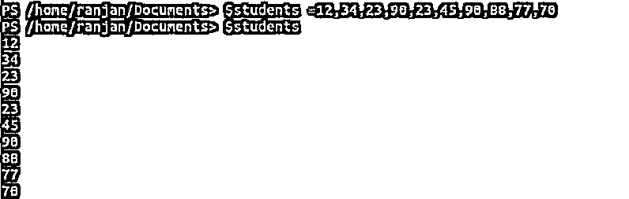

`$students | Sort-Object`

**输出:**

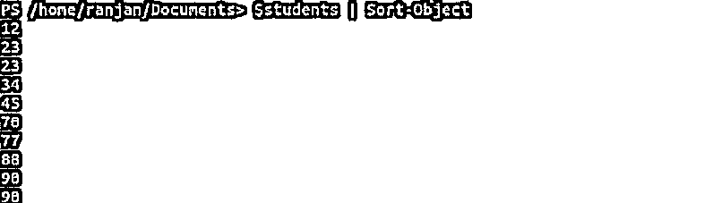

#### 实施例 2

这里我们有随机的未排序的数字以及重复的数字，所以在这个命令中，我们将删除所有重复的数字并对它们进行排序，见下面的例子。

`$students =12,34,23,90,23,45,90,88,77,70
$students`

**输出:**

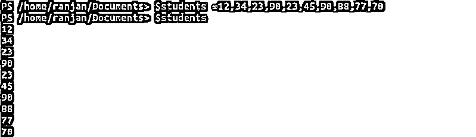

`$students | Sort-Object -Unique`

**输出:**

#### 实施例 3

在这个例子中，我们获取 ranjan1 目录的所有子文件，并对它们进行排序。我们可以看到下面是表格形式的输出，其中返回了最后修改的日期和长度等。一旦您对这个命令得心应手，您就会喜欢用它来查找文件系统中的任何内容。

`Get-ChildItem -Path ./ranjan1/ | Sort-Object`

**输出**:

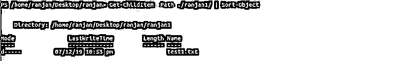

`Get-ChildItem -Path ./ranjan/ | Sort-Object`

**输出:**

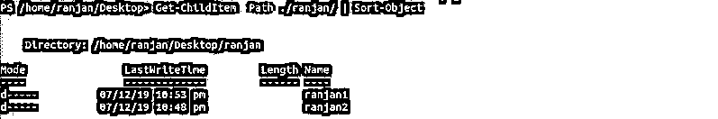

#### 实施例 4

让我给你举一个非常有用的例子。很多时候，当你使用你的系统(电脑)时，你可能会觉得你的系统运行非常慢。因此，要了解系统缓慢的根本原因，我们可以检查哪个进程占用了多少 CPU 和内存。一旦您知道了最重的进程，您就可以简单地终止那些占用更多 CPU 的正在运行的进程。在下面的两个例子中，我们按照 CPU 使用率最高的顺序对它们进行排序。在下面的两个屏幕中，我们获取了前 5 个和前 10 个 CPU 消耗最高的进程。您还可以尝试查找运行时间最长的进程或最近启动的进程等。

`Get-Process | Sort-Object -Property WS | Select-Object -Last 5`

**输出:**

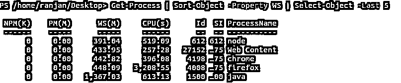

`Get-Process | Sort-Object -Property WS | Select-Object -Last 10`

**输出:**

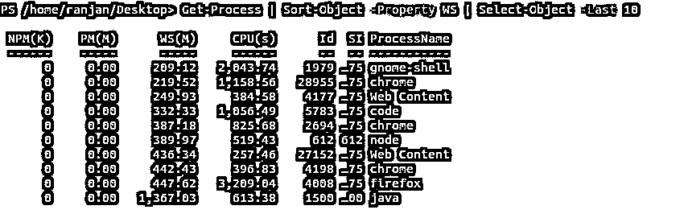

#### 实施例 5

再举一个重要的例子，这里我们是按照文件系统的长度来排序的。很多时候，您的目录可能包含数千个文件，但您只想查看那些大文件。所以在下面的例子中，我们绕过属性命令中的长度属性进行排序。您还可以使用组合的多个排序条件对它们进行排序。请查看下面的屏幕，以便更好地理解。

`Get-ChildItem -Path ./Desktop/ -File | Sort-Object -Property Length`

**输出:**

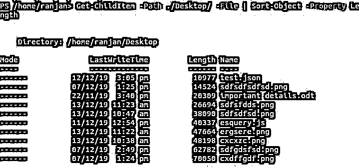

### 结论 PowerShell 排序-对象

PowerShell Sort-Object，我希望这篇教程能够给 Sort-Object 一个简要的介绍。从本教程中，我们了解了一些表示和搜索文件的好方法。它允许我们对数组和目录进行排序。

### 推荐文章

这是 PowerShell 排序对象的指南。这里我们讨论实现 Remove-Item 的语法、参数和不同的例子。你也可以看看下面的文章来了解更多-

1.  [使用 PowerShell 字符串函数](https://www.educba.com/powershell-string-functions/)
2.  [PowerShell 中 ForEach 循环的示例](https://www.educba.com/powershell-foreach-loop/)
3.  [Powershell 的基本概念和命令](https://www.educba.com/uses-of-powershell/)
4.  【PowerShell 与 Bash 的区别
5.  [PowerShell Get-child item 的前 16 个参数](https://www.educba.com/powershell-get-childitem/)
6.  [如何在 Powershell 中格式化表格？](https://www.educba.com/powershell-format-table/)
7.  [PowerShell Get-Location 完整指南](https://www.educba.com/powershell-get-location/)

