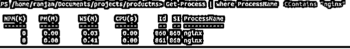
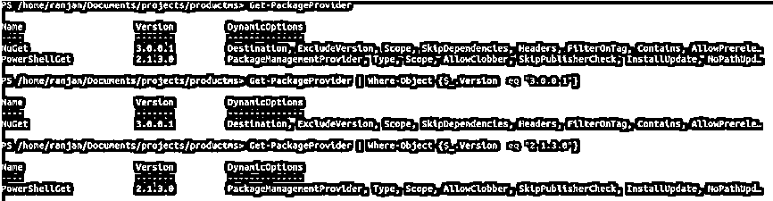
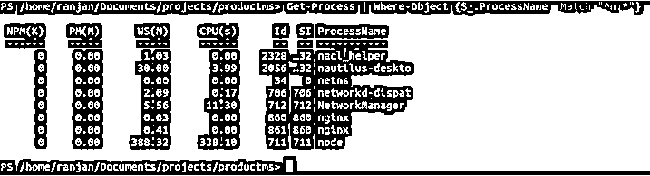
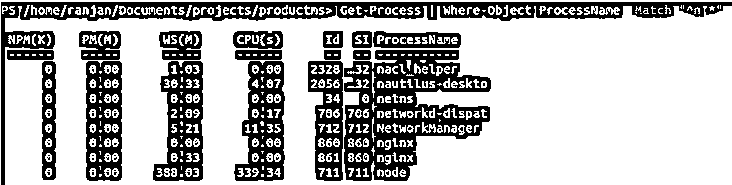

# PowerShell Where 对象

> 原文：<https://www.educba.com/powershell-where-object/>

## PowerShell Where 对象简介

Where-Object 允许我们选择或获取特定的对象、文件、进程、服务等。基于该对象、文件、进程、服务的某些属性。这些属性可以是大小、名称、日期等。让我给你一个例子，假设你有一个包含 1000 个文件的文件夹，你想对最近创建的文件或最先创建的文件执行一些任务。所以我们可以按日期选择文件。另一个例子，假设我们想在所有文件中选择最大的文件，这样我们就可以把文件的大小作为条件。我们还可以编写获取任何服务、包、过程等信息的条件。在本主题中，我们将了解 PowerShell Where-Object。

### 如何在 Powershell 中创建 Where 对象命令？

创建 Where-Object 命令主要有两种方法，如下所示。

<small>Hadoop、数据科学、统计学&其他</small>

#### 1.脚本块

我们可以使用脚本块来定义属性名、比较运算符和属性值。where-object 命令将检查并返回 block 为真的对象。

`Get-Process | Where-Object {comparison condition}`

#### 2.比较语句

这样，我们可以像使用任何普通编程一样直接使用比较。

`Get-Process | Where-Object condition`

**语法:**

获得所有语法和参数的一个非常简单的方法是运行下面的命令。下面给出的所有语法将在不同的情况下使用。我们将讨论其中的一些。

`Get-Help Where-Object -full`

`Where-Object [-Property] <Property like date,size etc> [[-Value] <Object>] [-InputObject <psobject>] [-EQ] [<CommonParameters>]`

`Where-Object [-FilterScript] <Here we write script containing conditions> [-InputObject <psobject>] [<CommonParameters>]`

`Where-Object [-Property] <Property like date,size etc> [[-Value] <Object>] -GE [-InputObject <psobject>] [<CommonParameters>]`

`Where-Object [-Property] <Property like date,size etc> [[-Value] <Object>] -CEQ [-InputObject <psobject>] [<CommonParameters>]`

`Where-Object [-Property] <Property like date,size etc> [[-Value] <Object>] -NE [-InputObject <psobject>] [<CommonParameters>]`

`Where-Object [-Property] <Property like date,size etc> [[-Value] <Object>] -CNE [-InputObject <psobject>] [<CommonParameters>]`

`Where-Object [-Property] <Property like date,size etc> [[-Value] <Object>] -GT [-InputObject <psobject>] [<CommonParameters>]`

`Where-Object [-Property] <Property like date,size etc> [[-Value] <Object>] -CGT [-InputObject <psobject>] [<CommonParameters>]`

`Where-Object [-Property] <Property like date,size etc> [[-Value] <Object>] -LT [-InputObject <psobject>] [<CommonParameters>]`

`Where-Object [-Property] <Property like date,size etc> [[-Value] <Object>] -CLT [-InputObject <psobject>] [<CommonParameters>]`

`Where-Object [-Property] <Property like date,size etc> [[-Value] <Object>] -CGE [-InputObject <psobject>] [<CommonParameters>]`

`Where-Object [-Property] <Property like date,size etc> [[-Value] <Object>] -LE [-InputObject <psobject>] [<CommonParameters>]`

`Where-Object [-Property] <Property like date,size etc> [[-Value] <Object>] -CLE [-InputObject <psobject>] [<CommonParameters>]`

`Where-Object [-Property] <Property like date,size etc> [[-Value] <Object>] -Like [-InputObject <psobject>] [<CommonParameters>]`

`Where-Object [-Property] <Property like date,size etc> [[-Value] <Object>] -CLike [-InputObject <psobject>] [<CommonParameters>]`

`Where-Object [-Property] <Property like date,size etc> [[-Value] <Object>] -NotLike [-InputObject <psobject>] [<CommonParameters>]`

`Where-Object [-Property] <Property like date,size etc> [[-Value] <Object>] -CNotLike [-InputObject <psobject>] [<CommonParameters>]`

`Where-Object [-Property] <Property like date,size etc> [[-Value] <Object>] -Match [-InputObject <psobject>] [<CommonParameters>]`

`Where-Object [-Property] <Property like date,size etc> [[-Value] <Object>] -CMatch [-InputObject <psobject>] [<CommonParameters>]`

`Where-Object [-Property] <Property like date,size etc> [[-Value] <Object>] -NotMatch [-InputObject <psobject>] [<CommonParameters>]`

`Where-Object [-Property] <Property like date,size etc> [[-Value] <Object>] -CNotMatch [-InputObject <psobject>] [<CommonParameters>]`

`Where-Object [-Property] <Property like date,size etc> [[-Value] <Object>] -Contains [-InputObject <psobject>] [<CommonParameters>]`

`Where-Object [-Property] <Property like date,size etc> [[-Value] <Object>] -CContains [-InputObject <psobject>] [<CommonParameters>]`

`Where-Object [-Property] <Property like date,size etc> [[-Value] <Object>] -NotContains [-InputObject <psobject>] [<CommonParameters>]`

`Where-Object [-Property] <Property like date,size etc> [[-Value] <Object>] -CNotContains [-InputObject <psobject>] [<CommonParameters>]`

`Where-Object [-Property] <Property like date,size etc> [[-Value] <Object>] -In [-InputObject <psobject>] [<CommonParameters>]`

`Where-Object [-Property] <Property like date,size etc> [[-Value] <Object>] -CIn [-InputObject <psobject>] [<CommonParameters>]`

`Where-Object [-Property] <Property like date,size etc> [[-Value] <Object>] -NotIn [-InputObject <psobject>] [<CommonParameters>]`

`Where-Object [-Property] <Property like date,size etc> [[-Value] <Object>] -CNotIn [-InputObject <psobject>] [<CommonParameters>]`

`Where-Object [-Property] <Property like date,size etc> [[-Value] <Object>] -Is [-InputObject <psobject>] [<CommonParameters>]`

`Where-Object [-Property] <Property like date,size etc> [[-Value] <Object>] -IsNot [-InputObject <psobject>] [<CommonParameters>]`

`Where-Object [-Property] <Property like date,size etc> -Not [-InputObject <psobject>] [<CommonParameters>]`

### PowerShell Where 对象的参数

以下是列出的参数。

**1。CContains:** 它检查是否精确匹配，这意味着只有当精确对象匹配有效时，它才会返回一个对象。

下面给出了它的一般语法。

`Get-Process | where servicename/processname/etc -CContains "exact matching name`

**2。CEQ:** 如果同一个属性值相同，那么只有它得到对象

**3。CGE** :如果属性值大于或等于传递的值，那么只有它得到对象。

**4。CGT** :如果属性值大于传递的值，那么只有它获得对象。记住这个条件是完全区分大小写的。

**5。CIn:** 这将检查 include，也就是说，如果属性值为 include，那么它将获取对象

**6。CLE:** 这将检查是否小于或等于传递的值。

7 .**。CLT:** 这将检查小于传递的值。

**8。CLike:** 这将检查匹配属性值，它也包括通配符。此外，该操作区分大小写。

**9。CMatch:** 这个属性是基于正则表达式的，所以在 where 条件中我们也可以用一些正则表达式来检查。

10。CNE: 如果我们试图寻找不同的值，这个命令将与 where 条件一起使用。

**11。CNotContains:** 如果属性值与传递的值不完全匹配，它将获取对象。此命令条件区分大小写。

### 例子

以下是实现 PowerShell 的示例，其中对象如下所述

#### 示例#1

在下面的例子中，我们正在检查与名称“nginx”完全匹配的服务。它返回所有运行的名为 nginx 的服务。请参考下面屏幕上的示例。

`Get-Process | where ProcessName -CContains "nginx"`

#### 实施例 2

在这个命令中，我们使用-eq 来获取特定版本的所有匹配包。首先，我们通过运行 Get-PackageProvider 命令显示所有版本，然后我们在脚本块中搜索特定版本，绕过 version exact。

`Get-PackageProvider
Get-PackageProvider | Where-Object {$_.Version -eq "3.0.0.1"}
Get-PackageProvider | Where-Object {$_.Version -eq "2.1.3.0"}`

#### 实施例 3

在这个例子中，我们想知道所有运行的进程，它们的名字以“n”开头。在输出中，我们可以看到它显示“node nginx networkmanager netns 等”。你可以在你自己的系统上试一试，根据你的系统上运行的进程，你会得到不同的输出。这个 Where-object 示例是阻塞脚本类型。

`Get-Process | Where-Object {$_.ProcessName -Match "^n.*"}`

#### 实施例 4

正如我们在介绍时所讨论的，有两种类型的 Where-Object，一种是块脚本，另一种是比较。在示例 3 中，我们讨论了块脚本，在此示例中，我们将了解语句块。

`Get-Process | Where-Object ProcessName -Match "^n.*"`

### 结论

Where-Object 用于获取一些对象、文件、进程、服务等。在某些条件的基础上，这些条件可以是对象、文件、进程、服务的属性、名称、大小或日期。

### 推荐文章

这是 PowerShell Where 对象的指南。这里我们讨论实现 PowerShell Where 对象的参数和示例。您也可以看看以下文章，了解更多信息–

1.  [如何使用 PowerShell？](https://www.educba.com/how-to-use-powershell/)
2.  [PowerShell 运行命令](https://www.educba.com/powershell-run-command/)
3.  [PowerShell 中的 Get-Command](https://www.educba.com/get-command-in-powershell/)
4.  [PowerShell 格式化表格|如何格式化表格？](https://www.educba.com/powershell-format-table/)

