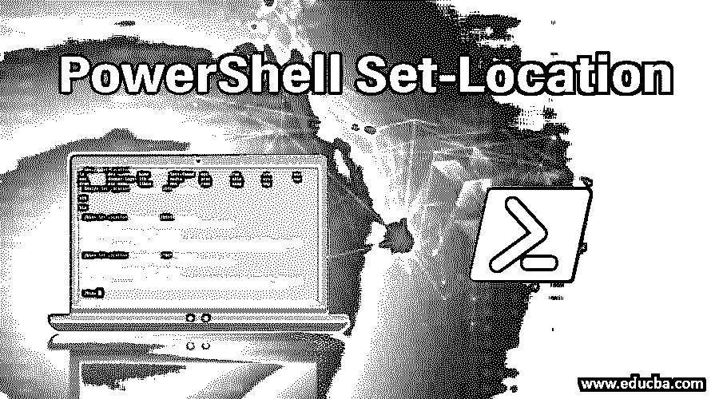
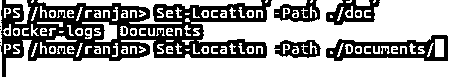
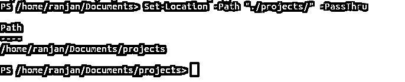
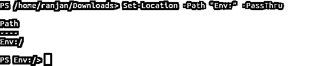
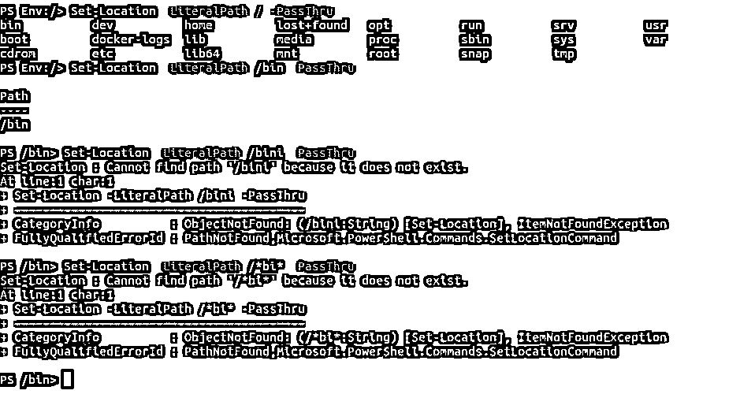
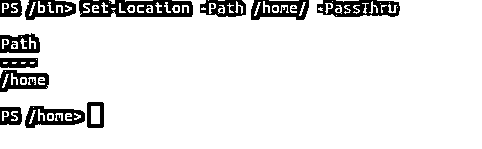

# PowerShell 集-位置

> 原文：<https://www.educba.com/powershell-set-location/>

## PowerShell 设置简介-位置

我们知道 Get-Location 函数，它给我们当前的目录路径。现在让我们假设，我们希望将当前目录更改为任何其他目录，因此我们有 PowerShell Set-Location。set-location 命令会将您的当前目录更改为任何其他目录或注册表。Set-Location 可以将您的当前位置更改为另一个目录、注册表或任何子目录。你可能会想为什么我们需要这个。假设你在“/home/ranjan/Document”目录下，你想切换到“/home/ranjna/Download”，所以你不需要做更多的事情，你只需要将位置设置为“/home/ranjan/Download”。看下面给出的例子。

`Set-Location /home/ranjan/Downloads/`

<small>Hadoop、数据科学、统计学&其他</small>

**输出:**

我们可以使用位置作为堆栈，我们可以分别使用 Push-Location 和 Pop-Location 命令来推送位置和弹出位置。

### PowerShell Set-Location 的语法

下面给出了一个非常简单的 PowerShell Set-Location 语法。它有三种主要的语法。

**1)–Path 命令:**在这里我们可以传递通配符，它将显示匹配模式，见下面的语法。

`Set-Location
[[-Path] <string path>] [-PassThru<rreturn object of representing location>] [<CommonParameters>]`

**2)–literal path 命令:**这里我们不能传递通配符，它将采用精确的路径，见下面的语法。

`Set-Location
-LiteralPath <Only exact match will work no wildcard works here>
[-PassThru] [<CommonParameters>]`

**3)–stack name 命令:**在这里，它将从堆栈返回结果，该堆栈在内存中保存多达 20 个最后推送的地址，我们可以以相反的方式弹出这些地址。请参见下面的语法。在示例中，我们将更多地讨论它。

`Set-Location
[-PassThru(return object of representing location)] [-StackName <string stack name like alias>] [<CommonParameters>]`

### PowerShell 设置参数-位置

以下是 PowerShell set-location 的一些参数，解释如下:

#### 1)–文字路径

它的名字反映了它的实用性。-Literalpath 命令用于查找完全匹配的路径，这意味着不允许使用通配符。例如，假设您正在搜索任何特定的目录，并且您知道该目录的确切名称，那么您可以使用此命令。请记住，这在您知道确切姓名的情况下非常有用。

#### 2-帕斯尚

它返回包含表示位置的的对象。默认情况下，它不返回任何内容。这是 Set-Location 命令中唯一返回对象的命令。

#### 3)–路径

路径代表我们正在工作或将要工作的地方。每当我们写入 pathname 时，它都会将路径名分配给它。它支持通配符，当我们使用任何通配符时，它会读取第一个匹配通配符模式。记住 [PowerShell 有能力](https://www.educba.com/what-is-powershell/)记住你设置的 20 个位置，直到你得到这个位置。例如，如果您正在编写 Set-Location -path "/ran "，然后您单击选项卡来搜索匹配目录，它会显示" ranjan "和其他匹配模式。

#### 4) – StackName

简而言之，这个命令将我们给出的栈名作为当前位置栈。在 stock 中，您可以以相反的顺序获得您存储的地址，举个例子，首先，我们推送“/home/ranjan/Document”，其次，我们推送“/home/ranjan/Download”，第三，我们推送位置“/home/ranjan/Desktop”，因此，当我们尝试弹出位置时，首先我们将获得“/home/ranjan/Desktop”，这是最后推送的条目，然后是“/home/ranjan/Download”，最后，我们将获得“/home/ranjan/Document”。

### 实现 PowerShell Remove-Item 的示例

以下是实现 PowerShell remove-item 的不同示例:

#### 示例#1

在对上述参数的解释中我们讨论了-path，并且我们了解到它可以带通配符和 on 搜索。它返回最后 20 个匹配项。在下面的例子中，我们将当前工作目录设置为“/home/ranjan/Document”。因此，在搜索中，我们编写如下示例，并单击选项卡来搜索相关路径(单击选项卡)。

`Set-Location -Path ./doc`

当有 3 个字符匹配时，它将返回 below out。我们可以在下面的例子中看到输出屏幕。

`docker-logs  Documents`

**输出:**

如果我们写的是完整路径，点击回车将会改变当前路径。请参见以下示例中的示例和输出屏幕。

`Set-Location -Path ./Documents/`

**输出:**

#### 实施例 2

让我们来谈谈-PassThru，这个例子将向我们展示这个命令如何返回当前选择的路径。我们正在检查。在输出中，它返回“/home/ran Jan/Documents/projects”的根路径。它总是返回 Object。

`Set-Location -Path "./projects/" -PassThru`

**输出:**

#### 实施例 3

看这个例子，这是一种非常独特的情况，我们想要直接到达“Env”的根路径。PowerShell 无需编写任何额外的代码就可以找到它的根目录。很多时候，当你写脚本的时候，你可能需要知道或者找到根目录。这个命令对于这种情况非常有用。

`Set-Location -Path "Env:" -PassThru`

**输出:**

#### 实施例 4

在下面的例子中，你可以看到我们在 LiteralPath 中传递“/bin ”,并且一旦点击 enter，我们就直接到达/bin 目录，而不用写入它的完整路径。我们已经讨论过-- literal path 总是采用完整的路径，这意味着我们不能传递通配符路径。这里我们只需要提到到那个目录**的确切路径。**在本例中，我们试图传递/bi 或 little match，但这不起作用，因为我们说过它将只采用完整路径，而不是通配符。

`Set-Location -LiteralPath /bin -PassThru`

**输出:**

#### 实施例 5

下面的例子显示了我们如何将目录从/bin 改为/home。如果我们在不知道/home 的根路径的情况下尝试做同样的事情，这将是一项非常困难的工作。因此，PowerShell 通过提供这个命令使我们的生活变得非常简单，在不知道确切路径的情况下，我可以切换到该路径。让我们看看下面的例子和屏幕。在所有的例子中，有一点你应该注意到，在我们没有使用-PassThru 命令之前，Get-Location 不会返回任何输出。

`Set-Location -Path /home/ -PassThru`

**输出:**

在这里，输出返回根路径以及到/home 的开关。这里通过返回对象。

### 结论

PowerShell Set-Location，我希望我们能够理解 PowerShell Set-Location 的基本用法。在我们不使用命令-PassThru 之前，Set-Location 命令不会返回任何输出。Set-Location 允许我们将一个目录移动到任何目录，而不需要了解太多的目录结构。

### 推荐文章

这是 PowerShell 设置位置的指南。这里我们详细讨论实现 PowerShell Set-Location 的语法、参数和示例。您也可以阅读以下文章，了解更多信息——

1.  [Unix Shell 命令列表](https://www.educba.com/unix-shell-commands/)
2.  [PowerShell 中添加内容的参数](https://www.educba.com/add-content-in-powershell/)
3.  [安装 PowerShell 的步骤](https://www.educba.com/install-powershell/)
4.  [如何在 Linux 中使用 Chown 命令？](https://www.educba.com/chown-command-in-linux/)
5.  [PowerShell 格式表|如何格式化？](https://www.educba.com/powershell-format-table/)

