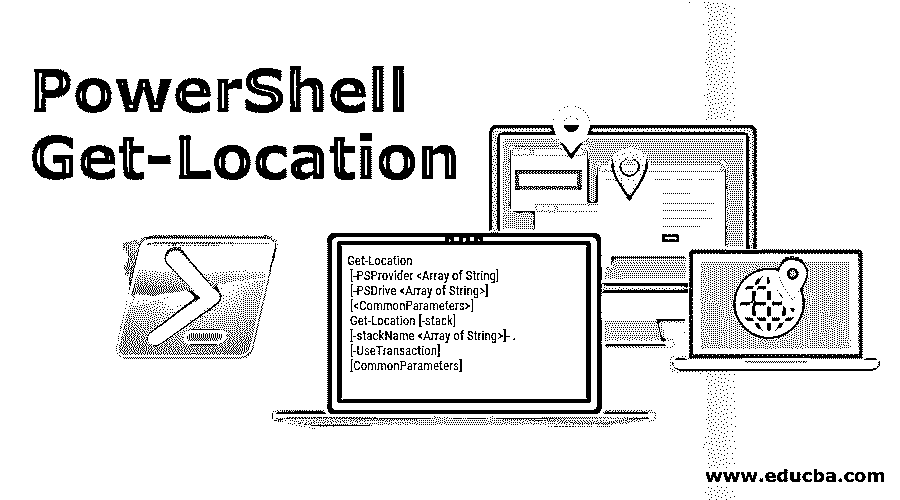
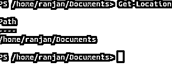
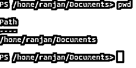
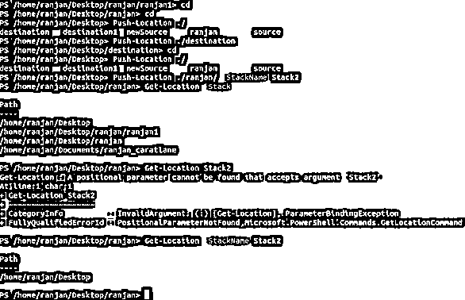
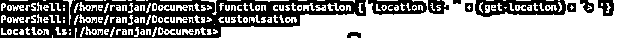
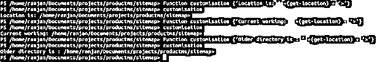

# PowerShell 获取位置

> 原文：<https://www.educba.com/powershell-get-location/>

## **简介** PowerShell Get-Location

一般来说，很多时候我们会忘记我们现在在哪里，我是说我们在哪一个目录里。永远不要从 Get-location 混淆位置意味着你的物理地址，它是关于你的目录，你工作的地方。因此，如果你知道一点 PWD(目前的工作目录)，这是用在基于 Linux 的系统，然后它几乎是相同的。PowerShell Get-location 命令总是给你当前的工作目录。让我告诉它的一个重要用途，假设你正在编写一个脚本，它将下载脚本所在的同一个目录中的任何文件，那么我们可以使用 Get-Location 函数。

这里，我们将在脚本中传递 download = Get-Location 的路径，我们将看到所有的下载都发生在脚本所在的同一个目录中。它的主要好处是，假设您与任何其他人共享您的脚本，并且他正在他的系统上运行您的脚本，那么他不需要手动提及下载路径，因为 Get-Location 会自动找到他的系统当前路径并下载到该目录中。

<small>Hadoop、数据科学、统计学&其他</small>

### PowerShell Get-Location 的语法和参数

下面给出了一个非常简单的 PowerShell Get-Location 语法:

**语法:**

`Get-Location
[-PSProvider <Array of String] [-PSDrive <Array of String>] [<CommonParameters>] Get-Location [-stack] [-stackName <Array of String>]- .
[-UseTransaction] [CommonParameters]`

**Note**: stackName (here we can write the name of the stack like stack1 stack2 by pushing location and also we can get back the same name)

Get-Location 总是返回对象。它有某些参数来执行一些额外的工作，而不仅仅是获取当前的工作目录名。让我们讨论一下它的参数。

#### 因素

让我们详细讨论一下 PowerShell get-location 参数:

*   **-PSDrive:** Get-Location 给出了当前的工作目录，如果我们想获得 PowerShell 特定驱动器中的当前位置，我们可以使用-PSDrive 命令。例如，假设您当前位于/home/Ranjan/etc 目录中，并且您想要查看/home/Ranjan/Document 中的当前位置，那么您可以使用这个命令。
*   **-PSProvider:** 现在，如果您想使用 PowerShell 找到注册表的当前位置，那么您可以使用-PSProvider **，**例如，如果您在“/home/Ranjan/etc”目录中，并且您想获得当前 PowerShell 注册表提供程序的位置。
*   **-stack:** 你一定听说过 stack，stack 就是 LIFO(后进先出)。这里堆栈条目将目录位置。假设您想查看所有以前的位置，那么我们可以在 PowerShell 中使用位置推送命令。让我给你解释一个例子，如果你在“/Ranjan”目录下，你推“/file1”，然后你推“/file”到“/file3”。因此，最终你可以得到你的文件格式的推送目录。我在例子部分解释过了。
*   **-stackName:** 显示某个定义的路径栈中的位置。我们可以创建自己的路径堆栈。如果你想用任何栈名创建你自己的路径栈推位置。同样，您可以用自己定义的名称取回堆栈。
*   **-UseTransaction:** 这些就像辅助命令一样，一般都在命令的末尾。它包含活动命令，如-ErrorVariable、-WarningAction、-WarningVariable、-ErrorAction、-ErrorVariable、-OutBuffer -OutVariable、-Verbose、-Debug。

### 实现 PowerShell Remove-Item 的示例

以下是实现 PowerShell remove-item 的示例:

#### 示例#1

在下面的例子中，我们正在编写一个非常简单的命令，您可能需要在日常工作中多次运行它。这里，在这个命令中，我们只是获取当前的工作目录。

正如我们在简介中所知，Get-Location 命令非常有用，因为很多时候，如果我们使用静态路径编写脚本，如果相同的脚本转到其他系统，它将无法工作，因为我们提到过静态路径，比如在我的系统路径上是“/home/Ranjan/Document”，我编写了 static，但如果我们在您的系统上运行相同的脚本，它将会出错，因为在您的系统路径上可能无法识别“/home/yourusername/Document”和“/home/Ranjan/Document”。

因此，编写 Get-location 将在每个系统上工作，因为路径是动态的，它将在我的系统上返回“/home/Ranjan/Document”，在您的系统上返回“/home/您的用户名/Document”。

**代码:**

`Get-Location`

它将返回一个对象。在下面的例子中，我们展示了与 Linux 的 PWD 命令同样的事情。我们不需要学习 pwd Linux 命令，因为那些知道它的人可以做很少的分析。

#### 实施例 2

让我们写一些更复杂的 Get-Location。我们讨论过-斯塔克名。在这里，我们可以推送位置，您可以在下图中看到示例。通过写 Get-Location -Stack，它返回我们推送的所有目录。如果你正在写一个脚本，你想让你的脚本捕获所有的路径和目录，然后你可以使用这些东西，这种情况是很有用的。请记住，它的概念与任何编程语言的堆栈都非常相似。因为你可以推送目录，也可以取回目录。

**代码:**

`Get-Location -Stack
Push-Location ./ranjan/ -StackName Stack2
Get-Location -StackName Stack2`

**输出:**

#### 实施例 3

PowerShell 还为您提供了定制 Get-Location 命令的选项。定制意味着根据我们的要求获得输出，或者改变 Get-location 命令的输出。让我告诉你一个实时的情况。假设您正在编写任何脚本，并且您的脚本根据其输入给出各种输出，现在如果相同的脚本将被其他人使用，并且他想要理解所有输出，他可能会感到困惑，因为如果他得到类似“home/Ranjan/etc”、“home/Ranjan/Document”等输出。

因此，他将如何理解哪个输出是关于当前目录的，因为所有输出都是目录而已。所以在下面的例子中，我们正在编写一个函数来告诉更多的细节或改变的信息。你可以自己写。

**代码:**

`Function customisation {‘Location is: ’ +(get-location) + ‘>’}
customization`

**输出:**

位置是/home/Ranjan/Documents

任何人都非常清楚这个输出是关于当前目录的。你可以根据你的需要写一些其他的信息。这里我们将字符串消息与目录的动态输出连接起来。

#### 实施例 4

您可以根据自己的用途编写多种功能，如定制。

**代码:**

`Function customisation {‘Current working: ’ +(get-location) + ‘>’}
Customisation`

位置是当前工作的:/home/ran Jan/Documents/projects/product ms/sitemap

**代码:**

`Function customisation {‘Older directory is : ’ +(get-location) + ‘>’}
Customisation`

旧目录是:/home/ran Jan/Documents/projects/product ms/sitemap

**输出:**

### 结论

这是一个日常使用的命令，在一般的编程中，我们大部分时间都会面临获取当前工作目录名的问题。PowerShell Get-Location 的主要用途是创建动态目录名，而不是手动编写目录名，这样相同的脚本也可以在其他系统上运行**。**

### 推荐文章

这是 PowerShell 获取位置的指南。这里我们讨论 PowerShell Get-Location 的语法和参数，以及它的例子和代码实现。你也可以看看下面的文章来了解更多-

1.  [PowerShell ForEach 循环](https://www.educba.com/powershell-foreach-loop/)
2.  [PowerShell 变量](https://www.educba.com/powershell-variables/)
3.  [PowerShell 字符串函数](https://www.educba.com/powershell-string-functions/)
4.  [PowerShell 操作员](https://www.educba.com/powershell-operators/)

