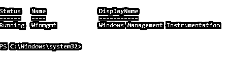
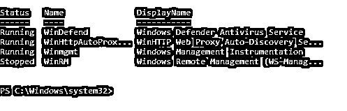
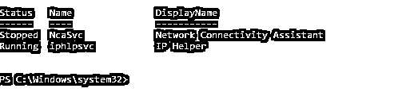
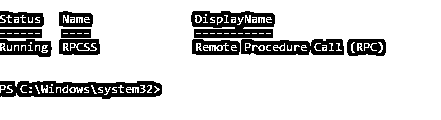
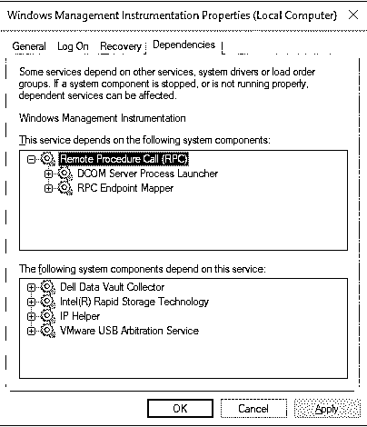
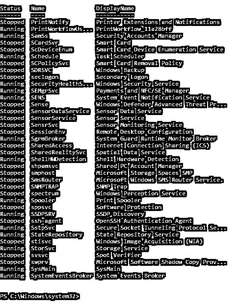
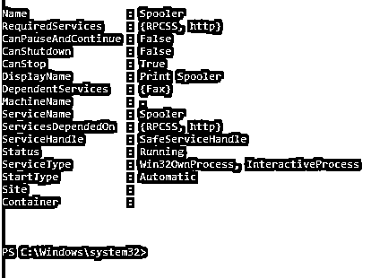
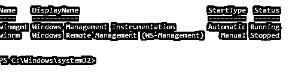

# PowerShell 获取服务

> 原文：<https://www.educba.com/powershell-get-service/>

## PowerShell Get-Service 简介

PowerShell 中的 Get-Service cmdlet 用于检索安装在本地计算机和远程计算机上的服务(操作系统和应用程序)以及这些服务的启动类型、状态、名称和显示名称。PowerShell 控制台将显示 Services.msc MMC 中存在的所有服务。默认情况下，Get-Service cmdlet 提供有关本地计算机服务的信息，直到为远程计算机指定了–computer name 参数。我们还可以用这个 cmdlet 检索相关的服务。此 cmdlet 是 Microsoft 的一部分。PowerShell。管理模块。

**语法**

<small>Hadoop、数据科学、统计学&其他</small>

`Get-Service
[[-Name] <String[]>] [[-DisplayName] <String[]>
[-DependentServices] [-RequiredServices] [-Include <String[]>] [-Exclude <String[]>] [-InputObject <ServiceController[]>] [<CommonParameters>]`

**参数**

以下是参数:

*   **名称:**该参数用于服务的名称或别名。它是一个字符串对象。您可以提供多个服务名称(别名)，用逗号(，)分隔。允许使用通配符(*)。例如，假脱机程序是“打印假脱机程序”服务的别名。
*   **显示名称:**该参数是服务的显示名称。它是字符串数据类型。您可以提供多个显示名称，用逗号(，)分隔。允许使用通配符(*)。例如，“Windows 管理工具”是 winmgmt 服务别名的显示名称。
*   **DependentServices:** 指定该参数时，检索所提供服务名的依赖服务。此参数必须与–Name 或–display Name 参数一起使用，否则，PowerShell 将检索所有相关服务。
*   **RequiredServices:** 该参数指定启动给定服务所需的服务。您必须指定–Name 或–display Name 参数，否则，PowerShell 将检索所有必需的服务。
*   **Include:** 该参数指定在检索服务信息时要包含的服务名。此参数的值限定了可以使用通配符(*)的名称。例如，当您指定 S*时，它将检索所有以 S 开头的服务。
*   **Exclude:** 该参数指定在检索服务信息集时要排除的服务名。此参数的值限定了可以使用通配符(*)的名称。例如，当您指定 S*时，它将检索除以 S*开头的服务之外的所有服务。
*   **InputObject:** 您可以提供多个服务作为输入对象参数的变量，以便从 Get-Service cmdlet 中检索服务。
*   **CommonParameters:** 这些参数用于错误和警告处理、调试、详细等..参数。例如，-ErrorAction，-ErrorVariable，-WarningVariable，-WarningAction，-Verbose，-Debug，-OutBuffer，-OutVariable。

### 实现 PowerShell Get-Service 的示例

以下是要实施的示例:

#### 1.使用–Name 参数获取服务

如果没有为 Get-Service cmdlet 指定任何参数，则默认情况下，它会采用–Name 参数。要使用–Name 参数检索服务信息，我们需要提供有效的服务名。默认输出将是状态、名称和显示名称格式。

**代码#1**

`Get-Service -Name Winmgmt`

**输出:**

**解释:**您也可以使用通配符来检索信息。

**代码#2**

`Get-Service -Name Win*`

这里，Get-Service 将检索所有以“Win”开头的服务。

**输出:**

**解释:**您可以使用–Name 参数获得多个服务信息，用逗号(，)分隔它们。

**代码#3**

`Get-Service -Name Winmgmt, WinRM, Spooler`

**输出:**

#### 2.使用–display name 参数获取服务

可以向 Get-Service cmdlet 提供 displayname 参数来检索服务信息。

**代码#1**

`Get-Service -DisplayName "Print Spooler"`

**输出:**

要使用通配符(*)，

**代码#2**

`Get-Service -DisplayName "*Spooler*"`

**输出:**

#### 3.使用–depended Service 获取服务

要获得特定服务的依赖服务信息，请使用下面的命令。

**代码#1**

`Get-Service Winmgmt -DependentServices`

**输出:**

**解释:**在上面的输出中，Windows management instrument 服务依赖于输出中给定的服务。

此参数也适用于显示名称和通配符，甚至适用于多个服务。

**代码#2**

`Get-Service -DisplayName "Windows Management Instrumentation" -DependentServices`

**输出:**

**解释:**您可以在 Services.msc 控制台的“依赖于”部分的服务属性中检查相同的内容。

#### 4.使用–required Service 获取服务

使用该参数，您将获得所需的服务信息(依赖于其他服务的特定服务)。

**代码#1**

`Get-Service Winmgmt -RequiredServices`

**输出:**

**解释:**上面的输出提到 Winmgmt 服务需要 RPCSS 服务。这意味着 Winmgmt 服务在 RPCSS 服务的依赖列表中。您可以在服务属性中检查相同的内容。

**输出:**

#### 5.使用–Include 参数获取服务

当您使用 include 参数时，它会搜索 include 参数后面提到的内容。接受通配符(*)。举个例子，

**代码#1**

`Get-Service -Include S*, *print*`

**输出:**

**说明:**上面的命令将包含所有以 S 开头，服务名中包含 Print 的服务。您也可以使用 Name 参数检索相同的输出。

#### 6.使用–Exclude 参数获取服务

使用 exclude 参数，将排除服务名称，并显示其余的服务。

**代码#1**

`Get-Service -Exclude S*, A*, *Windows*`

**说明:**上面的命令不包括以 S，A 开头，并且在输出命令中包含窗口的服务。

**输出:**

**说明:**您只能对 Name 参数进行限定搜索，而不能对 DisplayName、Start type 等参数进行限定搜索。

#### 7.使用格式列表获取服务

Get-Service cmdlet 提供默认输出，该输出仅包含几个表项，如显示名称、名称和状态，但如果您希望显示所有属性，请通过管道传输 Format-List * (fl *)别名。

**代码#1**

`Get-Service Spooler | Format-List *`

**输出:**

#### 8.使用选择对象管道获取服务

您可以使用 Select-Object (alias: Select)参数检索选定的属性。

**代码#1**

`Get-Service winmgmt, winrm | Select Name, DisplayName, Starttype, Status`

**输出:**

### 结论

使用 Get-Service，您可以检索本地计算机和远程计算机上的服务信息，但是您也可以通过管道启动服务和停止服务来启动或停止本地和远程计算机上的服务。

### 推荐文章

这是 PowerShell Get-Service 的指南。在这里，我们讨论语法，参数和前 8 个例子，以实现正确的代码和输出。您也可以浏览我们的其他相关文章，了解更多信息——

1.  [PowerShell 获取进程](https://www.educba.com/powershell-get-process/)
2.  [PowerShell 获取项目](https://www.educba.com/powershell-get-item/)
3.  [PowerShell 获取内容](https://www.educba.com/powershell-get-content/)
4.  [PowerShell Grep](https://www.educba.com/powershell-grep/)

