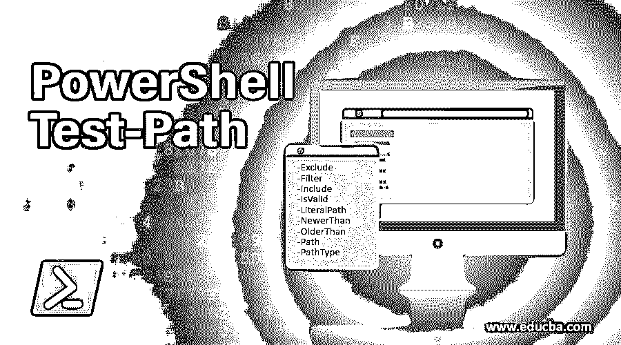
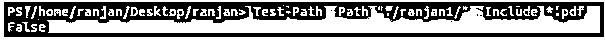
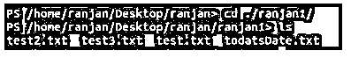
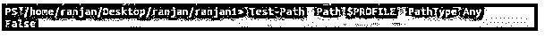
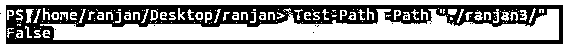
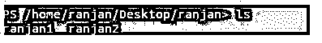
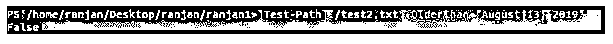
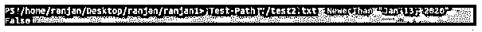
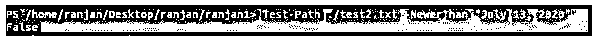
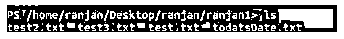

# PowerShell 测试路径

> 原文：<https://www.educba.com/powershell-test-path/>

## PowerShell 测试路径简介

Powershell test-path 命令检查所有元素的路径是否存在。它总是返回布尔值。它将返回$True 和$False。基本上它将返回$True，因为所有的元素都在那里，否则它将返回$False。在 Test-Path 命令的帮助下，我们还可以识别路径类型，也就是说，如果路径是容器或叶子或终端，如果路径是空白，它将始终返回$False，如果路径是 null，它将返回一个错误。实时使用，假设您正在检查目录中的任何文件，并且您不想检查或您想从目录中排除一个文件，因为该特定文件数量巨大，那么您可以使用它。

**语法 1:**

<small>Hadoop、数据科学、统计学&其他</small>

`Test-Path
[-Path] <String of path to be tested>
[-Filter <String of Filter arguments >] [-Include <String of Path which need to include>] [-Exclude <String of path which need to exclude>] [-PathType <test path type(leaf, container or ny)>] [-IsValid(return boolean true or false)] [-Credential <PSCredential>] [-OlderThan <DateTime to check older than>] [-NewerThan <DateTime to check newer than>] [<CommonParameters>]`

**语法 2:**

`Test-Path
-LiteralPath <String of exact path>
[-Filter <String of path to be tested>] [-Include <String of Path which need to include>] [-Exclude <String of path which need to exclude>] [-PathType <test path type(leaf, container or ny>] [-IsValid(return boolean true or false)] [-Credential <PSCredential>] [-OlderThan <DateTime to check older than>] [-NewerThan <DateTime to check newer than>] [<CommonParameters>]`

### 因素

**1。-Exclude:** 该命令禁止或忽略一个已定义的项目。此参数将用于路径参数。我们可以定义路径元素或任何类似“*”的模式。txt "，" *。pdf”等。并且这些定义的模式可以从路径中排除。

**2。-Filter:** 允许我们的命令定义一个过滤器来检查路径元素。例如，如果我们有巨大的文件系统，我们想检查路径是否存在，我们可以定义一些过滤条件。我们可以使用通配符。

**3。-Include:** 该命令用于检查特定的路径属性。通常，它将包括传递到该命令中的属性。在这种情况下，也允许通配符字符串属性。我们可以使用路径元素或属性，如“*”。txt "，" *。pdf”等。

**4。-IsValid:** 它检查路径语法，这个命令不关心路径是否存在。它将简单地验证路径语法，因此如果路径语法有效，它将返回$True，如果路径语法无效，它将返回$False。

**5。-LiteralPath:** 这也是路径检查的一种，但是这里，在这种情况下，我们要传递精确的匹配路径，不能用“*”。我们必须传递类似“ranjan.txt”的路径，这是一个确切的名称，不像匹配。在这些情况下，我们也可以使用转义字符。对于转义字符，我们应该使用单引号。作为单引号[通知 PowerShell](https://www.educba.com/what-is-powershell/) 将字符视为转义字符。

**6。-NewerThan:** 将任何时间定义为 DateTime，简单地说，它将检查文件的创建日期，检查文件的创建日期是否比提供的参数 date 新，然后返回 true。例如，以“2019 年 8 月 13 日”作为参数传递，文件创建日期为“2019 年 8 月 15 日”，则它将返回 true，因为文件创建日期比参数传递日期新。

7 .**。-OlderThan:** 将任何时间定义为 DateTime，简单地说，它将检查文件的创建日期，检查文件的创建日期是否早于参数 date，如果早于参数 date，它将返回 true。例如，以“2019 年 8 月 13 日”作为参数传递，文件创建日期为“2019 年 8 月 15 日”，则它将返回 false，因为传递的参数比创建日期新。

**8。-Path:** 定义任何将要被测试的路径。在这种情况下，我们也可以使用通配符。此外，如果路径之间有空格，我们可以使用单引号通知 PowerShell。

**9。-PathType:** 它定义了路径中给定元素的确切类型。在 simple 中，它将检查路径元素类型。它将返回一个布尔值。如果给定元素的路径与我们在命令中定义的类型相同，那么它将返回$True，如果路径的类型与我们在命令中定义的不同，那么它将返回$False。该命令将为 PathType 命令采用以下参数 like 值。

*   **任意容器**:包含注册表、目录等元素。
*   **Lead Item** :这个元素不会像任何文件一样包含属性。
*   **组合**:既可以是容器，也可以是叶子。

### PowerShell 测试路径示例

以下是 PowerShell 测试路径的示例:

#### 示例#1

下面的命令是一个例子，在这里我们检查“ranjan1”目录中是否有除“*”以外的任何文件。txt”。

`Test-Path -Path "./ranjan1/" -Exclude *.txt`

**输出:**

`Test-Path -Path "./ranjan1/" -Exclude *.pdf`

**输出:**

`Test-Path -Path "./ranjan1/" -Include *.pdf`

**输出:**

`cd ./ranjan1/
ls`

**输出:**

#### 实施例 2

下面是一个检查路径类型的例子。我们通过传递 Any、Leaf、Container 之类的参数来检查$PROFILE 的 PathType。

`Test-Path -Path $PROFILE -PathType Any`

**输出:**

`Test-Path -Path $PROFILE -PathType Container`

**输出:**

`Test-Path -Path $PROFILE -PathType leaf`

**输出:**

#### 实施例 3

如果路径存在，它将返回 True，如果路径不存在，它将返回 False。

`Test-Path -Path "./ranjan1/"`

**输出:**

`Test-Path -Path "./ranjan2/"`

**输出:**

`Test-Path -Path "./ranjan3/"`

**输出:**

`ls`

**输出:**

#### 实施例 4

这里我们检查文件的创建日期。它可能是旧的或新的。我已经创建了文件 test.txt，它是在 2019 年 8 月之前创建的，我们正在检查它的各个日期，绕过了它们。

`Test-Path ./test2.txt -NewerThan "August 13, 2019"`

**输出:**

`Test-Path ./test2.txt -OlderThan "August 13, 2019"`

**输出:**

`Test-Path ./test2.txt -NewerThan "August 13, 2020"`

**输出:**

`Test-Path ./test2.txt -NewerThan "Jan 13, 2020"`

**输出:**

`Test-Path ./test2.txt -NewerThan "July 13, 2020"`

**输出:**

`ls`

**输出:**

### 结论 PowerShell 测试路径

综上所述，我们了解到 Test-Path 命令既可以用于检查路径类型，也可以用于检查路径语法。我们可以识别路径是容器、叶还是混合(任何)。

### 推荐文章

这是 PowerShell 测试路径的指南。这里我们讨论 Powershell 测试路径的介绍、参数和示例。您也可以看看以下文章，了解更多信息–

1.  [PowerShell 中的 Try-catch](https://www.educba.com/try-catch-in-powershell/)
2.  [PowerShell 中的 cmdlets】](https://www.educba.com/cmdlets-in-powershell/)
3.  [PowerShell 排序对象](https://www.educba.com/powershell-sort-object/)
4.  PowerShell 中的[变量](https://www.educba.com/variable-in-powershell/)
5.  [实施 PowerShell 新项目的示例](https://www.educba.com/powershell-new-item/)
6.  [了解 PowerShell 重命名-项目](https://www.educba.com/powershell-rename-item/)
7.  [PowerShell 中断|示例](https://www.educba.com/powershell-break/)
8.  [PowerShell 的参数转换为字符串](https://www.educba.com/powershell-convert-to-string/)

