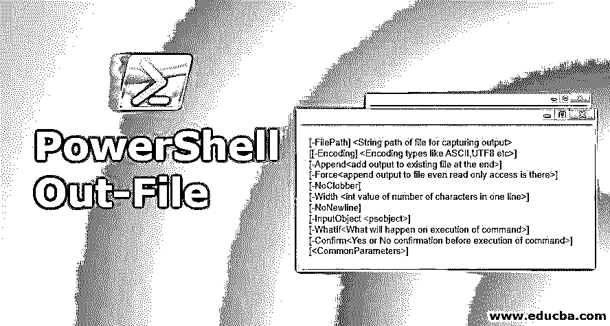
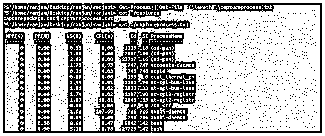
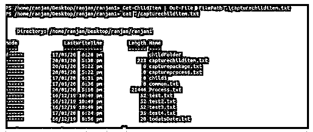
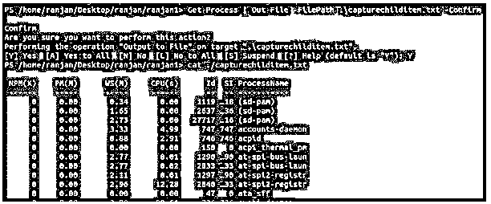

# PowerShell 输出文件

> 原文：<https://www.educba.com/powershell-out-file/>

## PowerShell Out-File 简介

PowerShell 文件输出命令，用于将输出存储或捕获到任何文件。很多时候，我们可能希望看到所有的错误和输出，因此，与简单地将它们打印到控制台上相比，将它们与文件的创建日期一起存储到文件中是一个更好的主意。因为输出的大小可能非常大，所以在这种情况下，我们可以将输出发送到文件中更好。

**语法**:

<small>Hadoop、数据科学、统计学&其他</small>

1.文件外

`[-FilePath] <String path of file for capturing output>
[[-Encoding] <Encoding types like ASCII,UTF8 etc>] [-Append<add output to existing file at the end>] [-Force<append output to file even read only access is there>] [-NoClobber] [-Width <int value of number of characters in one line>] [-NoNewline] [-InputObject <psobject>] [-WhatIf<What will happen on execution of command>] [-Confirm<Yes or No confirmation before execution of command>] [<CommonParameters>]`

2.文件外

`[[-Encoding] <Encoding types like ASCII,UTF8 etc>] -LiteralPath <string exact target file path>
[-Append<add output to existing file at the end>] [-Force<append output to file even read only access is there>] [-NoClobber] [-Width <int value of number of characters in one line>] [-NoNewline] [-InputObject <psobject>] [-WhatIf<What will happen on execution of command>] [-Confirm<Yes or No confirmation before execution of command>] [<CommonParameters>]`

### 因素

以下是给出的一些参数。

**1。-Append** :如果我们想要向任何现有文件添加任何输出，那么我们可以使用这个命令。此命令会将您的输出添加到任何现有文件的末尾。

**2。-确认**:如果我们想要安全执行命令，我们可以使用该命令。这里将显示一个提示框，要求您确认命令的执行。

**3。-Encoding:** 这个命令定义了我们将要写入内容的文件的编码类型。如果我们不定义类型，那么它会将 UTF8NoBOM 作为类型的默认值。

它接受几种类型，如下所示:

*   **ASCII:** 在这个类型中，它将使用 ASCII 7 位字符。这种类型的编码非常普遍。
*   **bigendianuicode**:使用 UTF-16 格式编码。它使用 UTF-16 的大端。
*   **OEM:** 在这种情况下，它将使用 MS-DOS 默认编码和控制台程序
*   **Unicode:** 它使用 UTF-16 格式编码。但是它对 UTF-16 使用 little-endian。
*   **UTF-7:** 在这种类型中编码以 UTF-7 格式完成。
*   **UTF8:** 此类型编码以 UTF-8 格式完成。
*   **UTF8BOM:** 在此类型中编码以 UTF8BOM 格式完成。它在 UTF 8 BOM 中使用字节顺序标记。
*   **UTF8NoBOM:** 此类型编码在 UTF 8 BOM 格式中完成。UTF 8 BOM 不使用字节顺序标记。
*   **UTF32:** 此类型编码以 UTF-32 格式完成。
*   如果我们使用的是 PowerShell 或更高版本，那么我们也可以使用任何注册代码页的数字 ID，例如编码 1251。这里 1251 是页码 ID。我们可以使用注册代码页的字符串名称，例如编码“Windows–1251”。

**4。-FilePath:** 该命令定义了输出文件的路径，我们希望在该文件中捕获或发送输出(错误或事件输出)。

**5。-Force** :假设有只读访问的文件，在这种情况下-Force 命令将允许覆盖它。请记住，force 参数只能在对文件进行只读访问的情况下写入，它不能覆盖对该文件的安全限制。这意味着它不能与安全妥协。

**6。-InputObject** :定义将要写入文件的对象。我们可以接受任何包含对象、类型或任何将返回任何对象的命令或表达式的变量(对象作为输出)。

7 .**。-LiteralPath:** 这里我们定义输出捕获文件的路径。当我们知道确切的路径时，我们写文字路径，我们不能在它里面传递通配符。例如，如果我们试图使用像“*”这样的路径，我们必须传递“/desktop/ranjan/test.txt”。txt”这样不行。如果我们可以对 but 使用转义符，那么我们需要用单引号将它括起来。通过使用单引号，我们通知 PowerShell 这是一个转义字符。

**8。-NoNewline:** 如果我们不想在文件末尾添加新的行字符，我们可以使用这个命令。

**9。-WhatIf:** 显示命令执行时会发生什么，它会让你清楚将要运行的命令的目的，而不需要实际执行。

10。-Width :定义每行输出可以有多少个字符。如果有任何多余的字符，将被截断。如果您不使用该属性，它将根据主机定义该值。一般来说，PowerShell 可以容纳 80 个字符。

### PowerShell 输出文件示例

以下是 PowerShell 输出文件的示例:

#### 示例#1

在本例中，我们试图将所有过程捕获到一个文件中，我们可以看到我们正在传递”。\captureprocess.txt "作为一个参数，以-FilePath 作为一个命令，它将捕获所有的进程并在编写 cat。/captureprocess.txt 文件包含所有进程名称。

`Get-Process | Out-File -FilePath .\captureprocess.txt
cat ./Process.txt`

**输出:**

#### 实施例 2

在本例中，我们捕获了包含文件的当前文件夹的所有子项(文件和文件夹)。/capturechilditem.txt 文件。

`Get-ChildItem | Out-File -FilePath .\capturechilditem.txt
cat ./capturechilditem.txt`

**输出:**

#### 实施例 3

在本例中，我们将输出捕获到文件 capturechilditem.txt，但我们使用的是 command -Confirm，该命令将生成一个提示，并在执行命令之前要求您确认。

`Get-Process | Out-File -FilePath .\capturechilditem.txt -Confirm
cat ./capturechilditem.txt`

**输出:**

#### 实施例 4

在这个命令中，我们使用了-WhatIf，您可以看到输出，而无需真正执行命令。简单地说，这是运行命令的一次试验，不会影响任何东西。在实际执行之前，我们使用该命令来了解执行该命令的目的。

`Get-Process | Out-File -FilePath .\capturechilditem.txt -WhatIf`

**输出:**

#### 实施例 5

这里我们使用-Force 命令，并将输出发送到文件 capturechilditem.txt，这里我们假设该文件只有读权限。这里将使用 Force 将输出写入文件。武力不能绕过安全标准。

`Get-Process | Out-File -FilePath .\capturechilditem.txt -Force
cat ./capturechilditem.txt`

**输出:**

### 结论

从上面的教程中我们了解到，在 Out-File 命令的帮助下，我们可以捕获(发送)文件的输出，这个输出可以是错误，也可以是任何事件或活动。

### 推荐文章

这是 PowerShell Out-File 的指南。这里我们讨论 PowerShell 输出文件的介绍、参数和示例。您也可以看看以下文章，了解更多信息–

1.  [PowerShell Set-Location](https://www.educba.com/powershell-set-location/)
2.  [PowerShell 中的 If 语句](https://www.educba.com/if-statement-in-powershell/)
3.  [PowerShell 新项目示例](https://www.educba.com/powershell-new-item/)
4.  [PowerShell 重命名指南-项目](https://www.educba.com/powershell-rename-item/)

